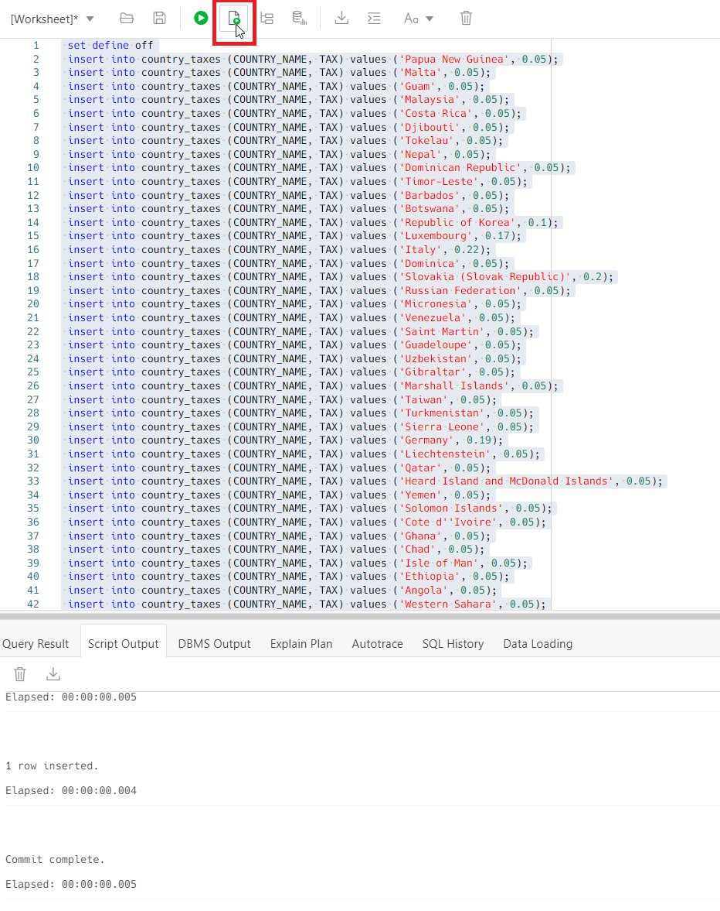
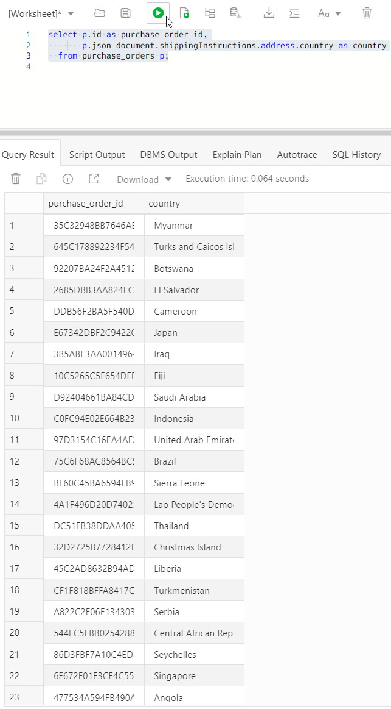
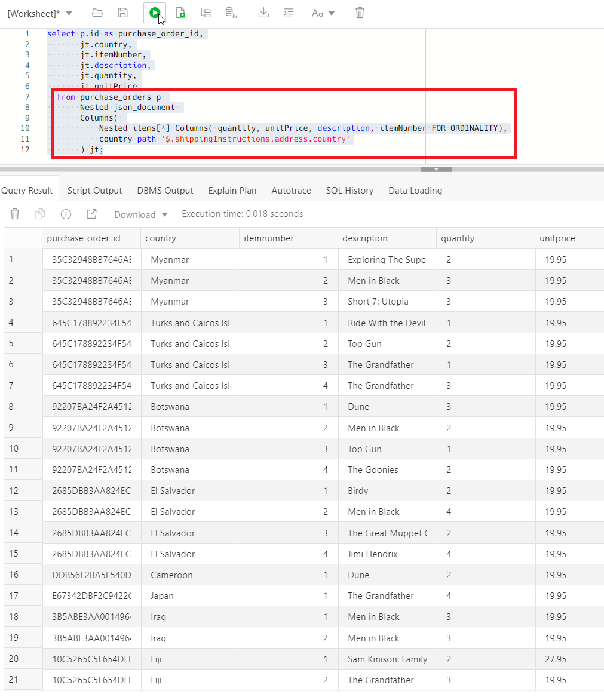
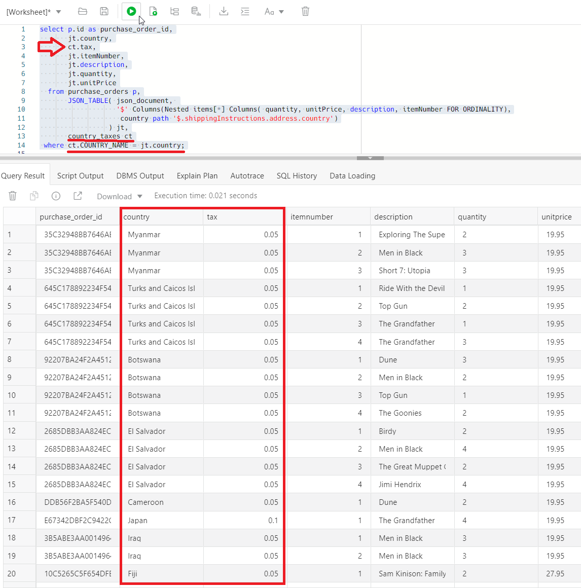
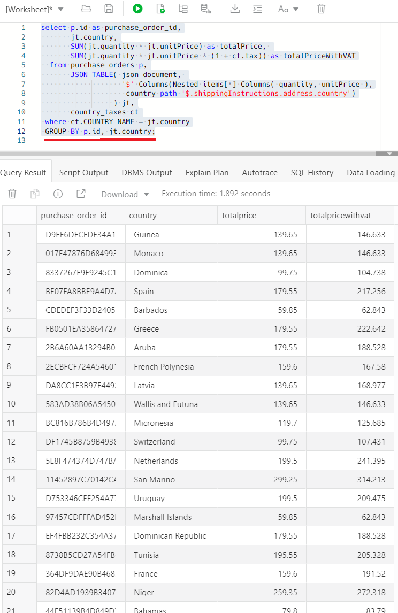
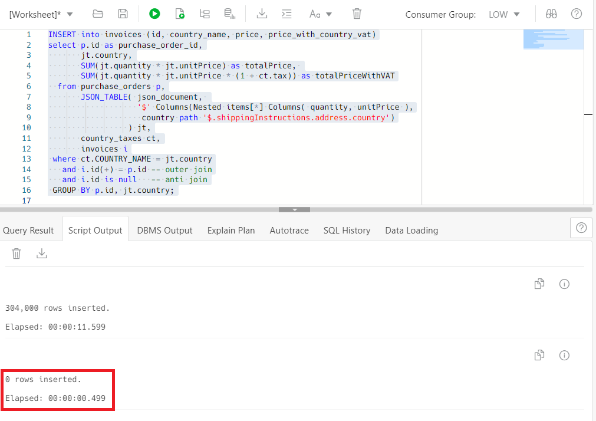
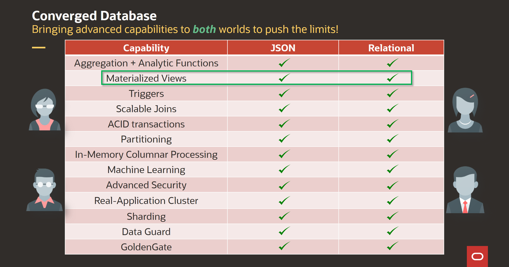
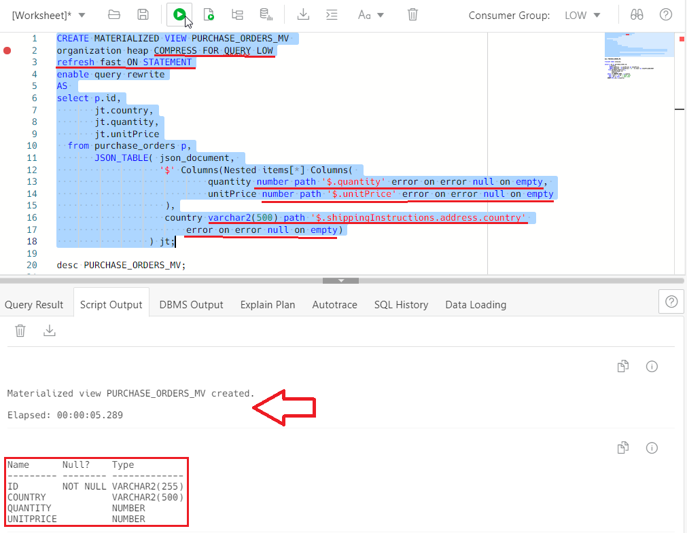
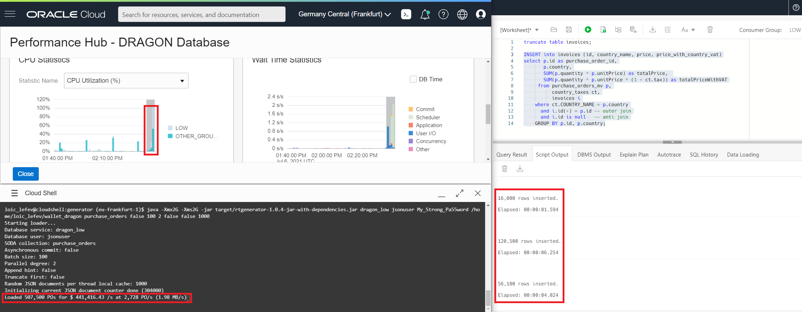

# SQL Over JSON

### Objectives

In this lab, you will:
- learn to unnest JSON arrays into rows using the `JSON_TABLE()` SQL/JSON function  
- learn how to join JSON collections and Relational tables
- learn how to create a view on a JSON data and Relational data 
- learn how to create a materialized view on a JSON data and Relational data in order to benefit from the query rewrite capability

### Prerequisites

* An Oracle Cloud Account - Please view this workshop's LiveLabs landing page to see which environments are supported
* An Autonomous database - Please see the Setup section of this lab

## Combining JSON data with Relational data


Again a new enhancement request comes from the business. The *accounting team* needs a process to generate invoices from purchase orders.
They need this process to be able to work over hundreds of thousands of purchase orders in the case they need to reprocess the invoices.

Financial data and accounting are important subjects for any company, including our MoviE-commerce! The invoices will need to use the
Value Added Tax per country (VAT). These data are used among the company and are stored as relational data. Moreover, since these generated 
invoices will be used downstream for further analysis, and because the accounting team is used to SQL and has existing tools using this language
for data visualization purpose, the invoices will be generated as relational data. 

Now, the question remains: how can we combine the purchase orders stored as JSON data with the VAT per country stored as Relational data in order to produce
new relational Invoices data to be used via SQL, hence stored as Relational data?

Let's dig into the power of a **Converged Database**

  

## **STEP 1**: Loading VAT per Country Data

The very first step will be to initialize our VAT per country relational data.

1. Create the `COUNTRY_TAXES` table:
   
   ```
   <copy>
   CREATE TABLE COUNTRY_TAXES (
       COUNTRY_NAME VARCHAR2(500 BYTE) not null primary key,
       TAX NUMBER(6,3) DEFAULT 0.05 not null
   );
   </copy>
   ```

2. Insert these static data into the table:

   You can use the `Run Script` icon (or F5) from the SQL database action:

   

   ```
   <copy>
    set define off
    insert into country_taxes (COUNTRY_NAME, TAX) values ('Papua New Guinea', 0.05);
    insert into country_taxes (COUNTRY_NAME, TAX) values ('Malta', 0.05);
    insert into country_taxes (COUNTRY_NAME, TAX) values ('Guam', 0.05);
    insert into country_taxes (COUNTRY_NAME, TAX) values ('Malaysia', 0.05);
    insert into country_taxes (COUNTRY_NAME, TAX) values ('Costa Rica', 0.05);
    insert into country_taxes (COUNTRY_NAME, TAX) values ('Djibouti', 0.05);
    insert into country_taxes (COUNTRY_NAME, TAX) values ('Tokelau', 0.05);
    insert into country_taxes (COUNTRY_NAME, TAX) values ('Nepal', 0.05);
    insert into country_taxes (COUNTRY_NAME, TAX) values ('Dominican Republic', 0.05);
    insert into country_taxes (COUNTRY_NAME, TAX) values ('Timor-Leste', 0.05);
    insert into country_taxes (COUNTRY_NAME, TAX) values ('Barbados', 0.05);
    insert into country_taxes (COUNTRY_NAME, TAX) values ('Botswana', 0.05);
    insert into country_taxes (COUNTRY_NAME, TAX) values ('Republic of Korea', 0.1);
    insert into country_taxes (COUNTRY_NAME, TAX) values ('Luxembourg', 0.17);
    insert into country_taxes (COUNTRY_NAME, TAX) values ('Italy', 0.22);
    insert into country_taxes (COUNTRY_NAME, TAX) values ('Dominica', 0.05);
    insert into country_taxes (COUNTRY_NAME, TAX) values ('Slovakia (Slovak Republic)', 0.2);
    insert into country_taxes (COUNTRY_NAME, TAX) values ('Russian Federation', 0.05);
    insert into country_taxes (COUNTRY_NAME, TAX) values ('Micronesia', 0.05);
    insert into country_taxes (COUNTRY_NAME, TAX) values ('Venezuela', 0.05);
    insert into country_taxes (COUNTRY_NAME, TAX) values ('Saint Martin', 0.05);
    insert into country_taxes (COUNTRY_NAME, TAX) values ('Guadeloupe', 0.05);
    insert into country_taxes (COUNTRY_NAME, TAX) values ('Uzbekistan', 0.05);
    insert into country_taxes (COUNTRY_NAME, TAX) values ('Gibraltar', 0.05);
    insert into country_taxes (COUNTRY_NAME, TAX) values ('Marshall Islands', 0.05);
    insert into country_taxes (COUNTRY_NAME, TAX) values ('Taiwan', 0.05);
    insert into country_taxes (COUNTRY_NAME, TAX) values ('Turkmenistan', 0.05);
    insert into country_taxes (COUNTRY_NAME, TAX) values ('Sierra Leone', 0.05);
    insert into country_taxes (COUNTRY_NAME, TAX) values ('Germany', 0.19);
    insert into country_taxes (COUNTRY_NAME, TAX) values ('Liechtenstein', 0.05);
    insert into country_taxes (COUNTRY_NAME, TAX) values ('Qatar', 0.05);
    insert into country_taxes (COUNTRY_NAME, TAX) values ('Heard Island and McDonald Islands', 0.05);
    insert into country_taxes (COUNTRY_NAME, TAX) values ('Yemen', 0.05);
    insert into country_taxes (COUNTRY_NAME, TAX) values ('Solomon Islands', 0.05);
    insert into country_taxes (COUNTRY_NAME, TAX) values ('Cote d''Ivoire', 0.05);
    insert into country_taxes (COUNTRY_NAME, TAX) values ('Ghana', 0.05);
    insert into country_taxes (COUNTRY_NAME, TAX) values ('Chad', 0.05);
    insert into country_taxes (COUNTRY_NAME, TAX) values ('Isle of Man', 0.05);
    insert into country_taxes (COUNTRY_NAME, TAX) values ('Ethiopia', 0.05);
    insert into country_taxes (COUNTRY_NAME, TAX) values ('Angola', 0.05);
    insert into country_taxes (COUNTRY_NAME, TAX) values ('Western Sahara', 0.05);
    insert into country_taxes (COUNTRY_NAME, TAX) values ('Puerto Rico', 0.05);
    insert into country_taxes (COUNTRY_NAME, TAX) values ('Vietnam', 0.05);
    insert into country_taxes (COUNTRY_NAME, TAX) values ('Mexico', 0.16);
    insert into country_taxes (COUNTRY_NAME, TAX) values ('San Marino', 0.05);
    insert into country_taxes (COUNTRY_NAME, TAX) values ('Zimbabwe', 0.05);
    insert into country_taxes (COUNTRY_NAME, TAX) values ('Equatorial Guinea', 0.05);
    insert into country_taxes (COUNTRY_NAME, TAX) values ('South Georgia and the South Sandwich Islands', 0.05);
    insert into country_taxes (COUNTRY_NAME, TAX) values ('Cameroon', 0.05);
    insert into country_taxes (COUNTRY_NAME, TAX) values ('Vanuatu', 0.05);
    insert into country_taxes (COUNTRY_NAME, TAX) values ('Cook Islands', 0.05);
    insert into country_taxes (COUNTRY_NAME, TAX) values ('Nicaragua', 0.05);
    insert into country_taxes (COUNTRY_NAME, TAX) values ('Aruba', 0.05);
    insert into country_taxes (COUNTRY_NAME, TAX) values ('Falkland Islands (Malvinas)', 0.05);
    insert into country_taxes (COUNTRY_NAME, TAX) values ('Saint Barthelemy', 0.05);
    insert into country_taxes (COUNTRY_NAME, TAX) values ('Kenya', 0.05);
    insert into country_taxes (COUNTRY_NAME, TAX) values ('Ecuador', 0.05);
    insert into country_taxes (COUNTRY_NAME, TAX) values ('Nauru', 0.05);
    insert into country_taxes (COUNTRY_NAME, TAX) values ('Canada', 0.05);
    insert into country_taxes (COUNTRY_NAME, TAX) values ('Philippines', 0.05);
    insert into country_taxes (COUNTRY_NAME, TAX) values ('Sweden', 0.25);
    insert into country_taxes (COUNTRY_NAME, TAX) values ('Niger', 0.05);
    insert into country_taxes (COUNTRY_NAME, TAX) values ('Gabon', 0.05);
    insert into country_taxes (COUNTRY_NAME, TAX) values ('Panama', 0.05);
    insert into country_taxes (COUNTRY_NAME, TAX) values ('Turkey', 0.18);
    insert into country_taxes (COUNTRY_NAME, TAX) values ('Montenegro', 0.05);
    insert into country_taxes (COUNTRY_NAME, TAX) values ('Switzerland', 0.077);
    insert into country_taxes (COUNTRY_NAME, TAX) values ('Bahrain', 0.05);
    insert into country_taxes (COUNTRY_NAME, TAX) values ('Maldives', 0.05);
    insert into country_taxes (COUNTRY_NAME, TAX) values ('Sudan', 0.05);
    insert into country_taxes (COUNTRY_NAME, TAX) values ('Seychelles', 0.05);
    insert into country_taxes (COUNTRY_NAME, TAX) values ('Liberia', 0.05);
    insert into country_taxes (COUNTRY_NAME, TAX) values ('Libyan Arab Jamahiriya', 0.05);
    insert into country_taxes (COUNTRY_NAME, TAX) values ('Ireland', 0.23);
    insert into country_taxes (COUNTRY_NAME, TAX) values ('Georgia', 0.05);
    insert into country_taxes (COUNTRY_NAME, TAX) values ('Montserrat', 0.05);
    insert into country_taxes (COUNTRY_NAME, TAX) values ('Faroe Islands', 0.05);
    insert into country_taxes (COUNTRY_NAME, TAX) values ('Finland', 0.24);
    insert into country_taxes (COUNTRY_NAME, TAX) values ('Anguilla', 0.05);
    insert into country_taxes (COUNTRY_NAME, TAX) values ('Somalia', 0.05);
    insert into country_taxes (COUNTRY_NAME, TAX) values ('Austria', 0.2);
    insert into country_taxes (COUNTRY_NAME, TAX) values ('Thailand', 0.05);
    insert into country_taxes (COUNTRY_NAME, TAX) values ('Lithuania', 0.21);
    insert into country_taxes (COUNTRY_NAME, TAX) values ('Bangladesh', 0.05);
    insert into country_taxes (COUNTRY_NAME, TAX) values ('Palau', 0.05);
    insert into country_taxes (COUNTRY_NAME, TAX) values ('Antarctica (the territory South of 60 deg S)', 0.05);
    insert into country_taxes (COUNTRY_NAME, TAX) values ('Reunion', 0.05);
    insert into country_taxes (COUNTRY_NAME, TAX) values ('Guyana', 0.05);
    insert into country_taxes (COUNTRY_NAME, TAX) values ('Bermuda', 0.05);
    insert into country_taxes (COUNTRY_NAME, TAX) values ('British Indian Ocean Territory (Chagos Archipelago)', 0.05);
    insert into country_taxes (COUNTRY_NAME, TAX) values ('Oman', 0.05);
    insert into country_taxes (COUNTRY_NAME, TAX) values ('Lesotho', 0.05);
    insert into country_taxes (COUNTRY_NAME, TAX) values ('Cape Verde', 0.05);
    insert into country_taxes (COUNTRY_NAME, TAX) values ('Guatemala', 0.05);
    insert into country_taxes (COUNTRY_NAME, TAX) values ('Suriname', 0.05);
    insert into country_taxes (COUNTRY_NAME, TAX) values ('Iraq', 0.05);
    insert into country_taxes (COUNTRY_NAME, TAX) values ('Tajikistan', 0.05);
    insert into country_taxes (COUNTRY_NAME, TAX) values ('Iceland', 0.24);
    insert into country_taxes (COUNTRY_NAME, TAX) values ('United States Minor Outlying Islands', 0.05);
    insert into country_taxes (COUNTRY_NAME, TAX) values ('Romania', 0.05);
    insert into country_taxes (COUNTRY_NAME, TAX) values ('Iran', 0.05);
    insert into country_taxes (COUNTRY_NAME, TAX) values ('Egypt', 0.05);
    insert into country_taxes (COUNTRY_NAME, TAX) values ('Japan', 0.1);
    insert into country_taxes (COUNTRY_NAME, TAX) values ('Malawi', 0.05);
    insert into country_taxes (COUNTRY_NAME, TAX) values ('Honduras', 0.05);
    insert into country_taxes (COUNTRY_NAME, TAX) values ('Samoa', 0.05);
    insert into country_taxes (COUNTRY_NAME, TAX) values ('Comoros', 0.05);
    insert into country_taxes (COUNTRY_NAME, TAX) values ('Jamaica', 0.05);
    insert into country_taxes (COUNTRY_NAME, TAX) values ('Denmark', 0.25);
    insert into country_taxes (COUNTRY_NAME, TAX) values ('Cuba', 0.05);
    insert into country_taxes (COUNTRY_NAME, TAX) values ('Paraguay', 0.05);
    insert into country_taxes (COUNTRY_NAME, TAX) values ('Christmas Island', 0.05);
    insert into country_taxes (COUNTRY_NAME, TAX) values ('Rwanda', 0.05);
    insert into country_taxes (COUNTRY_NAME, TAX) values ('Cyprus', 0.05);
    insert into country_taxes (COUNTRY_NAME, TAX) values ('New Caledonia', 0.05);
    insert into country_taxes (COUNTRY_NAME, TAX) values ('Monaco', 0.05);
    insert into country_taxes (COUNTRY_NAME, TAX) values ('Mayotte', 0.05);
    insert into country_taxes (COUNTRY_NAME, TAX) values ('Cayman Islands', 0.05);
    insert into country_taxes (COUNTRY_NAME, TAX) values ('Namibia', 0.05);
    insert into country_taxes (COUNTRY_NAME, TAX) values ('Burundi', 0.05);
    insert into country_taxes (COUNTRY_NAME, TAX) values ('New Zealand', 0.15);
    insert into country_taxes (COUNTRY_NAME, TAX) values ('China', 0.05);
    insert into country_taxes (COUNTRY_NAME, TAX) values ('Congo', 0.05);
    insert into country_taxes (COUNTRY_NAME, TAX) values ('Andorra', 0.05);
    insert into country_taxes (COUNTRY_NAME, TAX) values ('Albania', 0.05);
    insert into country_taxes (COUNTRY_NAME, TAX) values ('Wallis and Futuna', 0.05);
    insert into country_taxes (COUNTRY_NAME, TAX) values ('Colombia', 0.19);
    insert into country_taxes (COUNTRY_NAME, TAX) values ('Kazakhstan', 0.05);
    insert into country_taxes (COUNTRY_NAME, TAX) values ('Saint Vincent and the Grenadines', 0.05);
    insert into country_taxes (COUNTRY_NAME, TAX) values ('Saint Pierre and Miquelon', 0.05);
    insert into country_taxes (COUNTRY_NAME, TAX) values ('India', 0.05);
    insert into country_taxes (COUNTRY_NAME, TAX) values ('Saint Kitts and Nevis', 0.05);
    insert into country_taxes (COUNTRY_NAME, TAX) values ('Uganda', 0.05);
    insert into country_taxes (COUNTRY_NAME, TAX) values ('Poland', 0.23);
    insert into country_taxes (COUNTRY_NAME, TAX) values ('Cocos (Keeling) Islands', 0.05);
    insert into country_taxes (COUNTRY_NAME, TAX) values ('Lebanon', 0.05);
    insert into country_taxes (COUNTRY_NAME, TAX) values ('Sao Tome and Principe', 0.05);
    insert into country_taxes (COUNTRY_NAME, TAX) values ('Mozambique', 0.05);
    insert into country_taxes (COUNTRY_NAME, TAX) values ('Myanmar', 0.05);
    insert into country_taxes (COUNTRY_NAME, TAX) values ('Guinea', 0.05);
    insert into country_taxes (COUNTRY_NAME, TAX) values ('Saudi Arabia', 0.05);
    insert into country_taxes (COUNTRY_NAME, TAX) values ('Israel', 0.17);
    insert into country_taxes (COUNTRY_NAME, TAX) values ('Macedonia', 0.05);
    insert into country_taxes (COUNTRY_NAME, TAX) values ('Argentina', 0.05);
    insert into country_taxes (COUNTRY_NAME, TAX) values ('Norway', 0.25);
    insert into country_taxes (COUNTRY_NAME, TAX) values ('Morocco', 0.05);
    insert into country_taxes (COUNTRY_NAME, TAX) values ('Fiji', 0.05);
    insert into country_taxes (COUNTRY_NAME, TAX) values ('Algeria', 0.05);
    insert into country_taxes (COUNTRY_NAME, TAX) values ('Jersey', 0.05);
    insert into country_taxes (COUNTRY_NAME, TAX) values ('Tonga', 0.05);
    insert into country_taxes (COUNTRY_NAME, TAX) values ('Trinidad and Tobago', 0.05);
    insert into country_taxes (COUNTRY_NAME, TAX) values ('Democratic People''s Republic of Korea', 0.1);
    insert into country_taxes (COUNTRY_NAME, TAX) values ('Singapore', 0.05);
    insert into country_taxes (COUNTRY_NAME, TAX) values ('Moldova', 0.05);
    insert into country_taxes (COUNTRY_NAME, TAX) values ('Bhutan', 0.05);
    insert into country_taxes (COUNTRY_NAME, TAX) values ('Guernsey', 0.05);
    insert into country_taxes (COUNTRY_NAME, TAX) values ('Spain', 0.21);
    insert into country_taxes (COUNTRY_NAME, TAX) values ('Lao People''s Democratic Republic', 0.05);
    insert into country_taxes (COUNTRY_NAME, TAX) values ('Peru', 0.05);
    insert into country_taxes (COUNTRY_NAME, TAX) values ('Niue', 0.05);
    insert into country_taxes (COUNTRY_NAME, TAX) values ('Turks and Caicos Islands', 0.05);
    insert into country_taxes (COUNTRY_NAME, TAX) values ('Portugal', 0.23);
    insert into country_taxes (COUNTRY_NAME, TAX) values ('France', 0.2);
    insert into country_taxes (COUNTRY_NAME, TAX) values ('Pakistan', 0.05);
    insert into country_taxes (COUNTRY_NAME, TAX) values ('Afghanistan', 0.05);
    insert into country_taxes (COUNTRY_NAME, TAX) values ('Syrian Arab Republic', 0.05);
    insert into country_taxes (COUNTRY_NAME, TAX) values ('Ukraine', 0.05);
    insert into country_taxes (COUNTRY_NAME, TAX) values ('Palestinian Territory', 0.05);
    insert into country_taxes (COUNTRY_NAME, TAX) values ('El Salvador', 0.05);
    insert into country_taxes (COUNTRY_NAME, TAX) values ('Tanzania', 0.05);
    insert into country_taxes (COUNTRY_NAME, TAX) values ('Kuwait', 0.05);
    insert into country_taxes (COUNTRY_NAME, TAX) values ('United States of America', 0.05);
    insert into country_taxes (COUNTRY_NAME, TAX) values ('Bosnia and Herzegovina', 0.05);
    insert into country_taxes (COUNTRY_NAME, TAX) values ('American Samoa', 0.05);
    insert into country_taxes (COUNTRY_NAME, TAX) values ('Cambodia', 0.05);
    insert into country_taxes (COUNTRY_NAME, TAX) values ('Bahamas', 0.05);
    insert into country_taxes (COUNTRY_NAME, TAX) values ('Zambia', 0.05);
    insert into country_taxes (COUNTRY_NAME, TAX) values ('Belgium', 0.21);
    insert into country_taxes (COUNTRY_NAME, TAX) values ('Benin', 0.05);
    insert into country_taxes (COUNTRY_NAME, TAX) values ('Guinea-Bissau', 0.05);
    insert into country_taxes (COUNTRY_NAME, TAX) values ('Jordan', 0.05);
    insert into country_taxes (COUNTRY_NAME, TAX) values ('Svalbard & Jan Mayen Islands', 0.05);
    insert into country_taxes (COUNTRY_NAME, TAX) values ('Burkina Faso', 0.05);
    insert into country_taxes (COUNTRY_NAME, TAX) values ('Armenia', 0.05);
    insert into country_taxes (COUNTRY_NAME, TAX) values ('United Kingdom', 0.2);
    insert into country_taxes (COUNTRY_NAME, TAX) values ('Bouvet Island (Bouvetoya)', 0.05);
    insert into country_taxes (COUNTRY_NAME, TAX) values ('Senegal', 0.05);
    insert into country_taxes (COUNTRY_NAME, TAX) values ('Hungary', 0.27);
    insert into country_taxes (COUNTRY_NAME, TAX) values ('Greece', 0.24);
    insert into country_taxes (COUNTRY_NAME, TAX) values ('Sri Lanka', 0.05);
    insert into country_taxes (COUNTRY_NAME, TAX) values ('Norfolk Island', 0.05);
    insert into country_taxes (COUNTRY_NAME, TAX) values ('United Arab Emirates', 0.05);
    insert into country_taxes (COUNTRY_NAME, TAX) values ('Togo', 0.05);
    insert into country_taxes (COUNTRY_NAME, TAX) values ('Madagascar', 0.05);
    insert into country_taxes (COUNTRY_NAME, TAX) values ('Virgin Islands, U.S.', 0.05);
    insert into country_taxes (COUNTRY_NAME, TAX) values ('Nigeria', 0.05);
    insert into country_taxes (COUNTRY_NAME, TAX) values ('Central African Republic', 0.05);
    insert into country_taxes (COUNTRY_NAME, TAX) values ('Tuvalu', 0.05);
    insert into country_taxes (COUNTRY_NAME, TAX) values ('Netherlands Antilles', 0.05);
    insert into country_taxes (COUNTRY_NAME, TAX) values ('Haiti', 0.05);
    insert into country_taxes (COUNTRY_NAME, TAX) values ('Indonesia', 0.05);
    insert into country_taxes (COUNTRY_NAME, TAX) values ('Virgin Islands, British', 0.05);
    insert into country_taxes (COUNTRY_NAME, TAX) values ('Azerbaijan', 0.05);
    insert into country_taxes (COUNTRY_NAME, TAX) values ('Martinique', 0.05);
    insert into country_taxes (COUNTRY_NAME, TAX) values ('Brunei Darussalam', 0.05);
    insert into country_taxes (COUNTRY_NAME, TAX) values ('Brazil', 0.05);
    insert into country_taxes (COUNTRY_NAME, TAX) values ('Macao', 0.05);
    insert into country_taxes (COUNTRY_NAME, TAX) values ('Croatia', 0.05);
    insert into country_taxes (COUNTRY_NAME, TAX) values ('Slovenia', 0.22);
    insert into country_taxes (COUNTRY_NAME, TAX) values ('Netherlands', 0.21);
    insert into country_taxes (COUNTRY_NAME, TAX) values ('Grenada', 0.05);
    insert into country_taxes (COUNTRY_NAME, TAX) values ('Swaziland', 0.05);
    insert into country_taxes (COUNTRY_NAME, TAX) values ('Pitcairn Islands', 0.05);
    insert into country_taxes (COUNTRY_NAME, TAX) values ('French Southern Territories', 0.05);
    insert into country_taxes (COUNTRY_NAME, TAX) values ('Tunisia', 0.05);
    insert into country_taxes (COUNTRY_NAME, TAX) values ('Czech Republic', 0.21);
    insert into country_taxes (COUNTRY_NAME, TAX) values ('Northern Mariana Islands', 0.05);
    insert into country_taxes (COUNTRY_NAME, TAX) values ('Saint Helena', 0.05);
    insert into country_taxes (COUNTRY_NAME, TAX) values ('Greenland', 0.05);
    insert into country_taxes (COUNTRY_NAME, TAX) values ('Chile', 0.19);
    insert into country_taxes (COUNTRY_NAME, TAX) values ('Latvia', 0.21);
    insert into country_taxes (COUNTRY_NAME, TAX) values ('Belize', 0.05);
    insert into country_taxes (COUNTRY_NAME, TAX) values ('Mali', 0.05);
    insert into country_taxes (COUNTRY_NAME, TAX) values ('Gambia', 0.05);
    insert into country_taxes (COUNTRY_NAME, TAX) values ('Saint Lucia', 0.05);
    insert into country_taxes (COUNTRY_NAME, TAX) values ('Hong Kong', 0.05);
    insert into country_taxes (COUNTRY_NAME, TAX) values ('Estonia', 0.2);
    insert into country_taxes (COUNTRY_NAME, TAX) values ('Kiribati', 0.05);
    insert into country_taxes (COUNTRY_NAME, TAX) values ('Bolivia', 0.05);
    insert into country_taxes (COUNTRY_NAME, TAX) values ('Belarus', 0.05);
    insert into country_taxes (COUNTRY_NAME, TAX) values ('Uruguay', 0.05);
    insert into country_taxes (COUNTRY_NAME, TAX) values ('French Guiana', 0.05);
    insert into country_taxes (COUNTRY_NAME, TAX) values ('South Africa', 0.05);
    insert into country_taxes (COUNTRY_NAME, TAX) values ('Kyrgyz Republic', 0.05);
    insert into country_taxes (COUNTRY_NAME, TAX) values ('French Polynesia', 0.05);
    insert into country_taxes (COUNTRY_NAME, TAX) values ('Bulgaria', 0.05);
    insert into country_taxes (COUNTRY_NAME, TAX) values ('Holy See (Vatican City State)', 0.05);
    insert into country_taxes (COUNTRY_NAME, TAX) values ('Mauritania', 0.05);
    insert into country_taxes (COUNTRY_NAME, TAX) values ('Australia', 0.1);
    insert into country_taxes (COUNTRY_NAME, TAX) values ('Eritrea', 0.05);
    insert into country_taxes (COUNTRY_NAME, TAX) values ('Antigua and Barbuda', 0.05);
    insert into country_taxes (COUNTRY_NAME, TAX) values ('Mauritius', 0.05);
    insert into country_taxes (COUNTRY_NAME, TAX) values ('Mongolia', 0.05);
    insert into country_taxes (COUNTRY_NAME, TAX) values ('Serbia', 0.05);
    commit;
   </copy>
   ```

## **STEP 2**: Creating INVOICES Relational Table

1. Create the INVOICES table that will contain the computed invoices including the applied VAT according to the country origine of the purchase order:

   ```
   <copy>-- /!\ Warning for on-premises: this will use the Partitioning Option (costs associated unless you use the database XE version)
   CREATE TABLE INVOICES (
       id VARCHAR2(255) not null primary key,
       CREATED_ON timestamp default sys_extract_utc(SYSTIMESTAMP) not null,
       price number not null,
       price_with_country_vat number not null,
       country_name varchar2(500) not null
   )
   PARTITION BY RANGE (CREATED_ON)
   INTERVAL (INTERVAL '1' HOUR)
   (
       PARTITION part_01 values LESS THAN (TO_TIMESTAMP('01-JUN-2021','DD-MON-YYYY'))
   );</copy> 
   ```

   This table is partitioned the same way as the `purchase_orders` collection.

## **STEP 3**: Generating the _Invoices Data!_

The process will consist of:
- retrieving the **JSON** documents from the `purchase_orders` collection
- converting them into **relational** data using the `JSON_TABLE()` SQL/JSON function
- joining it with the `country_taxes` **relational** data
- computing the new price using the SQL `GROUP BY` operation along the aggregate function `SUM`
- removing the invoices that have already been processed using an `ANTI JOIN` technic
- inserting the data into the `INVOICES` **relational** table

As you can see, the SQL language is involved to combine multiple data models together. SQL shines here because as a 4th Generation Language (4GL),
we'll only ask for the results, and the database engine will process data in the most efficient way. 

...Let's go!

1. Retrieving the **JSON** documents from the `purchase_orders` collection... in SQL:

   The simplest query we can start with will use the dot-notation to walk the JSON documents hierarchy:

   ```
   <copy>
   select p.id as purchase_order_id,
          p.json_document.shippingInstructions.address.country as country
     from purchase_orders p;
   </copy>
   ```
   
   This allows us to retrieve the country from the shipping address fields along the ID or primary key for each single JSON document:
   


2. Converting them into **relational** data using the `JSON_TABLE()` SQL/JSON function

   The [`JSON_TABLE()`](https://docs.oracle.com/en/database/oracle/oracle-database/19/adjsn/function-JSON_TABLE.html) function allows projecting JSON fields into relational columns. It also allows unnesting JSON array elements into new rows.
   
   In the following example, we'll unnest the `items` array from our JSON documents:
   ```
   {
      "requestor": "Alexis Bull",
      ...
      "shippingInstructions": {
         "address": {
            ...
            "country": "United States of America",
            ...
         },
         ...
      },
      ...
      "items": [
         {
            "description": "One Magic Christmas",
            "unitPrice": 19.95,
            "UPCCode": 13131092899,
            "quantity": 1.0
         },
         {
            "description": "Lethal Weapon",
            "unitPrice": 19.95,
            "UPCCode": 85391628927,
            "quantity": 5.0
         }
      ]
   }
   ```
   
   Here is the SQL query:
   
   ```
   <copy>
   select p.id as purchase_order_id,
          jt.country,
          jt.itemNumber,
          jt.description,
          jt.quantity,
          jt.unitPrice
    from purchase_orders p,
         JSON_TABLE( json_document,
            '$' Columns(Nested items[*] Columns( quantity, unitPrice, description, itemNumber FOR ORDINALITY),
            country path '$.shippingInstructions.address.country')
         ) jt;
   </copy>
   ```
   
   And here is the result:
   

   You can see that the `JSON_TABLE()` function builds a new table with alias `jt`. The `'$'` symbol represents the root of the 
   JSON document hierarchy and we can navigate the JSON fields such as the `$.items` array or the `$.shippingInstructions.address.country`.
   
   The interesting part comes from the **Nested** operator which denotes the presence of an array inside the JSON document and then builds the rows by extracting here the 3
   JSON fields: `quantity`, `unitPrice` and `description`. The `ìtemNumber` column is a new one that will contain the item number inside the array starting from 1. This is the purpose of the `FOR ORDINALITY` expression:
   allows us to put a number in front of the new generated row.
   
   The first JSON document with ID highlighted in the red square is displayed hereunder to help you better understand what is happening:

   ```
   {
     "reference" : "FRAJKIRAN-20210703",
     "requestor" : "Fiamma Rajkiran",
     "user" : "FRAJKIRAN",
     "requestedAt" : "2021-07-03T08:30:31.752701Z",
     "shippingInstructions" :
     {
       "name" : "Fiamma Rajkiran",
       "address" :
       {
         "street" : "04478 Lincoln Springs",
         "city" : "South Armandobury",
         "state" : "NH",
         "zipCode" : "94335-7419",
         "country" : "Myanmar",
         "geometry" :
         {
           "type" : "Point",
           "coordinates" :
           [
             91.790958,
             -36.701601
           ]
         }
       },
       "phone" :
       [
         {
           "type" : "Office",
           "number" : "530-931-1111"
         }
       ]
     },
     "costCenter" : "A30",
     "specialInstructions" : "COD",
     "allowPartialShipment" : true,
     "items" :
     [
       {
         "description" : "Exploring The Supernatural 3: Miracles/Mysteries",
         "unitPrice" : 19.95,
         "UPCCode" : 56775020194,
         "quantity" : 2
       },
       {
         "description" : "Men in Black",
         "unitPrice" : 19.95,
         "UPCCode" : 43396054981,
         "quantity" : 3
       },
       {
         "description" : "Short 7: Utopia",
         "unitPrice" : 19.95,
         "UPCCode" : 85393694326,
         "quantity" : 3
       }
     ]
   }
   ```

   As you can see, the array contains 3 items.

   With the 19c version of the Oracle database, we get a new way to write such query with, simpler:
   
   ```
   <copy>
   select p.id as purchase_order_id,
          jt.country,
          jt.itemNumber,
          jt.description,
          jt.quantity,
          jt.unitPrice
    from purchase_orders p
         Nested json_document
         Columns(
             Nested items[*] Columns( quantity, unitPrice, description, itemNumber FOR ORDINALITY),
             country path '$.shippingInstructions.address.country'
         ) jt;
   </copy>
   ```
   
   This produces the exact same result:
   


3. Joining these data with the `country_taxes` **relational** data

   We can improve the previous query by introducing a SQL join with the `country_taxes` table:

   ```
   <copy>
   select p.id as purchase_order_id,
          jt.country,
          ct.tax,
          jt.itemNumber,
          jt.description,
          jt.quantity,
          jt.unitPrice
     from purchase_orders p,
          JSON_TABLE( json_document, 
                      '$' Columns(Nested items[*] Columns( quantity, unitPrice, description, itemNumber FOR ORDINALITY),
                       country path '$.shippingInstructions.address.country')
                    ) jt,
          country_taxes ct
    where ct.COUNTRY_NAME = jt.country;
   </copy>
   ```

   The result with the taxes per country now displayed and available for further computing...
   
   


4. Computing the new price using the SQL `GROUP BY` operation along the aggregate function `SUM`

   This is the easiest part: writing an aggregation query to sum the quantity of our items and multiplying it by the unit 
   price and summing for all the items of a given purchase order (_unique identifier_: ID). This will give us a price in $. 
   
   Now adding to it the VAT consist of taking this price and multiply it by 100% + tax = 1 + tax: 

   ```
   <copy>
   select p.id as purchase_order_id,
          jt.country,
          SUM(jt.quantity * jt.unitPrice) as totalPrice, 
          SUM(jt.quantity * jt.unitPrice * (1 + ct.tax)) as totalPriceWithVAT
     from purchase_orders p,
          JSON_TABLE( json_document, 
                      '$' Columns(Nested items[*] Columns( quantity, unitPrice ),
                       country path '$.shippingInstructions.address.country')
                    ) jt,
          country_taxes ct
    where ct.COUNTRY_NAME = jt.country
    GROUP BY p.id, jt.country;
   </copy>
   ```

   This gives the following result:

   


5. Removing the invoices that have already been processed using an `ANTI JOIN` technic

   Remember, we want to generate invoices relational data. However, we don't want to generate duplicates!

   Since we'll insert the generated data into the `invoices` table we've just created, we can use an `ANTI JOIN` to restrict the
   invoice generation to the purchase orders **without** any related invoice. We'll keep the purchase order ID as the unique identifier for our invoice.
   
   This gives the following query:
   
   ```
   <copy>
   select p.id as purchase_order_id,
          jt.country,
          SUM(jt.quantity * jt.unitPrice) as totalPrice, 
          SUM(jt.quantity * jt.unitPrice * (1 + ct.tax)) as totalPriceWithVAT
     from purchase_orders p,
          JSON_TABLE( json_document, 
                      '$' Columns(Nested items[*] Columns( quantity, unitPrice ),
                       country path '$.shippingInstructions.address.country')
                    ) jt,
          country_taxes ct,
          invoices i
    where ct.COUNTRY_NAME = jt.country
      and i.id(+) = p.id -- outer join
      and i.id is null   -- anti join
    GROUP BY p.id, jt.country;
   </copy>
   ```

   The resulting rows are:

   

   You can see highlighted the 2 interesting lines:
   - the first one does a left outer join between `purchase_orders` collection and the `invoices` table 
   - the second one checks that any resulting row from the `invoices` table has a null ID (the unique not null identifier) 
     meaning that there is no corresponding `invoices` row, and so we need to create one for this purchase order JSON document


6. Inserting the data into the `INVOICES` **relational** table

   We can then add the missing SQL expression to use to insert the data inside the `invoices` table:

   ```
   <copy>
   INSERT into invoices (id, country_name, price, price_with_country_vat)
   select p.id as purchase_order_id,
          jt.country,
          SUM(jt.quantity * jt.unitPrice) as totalPrice, 
          SUM(jt.quantity * jt.unitPrice * (1 + ct.tax)) as totalPriceWithVAT
     from purchase_orders p,
          JSON_TABLE( json_document, 
                      '$' Columns(Nested items[*] Columns( quantity, unitPrice ),
                       country path '$.shippingInstructions.address.country')
                    ) jt,
          country_taxes ct,
          invoices i
    where ct.COUNTRY_NAME = jt.country
      and i.id(+) = p.id -- outer join
      and i.id is null   -- anti join
    GROUP BY p.id, jt.country;
   </copy>
   ```

   Using the LOW database service on an Always Free Tiers database, it created 304,000 new invoices in 12 seconds:

   

   If we run it again without adding any new JSON purchase order, hence no new invoice to create, this is almost instantaneous:

   


## **STEP 4**: Optimizing the Process!


Indeed, a new bug need to be fixed! Apparently the batch process is too slow... It appears the generation of relational rows
from JSON data using the `JSON_TABLE()` function takes a lot of time.

Let's review what the integration of the JSON data model means for the Oracle database compared to the features available since years
for relational data:



As you can see, the features from the Relational world are available to the JSON world. Particularly, the one highlighted 
in green (`Materialized Views`) deserves our attention.

Indeed, this capability is very useful for reporting/analytics/batch workloads involving potentially a lot of rows. `Materialized Views` allow
pre-computing data during DML to speed-up the queries later.

Let's see how to optimize our batch process...

1. Creating a `Materialized View`

   We'll create a materialized view, that will be updated in the case of any DML operation occurring on the underlying `purchase_orders` collection.
   We'll also leverage the Autonomous database underlying infrastructure (Exadata) to ask for the columnar compression of the data inside the materialized view.
   
   ```
   <copy>
   CREATE MATERIALIZED VIEW PURCHASE_ORDERS_MV 
   organization heap COMPRESS FOR QUERY LOW
   refresh fast ON STATEMENT
   enable query rewrite
   AS 
   select p.rowid as p_rowid, p.id,
          jt.country,
          jt.quantity,
          jt.unitPrice
     from purchase_orders p,
          JSON_TABLE( json_document, 
                      '$' Columns(Nested items[*] Columns( 
                               quantity number path '$.quantity' error on error null on empty, 
                               unitPrice number path '$.unitPrice' error on error null on empty
                       ),
                       country varchar2(500) path '$.shippingInstructions.address.country' 
                           error on error null on empty)
                    ) jt;
   </copy>
   ```
   
   

   In red, there are several remarks:
   - the columnar compression is ideal for later queries, several other compression algorithms are available)
   - the refresh fast on statement allows computing only the additional data in the case of new purchase orders are ingested
   - the fields `quantity`, `unitPrice`, and `country` extracted from the JSON fields are converted into the proper data types to avoid being strings by default
   - the materialized view creation took 5 seconds for 304,000 purchase orders
   

2. Regenerating invoices data using the `MATERIALIZED VIEW`

   Let's clear the `invoices` table:

   ```
   <copy>
   truncate table invoices;
   </copy>
   ```
    
   And let's modify the `INSERT` statement to leverage our brand new `materialized view`:

   ```
   <copy>
   INSERT into invoices (id, country_name, price, price_with_country_vat)
   select p.id as purchase_order_id,
          p.country,
          SUM(p.quantity * p.unitPrice) as totalPrice, 
          SUM(p.quantity * p.unitPrice * (1 + ct.tax)) as totalPriceWithVAT
        from purchase_orders_mv p,
             country_taxes ct,
             invoices i
       where ct.COUNTRY_NAME = p.country
         and i.id(+) = p.id -- outer join
         and i.id is null   -- anti join
       GROUP BY p.id, p.country;
   </copy>
   ```
   
   And following are the results:

   

   The insertion batch took now 6 seconds to generate the 304,000 invoices instead of 11 seconds. And running it a second 
   time took again almost no time because no new purchase orders have been ingested.

## **STEP 5**: Running Everything Together!

The final step of this lab will consist of running every single capability together:
- the ingestion process
- the full-text indexing process
- the invoices batch generation

1. Reopen the OCI Cloud shell and rerun the data generator.

2. While the generator loads JSON documents, run several times the latest query to generate new invoices.

You should see using the Autonomous database performance hub the CPU activity increase:



For an Always Free Autonomous Transaction Processing database, you can see above an ingestion rate of about 2,700 purchase 
orders by second (which translate into about $ 440k of purchase orders by second, great!!!) and the invoices batch generator 
which generated close to 200,000 new invoices in less than 12 seconds. And remember all of these newly ingested JSON documents
are fully indexed: fields and values allowing great frontend response times!

**Converged database: all data models persistence and processing inside the same database.** 

You've now reached the end of this workshop. We hope you've tested and learned new things. 

## Learn More

* [Query JSON Data](https://docs.oracle.com/en/database/oracle/oracle-database/19/adjsn/query-json-data.html)
* [CREATE MATERIALIZED VIEW SQL Reference](https://docs.oracle.com/en/database/oracle/oracle-database/19/sqlrf/CREATE-MATERIALIZED-VIEW.html)

## Acknowledgements
* **Author** - Loic Lefevre, Principal Product Manager
* **Last Updated By/Date** - Loic Lefevre, Principal Product Manager, June 2021

