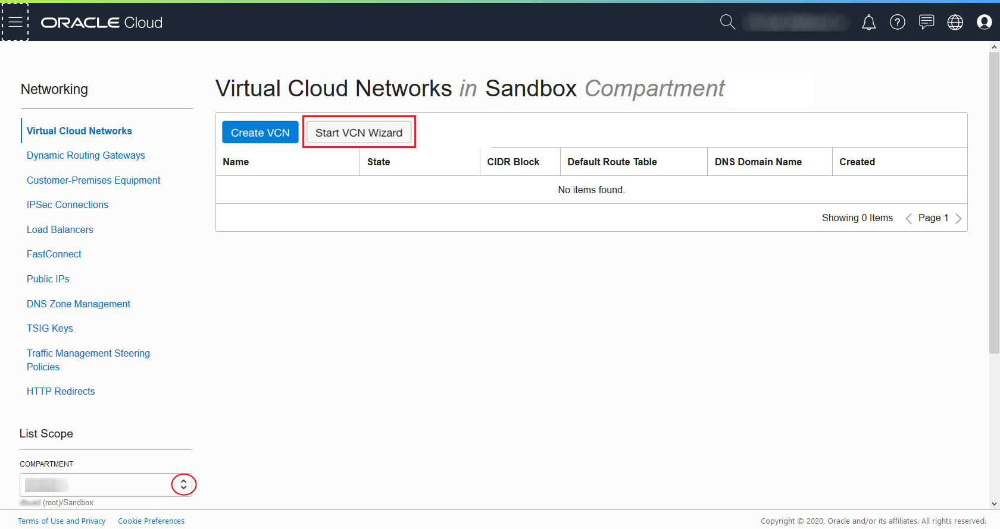
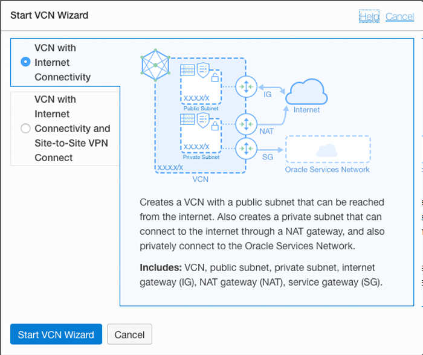
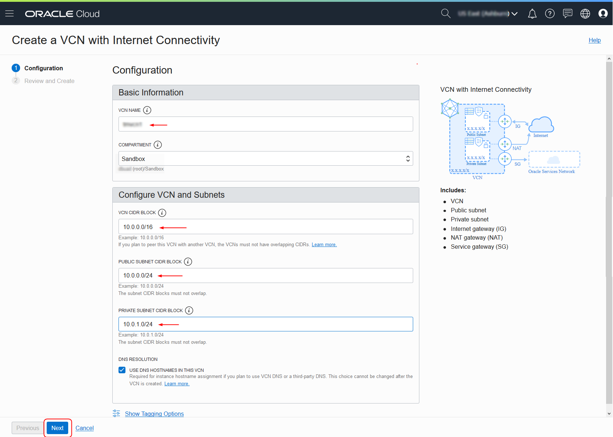
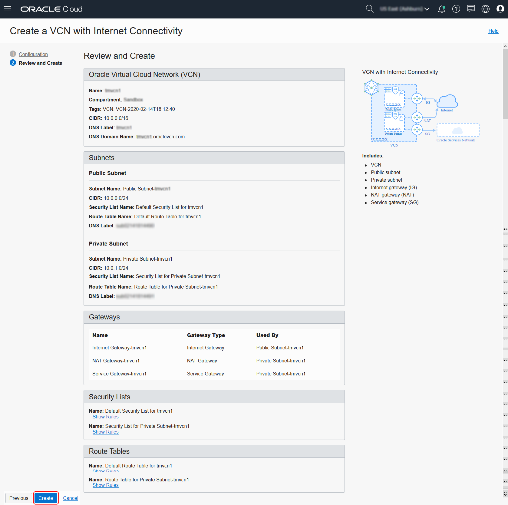
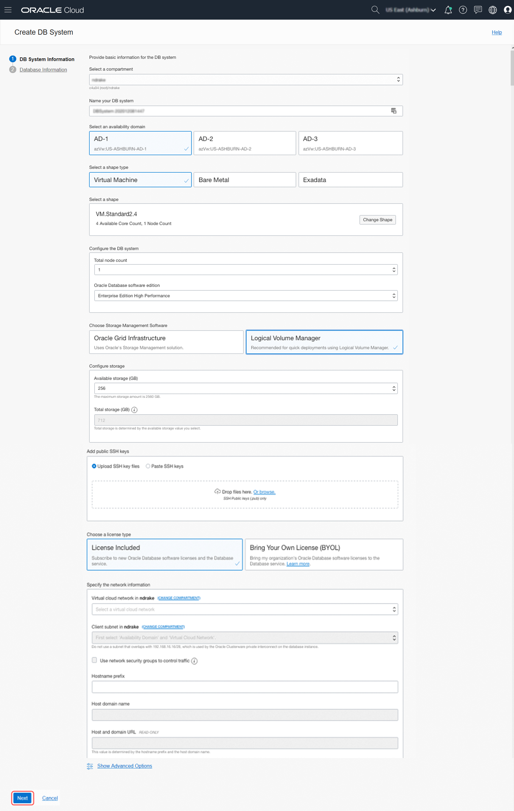
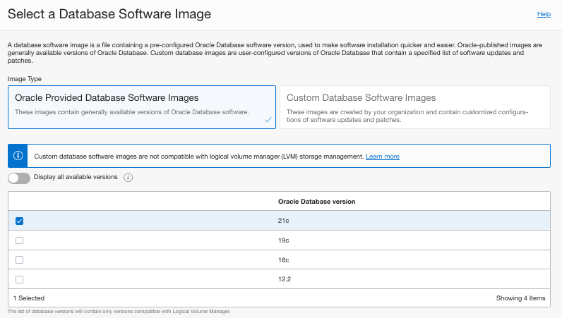

# Create a 21C DBCS VM Database and VCN

## Introduction

This lab walks you through the steps to create a virtual cloud network (VCN) and an instance of an Oracle 21c Database running in Oracle Cloud Infrastructure. Oracle Cloud Infrastructure provides several options for rapidly creating a Database system for development and testing, including fast provisioning of 1-node virtual machine database systems.

A virtual cloud network (VCN) provides the necessary network Infrastructure required to support resources, including Oracle Database instances. This includes a gateway, route tables, security lists, DNS and so on. 

Estimated Lab Time: 35 minutes

### Objectives
* Create a VCN 
* Create a Single Node 21c DBCS VM 
* Login to your environment

### Prerequisites

* An Oracle Free Tier, Always Free, Paid or LiveLabs Cloud Account
* SSH Keys
  
## **STEP 1**: Create a Virtual Cloud Network instance
Fortunately, Oracle Cloud Infrastructure provides a wizard that simplifies the creation of a basic, public internet accessible VCN.

1. Login to Oracle Cloud
2. From the Console menu, select **Networking > Virtual Cloud Networks**.

  

2. Select your compartment and click on **Start VCN Wizard**. If you haven't created any compartments yet, just leave it as the default (root) compartment.  If you were assigned a compartment, enter it here.

  

3. Be sure the default "VCN with Internet Connectivity" is selected and click **Start VCN Wizard**.

  

4. Enter a name for your VCN, and enter the default values for the VCN CIDR block(10.0.0.0/16), Public Subnet CIDR block (10.0.0.0/24) and Private CIDR block (10.0.1.0/24), and click **Next**.

  

5. Review your selections on the next screen and click **Create**.

  

6. On the summary screen, click **View Virtual Cloud Network**.
   
## **STEP 2**: Create a Database Virtual Machine

1. From the Console menu, click on **Bare Metal, VM, and Exadata**.

  

2. Select the compartment you want to create the database in and click on **Create DB System**.

  

3. On the DB System Information form, enter the following information and click **Next**  Enter the following

    * **Select a compartment**:  Select the compartment you used for your VCN
    * **Name your DB system**: Give your database a name.
    * **Select an availability domain**:  Choose an AD
    * **Select a shape type**:  Choose *Virtual Machine*
    * **Select a shape**: *VM Standard2.4* (If you are in a Free Trial account, choose the smaller *VM Standard 2.2* shape, keep in mind that this will increase provisioning time)
    * **Configure the DB system - Node count**: *1* 
    * **Configure the DB system - Software edition**: *Enterprise Edition High Performance*
    * **Storage Management Software**: *Logical Volume Manager* *Note:  This is **very** important to choose Logical Volume Manager*
    * **Available Storage**: *256*
    * **Add public SSH keys**: Paste your public key from Lab 1.  If you are in Cloud Shell use the Paste option and ensure you paste a single line (paste in notepad to check it is one line).  If you are using a terminal browse to the location of your SSH keys and select the public key file (with a .pub extension). *Note:  Ensure you paste a one line file if using Cloud Shell*
    * **Specify the Network information - Virtual Cloud Network**: Select the VCN you created using the drop down list
    * **Specify the Network information - Client subnet**:  *Public subnet* using the drop down list.
    * **Hostname prefix**:  Enter a short hostname prefix *Note: Hostname should start with a letter*

    

4. On the Database Information form, enter the following information and click **Create DB System**.

    * **Database name**: Choose default database name to "cdb1".
    * **Database image**: Click the **Change Database Image** button and select *21c*
    * **PDB name** field, enter "pdb1".
    * **Create administrator credentials**: Use the password `WElcome123##` for your sys user in the **Password** field and then repeat the password in the **Confirm password** field.  This password will be used for all exercises in the 21c workshop series.  Please enter it carefully.

    
    

5. After a few minutes, your Database System will change color from yellow (Provisioning) to green.  *Note:  If you use a smaller VM Shape, the provisioning may take longer*

    

## **STEP 3**: Gather system details and connect to the Database using SSH

1. Go back to the Oracle Cloud Console and click on the DB System you just created.  Note that you have a fully provisioned Database.
2. In the Databases section, jot down your **Database Unique Name**.  You will need this for the next lab.
3. Check your storage management software to ensure you selected **Logical Volume Manager**.  This is necessary for the next lab.
   
    

4. On the resources tab, click **Nodes** to gather your IP address. Note your Public IP Address

  

4. In Cloud Shell or your terminal window, navigate to the folder where you created the SSH keys and enter this command, using your IP address:

    ```
    $ <copy>ssh -i ./myOracleCloudKey opc@</copy>123.123.123.123
    Enter passphrase for key './myOracleCloudKey':
    Last login: Tue Feb  4 15:21:57 2020 from 123.123.123.123
    [opc@tmdb1 ~]$
    ```

5. Once connected, you can switch to the "oracle" OS user and connect using SQL*Plus:

    ```
    [opc@tmdb1 ~]$ sudo su - oracle
    [oracle@tmdb1 ~]$ . oraenv
    ORACLE_SID = [cdb1] ?
    The Oracle base has been set to /u01/app/oracle
    [oracle@tmdb1 ~]$ sqlplus / as sysdba

    SQL*Plus: Release 21.0.0.0.0 - Production on Sat Nov 15 14:01:48 2020
    Version 21.2.0.0.0

    Copyright (c) 1982, 2020, Oracle.  All rights reserved.

    Connected to:
    Oracle Database 21c EE High Perf Release 21.0.0.0.0 - Production
    Version 21.0.0.0.0

    SQL>
    ```

You may now [proceed to the next lab](#next).

## Want to Learn More?

* [Oracle Cloud Infrastructure: Creating Bare Metal and Virtual Machine DB Systems](https://docs.cloud.oracle.com/en-us/iaas/Content/Database/Tasks/creatingDBsystem.htm)
* [Oracle Cloud Infrastructure: Connecting to a DB System](https://docs.cloud.oracle.com/en-us/iaas/Content/Database/Tasks/connectingDB.htm)

## Acknowledgements
* **Author** - Tom McGinn, Learning Architect, Database User Assistance
* **Last Updated By/Date** - Kay Malcolm, December 7, 2020

## Need Help?
Please submit feedback or ask for help using our [LiveLabs Support Forum](https://community.oracle.com/tech/developers/categories/livelabsdiscussions). Please click the **Log In** button and login using your Oracle Account. Click the **Ask A Question** button to the left to start a *New Discussion* or *Ask a Question*.  Please include your workshop name and lab name.  You can also include screenshots and attach files.  Engage directly with the author of the workshop.

If you do not have an Oracle Account, click [here](https://profile.oracle.com/myprofile/account/create-account.jspx) to create one. 
