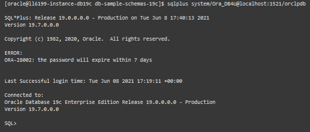

# Sample Schema Setup

## Introduction
This lab will show you how to setup your database schemas for the subsequent labs.

### Prerequisites
- An Oracle LiveLabs or Paid Oracle Cloud account
- Lab: Generate SSH Key
- Lab: Build a DB System

Estimated Lab Time: 5 Minutes

Watch the video below for an overview of the Install Sample Schema lab
[](youtube:rUIxZjy9HQg)

## Task: Install Sample Data

In this step, you will install a selection of the Oracle Database Sample Schemas.  For more information on these schemas, please review the Schema agreement at the end of this lab.

By completing the instructions below the sample schemas **SH**, **OE**, and **HR** will be installed. These schemas are used in Oracle documentation to show SQL language concepts and other database features. The schemas themselves are documented in Oracle Database Sample Schemas [Oracle Database Sample Schemas](https://www.oracle.com/pls/topic/lookup?ctx=dblatest&id=COMSC).

Copy the following commands into your terminal. These commands download the files needed to run the lab.  (Note: *You should run these scripts as the oracle user*.  Run a *whoami* to ensure the value *oracle* comes back.)

1.  If you aren't already logged in to the Oracle Cloud, open up a web browser and re-login to Oracle Cloud.

2.  Start Cloud Shell

    *Note:* You can also use Putty or MAC Cygwin if you chose those formats in the earlier lab.  
    

3.  Connect to node 1 as the *opc* user (you identified the IP address of node 1 in the Build DB System lab).

    ````
    ssh -i ~/.ssh/sshkeyname opc@<<Node 1 Public IP Address>>
    ````
    

4.  Switch to the oracle user and set the Oracle database environment

    ````
    <copy>
    sudo su - oracle
    </copy>
    ````

    When connected as *oracle*

    ````
    <copy>
    . oraenv
    </copy>
    ````

    Note: If you are running in Windows using putty, ensure your Session Timeout is set to greater than 0.

5.  Get the Database sample schemas and unzip them. Then set the path in the scripts.

    ````
    <copy>
    wget https://github.com/oracle/db-sample-schemas/archive/v19c.zip
    unzip v19c.zip
    cd db-sample-schemas-19c
    perl -p -i.bak -e 's#__SUB__CWD__#'$(pwd)'#g' *.sql */*.sql */*.dat
    </copy>
    ````

    

6.  Login using `SQL*Plus` as the **oracle** user.  

    ````
    <copy>
    sqlplus system/W3lcom3#W3lcom3#@localhost:1521/pdb1.pub.racdblab.oraclevcn.com
    </copy>
    ````
    

7.  Install the Sample Schemas by running the script below.

    ````
    <copy>
    @mksample W3lcom3#W3lcom3# W3lcom3#W3lcom3# W3lcom3#W3lcom3# W3lcom3#W3lcom3# W3lcom3#W3lcom3# W3lcom3#W3lcom3# W3lcom3#W3lcom3# W3lcom3#W3lcom3# users temp /home/oracle/db-sample-schemas-19c/ localhost:1521/pdb1.pub.racdblab.oraclevcn.com
    </copy>
    ````

    

8. Exit SQL Plus and exit the oracle user to return to the opc user.

    ```
    <copy>exit
    exit
    </copy>
    ```

    

Congratulations! Now you have the environment to run the labs.

    *Note:* There may be some drop user errors, ignore them.  Please be patient as this script takes some time.

Congratulations! Now you have the data to run subsequent labs.

You may now *proceed to the next lab*.

## Oracle Database Sample Schemas Agreement

Copyright (c) 2019 Oracle

Permission is hereby granted, free of charge, to any person obtaining a copy of this software and associated documentation files (the "Software"), to deal in the Software without restriction, including without limitation the rights to use, copy, modify, merge, publish, distribute, sublicense, and/or sell copies of the Software, and to permit persons to whom the Software is furnished to do so, subject to the following conditions:

The above copyright notice and this permission notice shall be included in all copies or substantial portions of the Software.

*THE SOFTWARE IS PROVIDED "AS IS", WITHOUT WARRANTY OF ANY KIND, EXPRESS OR IMPLIED, INCLUDING BUT NOT LIMITED TO THE WARRANTIES OF MERCHANTABILITY, FITNESS FOR A PARTICULAR PURPOSE AND NONINFRINGEMENT. IN NO EVENT SHALL THE AUTHORS OR COPYRIGHT HOLDERS BE LIABLE FOR ANY CLAIM, DAMAGES OR OTHER LIABILITY, WHETHER IN AN ACTION OF CONTRACT, TORT OR OTHERWISE, ARISING FROM, OUT OF OR IN CONNECTION WITH THE SOFTWARE OR THE USE OR OTHER DEALINGS IN THE SOFTWARE.*

## Acknowledgements

- **Author** - Troy Anthony, DB Product Management
- **Contributors** - Anoosha Pilli, Anoosha Pilli, Kay Malcolm
- **Last Updated By/Date** - Troy Anthony, July 2021
