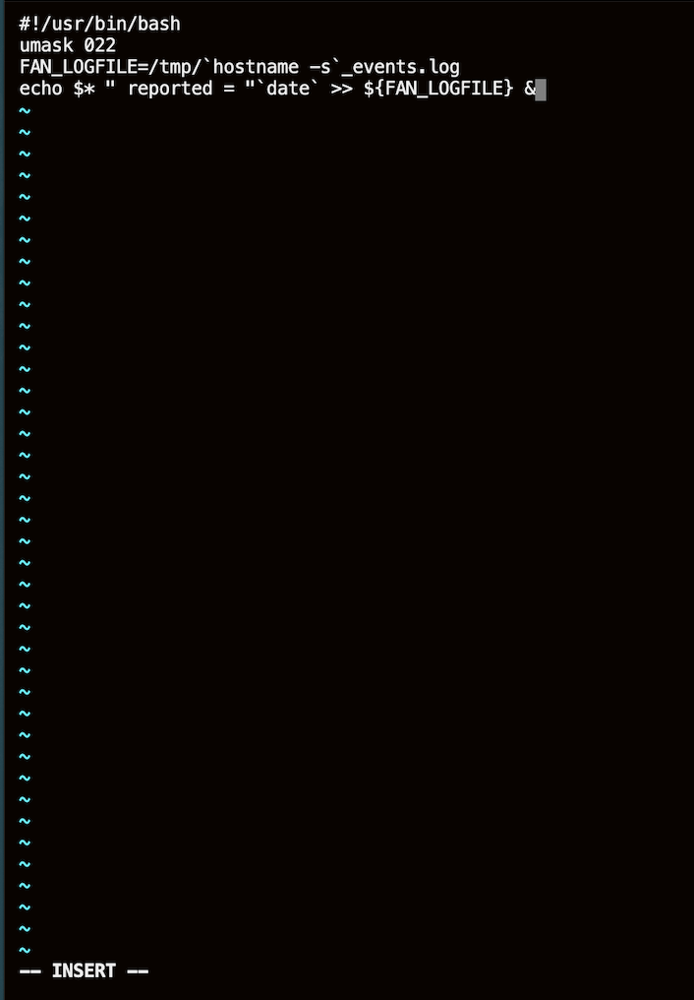
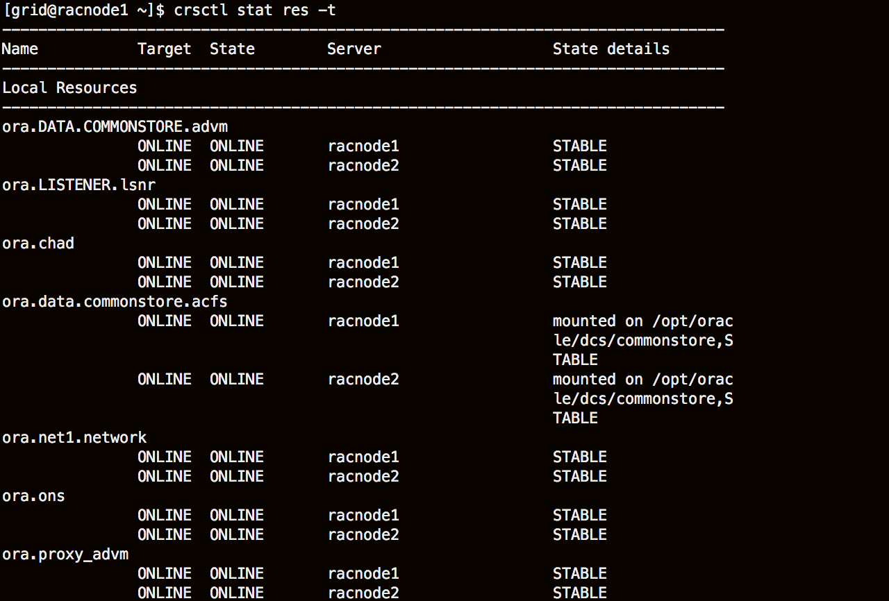
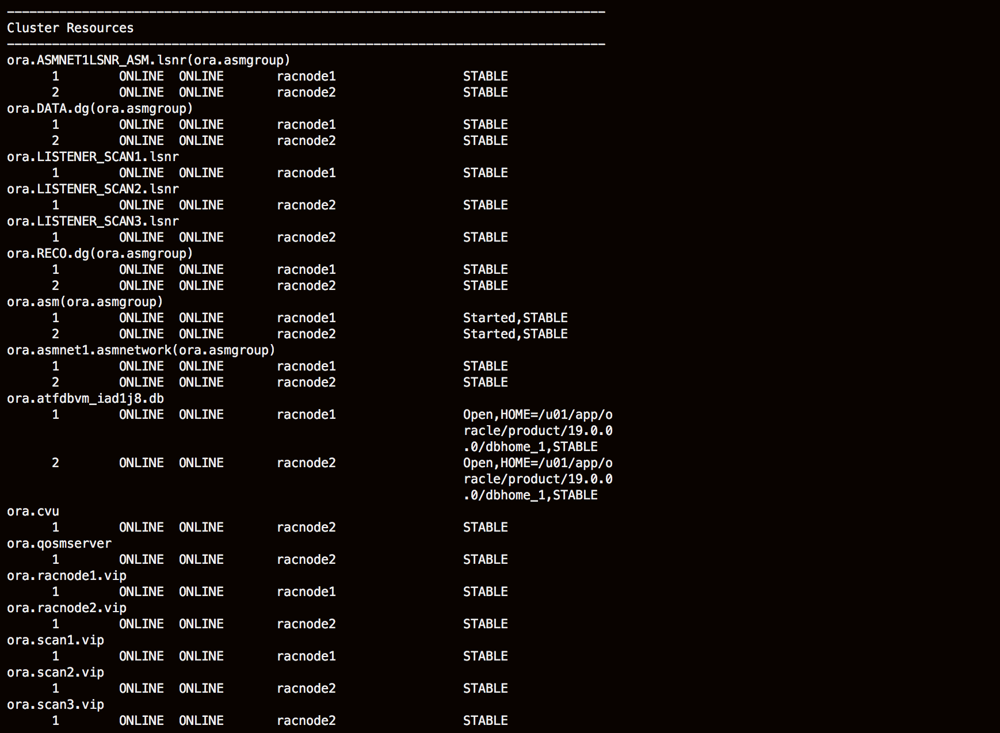
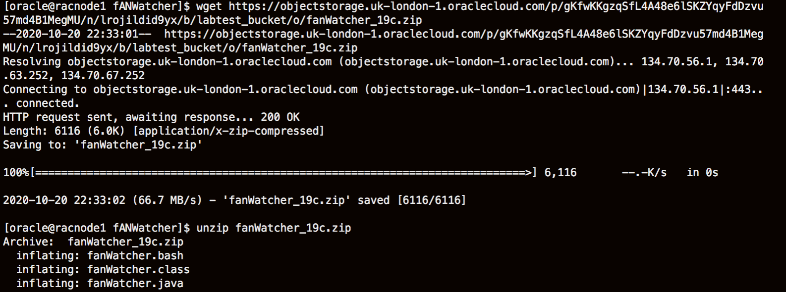
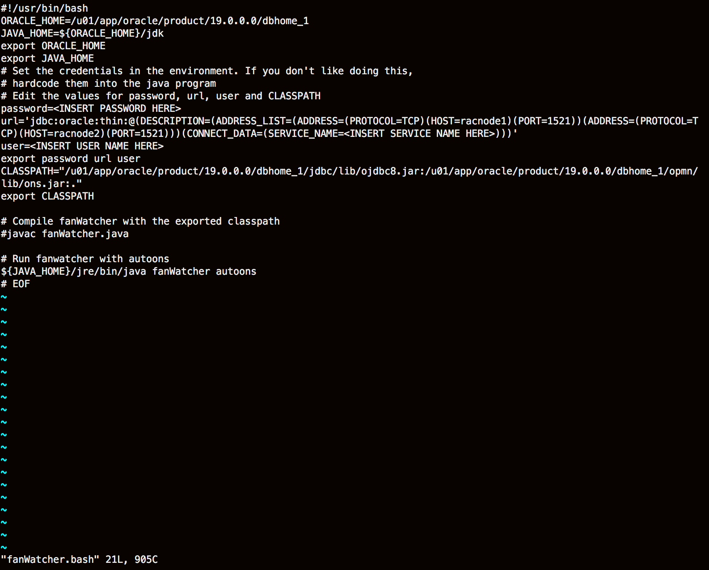
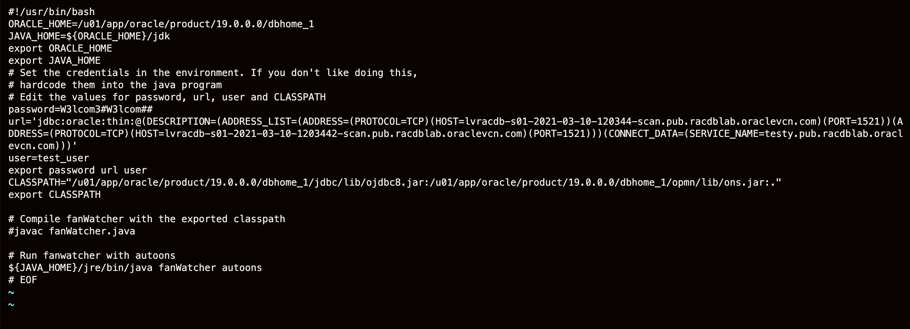

# Fast Application Notification

## Introduction

This lab walks you through the steps to demonstrate Oracle Clusterware’s FAN callout capability. Fast Application Notification, FAN, is a critical component towards solving the poor experience that end users can encounter when planned maintenance, unplanned outages, and load imbalances occur that make database instances unavailable or unresponsive. FAN enables end-to-end, lights-out recovery of applications and load balancing at runtime based on real transaction performance.

FAN is configured and runs automatically when you install Oracle Grid Infrastructure. All Oracle clients are FAN-aware and versions later than Oracle Database 12c Release 2 will auto-configure the FAN communication path. There is another lesson showing FAN at the application tier.

Estimated Lab Time: 30 Minutes

Watch the video below for an overview of the Fast Application Notification lab
[](youtube:J54SS_49AXs)

### Prerequisites
- An Oracle LiveLabs or Paid Oracle Cloud account
- Lab: Generate SSH Key
- Lab: Build a DB System
- Lab: Clusterware and Fencing

### About FAN Callouts
FAN callouts provide a simple yet powerful integration mechanism available with RAC that can be deployed with minimal programmatic efforts. A FAN callout is a wrapper shell script or pre-compiled executable written in any programming language that is executed each time a FAN event occurs. The purpose of the FAN callout is for simple logging, filing tickets and taking external actions. The purpose of the callout is not for integrated client failover –The FAN client failover is Fast Connection Failover in the next section. With the exception of node and network events (which act on all nodes), a FAN callout executes for the FAN events that are generated locally to each node and thus only for actions affecting resources on that node

For more information about FAN, click [here](https://www.oracle.com/technetwork/database/options/clustering/applicationcontinuity/learnmore/fastapplicationnotification12c-2538999.pdf) to view the technical paper. 

## **STEP 1:**  Write a callout
1.  If you aren't already logged in to the Oracle Cloud, open up a web browser and re-login to Oracle Cloud. 
2.  Once you are logged in, open up a 2nd webbrowser tab.
3.  Start Cloudshell in each.  Maximize both cloudshell instances.
   
    *Note:* You can also use Putty or MAC Cygwin if you chose those formats in the earlier lab.  
    

4.  Connect to node 1 (you identified the IP in an earlier lab) as the opc user. 

    ````
    ssh -i ~/.ssh/sshkeyname opc@<<Node 1 Public IP Address>>
    ````
    

5. Repeat this step for node 2.
   
    ````
    ssh -i ~/.ssh/sshkeyname opc@<<Node 2 Public IP Address>>
    ````
    

6. On each node (node 1 and node 2), switch to the *grid* user, change in to the **racg/usrco** directory under the GI home
   
    ````
    <copy>
    sudo su - grid
    cd /u01/app/19.0.0.0/grid/racg/usrco/
    </copy>
    ````

    

7. Create a file named **callout-log.sh** using an editor \(vim and vi are installed\). 
8. Click the command to edit the file with vi

    ````
    <copy>
    vi callout-log.sh
    </copy>
    ````

9.  Type **i** to switch to insert mode.  Copy the following lines and paste it into the vi editor. Click **esc**, **:wq!** to save it.  

    ````
    <copy>
    #!/usr/bin/bash
    umask 022
    FAN_LOGFILE=/tmp/`hostname -s`_events.log
    echo $* " reported = "`date` >> ${FAN_LOGFILE} &
    </copy>
    ````
    

    This callout will, place an entry in the logfile (FAN_LOGFILE) with the time (date) the event was generated, whenever a FAN event is generated,

10. Repeat this for **node 2**.
    
11. Ensure that the callout file has the execute bit set.  Repeat this on **both nodes**.

    ````
    <copy>
    chmod +x /u01/app/19.0.0.0/grid/racg/usrco/callout-log.sh
    ls -al
    </copy>
    ````
    

    Ensure that the callout directory has write permissions only to the system user who installed Grid Infrastructure (in our case, grid), and that each callout executable or script contained therein has execute permissions only to the same Grid Infrastructure owner. Each shell script or executable has to be able to run when called directly with the FAN payload as arguments.

12. Verify that the file exists on **both nodes**
   
    ````
    [grid@racnode1 usrco]$ ls -al
    total 12
    drwxr-xr-x 2 grid oinstall 4096 Aug 17 10:26 .
    drwxr-xr-x 6 grid oinstall 4096 Aug 14 04:47 ..
    -rwxr-xr-x 1 grid oinstall  119 Aug 17 10:26 callout-log.sh

    ````

13. Exit out of the grid user

    ````
    <copy>
    exit
    </copy>
    ````

## **STEP 2**: Generate an event

Stopping or starting a database instance, or a database service will generate a FAN event. A failure of an instance, a node, or a public network will generate an event.

1. Run the command to determine your database name and additional information about your cluster.  Run this as the *grid* user

    ````
    <copy>
    sudo su - grid
    crsctl stat res -t
    </copy>
    ````

    
    
    

2. Find your database name in the *Cluster Resources* section.  Replace the *replacename* with the name of your database.  Stop the database instance on node1 using srvctl

    ````
    <copy>
    /u01/app/oracle/product/19.0.0.0/dbhome_1/bin/srvctl stop instance -d aTFdbVm_replacename -i aTFdbVm1
    </copy>
    ````
    

3. Check the instance status

    ````
    /u01/app/oracle/product/19.0.0.0/dbhome_1/bin/srvctl status database -d aTFdbVm_replacename
    ````
    

4. If your callout was written correctly and had the appropriate execute permissions, a file named hostname_events.log should be visible in the /tmp directory
    ````
    <copy>
    ls -altr /tmp/<hostname>*.log
    </copy>
    ````

    

5. Examine the contents of the racnode*xx*_events.log file

    ````
    <copy>
    cat /tmp/<hostname>*.log
    </copy>
    ````

    

6. Depending on which instance you stopped you will see an entry similar to the following:

    ````
    INSTANCE VERSION=1.0 service=atfdbvm_replacename.tfexsubdbsys.tfexvcndbsys.oraclevcn.com database=atfdbvm_replacename instance=aTFdbVm1 host=racnode1 status=down reason=USER timestamp=2020-08-17 10:41:07 timezone=+00:00 db_domain=tfexsubdbsys.tfexvcndbsys.oraclevcn.com  reported = Mon Aug 17 10:41:07 UTC 2020
    ````

7. This is an **INSTANCE** event, a stop event as **reason=down**, it occurred on the **host=racnode1** and it was user initiated via **reason=USER**.  Note that there will be no entry for this event on **racnode2** as most events are local to the host on which they occur. The exceptions are node and network events which will generate an identical entry on all nodes in the cluster. If you did not get an entry similar to the above there is a problem with your script. Execute the script directly and correct any errors. For example:

    ````
    sh -x /u01/app/19.0.0.0/grid/racg/usrco/callout-log.sh  ABC
    ````
    


## **STEP 3**: Create a more elaborate callout

Callouts can be any shell-script or executable. There can be multiple callouts in the racg/usrco directory and all will be executed with the FAN payload as arguments. The scripts are executed sequentially, so it is not recommended to have many scripts in this directory, as they could place a load on the system that is not desired, and there may be timeliness issues if the scripts wait for scheduling.

1. A script may perform actions related to the eventtype. **eventtype** can be one of SERVICE, SERVICEMEMBER, INSTANCE, DATABASE  or NODE.  The following example will filter on the eventtype looking for a NODE, DATABASE or SERVICE event. If the FAN payload indicates a DOWN event for these eventypes it will perform a different action than for all other events.

    ````

    #!/usr/bin/bash
    # Scan and parse HA event payload arguments:
    #
    # define AWK
    AWK=/bin/awk
    # Define a log file to see results
    FAN_LOGFILE=/tmp/`hostname -s`.log
    # Event type is handled differently
    NOTIFY_EVENTTYPE=$1
    for ARGS in $*; do
        PROPERTY=`echo $ARGS | $AWK -F "=" '{print $1}'`
        VALUE=`echo $ARGS | $AWK -F "=" '{print $2}'`
        case $PROPERTY in
          VERSION|version) NOTIFY_VERSION=$VALUE ;;
          SERVICE|service) NOTIFY_SERVICE=$VALUE ;;
          DATABASE|database) NOTIFY_DATABASE=$VALUE ;;
          INSTANCE|instance) NOTIFY_INSTANCE=$VALUE ;;
          HOST|host) NOTIFY_HOST=$VALUE ;;
          STATUS|status) NOTIFY_STATUS=$VALUE ;;
          REASON|reason) NOTIFY_REASON=$VALUE ;;
          CARD|card) NOTIFY_CARDINALITY=$VALUE ;;
          VIP_IPS|vip_ips) NOTIFY_VIPS=$VALUE ;; #VIP_IPS for public_nw_down
          TIMESTAMP|timestamp) NOTIFY_LOGDATE=$VALUE ;; # catch event date
          TIMEZONE|timezone) NOTIFY_TZONE=$VALUE ;;
          ??:??:??) NOTIFY_LOGTIME=$PROPERTY ;; # catch event time (hh24:mi:ss)
        esac
    done

    # FAN events with the following conditions will be inserted# into the critical trouble ticket system:
    # NOTIFY_EVENTTYPE => SERVICE | DATABASE | NODE
    # NOTIFY_STATUS => down | public_nw_down | nodedown
    #
    if (( [ "$NOTIFY_EVENTTYPE" = "SERVICE" ] ||[ "$NOTIFY_EVENTTYPE" = "DATABASE" ] || \
        [ "$NOTIFY_EVENTTYPE" = "NODE" ] \
        ) && \
        ( [ "$NOTIFY_STATUS" = "down" ] || \
        [ "$NOTIFY_STATUS" = "public_nw_down" ] || \
        [ "$NOTIFY_STATUS" = "nodedown " ] ) \
        ) ; then
        # << CALL TROUBLE TICKET LOGGING PROGRAM AND PASS RELEVANT NOTIFY_* ARGUMENTS >>
        echo "Create a service request as " ${NOTIFY_EVENTTYPE} " " ${NOTIFY_STATUS} " occured at " ${NOTIFY_LOGTIME} >> ${FAN_LOGFILE}
    else
        echo "Found no interesting event: " ${NOTIFY_EVENTTYPE} " " ${NOTIFY_STATUS} >> ${FAN_LOGFILE}
    fi

    ````
2. Cause the generation of a DATABASE DOWN event with srvctl

    ````
    /u01/app/oracle/product/19.0.0.0/dbhome_1/bin/srvctl stop database -d aTFdbVm_replacename
    ````

3. Examine the entry created in the log file generated in /tmp on node1:

    ````
    <copy>
    cat /tmp/<hostname>*.log
    </copy>
    ````  
4. Examine the entry created in the log file generated in /tmp on node2:

    ````
    <copy>
    cat /tmp/<hostname>*.log
    </copy>
    ````
5. Cause a DATABASE UP event to be generated:

    ````
    /u01/app/oracle/product/19.0.0.0/dbhome_1/bin/srvctl start database -d aTFdbVm_replacename
    ```` 
6.  Note the different entries generated in each log (on each node).  Exit out of the grid user

    ````
    exit
    ````

## **STEP 4**: Client-side FAN events

FAN events are sent to the application mid-tier or client tier using the **Oracle Notification Service** (ONS). ONS is configured automatically on the cluster when you install Grid Infrastructure. CRS manages the stop and start of the ONS daemon.

ONS is configured automatically by FAN-aware Oracle clients, which include Universal Connection Pool (UCP), ODP.Net, Weblogic Server with Active Gridlink, CMAN and others, when a particular format connect string is used (for more information on this refer to the Application Continuity checklist: https://www.oracle.com//technetwork/database/clustering/checklist-ac-6676160.pdf)

In order to determine if a client has received FAN events may require running your client in a debug fashion. This may be difficult to do and even more difficult to interpret.

To confirm that FAN events are being received at a particular tier, you can install a java utility called FANWatcher, that will subscribe to ONS on a cluster and display events that it receives.

Download the FANWatcher utility
1. Open a terminal on one of the nodes using CloudShell (Putty or CYGWIN may be used)

2. Become the "oracle" user and create a directory named fanWatcher

    ````
    <copy>
    sudo su - oracle
    mkdir -p /home/oracle/fANWatcher
    cd /home/oracle/fANWatcher
    </copy>
    ````
3. Download the fanWatcher utility and unzip the file

    ````
    <copy>
    wget https://objectstorage.uk-london-1.oraclecloud.com/p/gKfwKKgzqSfL4A48e6lSKZYqyFdDzvu57md4B1MegMU/n/lrojildid9yx/b/labtest_bucket/o/fanWatcher_19c.zip
    unzip fanWatcher_19c.zip
    </copy>
    ````   

    

4. Create a database user in the PDB **pdb1** and a database service to connect to. The service should have 1 preferred instance and 1 available instance. In this example the service name is **testy** (choose a name you like), the instance names are as specified, the username is **test_user** and the password is **W3lc0m3\#W3lc0m3\#**

5. Create the service and start it.
   
    ````
    <copy>
    /u01/app/oracle/product/19.0.0.0/dbhome_1/bin/srvctl add service -d aTFdbVm_replacename -s testy -pdb pdb1 -preferred aTFdbVm1 -available aTFdbVm2
    /u01/app/oracle/product/19.0.0.0/dbhome_1/bin/srvctl start service -d aTFdbVm_replacename -s testy
    </copy>
    ````

    
    

6. Run the hostname command

    ````
    <copy>
    hostname
    </copy>
    ```` 

7. Connect to sqlplus as **SYS**. Replace PutYourHostnameHere in the connect string with your hostname
   
    ````
    <copy>
    sqlplus sys/W3lc0m3#W3lc0m3#@//<PutYourHostnameHere>/testy.pub.racdblab.oraclevcn.com as sysdba
    </copy>
    ```` 
    

8. Run the following commands to create a test user, password *W3lc0m3#W3lc0m3#* and grant them the appropriate privileges
   
    ````
    <copy>
    create user test_user identified by W3lc0m3#W3lc0m3# default tablespace users temporary tablespace temp;
    alter user test_user quota unlimited on users;
    grant connect, resource, create session to test_user;
    exit;
    </copy>
    ````
    

9. To get the SCAN address run the following command

    ````
    <copy>
    srvctl config scan
    </copy>
    ```` 

10. Enter the following commands and edit the **fanWatcher.bash** script by entering the following **vi** command

    ````
    <copy>
    ls -al
    chmod 755 fanWatcher.bash
    </copy>
    ````

    ````
    <copy>
    vi fanWatcher.bash
    </copy>
    ````

11.  Replace the **user**, **password**, and **URL**. Use the SCAN name in the URL. For example, the fanWatcher.bash script will look like:

    ````
    password=<<insert password>
    url='jdbc:oracle:thin:@(DESCRIPTION=(ADDRESS_LIST=(ADDRESS=(PROTOCOL=TCP)(HOST=scanname1)(PORT=1521))(ADDRESS=(PROTOCOL=TCP)(HOST=scanname2)(PORT=1521)))(CONNECT_DATA=(SERVICE_NAME=testy.pub.racdblab.oraclevcn.com)))'
    user=test_user
    export password url user
    CLASSPATH="/u01/app/oracle/product/19.0.0.0/dbhome_1/jdbc/lib/ojdbc8.jar:/u01/app/oracle/product/19.0.0.0/dbhome_1/opmn/lib/ons.jar:."
    export CLASSPATH

    # Compile fanWatcher with the exported classpath
    #javac fanWatcher.java

    # Run fanwatcher with autoons
    ${JAVA_HOME}/jre/bin/java fanWatcher autoons
    # EOF
    ````
    
    


12. Run the **fanWatcher.bash** script

    ````
    <copy>
    ./fanWatcher.bash
    </copy>
    ````
    

    When fanWatcher is run with the argument **autoons** it will use the credentials and url provided to connect to the database (wherever it is running) and use that connection to obtain the ONS configuration of the DB system it is connected to. A subscription, to receive FAN events, is created with the Grid Infrastructure ONS daemon.

    Connections to the ONS daemon on each node is established forming  redundant topology - with no knowledge of the cluster configuration required.

    

13. Perform an action on another node that will generate a FAN event. Kill a SMON background process.  For example, on node2 in my system executing the command below will show the SMON process ids for ASM and my database.

    ````
    <copy>
    ps -ef | grep smon
    </copy>
    ````
14. Examine the process id. The process id in this example is 99992. Your process id will be a different number.
    

15. Kill the process using the command below.  Replacing the ##### with the actual numbers of your smon process.

    ````
    sudo kill -9 #####
    ````
    

16. Look at the output from the fanWatcher utility

    

    The fanWatcher utility has received FAN events over ONS. The first event shows **reason=FAILURE** highlighting the abnormal termination of SMON (by the operating system kill command). **event_type=INSTANCE** and **status=down** shows that the instance has crashed.

    The event payload contains the same information as displayed in the CALLOUT example you observed, but there are some differences. All Oracle clients are FAN-aware and interpret the FAN events automatically.

    You will also see the failed instance get restarted by Grid Infrastructure, and the corresponding **UP** event is sent. Oracle clients, such as UCP, will react to both UP and DOWN events - closing connections on down and re-establishing them automatically on UP.

    ````
    ** Event Header **
    Notification Type: database/event/service
    Delivery Time: Wed Mar 10 15:28:58 UTC 2021
    Creation Time: Wed Mar 10 15:28:58 UTC 2021
    Generating Node: lvracdb-s01-2021-03-10-1203442
    Event payload:
    VERSION=1.0 event_type=INSTANCE service=ractciiv_iad1tf.pub.racdblab.oraclevcn.com instance=racTCIIV2 database=ractciiv_iad1tf db_domain=pub.racdblab.oraclevcn.com host=lvracdb-s01-2021-03-10-1203442 status=down reason=FAILURE timestamp=2021-03-10 15:28:23 timezone=+00:00

    ** Event Header **
    Notification Type: database/event/service
    Delivery Time: Wed Mar 10 15:28:58 UTC 2021
    Creation Time: Wed Mar 10 15:28:58 UTC 2021
    Generating Node: lvracdb-s01-2021-03-10-1203442
    Event payload:
    VERSION=1.0 event_type=INSTANCE service=ractciiv_iad1tf.pub.racdblab.oraclevcn.com instance=racTCIIV2 database=ractciiv_iad1tf db_domain=pub.racdblab.oraclevcn.com host=lvracdb-s01-2021-03-10-1203442 status=up reason=FAILURE timestamp=2021-03-10 15:28:58 timezone=+00:00
    ````
    If fanWatcher can auto-configure with ONS and receive and display events, so can any client on the same tier. This validates the communication path (no firewall blockage for example), and that FAN events are propagating correctly. 

You may now *proceed to the next lab*.  

## Acknowledgements
* **Authors** - Troy Anthony, Anil Nair
* **Contributors** - Kay Malcolm, Kamryn Vinson
* **Last Updated By/Date** - Kamryn Vinson, March 2021

## Need Help?

Please submit feedback or ask for help by sending an email to livelabs-help-db_us@oracle.com. Please make sure to include your workshop name and lab name.  You can also include screenshots and attach files.