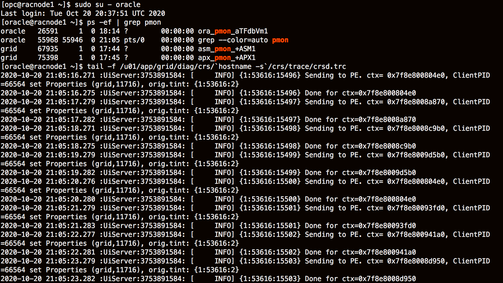
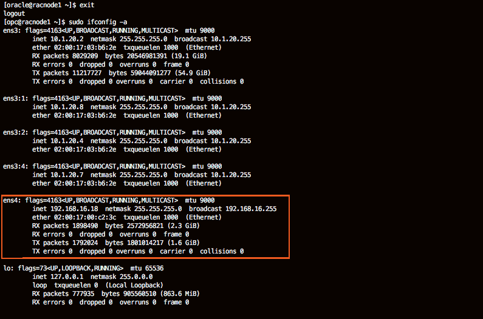
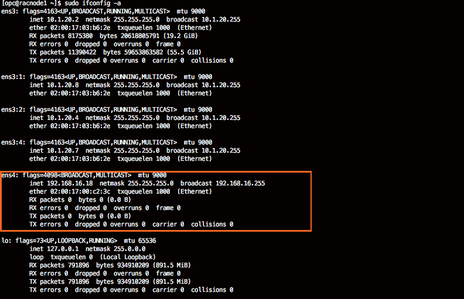
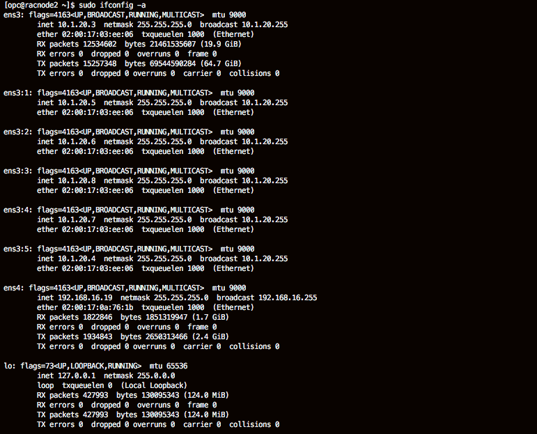
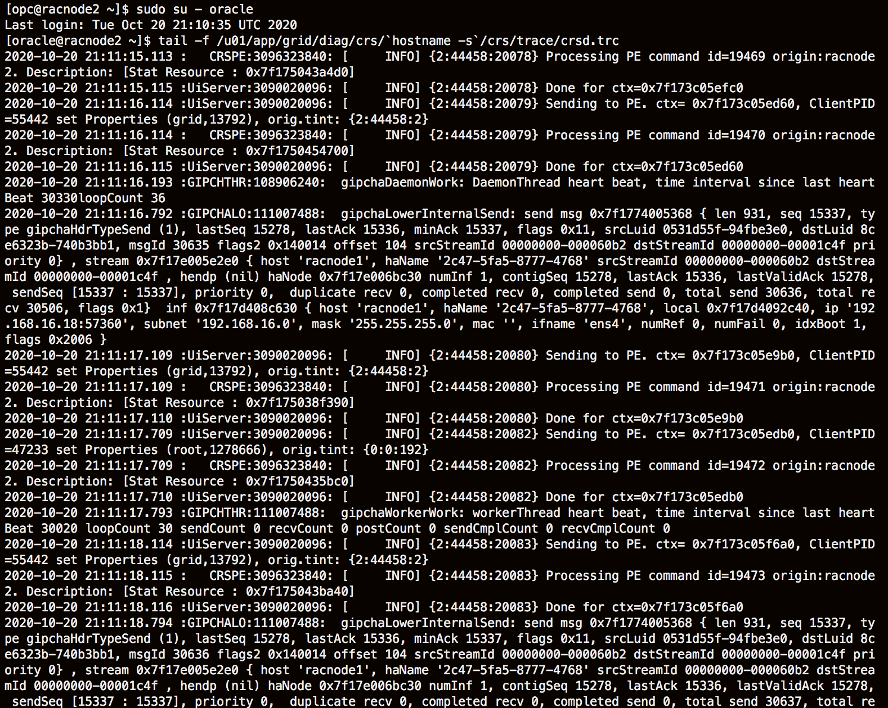
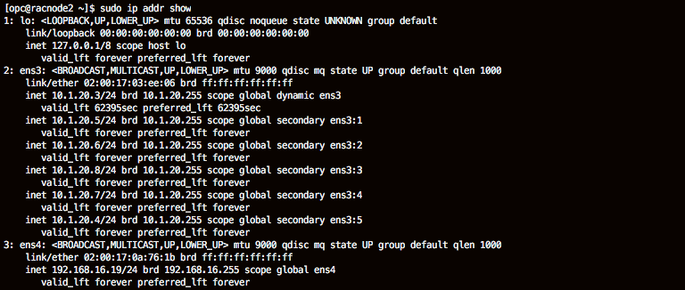

# Clusterware and Fencing

## Introduction

This lab walks you through the steps to demonstrate Oracle Clusterware’s fencing ability by forcing a configuration that will trigger Oracle Clusterware’s built-in fencing features. With Oracle Clusterware, fencing is handled at the node level by rebooting the non-responsive or failed node. This is similar to the as Shoot The Other Node In The Head (STONITH) algorithm, but it’s really a suicide instead of affecting the other machine. There are many good sources for more information online. .

Estimated Lab Time: 20 Minutes

Watch the video below for an overview of the Clusterware and Fencing lab
[](youtube:ok_OcxhsuQI)

### Prerequisites
- An Oracle LiveLabs or Paid Oracle Cloud account
- Lab: Generate SSH Key
- Lab: Build a DB System

### About Oracle Grid Infrastructure

Oracle Clusterware is the technology used in the RAC architecture that transforms a collection of servers into a highly available unified system. Oracle Clusterware provides failure detection, node membership, node fencing and optimal resource placement. It provides cluster-wide component inter-dependency management for RAC and other applications in the cluster. Clusterware uses resource models and policies to provide high availability responses to planned and unplanned component downtime.

For more information on Oracle Clusterware visit http://www.oracle.com/goto/clusterware

 [](youtube:GIq-jb4bKmo)

## **STEP 1:**  Connect and Disable the private interconnect

1.  If you aren't already logged in to the Oracle Cloud, open up a web browser and re-login to Oracle Cloud. 
2.  Once you are logged in, open up a 2nd webbrowser tab.
3.  Start Cloudshell in each.  Maximize both cloudshell instances.
   
    *Note:* You can also use Putty or MAC Cygwin if you chose those formats in the earlier lab.  
    

4.  Connect to node 1 as the *opc* user (you identified the IP address of node 1 in the Build DB System lab). 

    ````
    ssh -i ~/.ssh/sshkeyname opc@<<Node 1 Public IP Address>>
    ````
    

5. Repeat this step for node 2.
   
    ````
    ssh -i ~/.ssh/sshkeyname opc@<<Node 2 Public IP Address>>
    ````
    

6. On both nodes, switch to the oracle user and check to see what's running.  Run this command on *both nodes*.
   
    ````
    <copy>
    sudo su - oracle
    ps -ef | grep pmon
    ps -ef | grep lsnr
    </copy>
    ````
    
    

7. Monitor the **crsd.trc** on each node as the *oracle* user. The **crsd.trc** file is located in the $ADR\_BASE/diag/crs/*nodename*/crs/trace directory. In earlier versions of Grid Infrastructure the logfiles were located under CRS\_HOME/log/<nodename>/crs (these directory structures still exist in the installation)

    ````
    <copy>
    tail -f /u01/app/grid/diag/crs/`hostname -s`/crs/trace/crsd.trc
    </copy>
    ````
    


8. Examine the network settings as the *opc* user.  Type exit to switch back to the opc user on *both nodes*.

    ````
    <copy>
    exit
    sudo ifconfig -a
    </copy>
    ````
    Note that the commands **ip** or **if** can be used, but the syntax will not match what is shown here. Use these commands if you are familiar with their construct.


9.  Inspect the output on both nodes.
   
    


10. The **ifconfig** command shows all of the network interfaces configured and running. The **flags** entry will show whether the interface is UP, BROADCASTing, and whether in MULTICAST or not. The **inet** entry shows the IP address of each interface.

    You should notice that one of the network interfaces has multiple IP addresses associated with it. **ens3** has the virtual interfaces **es3:1** and **es3:2** in the example shown here. These virtual interfaces are for the virtual IPs (VIPs) used by each node and the SCAN listeners.

    The private interconnect addresses for this cluster are **192.168.16.18** and **192.168.16.19** or racnode1-priv and racnode2-priv, respectively.

11. Take down the interconnect on *node 1* (we are doing this on node1, but the other node could be used)
    ````
    <copy>
    sudo ifconfig ens4 down
    </copy>
    ````
    *No error message means this is successful.*

    

12. Look at the ifconfig command again by running the command below on node 1.
   
    ````
    <copy>
    sudo ifconfig -a
    </copy>
    ````
    
13. The output returned should be similar to.  Inspect the output.

     

14. Note that **ens4** is no longer UP.

15. Why have the virtual interfaces disappeared? Why are the virtual interfaces running on the other node? What state are they in?

    - When the private interconnect is down on node 1 the VIP for node 1 is running on node2. The reverse would be true if the private interconnect were down on node2.

16. Go back to node 2 and rerun the ifconfig command.
    
    ````
    sudo ifconfig -a
    ````
     

17.  Explore the result.

## **STEP 2:** Examine the CRSD log

1. Go back to node1 in cloudshell
2. Switch to the oracle user
3. The **crsd.trc** files that you are using **tail** to examine on node1 will begin to get errors related to the network interface and one of the nodes will be removed from the cluster. CLUSTER FENCING will take place.  See an example below.

     


4. During cluster fencing messages similar to the following will be seen:

     

5. Will the same node always be evicted? is it always the node on which the interface was removed? Can this be influenced in any way?

6. Examine the status of the cluster from the node that still has Grid Infrastructure running as the *opc* user

    ````
    <copy>
    /u01/app/19.0.0.0/grid/bin//crsctl status server
    </copy>
    ````
    


7. Only one node should be online

    ````
    <copy> 
    /u01/app/19.0.0.0/grid/bin//crsctl status server
    </copy>
    ```` 
    

8. Examine the network adapters on the running node

    ````
    <copy>
    sudo ip addr show
    </copy>
    ````
    

All of the virtual IP addresses will be present on the running node as ens3\:1 to en3\:5   

Can you connect an application client to a VIP (a host-vip) when it is running on a host other than its home host?

## **STEP 3:** Restart the private interconnect

1. On whichever node you stopped the private interconnect, restart it

    ````
    <copy>
    sudo ifconfig ens4 up
    </copy>
    ````
 2. Use ifconfig to examine the network adapters. Ens4 should restart

 3. The nodes will reform the cluster, VIPs will migrate back to their home node, or rebalance in the case of SCAN-VIPs.  An **ifconfig -a** command on the original failed node will now show restarted resources

    ```` 
    sudo ifconfig -a
    ````
    

2. A status command will show both nodes running

    ````
    <copy>
    /u01/app/19.0.0.0/grid/bin//crsctl status server
    </copy>
    ````

    ````
    [opc@racnode2 ~]$  /u01/app/19.0.0.0/grid/bin//crsctl status server
    NAME=racnode1
    STATE=ONLINE

    NAME=racnode2
    STATE=ONLINE
    ````

    

You may now *proceed to the next lab*.  

## Acknowledgements
* **Authors** - Troy Anthony, Anil Nair
* **Contributors** - Kay Malcolm
* **Last Updated By/Date** - Kay Malcolm, October 2020

## Need Help?

Please submit feedback or ask for help by sending an email to livelabs-help-db_us@oracle.com. Please make sure to include your workshop name and lab name.  You can also include screenshots and attach files.
