# Deploy the Shard Database

## Introduction

You can setup the shard database environment using Oracle Resource Manager and Terraform. The terraform script builds the following:

1. Compute service for Shard Directors (based on the shape that user wants to select).
2. Database service for Shard and Catalog databases (based on the shape that user wants to select).

Estimated Lab Time: 45 minutes

### Objectives
In this lab, you will:
-   Use Terraform and Resource Manager to setup the shard database environment.
-   Verify the shard database environment

### Prerequisites

This lab assumes you have already completed the following:
- An Oracle Free Tier, Always Free, Paid or LiveLabs Cloud Account
- Create a SSH Keys pair

Click on the link below to download the Resource Manager zip files you need to build your enviornment.

- [shardstack-nodomain-qs.zip](https://objectstorage.us-ashburn-1.oraclecloud.com/p/66WhdraCtnNngZ7qkghulTFnOAr_uNF9Cc8mqneE8gdk2fej-w_eOEolLGUOmE4D/n/c4u04/b/data-management-library-files/o/OracleShardingQuickStart/shardstack-nodomain-qs.zip) - Packaged terraform primary database instances creation script.


## **STEP 1:** Create the Shard Database Stacks

1. Login to the Oracle Cloud Console, open the hamburger menu in the left hand corner. Choose **Resource Manager > Stacks**. Choose the **Compartment** that you want to use, click the  **Create Stack** button. *Note: If you are in a workshop, double check your region to ensure you are on the assigned region.*

    
    
    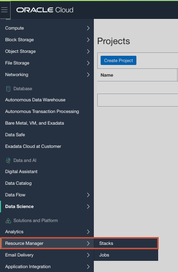
    
    
    
    

2. Check the **ZIP FILE**, Click the **Browse** link and select the setup zip file (`shardstack-nodomain-qs.zip`) that you downloaded. Click **Select** to upload the zip file.

    

    


3. Scroll down the screen, you can accept all the default informations and click **Next**.

    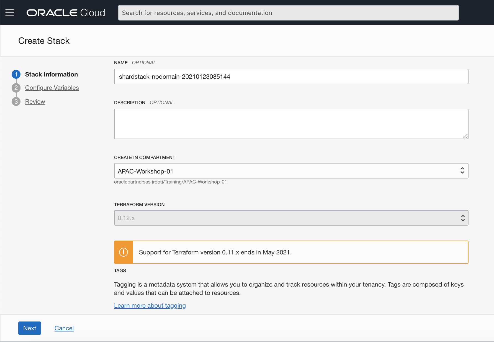

4. Oracle Sharded Database General Configuration. Enter the Sharded Database Name, for example: **sdb**. Accept all other default values.

    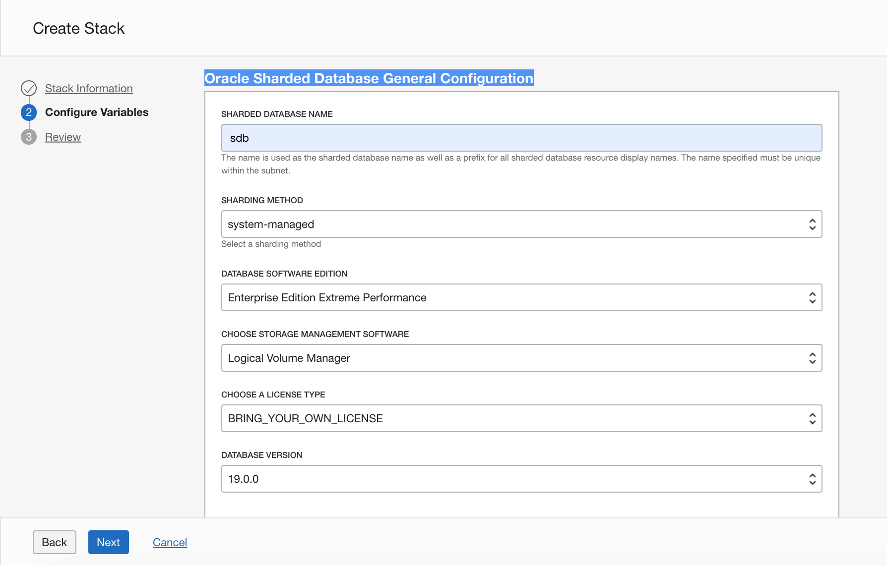

5. Scroll down the screen, in the Shard configuration sector, You can set the shard database shape, number of the primary shards and shard database available storage. Accept the default values.

    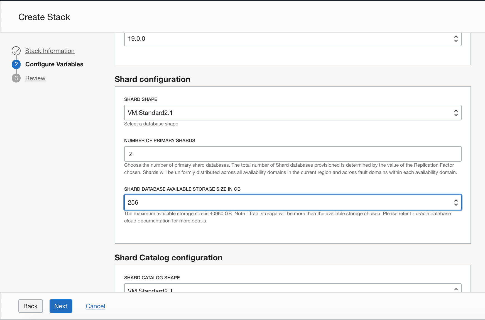

6. In the Shard Catalog configuration sector, you can set the shard catalog database shape, shard catalog db available storage. Accept the default values.

    

7. In the replication sector, you can set the number of the replication factor. If the selected value is 1, then only a single replica set of the primary shard will be created. If the selected value is 2, then both the primary shard replica set and standby shard replica set will be created. In this workshop, we will not use the standby shard, so accept the default value **1**.

    

8. In Shard Director Configuration,  you can set the shard director VM shape, and number of the shard directors. Accept the default values.

    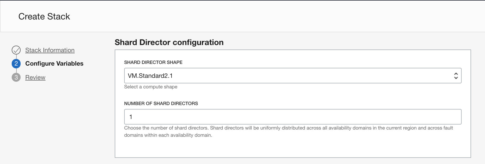

9. In the Network setting sector, You can choose create new network or use a previously created network. In this workshop, we use create new network, you can select the compartment for VCN and subnet network. Accept all other default values.

    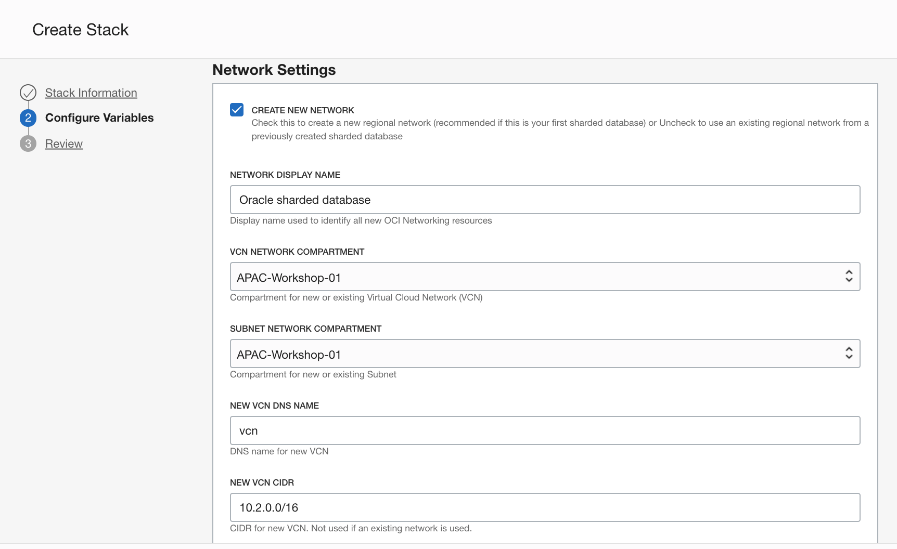

10. In the ssh configuration, You can choose the ssh public key file which you created before or paste the ssh public key value in it.

    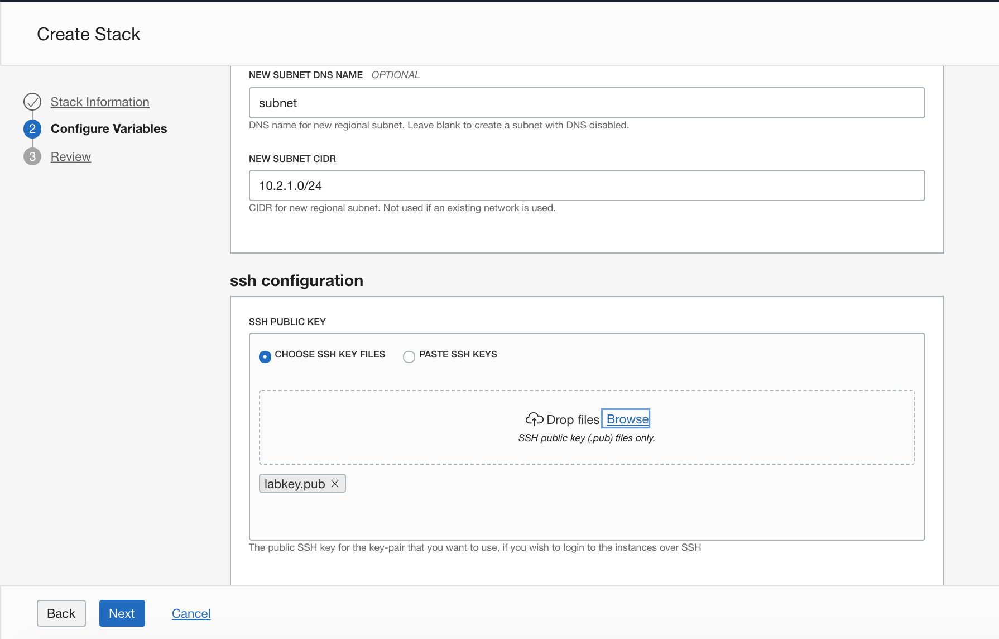

11. Click **Next**, you can review you configuration variables.

    

12. Click **Create**. Your stack has now been created!  

    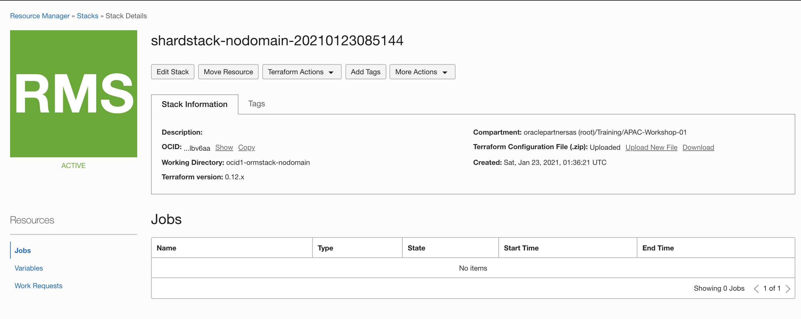

## **STEP 2:** Terraform Apply

When using Resource Manager to deploy an environment, execute a terraform **Apply**. Let's do that now.

1. At the top of your page, click on **Stack Details**.  Click the button, **Terraform Actions** -> **Apply**. Click **Apply**. This will create the shard database. This takes about about 30 minutes, please be patient.

    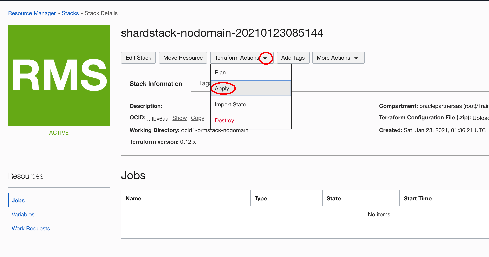
    
    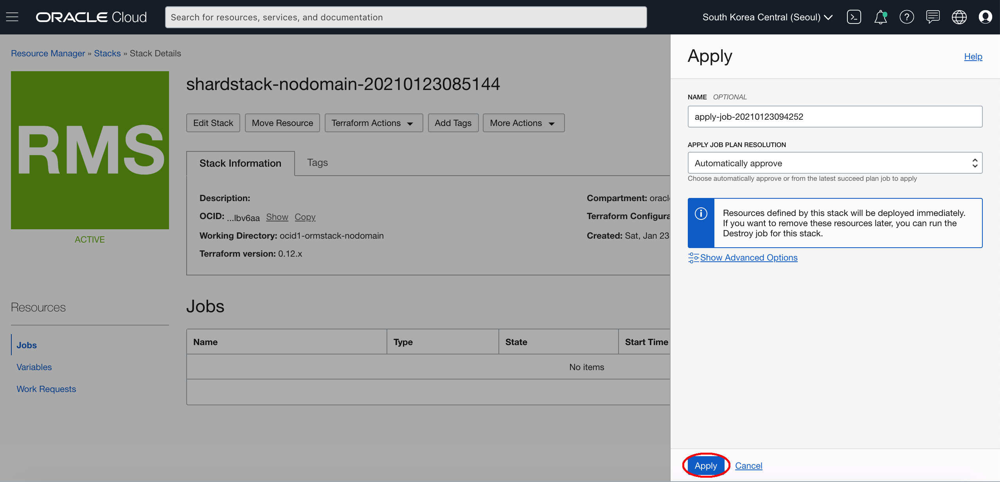
    
    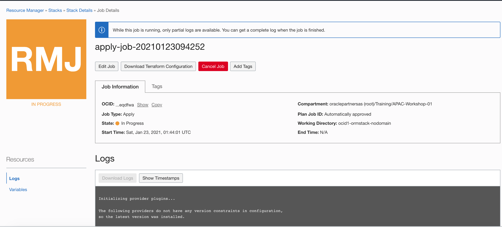
    
    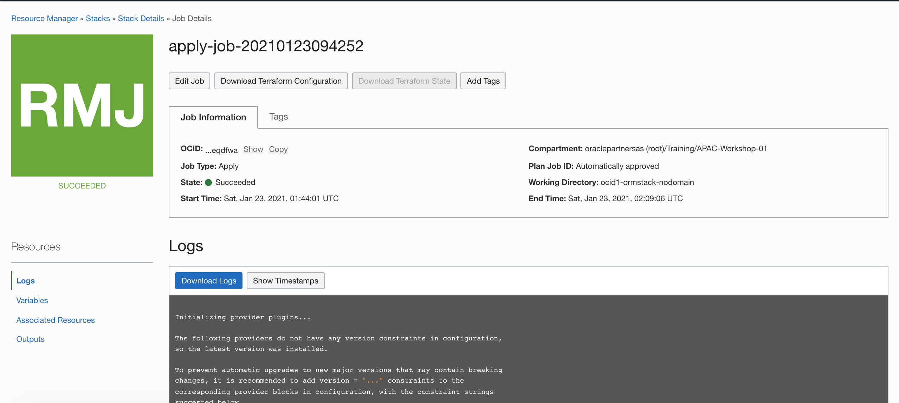

    

2. Once this job succeeds, you will get an apply complete notification from Terraform.  Click **Outputs**,  you can get the **public ip address** for the shard director, shard catalog and shard database. You can also get the sys user password for the catalog database and shard database. 

    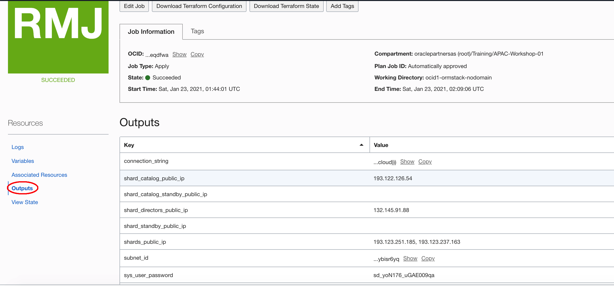

3. Write down all the public ip's and sys password for later use. It will be similar to the following. All the pdb name in the catalog and shard database is named `sdbpdb` by default. For example: the sys user password is: `sd_yonN176_uGAE009qa`

    | Public IP       | Hostname | Act as              | PDB name |
    | --------------- | -------- | ------------------- | -------- |
    | 132.145.91.88   | sdbsd0   | GSM, Shard Director |          |
    | 193.122.126.54  | sdbsc0   | Shard Catalog       | sdbpdb   |
    | 193.123.251.185 | sdbsh0   | Shard Database 0    | sdbpdb   |
    | 193.123.237.163 | sdbsh1   | Shard Database 1    | sdbpdb   |

    

You now have a fully functional Oracle shard database which uses the system managed shard method. 

## **STEP 3:** Verify the Shard Database

1. Login to the shard director host using the public ip address of the director host, switch to oracle user.

    ```
    $ ssh -i labkey opc@xxx.xxx.xxx.xxx
    The authenticity of host 'xxx.xxx.xxx.xxx (xxx.xxx.xxx.xxx)' can't be established.
    ECDSA key fingerprint is SHA256:EkqADZor/yuRtRhMIgfal0PWfySCUW0kAD4UwkUM/q8.
    Are you sure you want to continue connecting (yes/no/[fingerprint])? yes
    Warning: Permanently added 'xxx.xxx.xxx.xxx' (ECDSA) to the list of known hosts.
    Last login: Sat Jan 23 01:45:49 2021 from xxx.xxx.xxx.xxx
    -bash: warning: setlocale: LC_CTYPE: cannot change locale (UTF-8): No such file or directory
    
    [opc@sdbsd0 ~]$ sudo su - oracle
    Last login: Sat Jan 23 02:08:08 GMT 2021 from xxx.xxx.xxx.xxx on pts/0
    [oracle@sdbsd0 ~]$ 
    ```

   

2. Edit the `.bash_profile`.

    ```
    [oracle@sdbsd0 ~]$ <copy>vi .bash_profile</copy>
    ```

   

3. Add the following lines to the end of the profile. Save the file and exit the editor.

    ```
    <copy>ORACLE_HOME=/u01/app/oracle/product/19.3.0/gsmhome_1
    export ORACLE_HOME
    PATH=$ORACLE_HOME/bin:$PATH
    export PATH
    LD_LIBRARY_PATH=$ORACLE_HOME/lib
    export LD_LIBRARY_PATH</copy>
    ```

   

4. Activate the environment variables.

    ```
    [oracle@sdbsd0 ~]$ <copy>. .bash_profile</copy>
    [oracle@sdbsd0 ~]$
    ```

   

5. Run the following command to check the services in the director. You can find the default service named `GDS$CATALOG.oradbcloud` and `GDS$COORDINATOR.oradbcloud` which is listening on port 1522 and connected to the catalog instance.

    ```
    [oracle@sdbsd0 ~]$ <copy>lsnrctl status sdbsd0</copy>
    
    LSNRCTL for Linux: Version 19.0.0.0.0 - Production on 23-JAN-2021 02:56:05
    
    Copyright (c) 1991, 2019, Oracle.  All rights reserved.
    
    Connecting to (DESCRIPTION=(ADDRESS=(HOST=sdbsd0.subnet.vcn.oraclevcn.com)(PORT=1522)(PROTOCOL=tcp))(CONNECT_DATA=(SERVICE_NAME=GDS$CATALOG.oradbcloud)))
    STATUS of the LISTENER
    ------------------------
    Alias                     SDBSD0
    Version                   TNSLSNR for Linux: Version 19.0.0.0.0 - Production
    Start Date                23-JAN-2021 02:07:31
    Uptime                    0 days 0 hr. 48 min. 34 sec
    Trace Level               off
    Security                  ON: Local OS Authentication
    SNMP                      OFF
    Listener Parameter File   /u01/app/oracle/product/19.3.0/gsmhome_1/network/admin/gsm.ora
    Listener Log File         /u01/app/oracle/diag/gsm/sdbsd0/sdbsd0/alert/log.xml
    Listening Endpoints Summary...
      (DESCRIPTION=(ADDRESS=(PROTOCOL=tcp)(HOST=sdbsd0.subnet.vcn.oraclevcn.com)(PORT=1522)))
    Services Summary...
    Service "GDS$CATALOG.oradbcloud" has 1 instance(s).
      Instance "sdbsc0", status READY, has 1 handler(s) for this service...
    Service "GDS$COORDINATOR.oradbcloud" has 1 instance(s).
      Instance "sdbsc0", status READY, has 1 handler(s) for this service...
    Service "_MONITOR" has 1 instance(s).
      Instance "SDBSD0", status READY, has 1 handler(s) for this service...
    Service "_PINGER" has 1 instance(s).
      Instance "SDBSD0", status READY, has 1 handler(s) for this service...
    The command completed successfully
    [oracle@sdbsd0 ~]$ 
    ```

   

6. Run the GDSCTL Command.

    ```
    [oracle@sdbsd0 ~]$ <copy>gdsctl</copy>
    GDSCTL: Version 19.0.0.0.0 - Production on Sat Jan 23 03:05:07 GMT 2021
    
    Copyright (c) 2011, 2019, Oracle.  All rights reserved.
    
    Welcome to GDSCTL, type "help" for information.
    
    Current GSM is set to SDBSD0
    GDSCTL> 
    ```

   

7. Verify the Sharding Topology. 

    ```
    GDSCTL> <copy>config</copy>
    
    Regions
    ------------------------
    apseoul1                      
    
    GSMs
    ------------------------
    sdbsd0                        
    
    Sharded Database
    ------------------------
    sdb                           
    
    Databases
    ------------------------
    sdbsh0_icn1gr_sdbpdb          
    sdbsh1_icn1xv_sdbpdb          
    
    Shard Groups
    ------------------------
    shardgroup0                   
    
    Shard spaces
    ------------------------
    shardspaceora                 
    
    Services
    ------------------------
    
    GDSCTL pending requests
    ------------------------
    Command                       Object                        Status                        
    -------                       ------                        ------                        
    
    Global properties
    ------------------------
    Name: oradbcloud
    Master GSM: sdbsd0
    DDL sequence #: 0
    
    
    GDSCTL> 
    ```

   

8. Check the shard status, It's may look similar to the following.

    ```
    GDSCTL> <copy>config shard</copy>
    
    Name                Shard Group         Status    State       Region    Availability 
    ----                -----------         ------    -----       ------    ------------ 
    sdbsh0_icn1gr_sdbpd shardgroup0         Ok        Deployed    apseoul1  ONLINE       
    b                                                                                    
    sdbsh1_icn1xv_sdbpd shardgroup0         Ok        Deployed    apseoul1  ONLINE       
    b                                                                                    
    
    GDSCTL> 
    ```

   

9. Observe all shard database are registered.

    ```
    GDSCTL> <copy>databases</copy>
    Database: "sdbsh0_icn1gr_sdbpdb" Registered: Y State: Ok ONS: N. Role: PRIMARY Instances: 1 Region: apseoul1
       Registered instances:
         sdb%1
    Database: "sdbsh1_icn1xv_sdbpdb" Registered: Y State: Ok ONS: N. Role: PRIMARY Instances: 1 Region: apseoul1
       Registered instances:
         sdb%11
    
    GDSCTL> 
    ```

   

10. Show the created chunks.

    ```
    GDSCTL> <copy>config chunks</copy>
    Chunks
    ------------------------
    Database                      From      To        
    --------                      ----      --        
    sdbsh0_icn1gr_sdbpdb          1         6         
    sdbsh1_icn1xv_sdbpdb          7         12        
    
    GDSCTL>   
    ```

    

You may now [proceed to the next lab](#next).

## Acknowledgements
* **Author** - Minqiao Wang, DB Product Management, Jan 2021
* **Last Updated By/Date** - Minqiao Wang, Jul 2021
* **Workshop Expiry Date** - Jul 2022


