# Provision Spatial Studio using Cloud Marketplace

## Introduction

This lab walks though the process of provisioning Spatial Studio using the Oracle Cloud Cloud Marketplace.  The Markplace is ....

Estimated Lab Time: n minutes

### About Product/Technology
Enter background information here..

### Objectives

In this lab, you will:
* .......

### Prerequisites

* An Oracle Free Tier, Always Free, Paid or LiveLabs Cloud Account
* Item no 2 with url - [URL Text](https://www.oracle.com).

*This is the "fold" - below items are collapsed by default*

## **STEP 1**: Select Spatial Studio from Marketplace

Step 1 opening paragraph.

1. Log into your Oracle Cloud, click the main hamburger menu, and select  Marketplace > Applications

    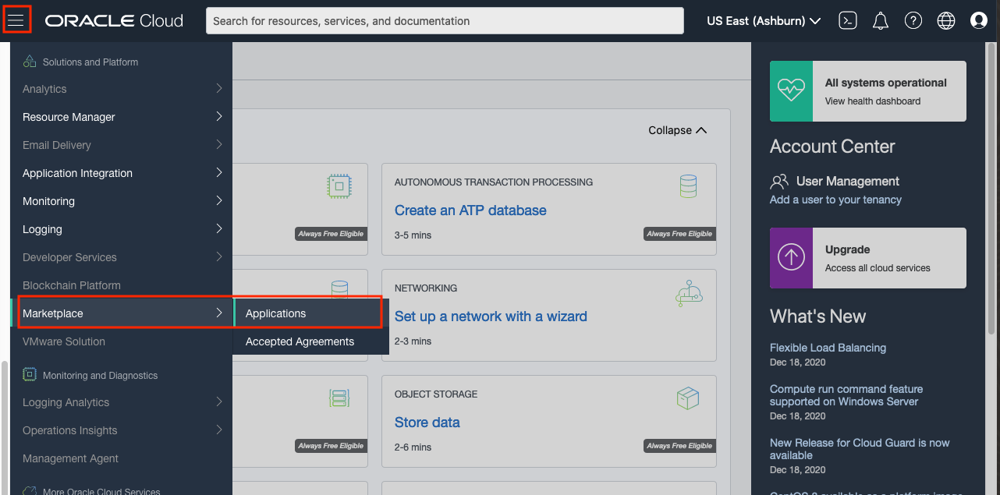

2. Search for Spatial Studio and then click on the Oracle Spatial Studio app

   

3. Review the Usage Instructions, then accept the terms and conditions and  click Launch Stack

   

## **STEP 2:** Create Stack Wizard

Opening paragraph...

1. Optionally enter a custom name and description for the app. Then select the Compartment to use for the deployment and click Next

  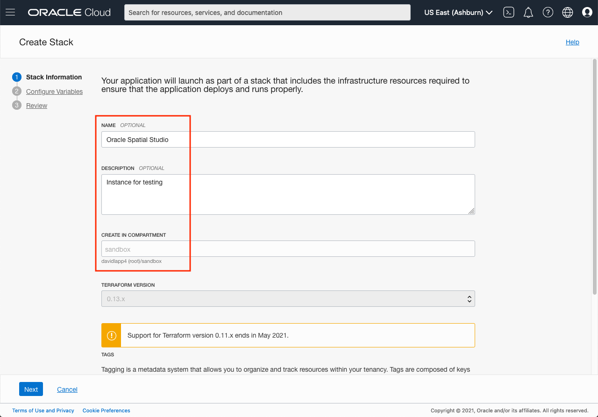

2. Select Availability Domain and Shape for the Compute Instance.  In the image below, I have selected the Micro shape but you should select the shape appropriate for your scenario. Details on compute shapes are [here](https://docs.oracle.com/en-us/iaas/Content/Compute/References/computeshapes.htm). Then scroll down.
   
   Note: In an upcoming step will have the choice to create a new VCN (Virtual Cloud Network) or use an existing one. If you will be using an existing VCN, then select the Availability Domain of that VCN here. If you will not use an exising VCN, then select any Availability Domain.
 
  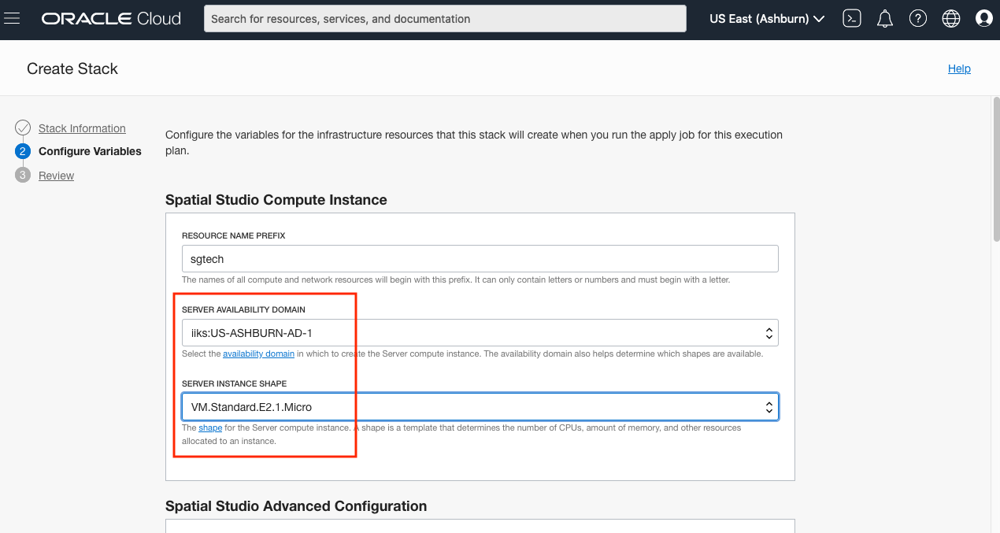

3. Optionally change the HTTPS port and  Spatial Studio admin user name from the defaults. For Spatial Studio Admin authentication, you have the option to use OCI Vault Secrets or a password. The image below shows an example using a password. For production deployments you are encouraged to use OCI Vault Secrets. Scroll down to the the section on Configuring Networking.

  

4. For networking, you have the option to automatically create a new VCN or an existing one. Select the Compartment for creating a new VCN or searching for existing VCNs. The image below shows an example using Create New VCN. If you do not have other existing VCNs then the remaining defaults can be left as is. If you do have other existing VCNs then update the CIDR values to avoid conflict. Scroll down to the SSH Keys section.

  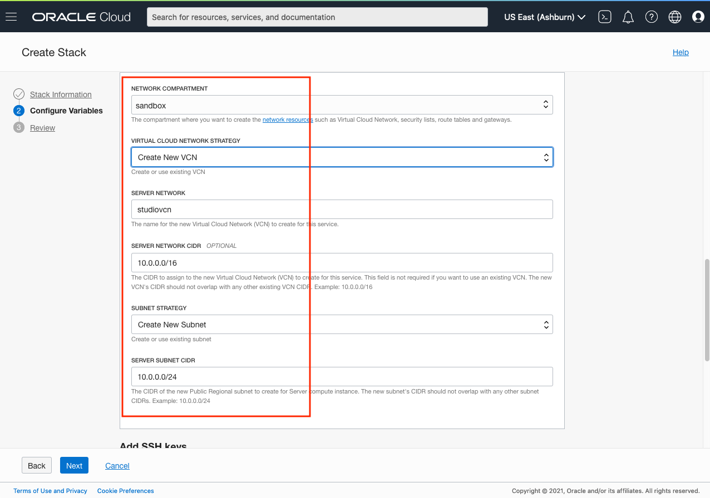

5. Loading a SSH public key enables access to Spatial Studio's file system for administrative purposes. The dialog has links to general SSH connection documentation. Submit your SSH public key by browsing to the key file or copy-pasting the key string. If you load you SSH public key from a file, the key file name will be displayed as shown in the image below. Click Next.

  

6. Review the summary of your entries. If corrections are needed then click Back. Otherwise click Create to start the deployment process. You will be redirected to a Job Details page for the deployment.  

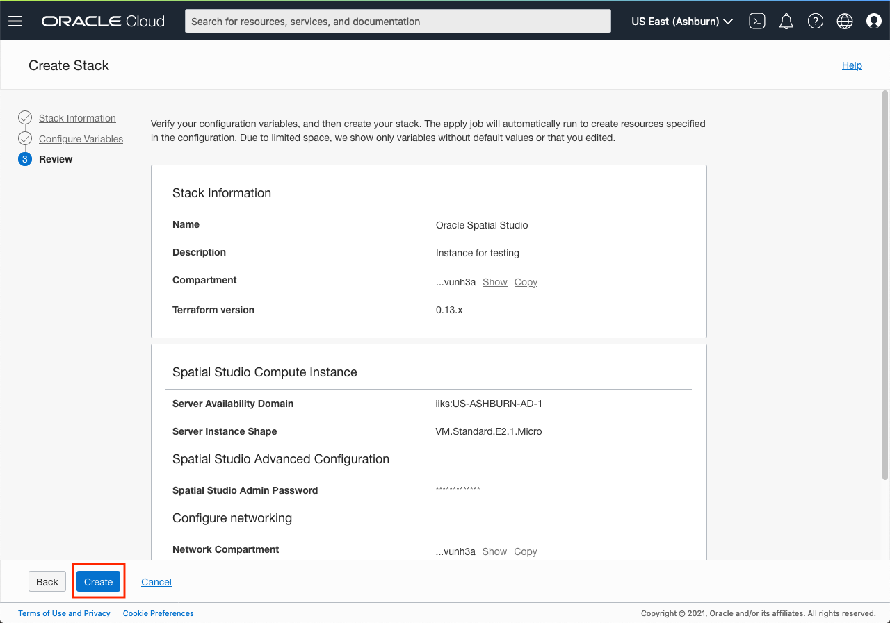

## **STEP 3:** Monitor Deployment Progress

Opening paragraph...

1. The Logs section at the bottom of the Job Details page will show progress. It will initially display a spinner while setting up for deployment. 

  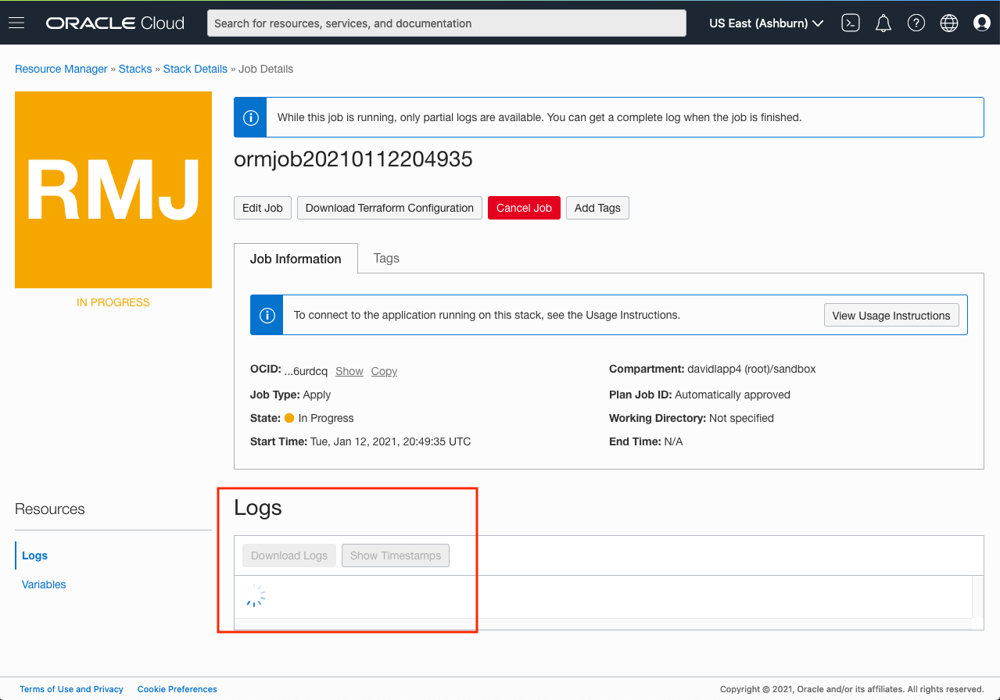

After a couple minutes you will see log information.

  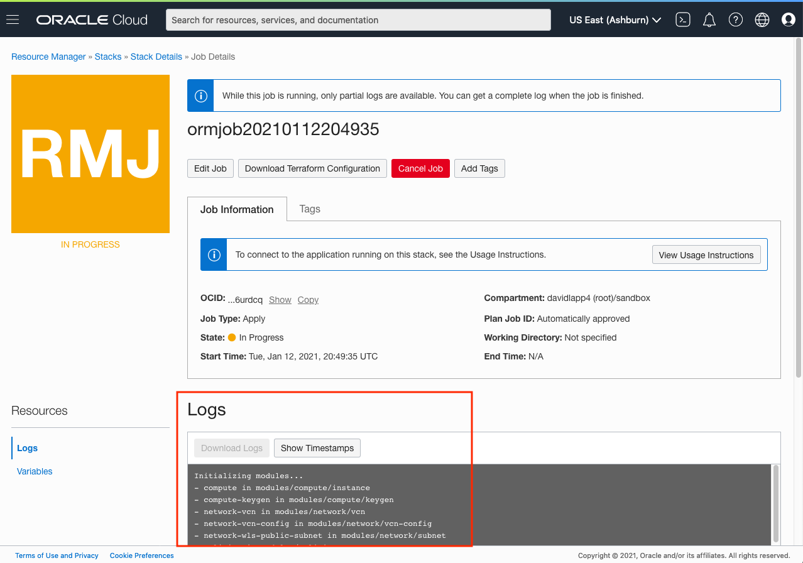

2. Scroll down to the bottom of the logs section. When complete you will see Apply Complete! followed by instance details. The last item listed is the Spatial Studio public URL. Copy this URL and paste into a browser.

  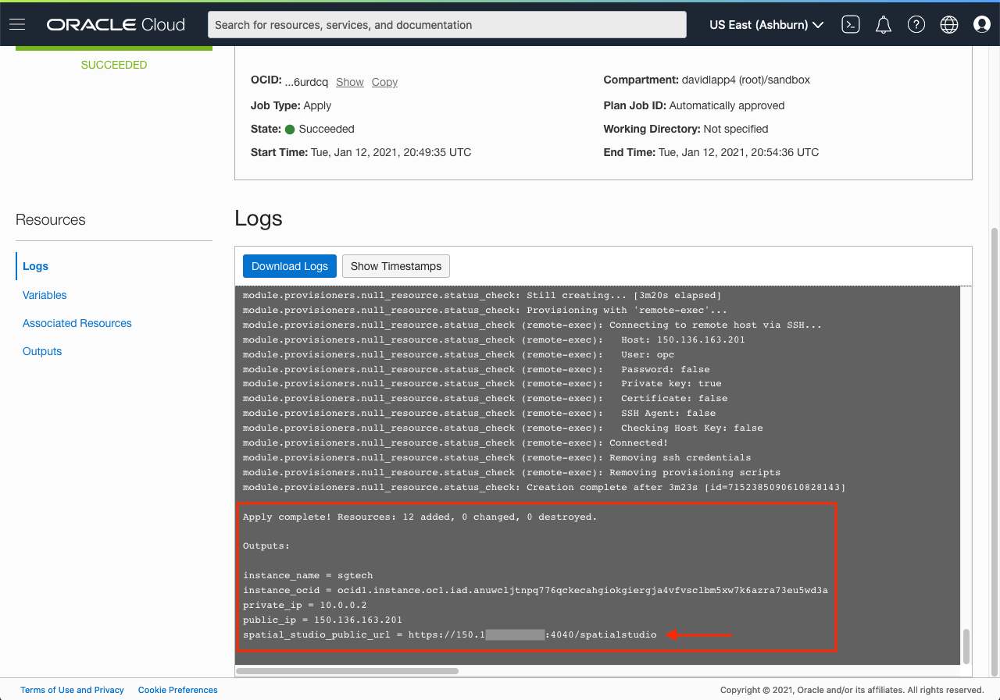

## **STEP 4:** Open Spatial Studio

Opening paragraph...

1. Opening the Spatial Studio public URL will first display a browser warning related to privacy and security. The specific warning depends on your platform and browser. This is not a Spatial Studio issue; it is generic to  access of web sites that do not have a signed HTTPS certificate. Loading and configuring a signed certificate removes this warning. However the process of loading certificates in Jetty is beyond the scope of this workshop. 

  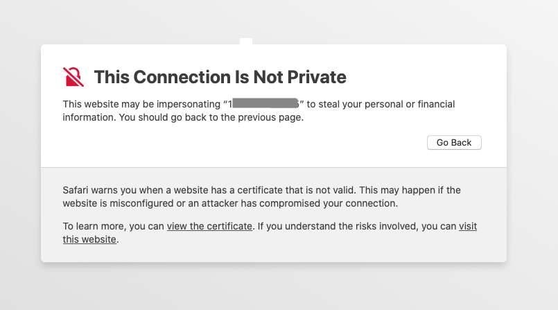

   Click the link to contine to the website.

2. Enter the Spatial Studio admin user name (default is studio_admin) and the password you entered in the Step 2 (Create Stack wizard, item 3). Then click Sign In.

  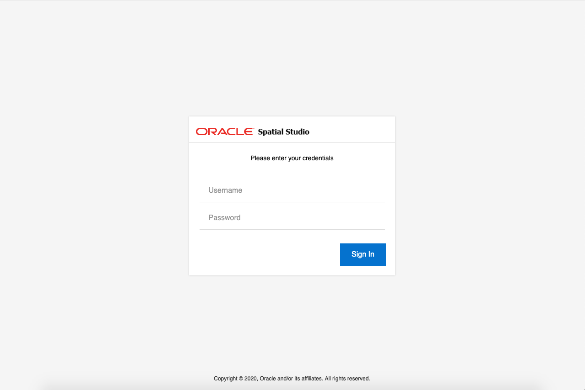

3. On the first login to a Spatial Studio instance, you are prompted for connection information for the database schema to use as the Spatial Studio's metadata repository. This is the database schema used for all of Spatial Studio's metadata and can also be used by Spatial Studio admin users for storing other data. You may use a traditional or Autonomous Oracle Database. This example uses the schema we created in Lab 2 so select Oracle Autonomous Dataabse and click Next.

  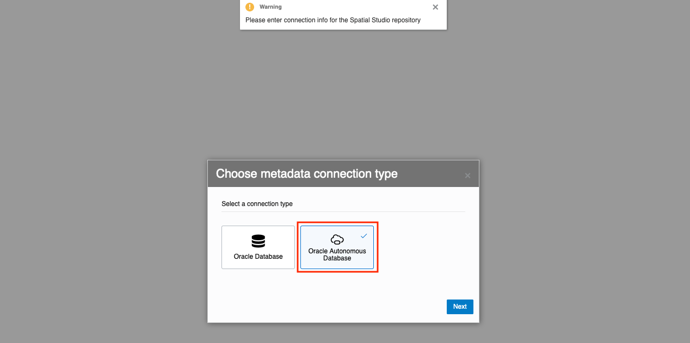  

4. For Autonomous Database, browse or drag-and-drop the Cloud Wallet zip file. After loading, the wallet file name will be listed as Selected Wallet. Click OK.

  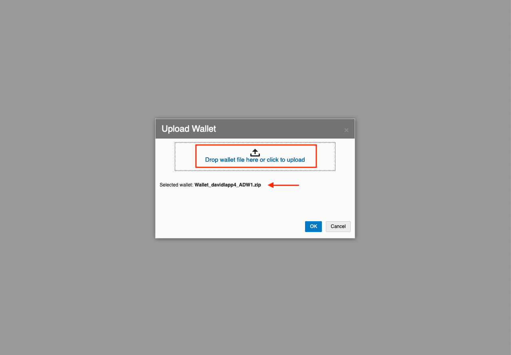  

5. Enter the user name and password defined in Lab 2 and the service. Medium service level is appropriate for this workshop. Click OK.

  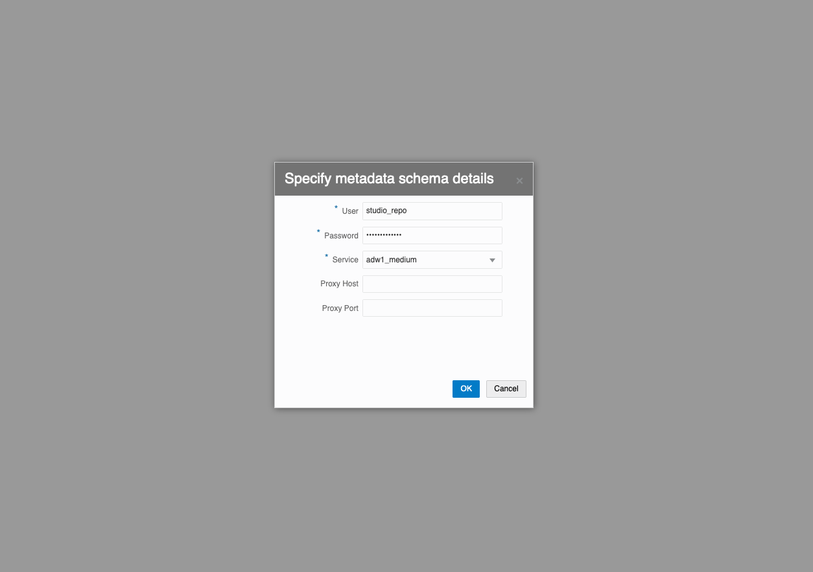  

6. Wait for a few moments while Spatial Studio makes its initial connection to the schema and creates several metadata tables. When finished, Spatial Studio will open with Getting Started information.

  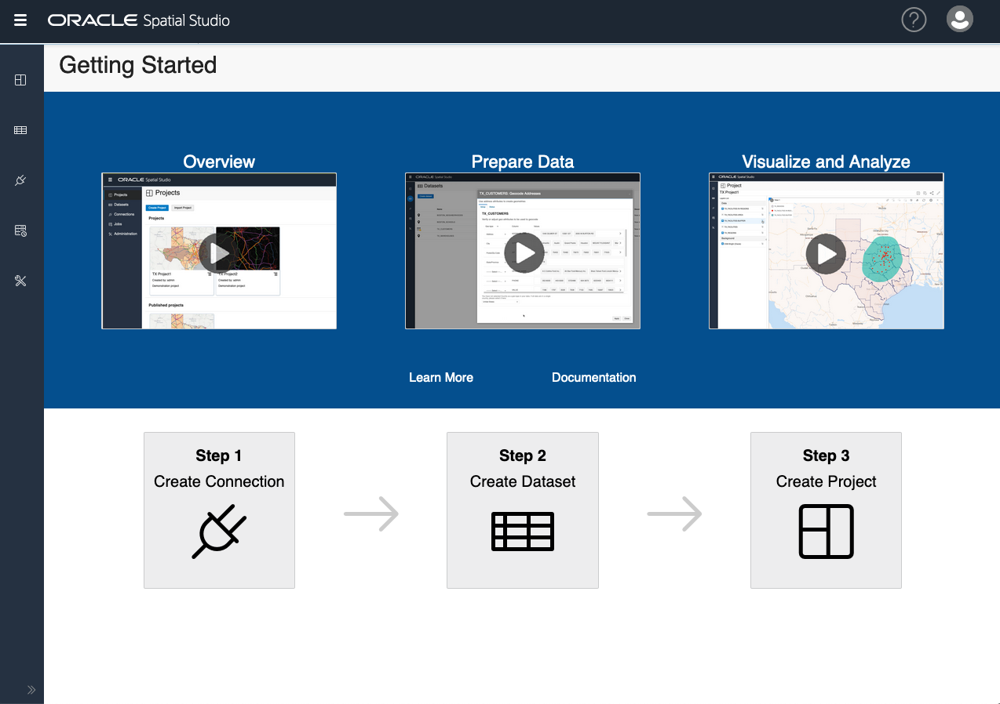  

Oracle Spatial Studio is now provisioned. 

In order to deprovision Spatial Studio......

You may now [proceed to the next lab](#next).

## Learn More

*(optional - include links to docs, white papers, blogs, etc)*

* [URL text 1](http://docs.oracle.com)
* [URL text 2](http://docs.oracle.com)

## Acknowledgements
* **Author** - <Name, Title, Group>
* **Contributors** -  <Name, Group> -- optional
* **Last Updated By/Date** - <Name, Group, Month Year>
* **Workshop (or Lab) Expiry Date** - <Month Year> -- optional, use this when you are using a Pre-Authorized Request (PAR) URL to an object in Oracle Object Store.

## Need Help?
Please submit feedback or ask for help using our [LiveLabs Support Forum](https://community.oracle.com/tech/developers/categories/livelabsdiscussions). Please click the **Log In** button and login using your Oracle Account. Click the **Ask A Question** button to the left to start a *New Discussion* or *Ask a Question*.  Please include your workshop name and lab name.  You can also include screenshots and attach files.  Engage directly with the author of the workshop.

If you do not have an Oracle Account, click [here](https://profile.oracle.com/myprofile/account/create-account.jspx) to create one.
