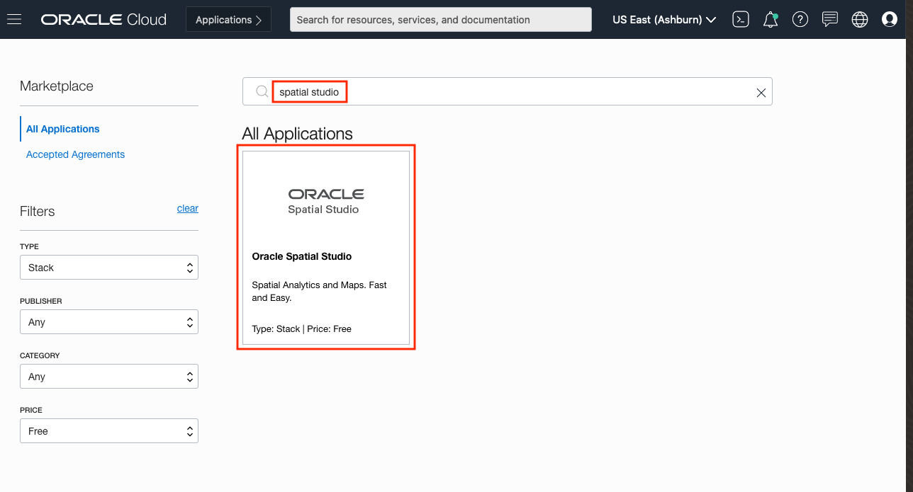
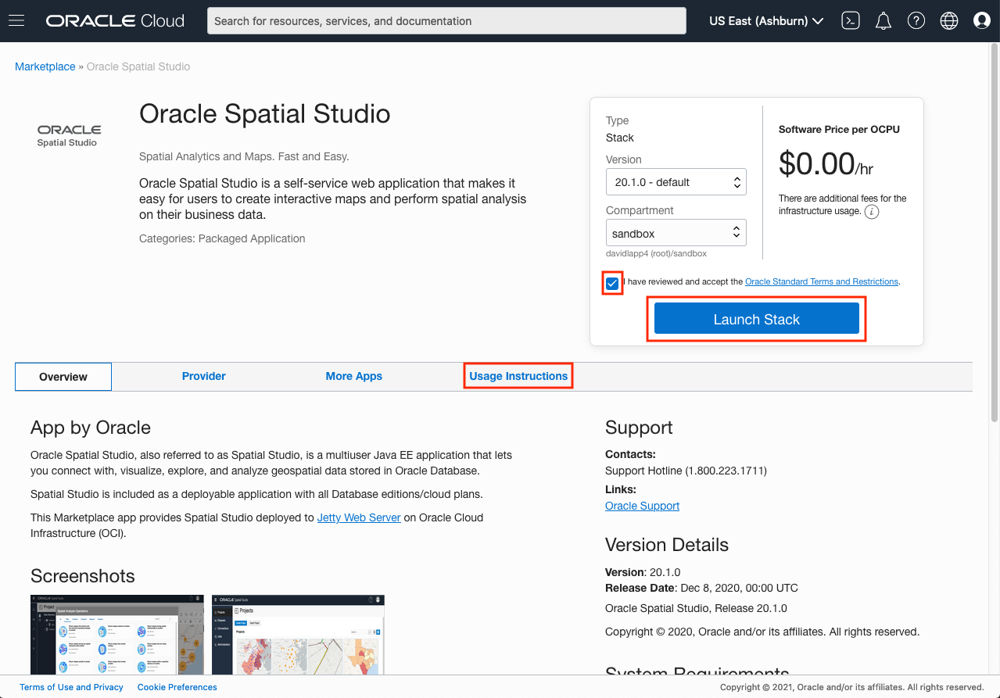
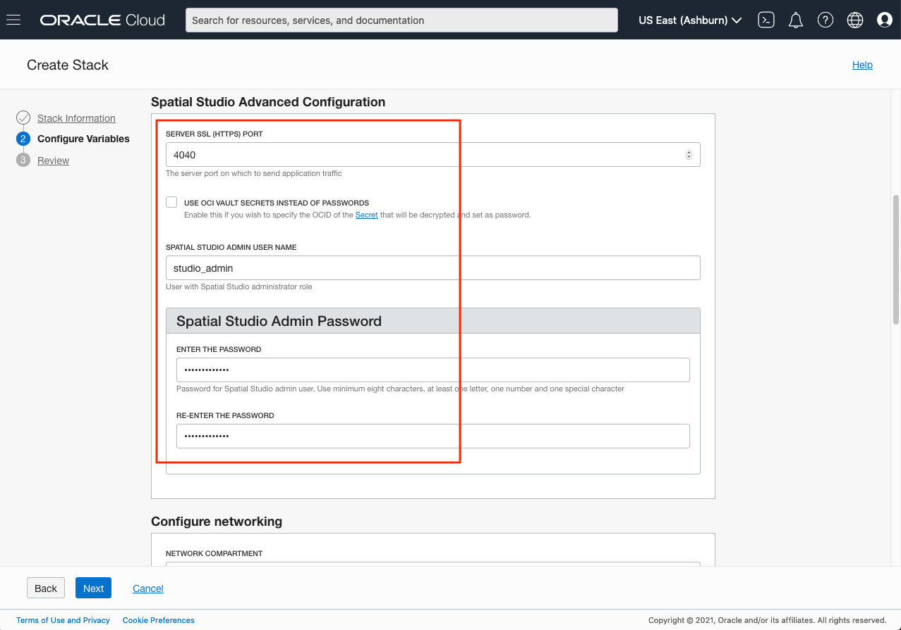
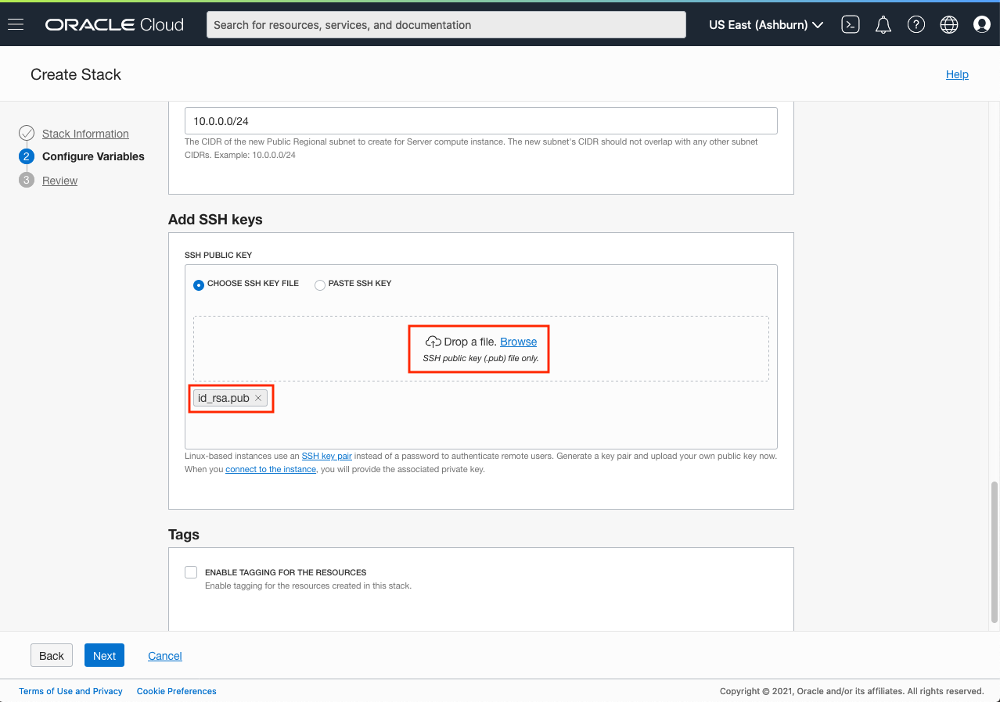

# Provision Spatial Studio using Cloud Marketplace

## Introduction

This lab walks though the process of provisioning Spatial Studio using the Oracle Cloud Cloud Marketplace.  The Markplace is ....

Estimated Lab Time: n minutes

### About Product/Technology
Enter background information here..

### Objectives

In this lab, you will:
* .......

### Prerequisites

* An Oracle Free Tier, Always Free, Paid or LiveLabs Cloud Account
* Item no 2 with url - [URL Text](https://www.oracle.com).

*This is the "fold" - below items are collapsed by default*

## **STEP 1**: Select Spatial Studio from Marketplace

Step 1 opening paragraph.

1. Log into your Oracle Cloud, click the main hamburger menu, and select  Marketplace > Applications

    

2. Search for Spatial Studio and then click on the Oracle Spatial Studio app

   

3. Review the Usage Instructions, then accept the terms and conditions and  click Launch Stack

   

## **STEP 2:** Create Stack Wizard

Opening paragraph...

1. Optionally enter a custom name and description for the app. Then select the Compartment to use for the deployment and click Next

  

2. Select Availability Domain and Shape for the Compute Instance.  In the image below, I have selected the Micro shape but you should select the shape appropriate for your scenario. Details on compute shapes are [here](https://docs.oracle.com/en-us/iaas/Content/Compute/References/computeshapes.htm). Then scroll down.
   
   Note: In an upcoming step will have the choice to create a new VCN (Virtual Cloud Network) or use an existing one. If you will be using an existing VCN, then select the Availability Domain of that VCN here. If you will not use an exising VCN, then select any Availability Domain.
 
  

3. Optionally change the HTTPS port and  Spatial Studio admin user name from the defaults. For Spatial Studio Admin authentication, you have the option to use OCI Vault Secrets or a password. The image below shows an example using a password. For production deployments you are encouraged to use OCI Vault Secrets. Scroll down to the the section on Configuring Networking.

  

4. For networking, you have the option to automatically create a new VCN or an existing one. Select the Compartment for creating a new VCN or searching for existing VCNs. The image below shows an example using Create New VCN. If you do not have other existing VCNs then the remaining defaults can be left as is. If you do have other existing VCNs then update the CIDR values to avoid conflict. Scroll down to the SSH Key section.

  

5. For 

  

*At the conclusion of the lab add this statement:*
You may now [proceed to the next lab](#next).

## Learn More

*(optional - include links to docs, white papers, blogs, etc)*

* [URL text 1](http://docs.oracle.com)
* [URL text 2](http://docs.oracle.com)

## Acknowledgements
* **Author** - <Name, Title, Group>
* **Contributors** -  <Name, Group> -- optional
* **Last Updated By/Date** - <Name, Group, Month Year>
* **Workshop (or Lab) Expiry Date** - <Month Year> -- optional, use this when you are using a Pre-Authorized Request (PAR) URL to an object in Oracle Object Store.

## Need Help?
Please submit feedback or ask for help using our [LiveLabs Support Forum](https://community.oracle.com/tech/developers/categories/livelabsdiscussions). Please click the **Log In** button and login using your Oracle Account. Click the **Ask A Question** button to the left to start a *New Discussion* or *Ask a Question*.  Please include your workshop name and lab name.  You can also include screenshots and attach files.  Engage directly with the author of the workshop.

If you do not have an Oracle Account, click [here](https://profile.oracle.com/myprofile/account/create-account.jspx) to create one.
