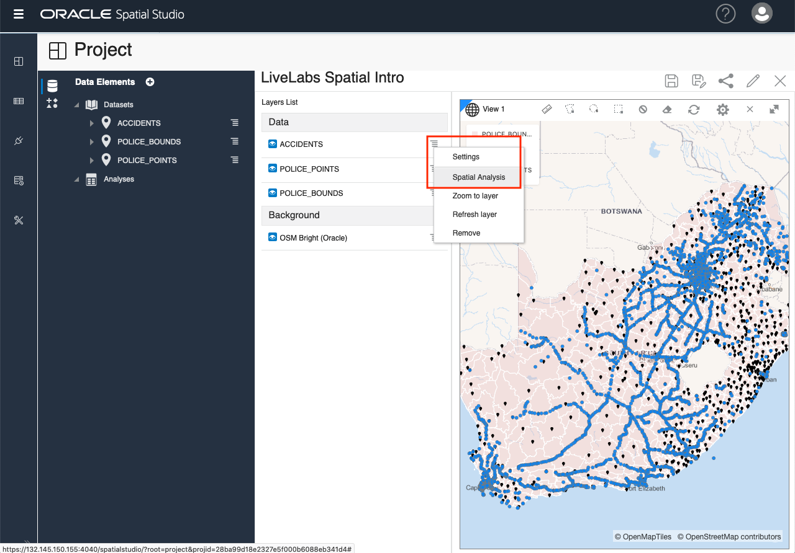
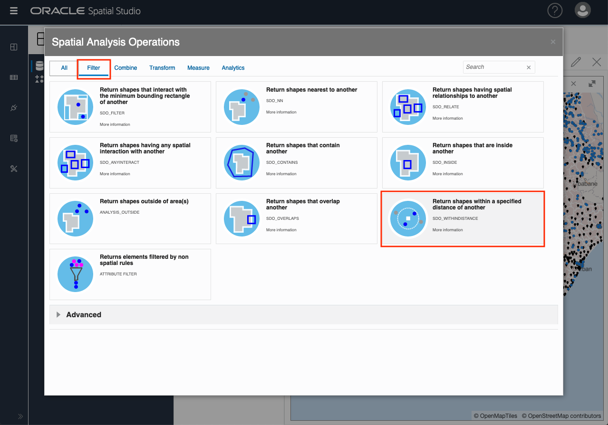
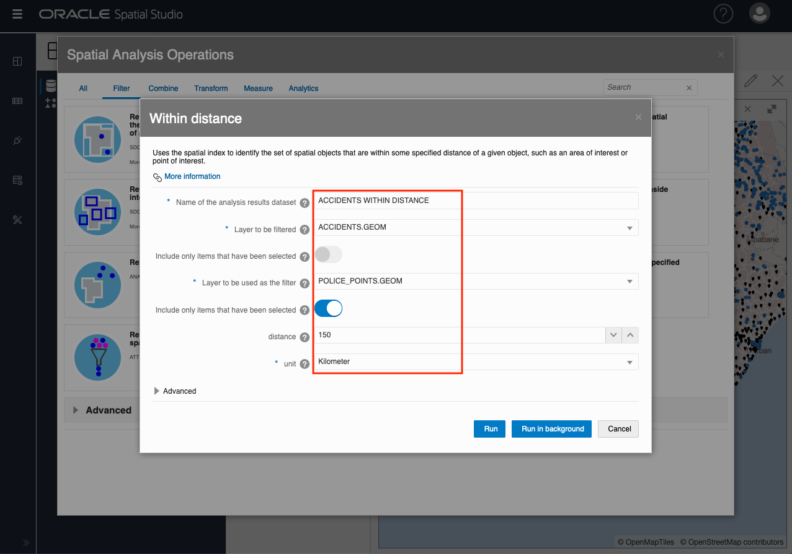
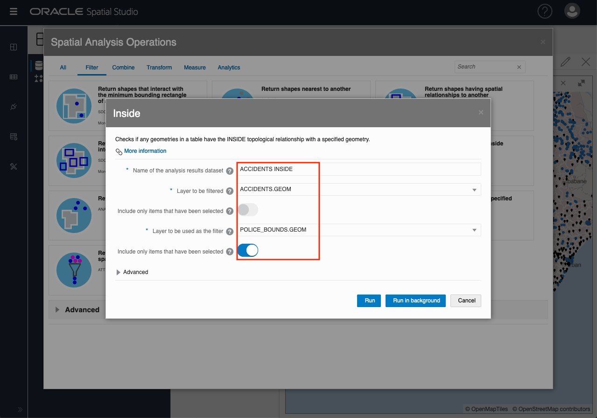
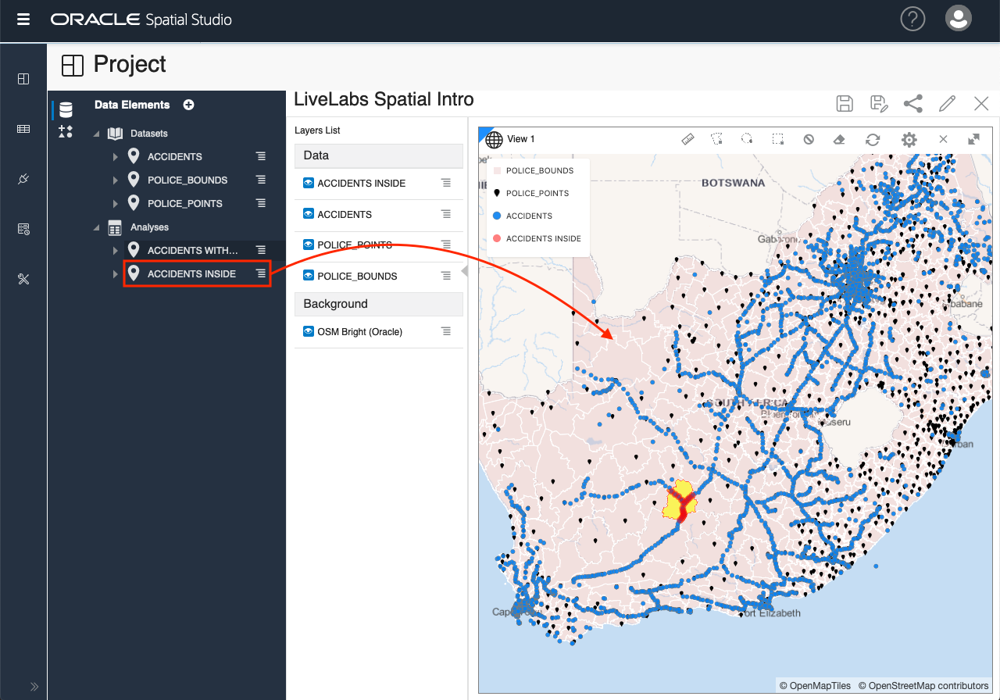
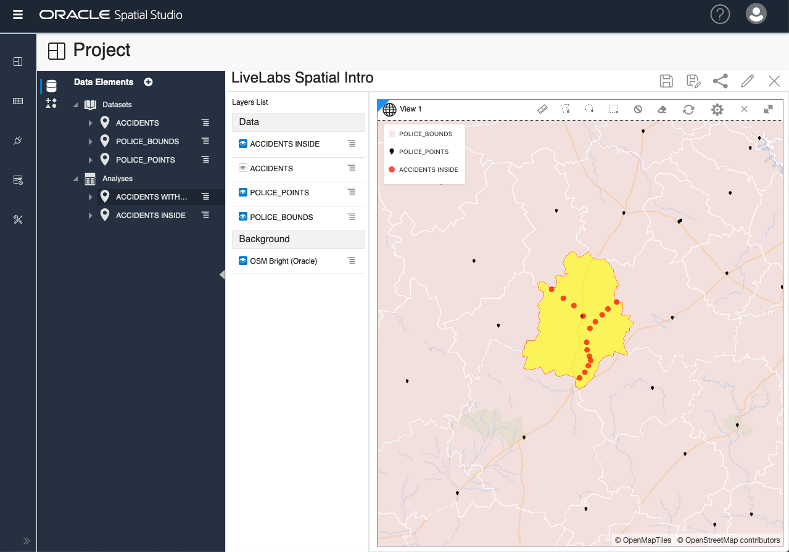
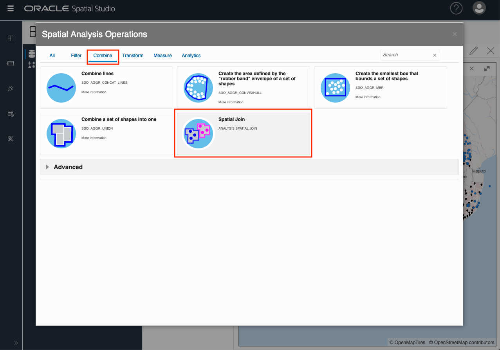
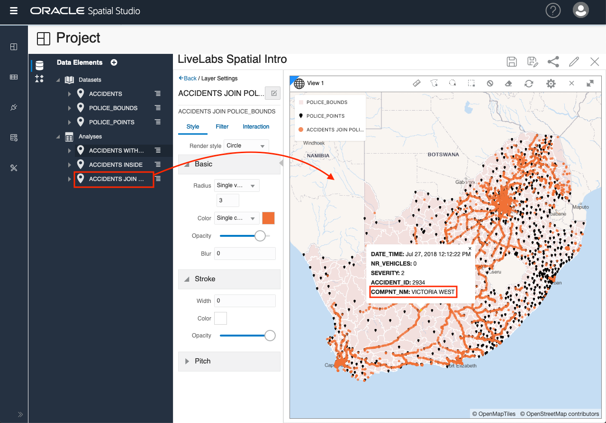
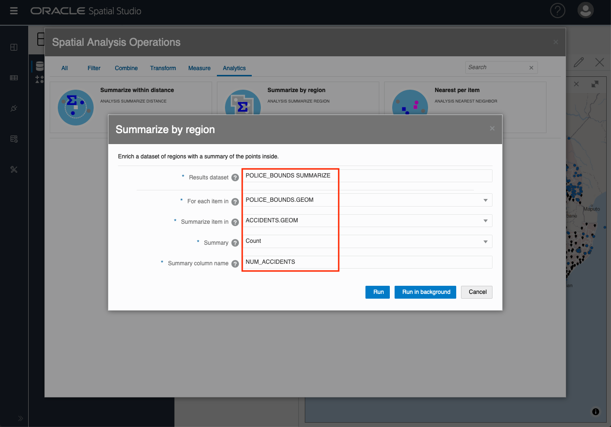

# Perform Spatial Analyses

## Introduction

Spatial Studio provides access to the spatial analysis features of Oracle Database without the need to write code. Simple user interfaces are provided for spatial analyses and all of the underlying database syntax is handled automatically behind the scenes. Spatial analysis operations in Spatial Studio are organized into categories:

**Filter**  -  i.e., "Identify which items in a dataset are inside of a region?"

**Combine** - i.e., "Join 2 datasets based on a spatial relationship" 

**Transform** - i.e., "Generate a dataset containing the points in the middle of each region"

**Measure** - i.e., "What is the area of each region in my dataset?"

**Analytics** - i.e., "How many items are inside of each region?" 

In this lab you will explore several of these spatial analyses.

Estimated Lab Time: xx minutes

### Objectives

* Understand the categories of spatial analyses in Spatial Studio
* Learn how to perform spatial analyses and visualize results

### Prerequisites

* Successfully complete Labs 1-3

<!-- *This is the "fold" - below items are collapsed by default*  -->

## **STEP 1**: Filter by Proximity

In this step you use a spatial filter to identify accidents within a specified distance of a selected police station.

1. Begin by clicking on a police station. In the image below, I have clicked on the police station in the red box. This selects the police station to use for the proximity analysis. If there is any issue with making the selection, confirm that **Allow selection** is turned on for the POLICE\_POINTS layer as described in Lab 3 Step 6.

   
   
2. Click the hamburger menu for the ACCIDENTS layer and select **Spatial Analysis**

     

3. Click on the **Filter** tab select **Return shapes within a specific distance of another**

     

4. In the analysis dialog, you may enter a name for the result or leave the default. We are filtering ACCIDENTS based on distance from a selected item in POLICE_POINTS. In the example show below, I have used a distance of 150 kilometers. 
   
   **Note:** The analysis includes switches to **Include only items that have been selected** for the layers involved. We are only interested in including the 1 selected police station for proximity analysis in this example. Therefore **Include only items that have been selected** should be **On** for POLICE_POINTS. 

   Once selections are made, click **Run**.

     

5. The analysis result is listed under Analyses in the Data Elements panel. Drag and drop the analysis result onto the map. This creates a new map layer displaying only the accidents within the specified distance of the selected police station.

    

   **Note:** Analysis results are just another type of Dataset in Spatial Studio. As you'll see in a later Lab, analysis results may be added to other maps/tables, used in other projects, accessed programmatically via REST or SQL, or exported as a file. 

6. You no longer need this analysis result in the map. So to avoid clutter, you next remove it from the map. Right click on the analysis result in the Layers List and select **Remove**
   
     

   **Note:** A Layer is just a Dataset rendered in a map. After removing a Layer (our analysis result in this case), the Dataset is still listed in the Data Elements panel and could be re-added to the map. To remove a Dataset from a Project you would right click on the Dataset in the Data Elements panel and select **Remove from project**.

## **STEP 2**: Filter by Containment

In this step you use a spatial filter to identify accidents inside a selected police region.

1. Begin by clicking in a region in the POLICE\_BOUNDS layer. The selected region will be used as to filter accidents. In the image below, the region in the red box was selected.

     
   
2. As you did for the previous analysis in Step 1, click on the hamburger menu for the ACCIDENTS layer and select Spatial Analysis. This time we are filtering by containment. So select the tile **Return shapes that are inside another**  

     

3. You may enter a name for the results or leave the default. The layer to be filtered is ACCIDENTS and the layer used as the filter is POLICE\_BOUNDS. The option to **Include only items that have been selected** should be selected for POLICE\_BOUNDS since we are only filtering for accidents contained in the single selected police region.

     
   
4. Drag and drop the analysis result into the map. Observe the new layer containing the accidents inside the selected police region.

     
   
   You can use your mouse wheel to zoom into the area of results. In the image below the ACCIDENTS layer is turned off to focus on the analysis result.

     
   
 5.  Before moving on to the next analysis, zoom to the full extent of your data by opening the hamburger menu for the POLICE\_BOUNDS layer and selecting **Zoom to layer** and remove the containment analysis from the map. 
   
## **STEP 3**: Join by Containment

Here you join Datasets based on a spatial relationship. You will join ACCIDENTS to POLICE\_BOUNDS based on containment. You may think of this as enriching or tagging each accident with the police region that contains it. 

1. As you did for previous analyses, click on the hamburger menu for the ACCIDENTS layer in the Layers List and select Spatial Analysis. Select the **Combine** tab and then the tile **Spatial Join**  

   

1. In the Spatial Join dialog, enter a name for the result, for example ACCIDENTS\_JOIN\_POLICE\_BOUNDS. For the additional entries, you are joining items in ACCIDENTS based on the spatial relationship Inside to items in POLICE\_BOUNDS.    This operation will result in a new Dataset containing ACCIDENTS enriched with the unique id of the POLICE\_BOUNDS region containing each item. The unique id (i.e., key column) for POLICE\_BOUNDS is COMPNT\_NM, therefore we expect to see that column in the result. Click **Run**.

     **Note:** The Advanced option allows you to include all columns from the secondary Dataset (POLICE\_BOUNDS in this case) in the result, instead of just the unique id.

   
   
2. The result is listed under Analyses in the Data Elements panel. Expand the result to see its columns; all original columns from ACCIDENTS, plus COMPNT\_NM as expected.

   

3. x

   

   

   

## **STEP 4**: Summarize Items by Region

## **STEP 5**: Identify Nearest Items

You may now [proceed to the next lab](#next).

## Acknowledgements
* **Author** - David Lapp, Database Product Management
* **Last Updated By/Date** - David Lapp, Database Product Management, February 2021

## Need Help?
Please submit feedback or ask for help using our [LiveLabs Support Forum](https://community.oracle.com/tech/developers/categories/livelabsdiscussions). Please click the **Log In** button and login using your Oracle Account. Click the **Ask A Question** button to the left to start a *New Discussion* or *Ask a Question*.  Please include your workshop name and lab name.  You can also include screenshots and attach files.  Engage directly with the author of the workshop.

If you do not have an Oracle Account, click [here](https://profile.oracle.com/myprofile/account/create-account.jspx) to create one.
