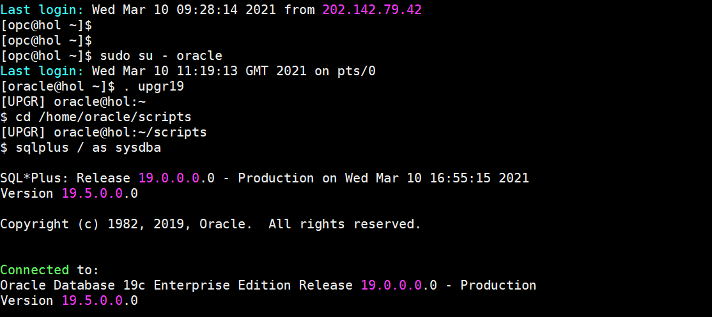
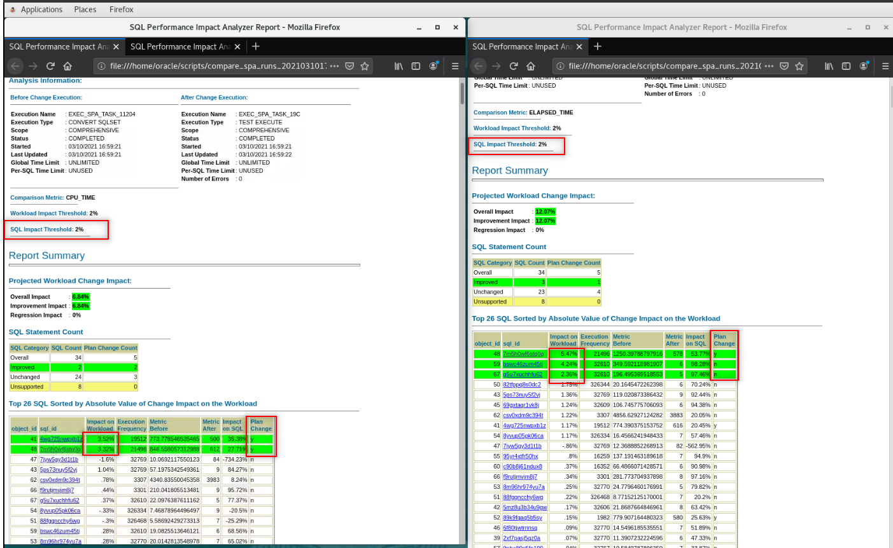

# SQL Performance Analyzer

## Introduction

In this Lab, you will use the SQL Performance Analyzer (SPA) which is a part of the Real Application Testing (RAT). You will compare statements collected before the upgrade to a simulation of these statements after upgrade. You will use the SQL Tuning Sets collected earlier in the workshop.

*Estimated Lab Time*: 30 minutes


You have collected SQL statements from the first load of HammerDB earlier in this workshop into two SQL Tuning Sets:

    STS_CaptureAWR
    STS_CaptureCursorCache

You will simulate the statements with "test executes" of one of the SQL Tuning Sets (you can do both if time allows), and generate a comparison report.

### SQL Performance Analyzer
You can run SQL Performance Analyzer on a production system or a test system that closely resembles the production system. It's highly recommended to execute the SQL Performance Analyzer runs on a test system rather than directly on the production system.


### Objectives

In this lab, you will:
* Check Statements

### Prerequisites
This lab assumes you have:
- A Free Tier, Paid or LiveLabs Oracle Cloud account
- SSH Private Key to access the host via SSH (*Free-tier* and *Paid Tenants* only)
- You have completed:
    - Lab: Generate SSH Keys (*Free-tier* and *Paid Tenants* only)
    - Lab: Prepare Setup (*Free-tier* and *Paid Tenants* only)
    - Lab: Environment Setup
		- Lab: Initialize Environment

## Task 1: Check Statements


1. Check the number of statements you collected in the SQL Tuning Sets

    ```
    <copy>
    . upgr19
    cd /home/oracle/scripts
    sqlplus / as sysdba
    </copy>
    ```
    

2. Run the query given below:

    ```
    <copy>
    select count(*), sqlset_name from dba_sqlset_statements group by sqlset_name order by 2;
    </copy>
    ```
    

3. Then start a completely scripted SQL Performance Analyzer run.
   It will:
      - Convert the information from `STS_CaptureAWR` into the right format
      - Simulate the execution of all statements in `STS_CaptureAWR`
      - Compare before/after
      - Report on the results – in this case based on CPU\_TIME and ELAPSED\_TIME

4. You will execute two simulations using different comparison metrics for both, CPU\_TIME and ELAPSED\_TIME.  Start with an initial run for CPU\_TIME with the script below.

    ```
    <copy>
    @spa_cpu.sql
    </copy>
    ```
    

5. Generate the HTML Report containing the results below.

    ```
    <copy>
    @spa_report_cpu.sql
    </copy>
    ```
6. Then repeat this for ELAPSED\_TIME

    ```
    <copy>
    @spa_elapsed.sql
    </copy>
    ```
    

7. Finally, generate the HTML Report containing the results below

    ```
    <copy>
    @spa_report_elapsed.sql
    </copy>
    exit
    ```

8. Notice that there will be two html files in /home/oracle/scripts.

    ```
    <copy>
    cd /home/oracle/scripts
    firefox compare_spa_* &
    </copy>
    ```
    

9.  Firstly, observe the different comparison metrics in the report’s header.

    *This screenshot is just an example – you may see a very different report*
    

10.  You may recognize regressed statements and statements with plan changes (rightmost column).  But you may also recognize that the statements NOT marked in GREEN have improved drastically as well.  Why are they not marked GREEN, too? The reason is the THRESHOLD of 2% that has been set.
    

11.  If you want to play, you can change the threshold values in this script - but this is not part of the lab exercise.
    ```
    <copy>
    vi /home/oracle/scripts/spa_elapsed.sql
    </copy>
    ```

12.  The statement in the screen shot is slightly better than before measured.  Now click on the statement with the ID 7m5h0wf6stq0q and check the plan differences.  Scroll down to the two plans, BEFORE and AFTER.

    “BATCHED” access means that the database retrieves a few row ids from the index, and then attempts to access rows in block order to improve the clustering and reduce the number of times that the database must access a block. This makes it run faster.

    Feel free to check other examples in the report, too.

13. But this demonstrates that it is not always good to deny plan changes as part of an upgrade. Repeat the ELAPSED run but set.

    ```
    <copy>
    alter session set optimizer_features_enable='11.2.0.4';
    @spa_elapsed.sql
    </copy>
    ```
    

14.  Then regenerate the HTML Report containing the results below.

    ```
    <copy>
    @spa_report_elapsed.sql
    exit
    </copy>
    ```

15. Open it with Firefox.

    ```
    <copy>
    cd /home/oracle/scripts
    firefox compare_spa_* &
    </copy>
    ```
    

16.  Now there is no plane change, but there is still an improvement as 19c seems to do something different internally. We basically “lost” the improvement partially by using an old optimizer parametrization.

The idea of such SPA runs is to accept the better plans and identify and cure the ones which are misbehaving.

You may now [proceed to the next lab](#next).

## Learn More

* [SQL Performance Analyzer](https://docs.oracle.com/en/database/oracle/oracle-database/19/ratug/introduction-to-sql-performance-analyzer.html#GUID-860FC707-B281-4D81-8B43-1E3857194A72)

## Acknowledgements
* **Author** - Mike Dietrich, Database Product Management
* **Contributors** -  Roy Swonger, Sanjay Rupprel, Cristian Speranta, Kay Malcolm
* **Last Updated By/Date** - Mike Dietrich, July 2021
