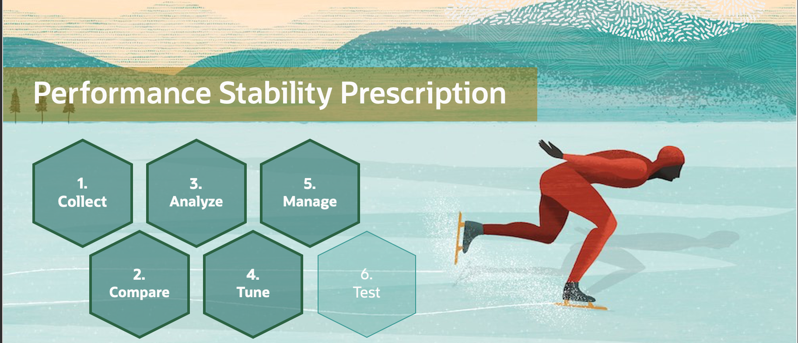
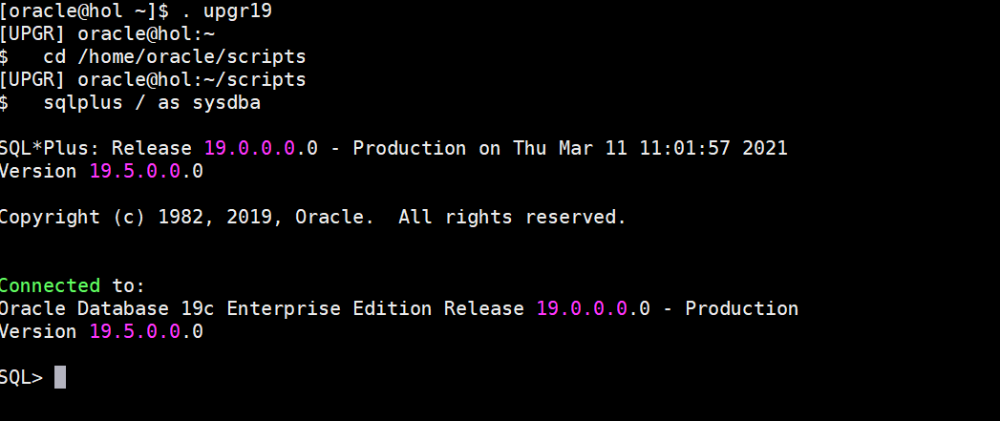
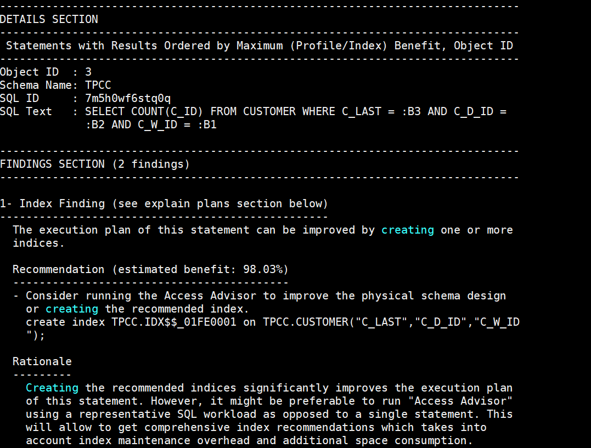
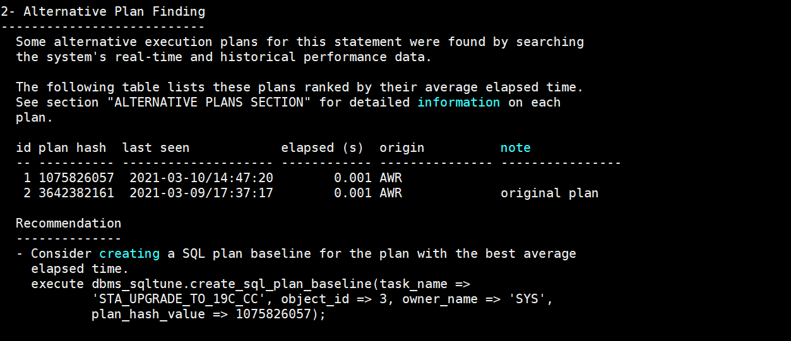
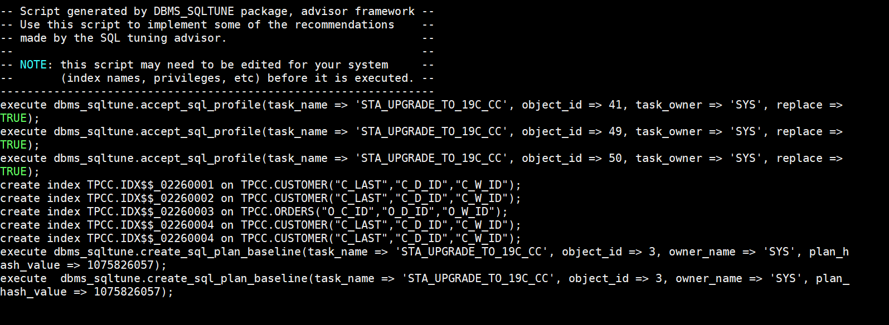
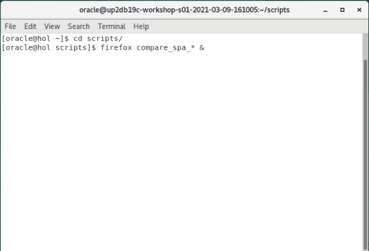

# SQL Tuning Advisor

## Introduction

In the previous section you fixed plans with SQL Plan Management. But let us see what else could be done and ask the SQL Tuning Advisor (STA).

*Estimated Lab Time:* 10 minutes



You will pass the SQL Tuning Set from the “Load” exercise where you captured the HammerDB workload directly from Cursor Cache to the SQL Tuning Advisor and check the results.
Analyze the SQL Tuning Set and generate recommendations

A complete script is provided: sta_cc.sql.  

### About SQL Tuning Advisor
SQL Tuning Advisor is SQL diagnostic software in the Oracle Database Tuning Pack.

You can submit one or more SQL statements as input to the advisor and receive advice or recommendations for how to tune the statements, along with a rationale and expected benefit.

### Objectives
In this lab, you will:
* Generate a tuning task with the SQL Tuning Set STS_CaptureCursorCache
* Run a tuning task where the SQL Tuning Advisor simulates the execution
* Generate a result report in TEXT format
* Generate statements to implement the findings

### Prerequisites
This lab assumes you have:
- A Free Tier, Paid or LiveLabs Oracle Cloud account
- SSH Private Key to access the host via SSH (*Free-tier* and *Paid Tenants* only)
- You have completed:
    - Lab: Generate SSH Keys (*Free-tier* and *Paid Tenants* only)
    - Lab: Prepare Setup (*Free-tier* and *Paid Tenants* only)
    - Lab: Environment Setup
		- Lab: Initialize Environment

## **STEP 1**: Generate a Tuning Task

1. Execute the SQL Tuning Advisor script sta_cc.sql to create, execute and report a complete tuning task.

    ```
    <copy>
    . upgr19
    cd /home/oracle/scripts
    sqlplus / as sysdba
    </copy>
    ```
    

    ```
    <copy>
    @sta_cc.sql
    </copy>
    ```


2. It will take 30 seconds to check the output by scrolling up. Displayed below are the first two findings for a COUNT statement on the CUSTOMER table.
    
    

  You see that the SQL Tuning Advisor interacts with SQL Plan Management from the previous exercise as well.

  When you scroll to the end, you will find the implementation section:
    


3. Firstly, remove the duplicate recommendations. You will not need several identical indexes with different names on TPCC.CUSTOMER for sure (marked in BLUE). Fix everything.  This is an exercise. Please do not do this in a real environment without proper verification. But let us implement all the recommendations and see what happens. Execute all the recommendations from the Advisor.
      


4. Wait for a while until all statements have been executed. Subsequently, repeat the SQL Performance Analyzer runs from the previous exersize and verify the results.
    ```
    <copy>
    @spa_cpu.sql
    @spa_report_cpu.sql
    </copy>
    ```
    
    ```
    <copy>
    @spa_elapsed.sql
    @spa_report_elapsed.sql
    </copy>
    ```
    
    ```
    <copy>
    exit
    </copy>
    ```

5. Compare the two resulting reports again. Then compare them to the examples from the previous run. Firefox will open several tabs, one for each report.

    ```
    <copy>
    cd /home/oracle/scripts
    firefox compare_spa_* &
    </copy>
    ```
    

    It should look similar to the ones below. More isn not always better. Be careful just implementing recommendations. Test and verify them step by step.

You may now [proceed to the next lab](#next).

## Learn More

* [SQL Tuning Advisor](https://docs.oracle.com/en/database/oracle/oracle-database/19/tgsql/sql-tuning-advisor.html#GUID-8E1A39CB-A491-4254-8B31-9B1DF7B52AA1)

## Acknowledgements
* **Author** - Mike Dietrich
* **Contributors** -  Roy Swonger, Sanjay Rupprel, Cristian Speranta, Kay Malcolm
* **Last Updated By/Date** - Mike Dietrich, July 2021
