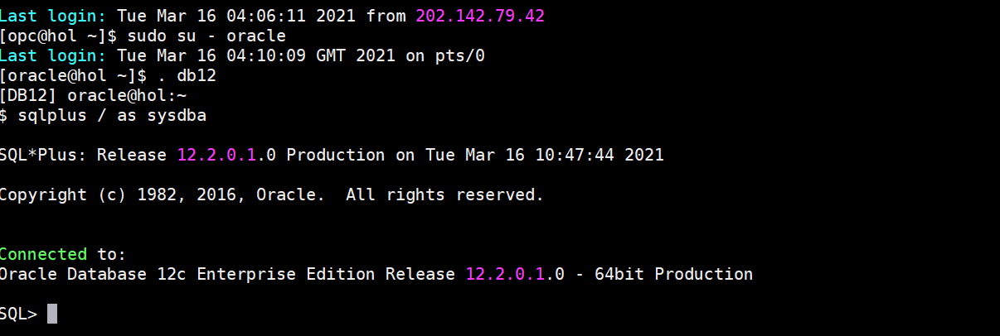
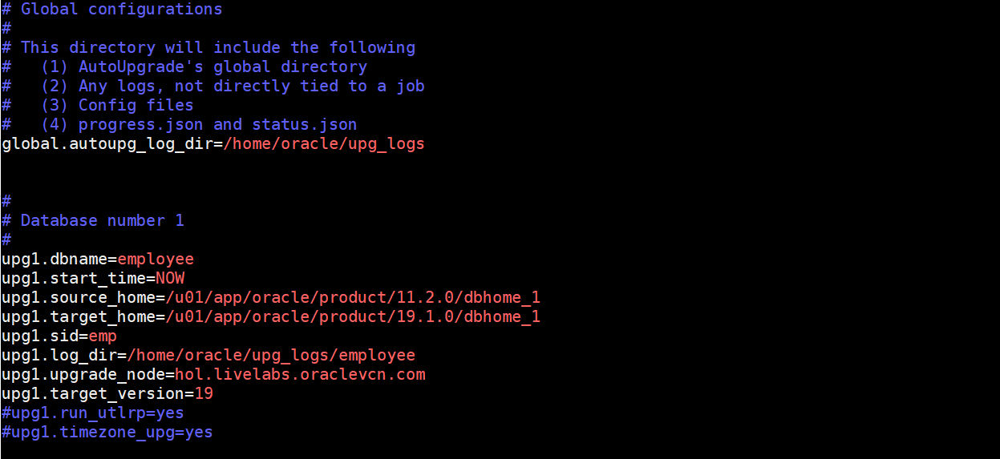
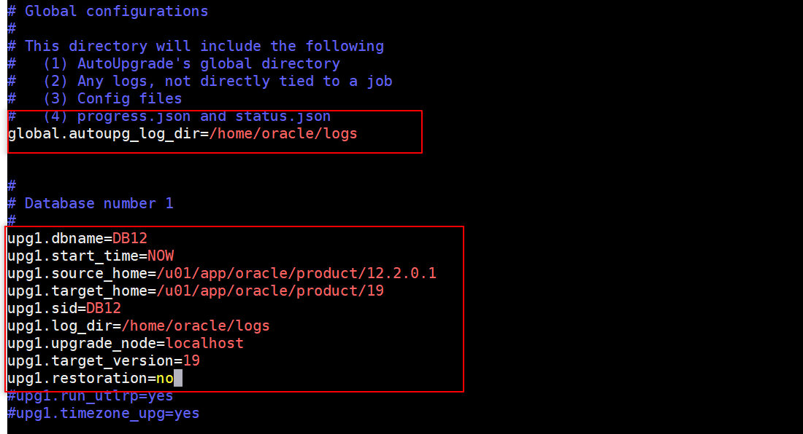
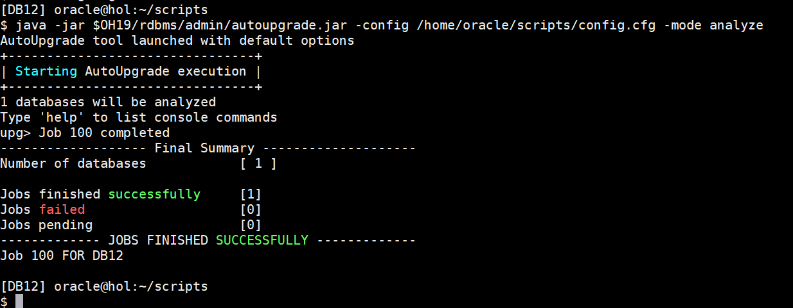
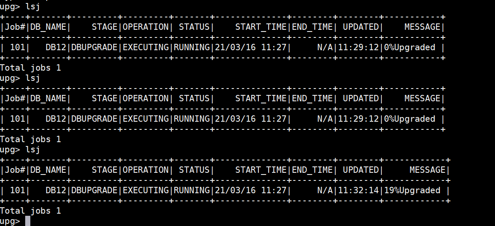
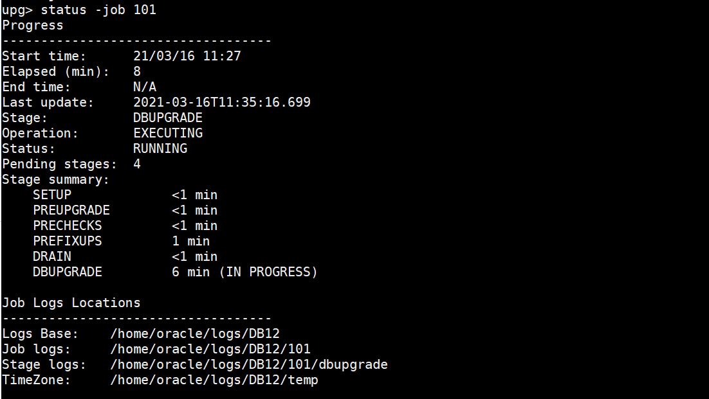
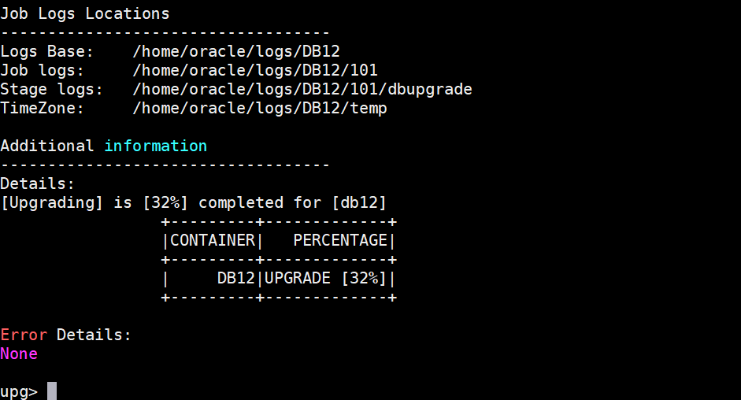
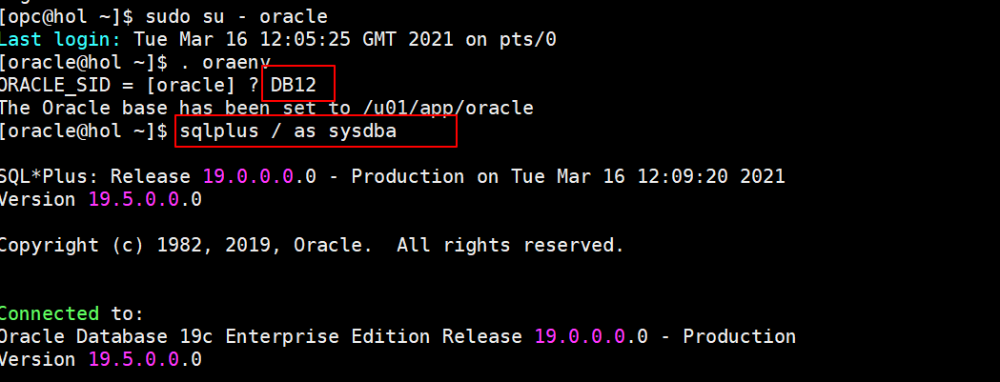
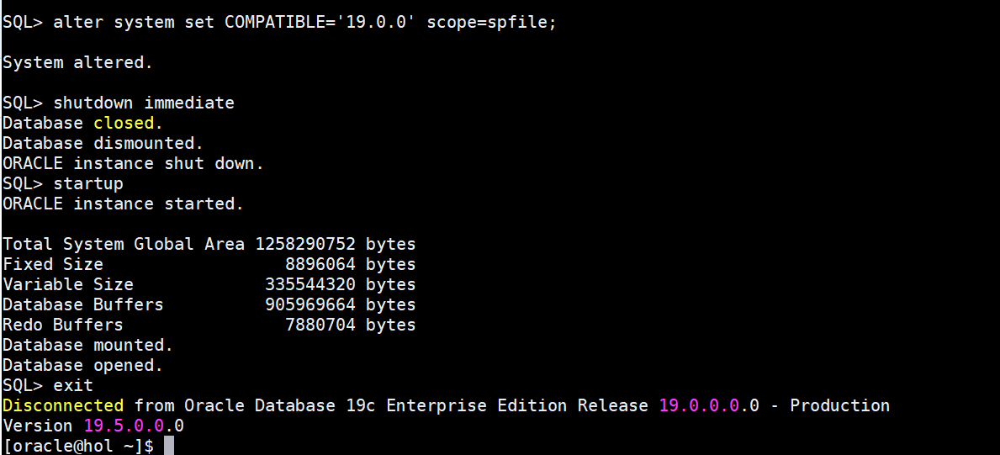

# AutoUpgrade - Part 2

## Introduction

You executed the AutoUpgrade in a previous lab.  In this OPTIONAL lab you will upgrade the two other databases

You can upgrade Oracle 11.2.0.4 databases and newer to:
- Oracle 12.2.0.1 with Release Update January 2019 or newer
- Oracle 18.5.0 or newer
- Oracle 19.5.0 or newer

*Estimated Lab Time*: 1 hour

### About AutoUpgrade
The AutoUpgrade utility identifies issues before upgrades, performs pre- and postupgrade actions, deploys upgrades, performs postupgrade actions, and starts the upgraded Oracle Database.

The AutoUpgrade utility is designed to automate the upgrade process, both before starting upgrades, during upgrade deployments,during postupgrade checks and configuration migration. You will use AutoUpgrade after having downloaded binaries for the new Oracle Database release, and set up new release Oracle homes. When you use AutoUpgrade, you can upgrade multiple Oracle Database deployments at the same time, using a single configuration file, customized as needed for each database deployment.

With the January 2019 Release Updates (DBJAN2019RU) and later updates, AutoUpgrade support is available for Oracle Database 12c Release 2 (12.2) and Oracle Database 18c (18.5) target homes. For both Oracle Database 12c Release 2 (12.2) and Oracle Database 18c (18.5) target homes, you must download the AutoUpgrade kit from My Oracle Support Document 2485457.1.

### Objectives

In this lab, you will:
* Preparation
* Generate and edit the config file
* Analyze Mode
* Deploy Mode

### Prerequisites
This lab assumes you have:
- A Free Tier, Paid or LiveLabs Oracle Cloud account
- SSH Private Key to access the host via SSH
- You have completed:
    - Lab: Generate SSH Keys (*Free-tier* and *Paid Tenants* only)
    - Lab: Prepare Setup (*Free-tier* and *Paid Tenants* only)
    - Lab: Environment Setup
		- Lab: Initialize Environment

## **STEP 1**: Preparation

1. The first step is to start the database DB12.
    ````
    <copy>
    . db12
    sqlplus / as sysdba
    </copy>
    ````
    

    ````
    <copy>
    startup
    exit
    </copy>
    ````
    

## **STEP 2**: Generate and edit the config file

1. Run the command below to generate autoupgrade sample file.

    ````
    <copy>
    java -jar $OH19/rdbms/admin/autoupgrade.jar -create_sample_file config
    </copy>
    ````
    

2.  You will need to edit the sample file and then pass it to the AutoUpgrade utility. You can find the sample configuration file from the path- `/home/oracle/scripts/sample_config.cfg`.  Open the sample file in your preferred editor and adjust the following things from the below parameters.  Generated config.cfg, make the following adjustments.

    
   
    <!-- ````
    #Global configurations
    #Autoupgrade's global directory, ...
    #temp files created and other ...
    #send here
    global.autoupg_log_dir=/default/...

    #
    # Database number 1
    #
    upg1.dbname=employee
    upg1.start_time=NOW
    upg1.source_home=/u01/...
    upg1.target_home=/u01/...
    upg1.sid=emp
    upg1.log_dir=/scratch/auto
    upg1.upgrade_node=node1
    upg1.target_version=19.1
    #upg1.run_utlrp=yes
    #upg1.timezone_upg=yes

 -->
    ````
    #Global configurations
    #Autoupgrade's global directory, ...
    #temp files created and other ...
    #send here
    global.autoupg_log_dir=/home/oracle/logs


    #
    # Database number 1
    #
    upg1.dbname=DB12
    upg1.start_time=NOW
    upg1.source_home=/u01/app/oracle/product/12.2.0.1
    upg1.target_home=/u01/app/oracle/product/19
    upg1.sid=DB12
    upg1.log_dir=/home/oracle/logs
    upg1.upgrade_node=localhost
    upg1.target_version=19
    upg1.restoration=no
    ````
    

3. Then save the file as config.cfg to `/home/oracle/scripts`.  
    
    ````
    <copy>
    mv /home/oracle/sample_config.cfg /home/oracle/scripts/config.cfg
    </copy>
    ````

    If you don not want to edit the file by yourself, there is a config file for DB12 stored already:

    ````
    <copy>
    cat /home/oracle/scripts/DB12.cfg
    </copy>
     ````
    Just ensure that you adjust the below calls to call DB12.cfg instead of config.cfg.

##  **STEP 3**: Analyze

1. You could run the autoupgrade directly, but it is best practice to run an analyze at first. Once the analyze phase is passed without issues, the database can be upgraded automatically.

    ````
    <copy>
    java -jar $OH19/rdbms/admin/autoupgrade.jar -config /home/oracle/scripts/config.cfg -mode analyze
    </copy>
    ````
    You will see this output below.
    

## **STEP 4**: Deploy mode

1. When you initiate the upgrade now with the -mode deploy, the tool will repeat the analyze phase, but add the fixups, upgrade and postupgrade steps.

    ````
    <copy>
    java -jar $OH19/rdbms/admin/autoupgrade.jar -config /home/oracle/scripts/config.cfg -mode deploy
    </copy>
    ````
    

2. You will see this output:

    

    <!-- ````
    Autoupgrade tool launched with default options
    +--------------------------------+
    | Starting AutoUpgrade execution |
    +--------------------------------+
    1 databases will be processed
    Type 'help' to list console commands
    upg>

    ```` -->

3. At this point you can monitor the upgrade now – enlarge the xterm’s width a bit to see no line wraps.  The most important commands are:

    **lsj** – this lists the job number and overview information about each active job
    ````
    upg> <copy>lsj</copy>
    ````
    
    
    **status -job 101** This gives you more information about a specific job
    ````
    upg> <copy>status -job 101</copy>
    ````
    
    
    

4. You can also monitor the logs in /home/oracle/logs/DB12/101. In the ./dbupgrade subdirectory you will find the usual upgrade logs of each worker.  Depending on your hardware, the upgrade will take **20-45 minutes**. You don’t have to wait for the next step but instead you can progress with Plugin UPGR into CDB2.  Execute the lsj command a while later.
    

5. The AutoUpgrade utility will also complete the recompilation, the time zone change and update password file, spfile and /etc/oratab.  The final output will look like this:
    


6. As the upgrade has been completed successfully, you should adjust the COMPATIBLE parameter as it does not affect the Optimizer behavior.

    ````
    <copy>
    alter system set COMPATIBLE='19.0.0' scope=spfile;
    shutdown immediate
    startup
    exit
    </copy>
    ````
    
    

7. Congratulations – you upgraded the DB12 database successfully with the new AutoUpgrade to Oracle 19c.


## Learn More

* [AutoUpgrade Documentation](https://docs.oracle.com/en/database/oracle/oracle-database/19/upgrd/about-oracle-database-autoupgrade.html#GUID-3FCFB2A6-4617-4783-828A-41BD635FC88C)
* [MOS Note: 2485457.1 Auto Upgrade Tool](https://support.oracle.com/epmos/faces/DocumentDisplay?id=2485457.1)
* [Using AutoUpgrade for Oracle Database Upgrades](https://docs.oracle.com/en/database/oracle/oracle-database/19/upgrd/using-autoupgrade-oracle-database-upgrades.html#GUID-71883C8C-7A34-4E93-8955-040CB04F2109)
* [AutoUpgrade Blog](https://mikedietrichde.com/2019/04/29/the-new-autoupgrade-utility-in-oracle-19c/)

## Acknowledgements
* **Author** - Mike Dietrich, Database Product Management
* **Contributors** -  Roy Swonger, Sanjay Rupprel, Cristian Speranta
* **Last Updated By/Date** - Kay Malcolm, February 2021
