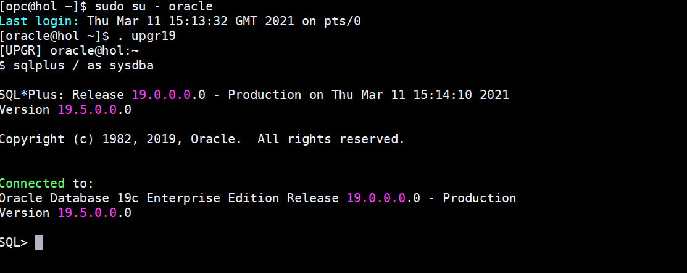
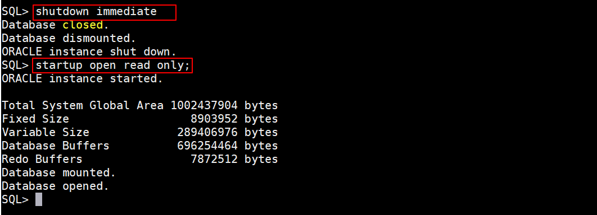
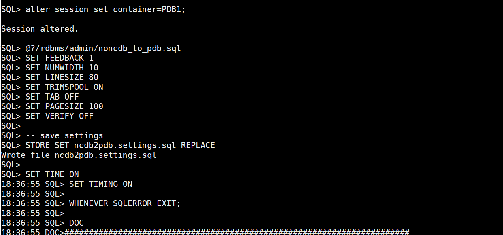

# Plugin UPGR into CDB2

## Introduction

In this Lab, you will plugin UPGR into CDB2.

We could have done this with AutoUpgrade already – you can see this in the OPTIONAL AutoUpgrade exercise (Parameter: `target_cdb`=CDB2). But we rather decided that you should do these steps manually to understand the implications.

CDB2 is a Multitenant Container database. UPGR will be converted into a PDB, and then become a pluggable database.

You will complete the lab step-by-step even though the entire action could be fully automated with AutoUpgrade as well.

*Estimated Lab Time:* 30 minutes

### About Oracle Multitenant
The multitenant architecture enables an Oracle database to function as a multitenant container database (CDB).

Every CDB has the following containers:

 Exactly one CDB root container

- The CDB root is a collection of schemas, schema objects, and nonschema objects to which all PDBs belong .

Zero or more user-created PDBs

- A PDB contains the data and code required for a specific set of features (see "PDBs"). A PDB belongs to exactly zero or one application container. If a PDB belongs to an application container, then it is an application PDB.

Exactly one seed PDB

- The seed PDB is a system-supplied template that the CDB can use to create new PDBs. The seed PDB is named PDB$SEED. You cannot add or modify objects in PDB$SEED.

### Objectives

In this lab, you will:
* Prepare UPGR as non-CDB
* Perform compatibility check
* Plugin Operation

### Prerequisites
This lab assumes you have:
- A Free Tier, Paid or LiveLabs Oracle Cloud account
- SSH Private Key to access the host via SSH (*Free-tier* and *Paid Tenants* only)
- You have completed:
    - Lab: Generate SSH Keys (*Free-tier* and *Paid Tenants* only)
    - Lab: Prepare Setup (*Free-tier* and *Paid Tenants* only)
    - Lab: Environment Setup
		- Lab: Initialize Environment

## Task 1: Preparation of UPGR as non-CDB

1. Switch to the UPGR database in 19c environment.

    ```
    <copy>
    . upgr19
    sqlplus / as sysdba
    </copy>
    ```
    

2. Shutdown UPGR and start it as read only.

    ```
    <copy>
    shutdown immediate
    startup open read only;
    </copy>
    ```
    

3. Create the XML manifest file describing UPGR’s layout and information.

    ```
    <copy>
    exec DBMS_PDB.DESCRIBE('/home/oracle/pdb1.xml');
    </copy>
    ```
    

4. Shutdown UPGR.

    ```
    <copy>
    shutdown immediate
    exit
    </copy>
    ```
    

5. Switch to CDB2.

    ```
    <copy>
    . cdb2
    sqlplus / as sysdba
    </copy>
    ```
    

## Task 2: Compatibility check

1. Ideally you do a compatibility check before you plugin finding out about potential issues. This step is not mandatory but recommended. The check will give you YES or NO only.

    ```
    <copy>
    set serveroutput on

    DECLARE
    compatible CONSTANT VARCHAR2(3) := CASE DBMS_PDB.CHECK_PLUG_COMPATIBILITY( pdb_descr_file => '/home/oracle/pdb1.xml', pdb_name => 'PDB1') WHEN TRUE THEN 'YES' ELSE 'NO'
    END;
    BEGIN
    DBMS_OUTPUT.PUT_LINE('Is the future PDB compatible? ==> ' || compatible);
    END;
    /
    </copy>
    ```
    

2. If the result is “NO” (and it is NO very often), then check for TYPE='ERROR' in PDB\_PLUG\_IN\_VIOLATIONS. In this case, the result should be “YES“.

## Task 3: Plugin Operation

1. Plugin UPGR with its new name PDB1 – from this point there is no UPGR database anymore. In a real world environment, you would have a backup or use a backup/copy to plug in. In our lab the database UPGR will stay in place and become PDB1 as part of CDB2.

    Please use the proposed naming as the FILE\_NAME\_CONVERT parameter and TNS setup have been done already.
    Use the NOCOPY option for this lab to avoid additional copy time and disk space consumption. The show pdbs command will display you all existing PDBs in this CDB2.

    

    ```
    <copy>
    create pluggable database PDB1 using '/home/oracle/pdb1.xml' nocopy tempfile reuse;
    show pdbs;
    </copy>
    ```
    

    If you didn't execute a compatibility check beforehand, you will open the PDB now and recognize that it opens only with errors.

    ```
    <copy>
    alter pluggable database PDB1 open;
    </copy>
    ```
    

    To find the above issue execute:
    ```
    <copy>
    column message format a50
    column status format a9
    column type format a9
    column con_id format 9

    select con_id, type, message, status from PDB_PLUG_IN_VIOLATIONS
    where status<>'RESOLVED' order by time;
    </copy>
    ```
    


2. As you can see, a lot of the reported issues aren’t really issues. This is a known issue. Only in the case you see ERROR in the first column you need to solve it.  The only real ERROR says:

    **PDB plugged in is a non-CDB, requires noncdb\_to\_pdb.sql be run.**

3. Kick off this transformation script to assimilate UPGR and make it a “real” pluggable database PDB1 with noncdb\_to\_pdb.sql. Runtime will vary between 10-20 minutes. Take a break while it is running. The forced recompilation takes quite a bit.

    ```
    <copy>
    alter session set container=PDB1;
    @?/rdbms/admin/noncdb_to_pdb.sql
    </copy>
    ```
    

4. Now SAVE STATE. This ensures, that PDB1 will be opened automatically whenever you restart CDB2. Before you must restart the PDB or else it opens only in RESTRICTED mode.

    ```
    <copy>
    shutdown
    startup
    alter pluggable database PDB1 save state;
    alter session set container=CDB$ROOT;
    show pdbs
    exit
    </copy>
    ```
    

5. Try to connect directly to PDB1 – please notice that you are using the service name. Otherwise you'd connect to the CDB$ROOT instead as PDB1 is not visible on the OS level.

    ```
    <copy>
    sqlplus "sys/oracle@pdb1 as sysdba"
    exit
    </copy>
    ```
    

6. As an alternative you could also use the EZconnect (speak: Easy Connect)

    ```
    <copy>
    sqlplus "sys/oracle@//localhost:1521/pdb1 as sysdba"
    exit
    </copy>
    ```
    


## Appendix 1: Plugin Operation with AutoUpgrade

DON'T USE THIS IF YOU HAVE DONE THE PLUGIN WITH THE ABOVE STEPS ALREADY.

You could have completed the above task with AutoUpgrade as well. Even when the database has been upgraded already, AutoUpgrade automated the entire plugin operation for you. You only need to specify the target\_sid you'd like to plugin and change the source\_home to Oracle 19c. This would be an example config file:

   ```
   <copy>
   global.autoupg_log_dir=/home/oracle/logs

   upg1.source_home=/u01/app/oracle/product/19
   upg1.target_home=/u01/app/oracle/product/19
   upg1.sid=UPGR
   upg1.target_sid=CDB2
   upg1.target_pdb_name=PDB1
   upg1.log_dir=/home/oracle/logs
   </copy>
   ```

   Save the file under /home/oracle/scripts/PLUG.cfg.

   You start AutoUpgrade now, and let it plugin your database as a new PDB.


   ```
   <copy>
   java -jar $OH19/rdbms/admin/autoupgrade.jar -config /home/oracle/scripts/PLUG.cfg -mode deploy
   </copy>
   ```


You may now [proceed to the next lab](#next).

## Learn More

* [Multitenant Architecture](https://docs.oracle.com/en/database/oracle/oracle-database/19/multi/introduction-to-the-multitenant-architecture.html#GUID-267F7D12-D33F-4AC9-AA45-E9CD671B6F22)

## Acknowledgements
* **Author** - Mike Dietrich
* **Contributors** -  Roy Swonger, Sanjay Rupprel, Cristian Speranta, Kay Malcolm
* **Last Updated By/Date** - Mike Dietrich, July 2021
