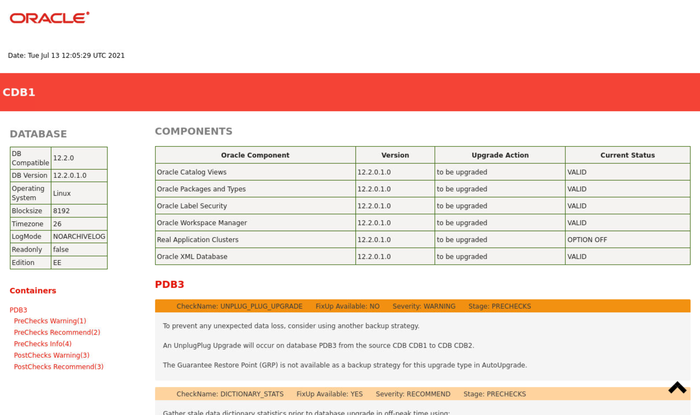
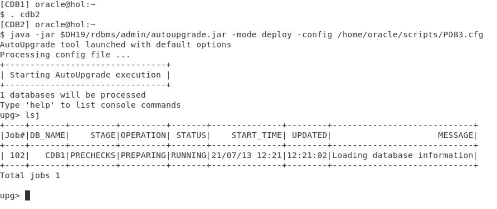
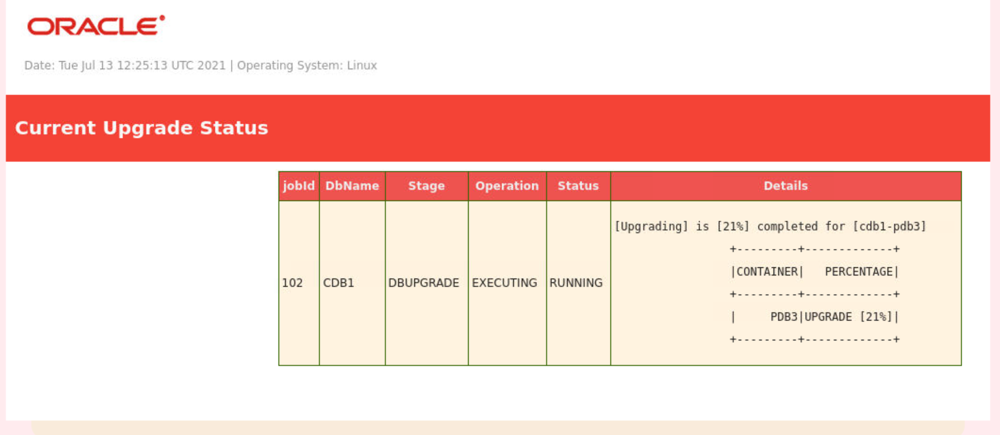

# Unplug - Plug - Upgrade

## Introduction

In this lab, you will now unplug an Oracle 12.2.0.1 pluggable database (PDB) from CDB1 and plug it into 19c’s CDB2, including all the necessary steps.

*Estimated Lab Time*: 20 minutes

### About Unplug Plug Upgrade
You can upgrade PDBs by unplugging a PDB from an earlier release CDB, plugging it into a later release CDB, and then upgrading that PDB to the later release.

Unless a PDB from a lower release plugged into a CDB of a higher release hasn't been upgraded, it will open "restricted" only. As each PDB has its own dictionary, it needs to be upgraded to match the version of the CDB. PDBs always need to match the version of the CDB$ROOT.

The unplug/plug/upgrade can be fully automated with AutoUpgrade.


### Objectives
In this lab, you will:
* Preparation work in CDB1
* Use AutoUpgrade to check the source PDB before unplugging it
* Unplug, plug and upgrade with AutoUpgrade

### Prerequisites
This lab assumes you have:
- A Free Tier, Paid or LiveLabs Oracle Cloud account
- SSH Private Key to access the host via SSH
- You have completed:
    - Lab: Generate SSH Keys (*Free-tier* and *Paid Tenants* only)
    - Lab: Prepare Setup (*Free-tier* and *Paid Tenants* only)
    - Lab: Environment Setup
		- Lab: Initialize Environment

## **STEP 1**: Preparation work in CDB1

1. The PDB3 we will utilize in this part of the lab has already been created in CDB1 – but you will need to startup CDB1. PDB3 will start automatically within seconds.

    ````
    <copy>
    . cdb1
    sqlplus / as sysdba
    </copy>
    ````

    ````
    <copy>
    startup
    show pdbs
    exit
    </copy>
    ````


## **STEP 2**: Analyze the source PDB with AutoUpgrade

1. A config file has been provided already. Please note that you will use the COPY option this time. The source PDB3 will remain in CDB1 but exist upgraded in CDB2 afterwards.

    ````
    <copy>
    cat /home/oracle/scripts/PDB3.cfg
    </copy>
    ````
    

    ````
    global.autoupg_log_dir=/home/oracle/logs

    upg1.source_home=/u01/app/oracle/product/12.2.0.1
    upg1.target_home=/u01/app/oracle/product/19
    upg1.sid=CDB1
    upg1.pdbs=PDB3
    upg1.target_cdb=CDB2
    upg1.log_dir=/home/oracle/logs
    upg1.target_pdb_copy_option=file_name_convert=('CDB1', 'CDB2')
    ````

2. Invoke AutoUpgrade to analyze PDB3 in Oracle 12.2.0.1

    ````
    <copy>
    java -jar $OH19/rdbms/admin/autoupgrade.jar -mode analyze -config /home/oracle/scripts/PDB3.cfg
    </copy>
    ````
    

    If you get the following error:

    ````
    $ java -jar $OH19/rdbms/admin/autoupgrade.jar -mode analyze -config /home/oracle/scripts/PDB3.cfg

    Previous execution found loading latest data
    Total jobs recovered: 1

    The content of the user config file /home/oracle/scripts/PDB3.cfg was altered after a deploy which may lead to corruption or invalid settings, the AutoUpgrade will stop for safety, make sure to restore the original content of the file prior running the tool again or if you wish to start from the beginning then remove or change the autoupg_log_dir directory
    ````

    then please execute the following steps to clear the log history of AutoUpgrade:

    ````
    <copy>
    java -jar $OH19/rdbms/admin/autoupgrade.jar -config /home/oracle/scripts/PDB3.cfg -clear_recovery_data
    rm -rf /home/oracle/logs

    </copy>
    ````

    Now run AutoUpgrade with the above "analyze" command again. It should work now.


3. Check the output of the analyze run with Mozilla Firefox


    ````
    <copy>
    firefox /home/oracle/logs/cfgtoollogs/upgrade/auto/status/status.html &
    </copy>
    ````
    
    

    There shouldn't be any issue to be fixed by yourself in PDB3. AutoUpgrade will take care on everything for you.


## **STEP 3**: Unplug/Plugin/Upgrade with AutoUpgrade

1. Now you can start AutoUpgade in deploy mode and let the tool unplug and plug and upgrade PDB3 within CDB2


    ````
    <copy>
    . cdb2
    java -jar $OH19/rdbms/admin/autoupgrade.jar -mode deploy -config /home/oracle/scripts/PDB3.cfg
    </copy>
    ````
    


2. Open another xterm and monitor the progress in Mozilla Firefox. The page will refresh automatically every other minute. The entire process will take approximately 15-20 minutes until completion including the PDB3 upgrade.

    ````
    <copy>
    firefox /home/oracle/logs/cfgtoollogs/upgrade/auto/state.html &
    </copy>
    ````
    
    

3. Finally open a SQL*Plus session and control whether all PDBs are open read/write. Use the xterm where the upgrade has been run from or open a new xterm.

    ````
    <copy>
    . cdb2
    sqlplus / as sysdba
    show pdbs
    </copy>
    ````
    


    This should be the result now:
    ````
      SQL> show pdbs

          CON_ID CON_NAME			  OPEN MODE  RESTRICTED
      ---------- ------------------------------ ---------- ----------
      	 2 PDB$SEED			  READ ONLY  NO
      	 3 PDB1 			  READ WRITE NO
      	 4 PDB2 			  READ WRITE NO
      	 5 PDB3 			  READ WRITE NO
    ````

Congratulations! You completed all stages of this Upgrade to Oracle Database 19c lab successfully!

## Learn More

* [Unplugging, Plugging and Upgrading a PDB to a new CDB](https://mikedietrichde.com/2021/06/07/unplug-plug-upgrade-with-autoupgrade/)
* [Upgrading Multitenant Using Unplug-Plug](https://docs.oracle.com/en/database/oracle/oracle-database/19/spupu/upgrade-multitenant-architecture-sequentially.html#GUID-8F9AAFA1-690D-4F70-8448-E66D765AF136)

## Acknowledgements
* **Author** - Mike Dietrich, Database Product Management
* **Contributors** -  Roy Swonger, Sanjay Rupprel, Cristian Speranta, Kay Malcolm
* **Last Updated By/Date** - Mike Dietrich, July 2021
