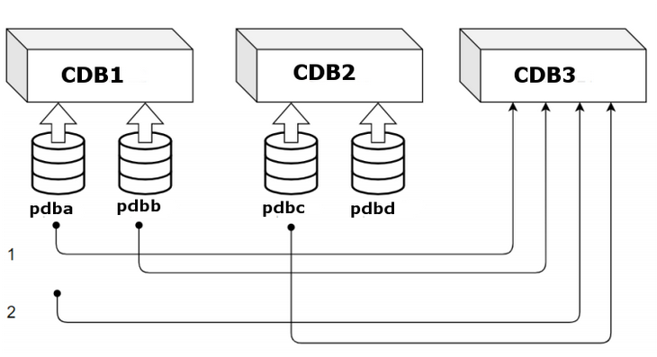

# Unplug - Plug - Upgrade

## Introduction

In this lab you will now unplug an Oracle 12.2.0.1 pluggable database (PDB) from CDB1 and plug it into 19c’s CDB2, including all the necessary steps.

Estimated Lab Time: n minutes

### About Unplug Plug Upgrade
You can upgrade PDBs by unplugging a PDB from an earlier release CDB, plugging it into a later release CDB, and then upgrading that PDB to the later release.

CDBs can contain zero, one, or more pluggable databases (PDBs). After you install a new Oracle Database release, or after you upgrade the CDB (CDB$ROOT), you can upgrade one or more PDB without upgrading all of the PDBs on the CDB.

1. Unplug PDBs from one source Oracle Database 12.2 CDB (CDB1, with pdba and pdbb) and plug them into a new release target CDB (CDB3).
2. Unplug PDBs from multiple source CDBs (Oracle Database 12.2 on CDB1, pdba and pdbb), and Oracle Database 18c, CDB2, pdbc and pdbd), and plug them into a new release target CDB (CDB3).

### Objectives
In this lab, you will:
* Preparation work in CDB1
* Preupgrade.jar and Unplug
* Plugin
* Upgrade

### Prerequisites
* An Oracle Free Tier, Paid or LiveLabs Cloud Account

## **STEP 1**: Preparation work in CDB1

The PDB3 we will use in this part of the lab is created already in CDB1 – but you need to startup CDB1 and PDB3.

. cdb1
sqlplus / as sysdba

startup
alter pluggable database pdb3 open;
show pdbs
exit

## **STEP 2**: Preupgrade.jar and Unplug

Run the preupgrade.jar but only on container PDB3

java -jar $OH19/rdbms/admin/preupgrade.jar -c 'pdb3' TERMINAL TEXT

This will execute preupgrade.jar only in container “PDB3”.

Follow the advice of preupgrade.jar‘s output. You can leave all underscore parameters in

Be aware: If you’d remove  for instance the _fix_control, you’d remove this setting for the entire CDB. This would affect other PDBs as well which may still remain in the 12.2.0.1 environment. That’s why we will leave all underscores as is.

Open a second terminal window (or a new tab in your existing one) and logon at first to CDB$ROOT. Then change to PDB3 to complete the steps recommended by preupgrade.jar.

. cdb1
sqlplus / as sysdba

alter session set container=PDB3;
@/u01/app/oracle/cfgtoollogs/CDB1/preupgrade/preupgrade_fixups.sql
alter session set container=CDB$ROOT;
alter pluggable database PDB3 close;
alter pluggable database PDB3 unplug into '/home/oracle/pdb3.pdb';
drop pluggable database PDB3 including datafiles;

Unplugging into a *.pdp does create a zip archive including all necessary files. It will take 30 seconds or more.

shutdown immediate
exit

## **STEP 3**: Plugin

In this step you’ll plugin PDB3 into CDB2.

. cdb2
sqlplus / as sysdba

At first, you’ll do a compatibility check and find out, why the action is classified as “not compatible”:

SET SERVEROUTPUT ON
DECLARE
compatible CONSTANT VARCHAR2(3) := CASE DBMS_PDB.CHECK_PLUG_COMPATIBILITY(
pdb_descr_file => '/home/oracle/pdb3.pdb',
pdb_name => 'PDB3')
WHEN TRUE THEN 'YES' ELSE 'NO'
END;
BEGIN
DBMS_OUTPUT.PUT_LINE(compatible);
END;
/

If the result is “NO“, check PDB_PLUG_IN_VIOLATIONS for the reason:

select message from pdb_plug_in_violations where type like '%ERR%' and status <> 'RESOLVED';

You receive two messages:

SQL> select message from pdb_plug_in_violations where type like '%ERR%' and status <> 'RESOLVED';

MESSAGE
--------------------------------------------------------------------------------
PDB's version does not match CDB's version: PDB's version 12.2.0.1.0. CDB's vers
ion 19.0.0.0.0.

DBRU bundle patch 200114 (DATABASE JAN 2020 RELEASE UPDATE 12.2.0.1.200114): Not
 installed in the CDB but installed in the PDB

'19.6.0.0.0 Release_Update 1912171550' is installed in the CDB but no release up
dates are installed in the PDB

The first one is correct and makes sense. The second and third one can be ignored as it doesn’t matter if PDB3 has a different patch level in 12.2.0.1 – you will upgrade it to 19c anyway. You may read a bit more about PDB_PLUG_IN_VIOLATIONS here.

Plugin the PDB3, the open it in UPGRADE mode:

create pluggable database pdb3 using '/home/oracle/pdb3.pdb' file_name_convert=('/home/oracle', '/u02/oradata/CDB2/pdb3');
alter pluggable database PDB3 open upgrade;
exit

## **STEP 4**: Upgrade PDB3

As final action, as a PDB has its own data dictionary, you need to upgrade PDB3 now.

. cdb2
dbupgrade -c 'PDB3' -l /home/oracle/logs -n 2

Once the upgrade has been completed, you need to recompile and run the postupgrade_fixups.sql as usual:

. cdb2
sqlplus / as sysdba

alter session set container=PDB3;
startup
@?/rdbms/admin/utlrp.sql
@/u01/app/oracle/cfgtoollogs/CDB1/preupgrade/postupgrade_fixups.sql
alter session set container=CDB$ROOT;
show pdbs
exit

Done.

If you’d like, you can now try some fallback exercises. For this part of the lab you should restore the initial snapshot again.

Mark the initial snapshot in the VirtualBox Manager with the mouse <click>:

Then <click> on the Restore icon.

You may now [proceed to the next lab](#next).

## Learn More

* [Unplugging, Plugging and Upgrading a PDB to a new CDB](https://www.google.com/url?sa=t&rct=j&q=&esrc=s&source=web&cd=&ved=2ahUKEwiJsZX9yfPuAhWAGFkFHeisAIYQFjAAegQIARAD&url=https%3A%2F%2Fdocs.oracle.com%2Fen%2Fdatabase%2Foracle%2Foracle-database%2F19%2Fspupu%2Funplugging-plugging-and-upgrading-pdb-new-cdb.pdf&usg=AOvVaw1LWOFvD1Ma7o5gdt7k0kbw)
* [Upgrading Multitenant Using Unplug-Plug](https://docs.oracle.com/en/database/oracle/oracle-database/19/spupu/upgrade-multitenant-architecture-sequentially.html#GUID-8F9AAFA1-690D-4F70-8448-E66D765AF136)

## Acknowledgements
* **Author** - Mike Dietrich, Database Product Management
* **Contributors** -  Roy Swonger, Sanjay Rupprel, Cristian Speranta
* **Last Updated By/Date** - Kay Malcolm, February 2021

## Need Help?
Please submit feedback or ask for help using our [LiveLabs Support Forum](https://community.oracle.com/tech/developers/categories/livelabsdiscussions). Please click the **Log In** button and login using your Oracle Account. Click the **Ask A Question** button to the left to start a *New Discussion* or *Ask a Question*.  Please include your workshop name and lab name.  You can also include screenshots and attach files.  Engage directly with the author of the workshop.

If you do not have an Oracle Account, click [here](https://profile.oracle.com/myprofile/account/create-account.jspx) to create one.
