## Introduction


Managed database services run the risk of 'Admin snooping', allowing privileged users access to customer data. Oracle Exadata Cloud Service provides powerful security controls within your database, restricting access to application data by privileged database users, reducing the risk of insider and outsider threats and addressing common compliance requirements.

You can deploy controls to block privileged account access to application data and control sensitive operations inside the database. Trusted paths can be used to add additional security controls to authorized data access and database changes. Through the runtime analysis of privileges and roles, you can increase the security of existing applications by implementing least privileges and reducing the attack profile of your database accounts. IP addresses, usernames, client program names and other factors can be used as part of Oracle Database Vault security controls to increase security.  Oracle Database Vault secures existing database environments transparently, eliminating costly and time consuming application changes.

**For more information, refer to the [Database Vault Administrator’s Guide](https://docs.oracle.com/en/database/oracle/oracle-database/19/dvadm/introduction-to-oracle-database-vault.html).

### Need Help?
Please submit feedback or ask for help using our [LiveLabs Support Forum](https://community.oracle.com/tech/developers/categories/livelabsdiscussions). Please click the **Log In** button and login using your Oracle Account. Click the **Ask A Question** button to the left to start a *New Discussion* or *Ask a Question*.  Please include your workshop name and lab name.  You can also include screenshots and attach files.  Engage directly with the author of the workshop.

If you do not have an Oracle Account, click [here](https://profile.oracle.com/myprofile/account/create-account.jspx) to create one.

Watch the video below for an overview on how to protect your data with Database Vault

<div style="max-width:768px"><div style="position:relative;padding-bottom:56.25%"><iframe id="kaltura_player" src="https://cdnapisec.kaltura.com/p/2171811/sp/217181100/embedIframeJs/uiconf_id/35965902/partner_id/2171811?iframeembed=true&playerId=kaltura_player&entry_id=1_fz3bekuh&flashvars[streamerType]=auto&amp;flashvars[localizationCode]=en&amp;flashvars[leadWithHTML5]=true&amp;flashvars[sideBarContainer.plugin]=true&amp;flashvars[sideBarContainer.position]=left&amp;flashvars[sideBarContainer.clickToClose]=true&amp;flashvars[chapters.plugin]=true&amp;flashvars[chapters.layout]=vertical&amp;flashvars[chapters.thumbnailRotator]=false&amp;flashvars[streamSelector.plugin]=true&amp;flashvars[EmbedPlayer.SpinnerTarget]=videoHolder&amp;flashvars[dualScreen.plugin]=true&amp;flashvars[hotspots.plugin]=1&amp;flashvars[Kaltura.addCrossoriginToIframe]=true&amp;&wid=1_0wy8lj93" width="768" height="432" allowfullscreen webkitallowfullscreen mozAllowFullScreen allow="autoplay *; fullscreen *; encrypted-media *" sandbox="allow-forms allow-same-origin allow-scripts allow-top-navigation allow-pointer-lock allow-popups allow-modals allow-orientation-lock allow-popups-to-escape-sandbox allow-presentation allow-top-navigation-by-user-activation" frameborder="0" title="Kaltura Player" style="position:absolute;top:0;left:0;width:100%;height:100%"></iframe></div></div>

## Objectives

As a database security admin,

- Configure and enable Database Vault for your Exadata Cloud Service database instance
- Create a realm to restrict schema access
- Add audit policy to audit Database Vault activities


## Required Artifacts

- An Oracle Cloud Infrastructure account

- A pre-provisioned instance of Oracle Developer Client image in an application subnet. Refer to [Lab 4](?lab=lab-4-configure-development-system-for-use)

- A pre-provisioned ExaCS instance. Refer to [Lab 1](?lab=lab-1-preparing-private-data-center-o)

## Steps

### **Task 1: Set up Application Schema and Users**

Oracle Database vault comes pre-installed with your ExaCS database on dedicated infrastructure. In this lab we will enable Database Vault (DV), add required user accounts and create a DV realm to secure a set of user tables from privileged user access. 

Our implementation scenario looks as follows,


The HR schema contains multiple tables. The employees table contains sensitive information such as employee names, SSN, pay-scales etc. and needs to be protected from privileged users such as the schema owner (user HR) and sys (DBA).

The table should however be available to the application user (appuser). Note that while the entire HR schema can be added to DV, here we demonstrate more fine grained control by simply adding a single table to the vault.

Before we log into the database, let us make some changes to `tnsnames.ora` file so we are always connected to the database on a specific node.


**Let's start by creating the HR schema and the appuser accounts**

- Open Terminal and ssh into your bastion node (developer client created in lab 4).
	```
	<copy>ssh -i /path/to/private/key opc@public-ip-of-bastion-node</copy>
	```
	
- Now, ssh into your database node from bastion instance.
	```
	<copy>ssh -i /path/to/private/key opc@private-ip-of-db-node</copy>
	```
- Change to `oracle` user.
	```
	<copy>sudo su - oracle</copy>
	```
- List all the files.
  ```
  <copy>ls</copy>
  ```
  You should see `your-database-name.env` file after executing `ls`.
- Configure all the required environment variables into the current session.
  ```
  <copy>source your-database-name.env</copy>
  ```
- Go to `$ORACLE_HOME/network/admin/your-database-name`.
	```
  	<copy>cd $ORACLE_HOME/network/admin/your-database-name</copy>
  	```
- Open and edit `tnsnames.ora` file.
	```
	<copy>vi tnsnames.ora</copy>
	```
- Press `i` and replace `HOST` with private ip address of one of your database nodes.
 	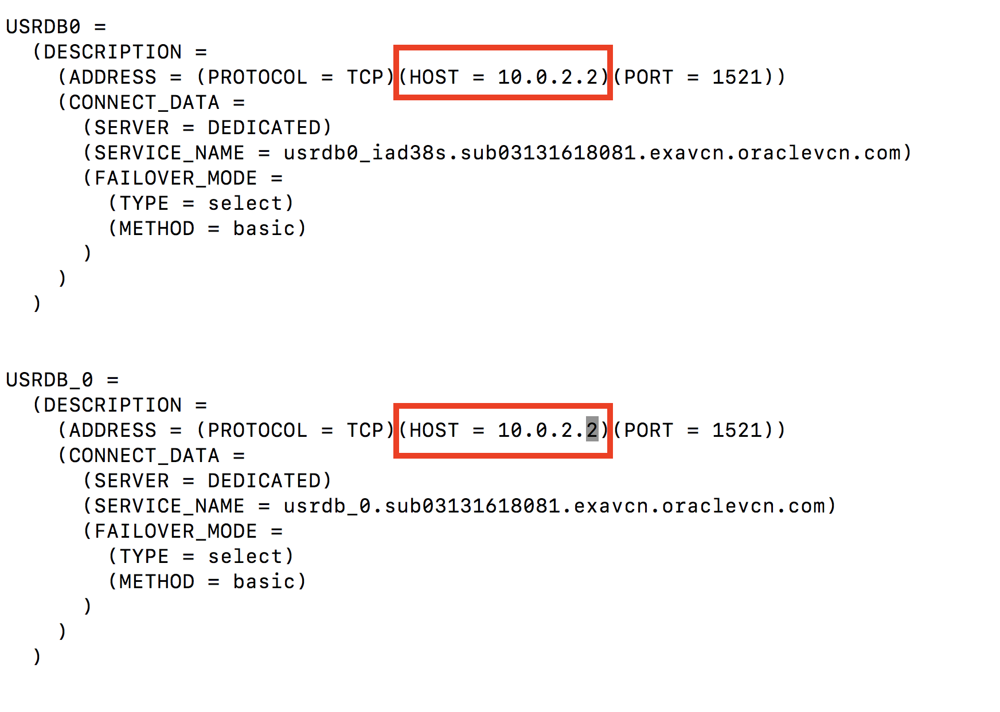
- To find the pdb name of your database, login as `SYS` and list all pdbs.
  ```
  <copy>sqlplus / as sysdba</copy>
  ```
  ```
  <copy>show pdbs;</copy>
  ```
  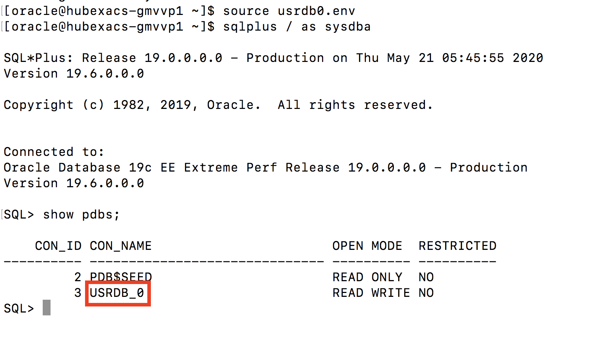
  
- Under `CON_NAME` you will see your `PDB$SEED` and `your-pdb-name` listed as shown in the figure above (in this example, my pdb name is `USRDB_0`). Save this pdb name to be used in later parts of the lab.

- Change to your pdb at SQL prompt.
  ```
  <copy>alter session set container=your-pdb-name;</copy>
  ```
  
  

- Now, create the schema `hr` and table `employees`:

  ```
  <copy>create user hr identified by WElcome_123#;</copy>
  ```
  ```
  <copy>grant create session, create table to hr;</copy>
  ```
  ```
  <copy>grant unlimited tablespace to hr;</copy>
  ```
  ```
  <copy>create table hr.employees (id number, name varchar2 (20), salary number);</copy>
  ```
  ```
  <copy>insert into hr.employees values (10,'Larry',20000);</copy>
  ```
  ```
  <copy>commit;</copy>
  ```
  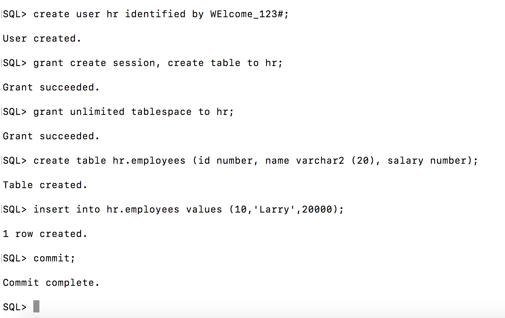

- Next, create the application user `appuser`.

  ```
  <copy>create user appuser identified by WElcome_123#;</copy>
  ```
  ```
  <copy>grant create session, read any table to appuser;</copy>
  ```
  ```
  <copy>exit;</copy>
  ```
  

### **Task 2: Configure and enable Database Vault**

We start with creating the two DV user accounts - DV Owner and DV Account Manager. The dv_owner account is mandatory as an owner of DV objects. DV account manager is an optional but recommended role. Once DV is enabled, the user 'SYS' loses its ability to create/drop DB user accounts and that privilege is then with the DV Account Manager role. While DV Owner can also become DV account manager, it is recommended to maintain separation of duties via two different accounts.

In this step, we will need to configure and enable database vault in both CDB and PDB of the database.

#### **Task $1: 2.1: Create Common User Accounts**
- Login to the CDB as `SYS` with sysdba privileges.
  ```
  <copy>sqlplus / as sysdba;</copy>
  ```
- Create the common user accounts `c##dv_owner1` and `c##dv_acctmgr1` and assign `dv_owner` and `dv_acctmgr` roles respectively.
  ```
  <copy>create user c##dv_owner1 identified by WElcome_123#;</copy>
  ```
  ```
  <copy>grant dv_owner, create session, set container, audit_admin to c##dv_owner1 container=all;</copy>
  ```
  ```
  <copy>create user c##dv_acctmgr1 identified by WElcome_123#;</copy>
  ```
  ```
  <copy>grant dv_acctmgr, create session, set container to c##dv_acctmgr1 container=all;</copy>
  ```
  ```
  <copy>commit;</copy>
  ```
  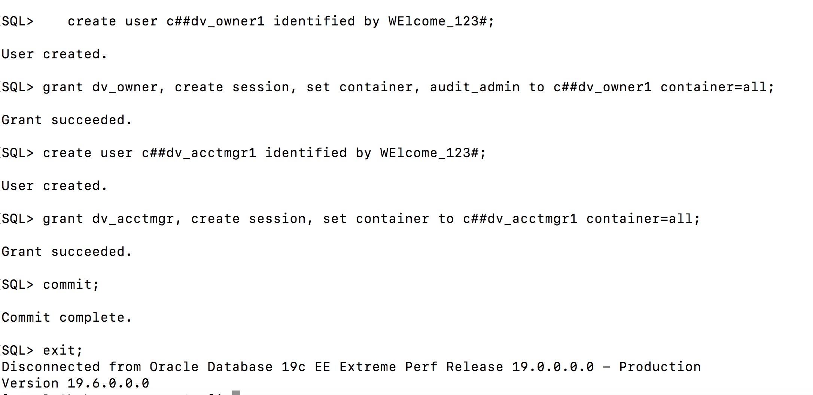
  
#### **Task $1: 2.2: Configure Database Vault in CDB**
- Check the configure status of the database vault.
	```
	<copy>select * from dba_dv_status;</copy>
	```
	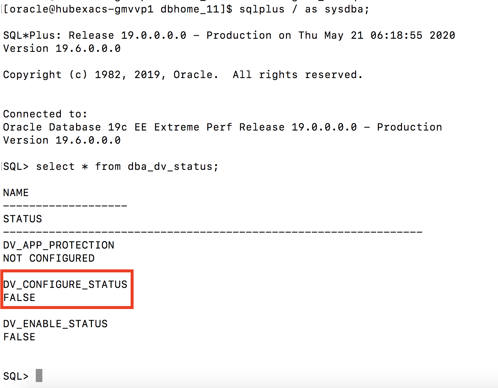
	
	```
	<copy>select a.name pdb_name, a.open_mode, b.name, b.status from v$pdbs a, cdb_dv_status b where a.con_id = b.con_id order by 1,2;</copy>
	```
	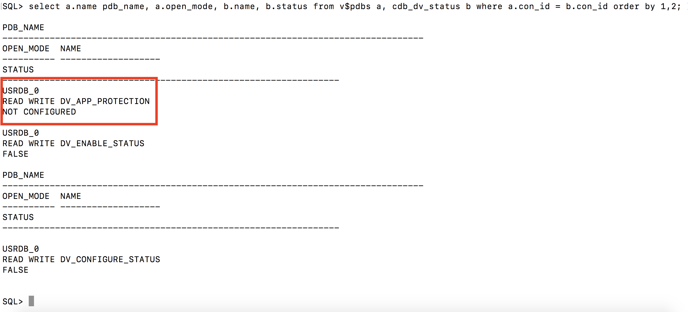
- Exit from the SQL prompt.
	```
	<copy>exit;</copy>
	```
- Change to `ORACLE_HOME`.
  ```
  <copy>cd $ORACLE_HOME</copy>
  ```
- Create a sql file `configure_dv.sql`.
  ```
  <copy>vi configure_dv.sql</copy>
  ```
- Press `i` on your keyboard to change to insert mode and copy and paste the following into the vi editor. Press `Esc` and `:wq!` to save and quit.
  
  ```
      <copy>
      BEGIN
        DVSYS.CONFIGURE_DV (
          dvowner_uname         => 'c##dv_owner1',
          dvacctmgr_uname       => 'c##dv_acctmgr1');
      END;
      /
      </copy>
  ```

- Connect to your CDB as `SYS`.
  ```
  <copy>sqlplus / as sysdba;</copy>
  ```
- Execute the `configure_dv.sql` script you just created.
  ```
  <copy>@?/configure_dv.sql</copy>
  ```
  

- Run the `utlrp.sql` script to recompile invalidated objects.
  ```
  <copy>@?/rdbms/admin/utlrp.sql</copy>
  ```
  
  
#### **Task $1: 2.3: Enable Database Vault in CDB**
- Now, connect as `c##dv_owner1` and check if the database vault is enabled with the following statement. It should return `False`.
  ```
  <copy>conn c##dv_owner1/WElcome_123#;</copy>
  ```
  ```
  <copy>SELECT VALUE FROM V$OPTION WHERE PARAMETER = 'Oracle Database Vault';</copy>
  ```
  


- Enable the database vault. Then, connect as `SYS` and restart the CDB.

  ```
  <copy>exec dbms_macadm.enable_dv;</copy>
  ```
  ```
  <copy>conn sys as sysdba;</copy>
  ```
  ```
  <copy>shutdown immediate;</copy>
  ```
  ```
  <copy>startup;</copy>
  ```

  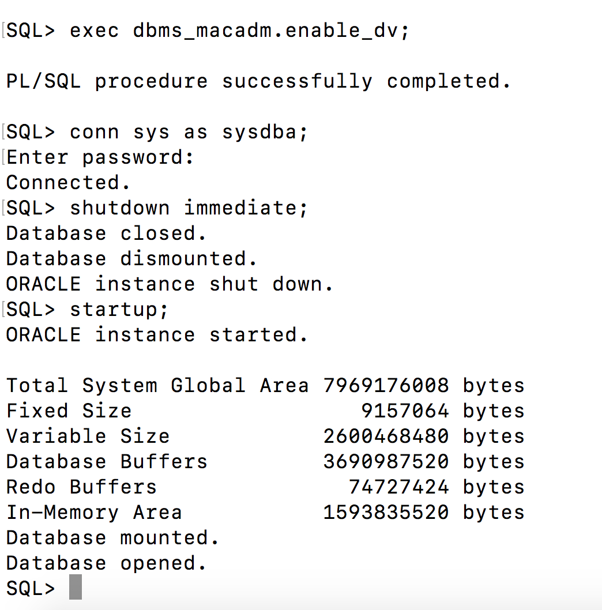

- Now, check if the database vault is enabled in CDB.
  ```
  <copy>SELECT VALUE FROM V$OPTION WHERE PARAMETER = 'Oracle Database Vault';</copy>
  ```
  ```
  <copy>SELECT VALUE FROM V$OPTION WHERE PARAMETER = 'Oracle Label Security';</copy>
  ```
  ```
  <copy>SELECT * FROM DVSYS.DBA_DV_STATUS;</copy>
  ```
  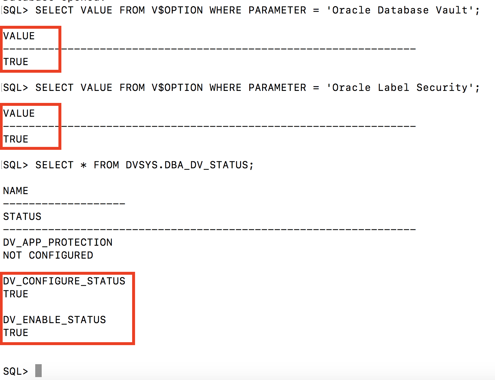

#### **Task $1: 2.4: Configure Database Vault in PDB**
- Now, we need to configure the database vault in the pdb. Change to your pdb.
	```
	<copy> alter session set container=your-pdb-name;</copy>
	```
	 

- Grant necessary privileges to the common user accounts.
  ```
  <copy>GRANT CREATE SESSION, SET CONTAINER TO c##dv_owner1 CONTAINER = CURRENT;</copy>
  ```
  ```
  <copy>GRANT CREATE SESSION, SET CONTAINER TO c##dv_acctmgr1 CONTAINER = CURRENT;</copy>
  ```
  ```
  <copy>grant select any dictionary to c##dv_owner1;</copy>
  ```
  ```
  <copy>grant select any dictionary to C##DV_ACCTMGR1;</copy>
  ```

  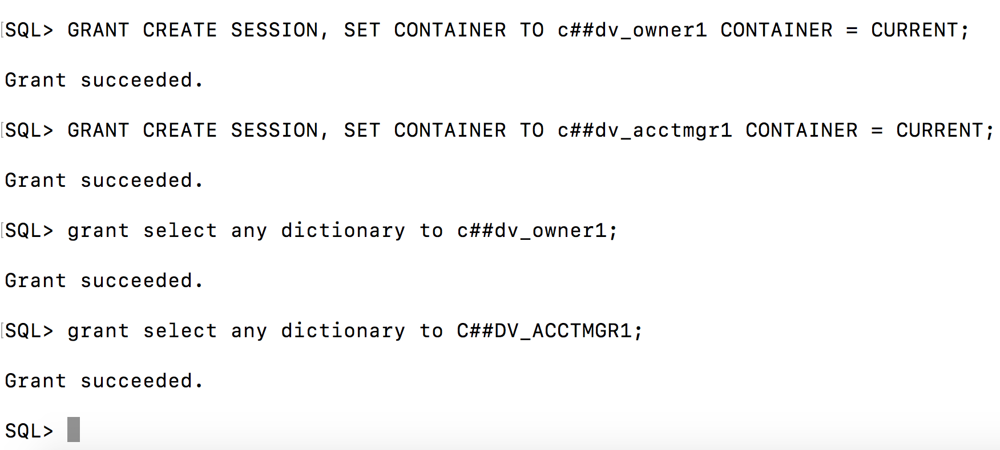

- Configure database vault in the pdb.

  ```
  <copy>@?/configure_dv.sql</copy>
  ```
   

- Run the `utlrp.sql` script to recompile invalidated objects.
  ```
  <copy>@?/rdbms/admin/utlrp.sql</copy>
  ```
  

#### **Task $1: 2.5: Enable Database Vault in PDB**

- Now, connect as `c##dv_owner1` and check if the database vault is enabled with the following statement. It should return `False`.
  ```
  <copy>conn c##dv_owner1/WElcome_123#@your-pdb-name;</copy>
  ```
  ```
  <copy>SELECT VALUE FROM V$OPTION WHERE PARAMETER = 'Oracle Database Vault';</copy>
  ```
  ```
  <copy>exit</copy>
  ```

  
  
- Now, connect as `c##dv_owner1` to your pdb and enable the database vault.
  ```
  <copy>exec dbms_macadm.enable_dv;</copy>
  ```
  ```
  <copy>exit;</copy>
  ```
  

- Now, log in as `SYS` and restart the pdb.
  ```
  <copy>sqlplus / as sysdba;</copy>
  ```
  ```
  <copy>alter pluggable database your-pdb-name close immediate;</copy>
  ```
  ```
  <copy>alter pluggable database your-pdb-name open;</copy>
  ```
  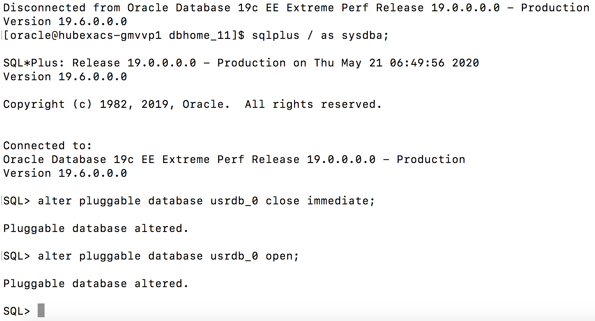

- Verify if database vault is successfully enabled.
  ```
  <copy>conn c##dv_owner1/WElcome_123#@your-pdb-name;</copy>
  ```
  ```
  <copy>SELECT VALUE FROM V$OPTION WHERE PARAMETER = 'Oracle Database Vault';</copy>
  ```
  ```
  <copy>SELECT VALUE FROM V$OPTION WHERE PARAMETER = 'Oracle Label Security';</copy>
  ```
  ```
  <copy>SELECT * FROM DVSYS.DBA_DV_STATUS;</copy>
  ```
  ```
  <copy>exit;</copy>
  ```
  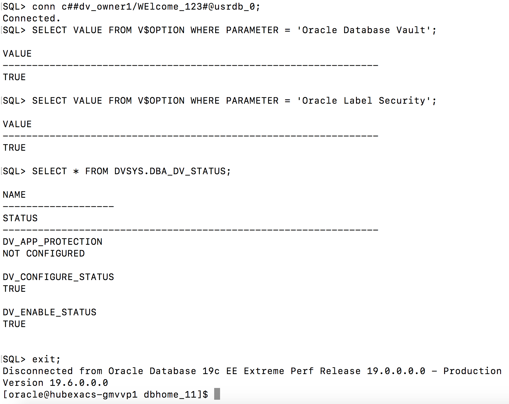

- Now that the database vault is successfully configured and enabled in both CDB and PDB, let us go ahead and create security realms and policies.


### **Task 3: Create Security Realms and Add Schema Objects**

Next we create a 'Realm', add objects to it and define access rules for the realm.

Let's create a realm to secure `HR.EMPLOYEES` table from `SYS` and `HR` (table owner) and grant access to `APPUSER` only.

- Change to `$ORACLE_HOME` and create a new file called `create_realm.sql`.
  ```
  <copy>cd $ORACLE_HOME</copy>
  ```
  ```
  <copy>vi create_realm.sql</copy>
  ```

- Press `i` and copy and paste the following into the vi editor. Press `Esc` and `:wq!` to save and quit.
  
  ```
    <copy>BEGIN
    DBMS_MACADM.CREATE_REALM(
      realm_name    => 'HR App', 
      description   => 'Realm to protect HR tables', 
      enabled       => 'y', 
      audit_options => DBMS_MACUTL.G_REALM_AUDIT_OFF,
      realm_type    => 1);
    END; 
    /
    BEGIN
    DBMS_MACADM.ADD_OBJECT_TO_REALM(
      realm_name   => 'HR App', 
      object_owner => 'HR', 
      object_name  => 'EMPLOYEES', 
      object_type  => 'TABLE'); 
    END;
    /
    BEGIN
    DBMS_MACADM.ADD_AUTH_TO_REALM(
      realm_name   => 'HR App', 
      grantee      => 'APPUSER');
    END;
    /</copy>
  ```
- Connect to the PDB of your database, connect as `c##dv_owner1` and execute the script.
  ```
  <copy>sqlplus sys@your-pdb-name as sysdba;</copy>
  ```
  ```
  <copy>conn c##dv_owner1/WElcome_123#@your-pdb-name;</copy>
  ```
  ```
  <copy>@?/create_realm.sql</copy>
  ```

  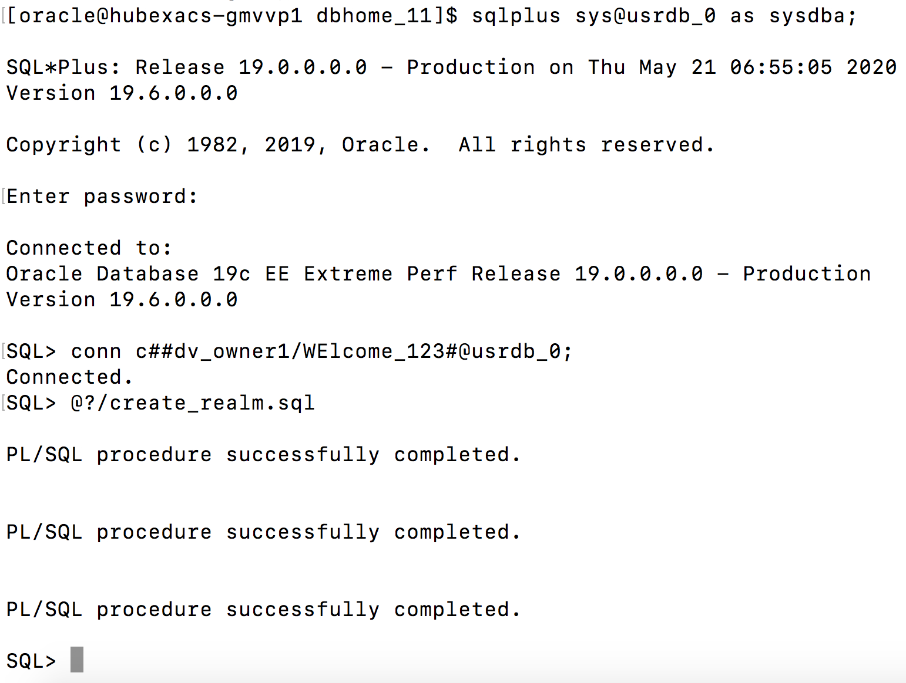


### **Task 4: Create Audit Policy to Capture Realm Violations**

You may also want to capture an audit trail of unauthorized access attempts to your realm objects. Since the Exadata Cloud Service includes Unified Auditing, we will create a policy to audit database vault activities. For more information on Unified Auditing, refer to the [Database Security Guide](https://docs.oracle.com/en/database/oracle/oracle-database/19/dbseg/introduction-to-auditing.html)

- Create an audit policy to capture realm violations.

  ```
  <copy>create audit policy dv_realm_hr actions select, update, delete actions component=DV Realm Violation ON "HR App";</copy>
  ```
  ```
  <copy>audit policy dv_realm_hr;</copy>
  ```
  ```
  <copy>exit;</copy>
  ```

  


- Finally, let's test how this all works. To test the realm, try to access the EMPLOYEES table as HR, SYS and then APPUSER, you can test with a combination of SELECT and DML statements.
- Connect as `SYS` to your pdb and test the access. You should see an error with insufficient privileges.
  ```
  <copy>sqlplus sys@your-pdb-name as sysdba;</copy>
  ```
  ```
  <copy>select * from hr.employees;</copy>
  ```

- Connect as `HR` and test the access. You should see an error with insufficient privileges.
  ```
  <copy>conn hr/WElcome_123#@<your-pdb-name>;</copy>
  ```
  ```
  <copy>select * from hr.employees;</copy>
  ```

- Connect as `APPUSER` and test the access. This should be successful and you should see the data.
  ```
  <copy>conn appuser/WElcome_123#@<your-pdb-name>;</copy>
  ```
  ```
  <copy>select * from hr.employees;</copy>
  ```
  ```
  <copy>exit;</copy>
  ```

  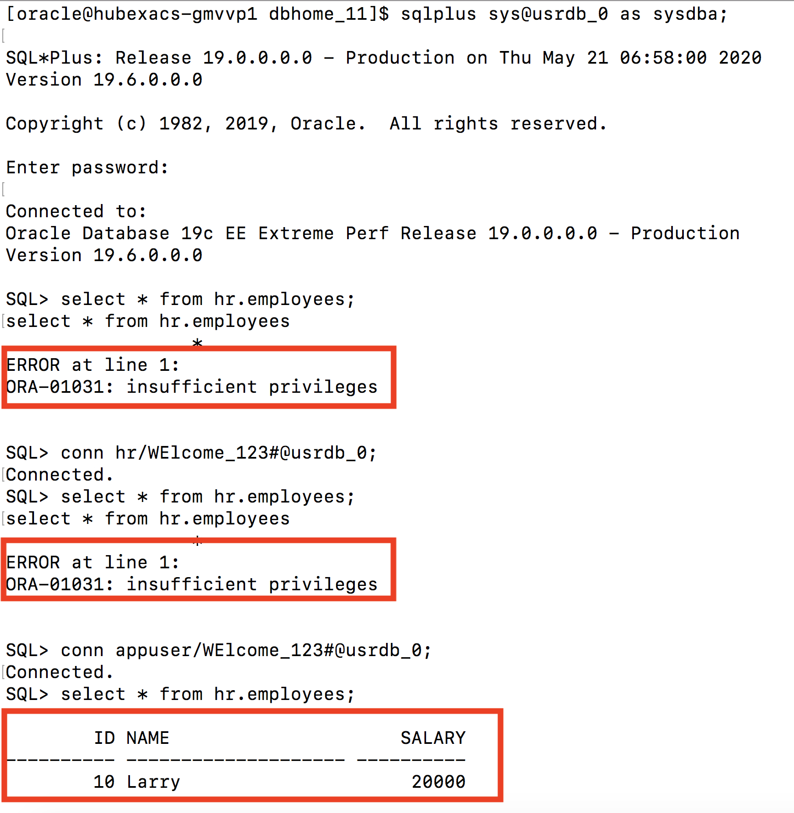


**Note: The default `SYS` account in the database has access to all objects in the database, but realm objects are now protected from `SYS` access. In fact, even the table owner `HR` does not have access to this table. Only `APPUSER` has access.**

### **Task 5: Review Realm Violation Audit Trail**

We can query the audit trail to generate a basic report of realm access violations. 

- Connect as Audit Administrator, in this lab this is the Database Vault owner, and execute the following:

	```
	<copy>sqlplus c##dv_owner1/WElcome_123#@<your-pdb-name>;</copy>
	```
	```
	<copy>set head off</copy>
	```
	```
	<copy>select os_username, dbusername, event_timestamp, action_name, sql_text from UNIFIED_AUDIT_TRAIL where DV_ACTION_NAME='Realm Violation Audit';</copy>
	```

  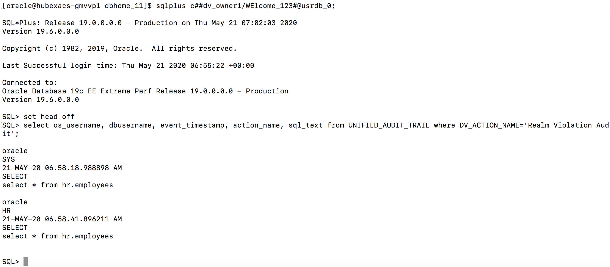

  You can see the access attempts from `HR` and `SYS`.

That is it! You have successfully enabled and used database vault in your Exadata cloud database.

If you'd like to reset your database to its original state, follow the steps below -

To remove the components created for this lab and reset the database back to the original configuration. 
As Database Vault owner, execute:
	
	```
	<copy>noaudit policy dv_realm_hr;</copy>
	```
	```
	<copy>drop audit policy dv_realm_hr;</copy>
	```
	```
	<copy>EXEC DBMS_MACADM.DELETE_REALM('HR App');</copy>
	```
	```
	<copy>EXEC DBMS_MACADM.DISABLE_DV;</copy>
	```
	```
	<copy>exit;</copy>
	```
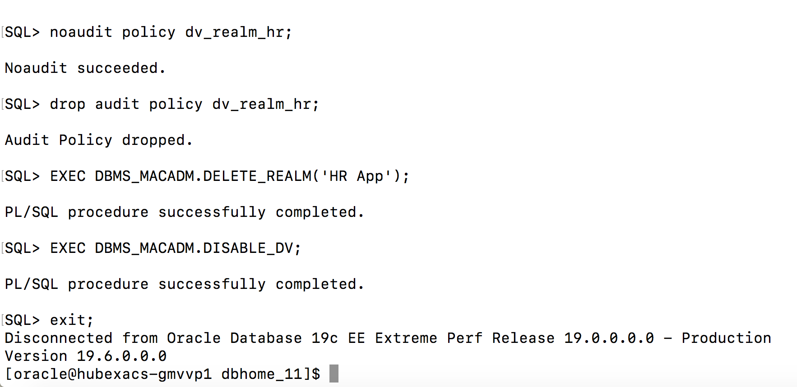
Restart the CDB and PDB as `SYS`.
	
	```
	<copy>sqlplus / as sysdba;</copy>
	```
	```
	<copy>shutdown immediate;</copy>
	```
	```
	<copy>startup;</copy>
	```
	```
	<copy>alter pluggable database <your-pdb-name> close immediate;</copy>
	```
	```
	<copy>alter pluggable database <your-pdb-name> open;</copy>
	```

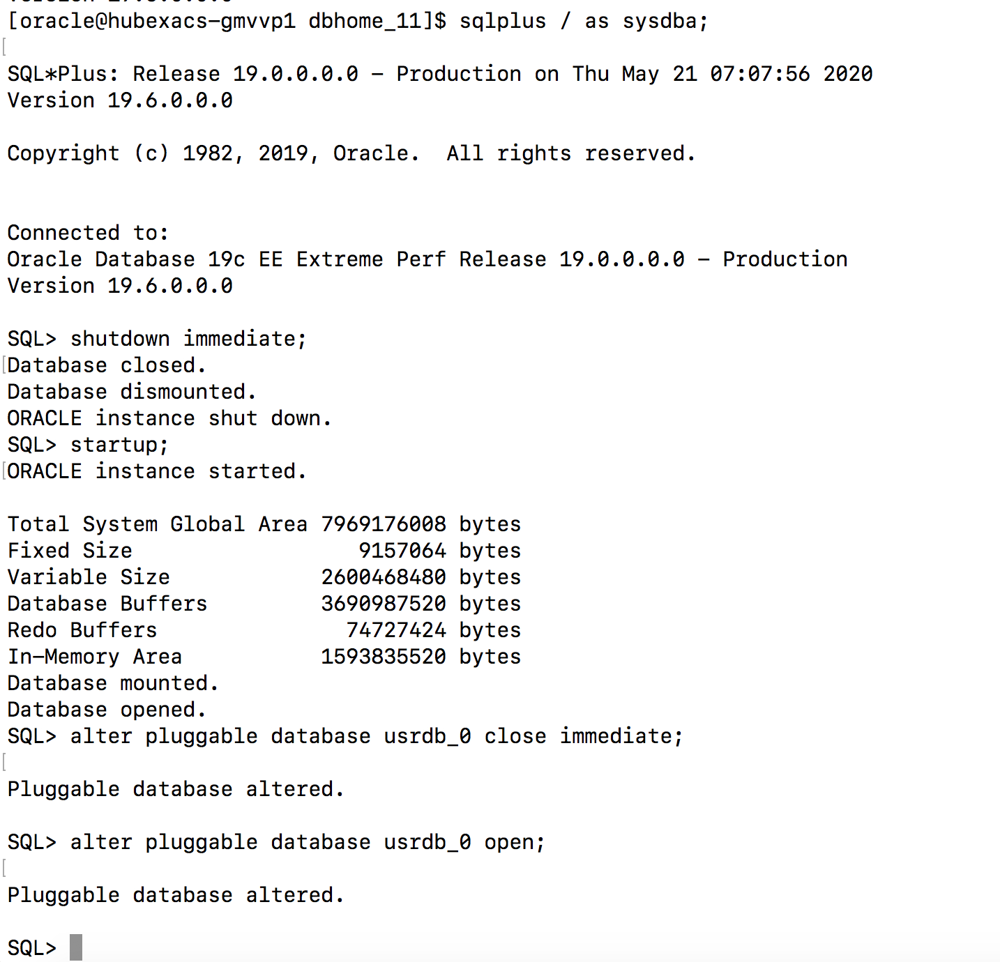
