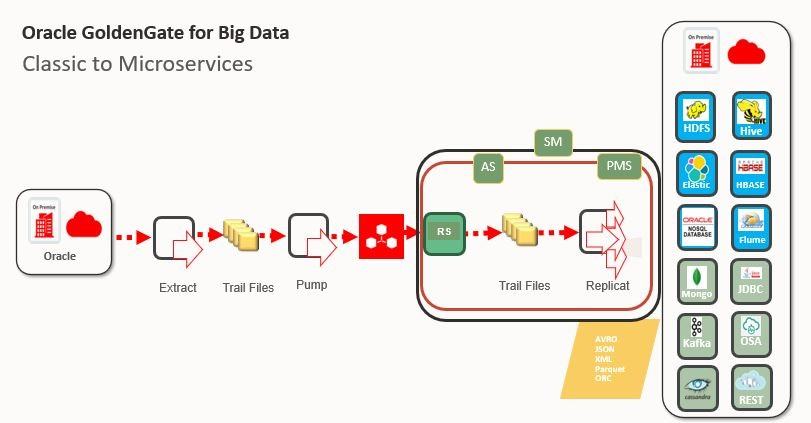
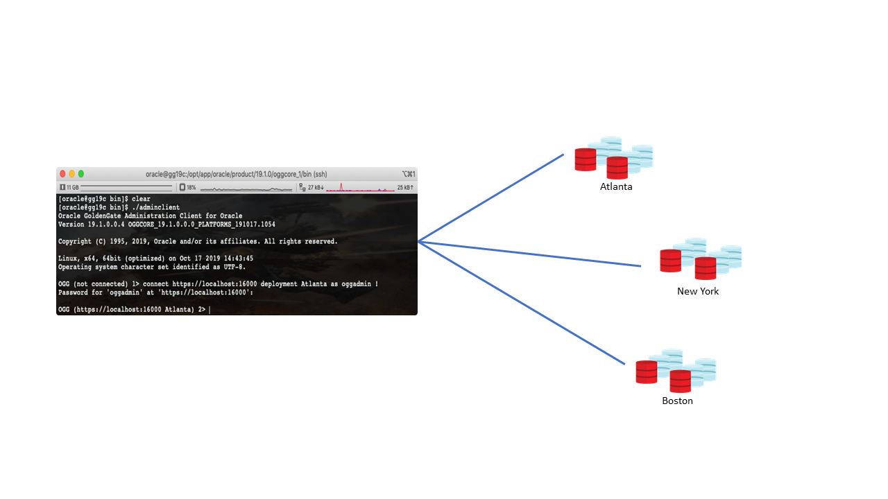

# Introduction

## About Oracle GoldenGate for Big Data using Microservices

Oracle GoldenGate for Big Data offers high-performance, fault-tolerant, easy-to-use, and flexible real- time data streaming platform for big data environments. It easily extends customers’ real-time data integration architectures to big data systems without impacting the performance of the source systems and enables timely business insight for better decision making. This workshop focuses on **GoldenGate Real Time Data Capture** demonstrating four scenarios that you can use (both on-premise and in the cloud) to capture real time data changes from your sources.

This hands-on lab is designed to demonstrate how Oracle **GoldenGate 21.1 Microservices** can be used to setup a replication environment by a mix of web page, shell scripts and Rest API interfaces. All labs will use shell scripts to facilitate the building of the environment, at the same time provide insight into how to use the web pages and AdminClient.
The labs will walk the end-user through how to add all components of Oracle GoldenGate replication. To do the instantiation of the target database, the end-user will be performing a data pump export and import. All replication process will be started as they are built. Our source data changes are generated by Classic GoldenGate and trail file changes will be received into the GoldenGate Microservices Target.

**Workshop Architecture**

**Microservices Administration - GG Adminclient**

- Command Line Tool (replacement for GGSCI)
- Install on Windows, Linux, Containers, etc…
- Manage multiple deployments, single interface

### Prerequisites
* An Oracle Free Tier, Always Free, Paid or LiveLabs Cloud Account

### Lab Overview

- **Lab: Installation Of GoldenGate Microservices for Big Data**
    In this lab we will install GoldenGate Microservices for Big Data in the GG Target. Follow the steps below to install GGMA.

- **Lab: Replication from Relational Database to Relational Database using GoldenGate Classic** -
    This lab is intended to give you familiarity with how to configure GG for database to database replication. If you are already familiar with GG, you can choose to skip this lab.

- **Lab: Replication from Relational to HDFS** -
    This lab is intended to give you familiarity with how to configure GG for database to database replication. If you are already familiar with GG, you can choose to skip this lab.

- **Lab: Replication from Relational to Hive** -
    In this lab we will load data in MySQL database `ggsource`, GG extract process `extmysql` will capture the changes from MySQL's binary logs and wrote them to the local trail file. The pump process `pmphadop` will route the data from the local trail (on the source) to the remote trail (on the target). The replicat
    process `rhive` will read the trail file, create the Hive tables, write the data and the schema files (avsc) to the HDFS target directory for Hive:` /user/ggtarget/hive/data/*` and `/user/ggtarget/hive/schema/*`

- **Lab: Replication from Relational to HBase** -
    In this lab we will load data in MySQL database `ggsource`, GG extract process `extmysql` will In this lab we will load data in MySQL database `ggsource`, GG extract process `extmysql` will capture the changes from MySQL's binary logs and write them to the local trail file. The pump process `pmphadop` will route the data from the local trail (on the source) to the remote trail (on the target). The replicat process `rhbase` will read the remote trail files, create the HBase tables and write the data to those tables.

- **Lab: Replication from Relational to Kafka** -
    In this lab we will load data in MySQL database `ggsource`, GG extract process `extmysql` will capture the changes from MySQL's binary logs and write them to the local trail file. The pump process `pmphadop` will route the data from the local trail (on the source) to the remote trail (on the target). The replicat process `rkafka` will read the remote trail files, act as a producer and write the messages to an auto- created topic for each table in the source database.

- **Lab: Replication from Relational to Cassandra** -  
    In this lab we will load data in MySQL database `ggsource`, GG extract process `extmysql` will capture the changes from MySQL's binary logs and write them to the local trail file. The pump process `pmphadop` will route the data from the local trail (on the source) to the remote trail (on the target). The replicat process `rcass` will read the remote trail files, create the Cassandra tables and write the data to those tables.

- **Lab: Install and configure GoldenGate Microservices** -
In this lab we will (Update from Madhu) .....

- **Lab: Configure GoldenGate Microservices BigData Kafka Target Property file using Administration Server ** -

In this lab we will  (Update from Madhu).....

- **Lab: Managing GoldenGate Remotely using Adminclient ** -  

## Learn More

* [GoldenGate](https://www.oracle.com/middleware/data-integration/goldengate/")
* [GoldenGate Microservices](https://docs.oracle.com/goldengate/c1230/gg-winux/GGCON/getting-started-oracle-goldengate.htm#GGCON-GUID-5DB7A5A1-EF00-4709-A14E-FF0ADC18E842")
* [GoldenGate for Big Data](https://www.oracle.com/middleware/data-integration/goldengate/big-data/")

## Acknowledgements
* **Author** - Brian Elliott, Data Integration Team, Oracle, June 2021
* **Contributors** - Madhu Kumar S., Data Integration Hub Team
* **Last Updated By/Date** - Brian Elliott, Data Integration Team, Oracle, July 2021
## Need Help?
Please submit feedback or ask for help using our [LiveLabs Support Forum](https://community.oracle.com/tech/developers/categories/goldengate-on-premises). Please click the **Log In** button and login using your Oracle Account. Click the **Ask A Question** button to the left to start a *New Discussion* or *Ask a Question*.  Please include your workshop name and lab name.  You can also include screenshots and attach files.  Engage directly with the author of the workshop.

If you do not have an Oracle Account, click [here](https://profile.oracle.com/myprofile/account/create-account.jspx) to create one.
