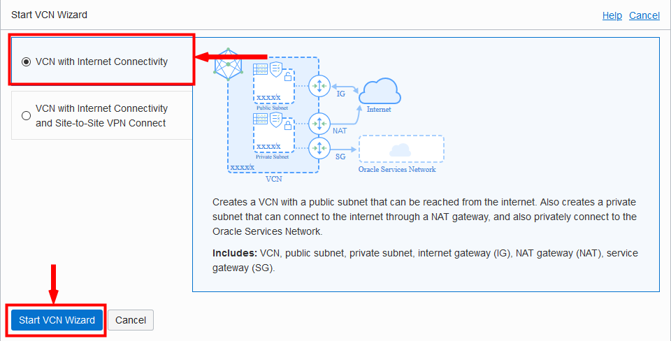
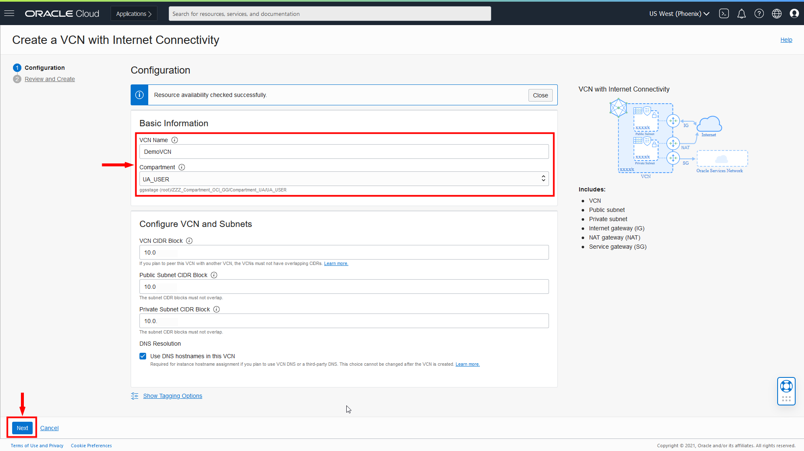
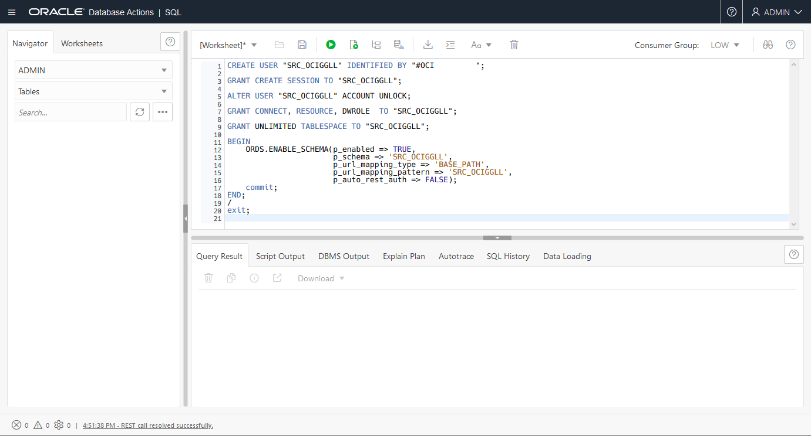
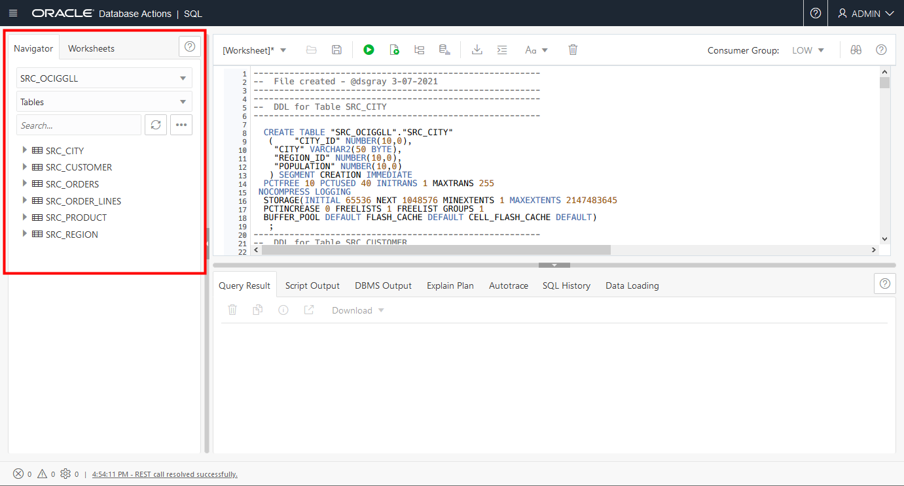
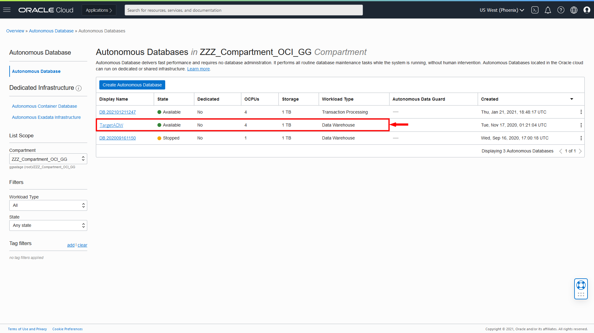
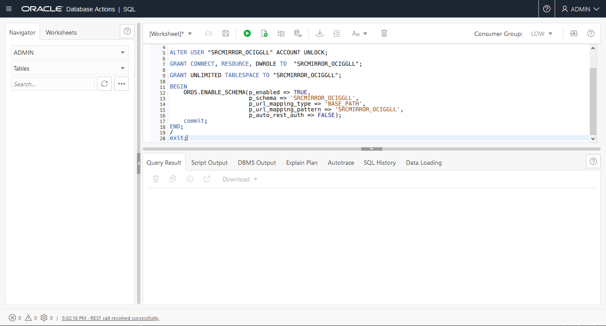
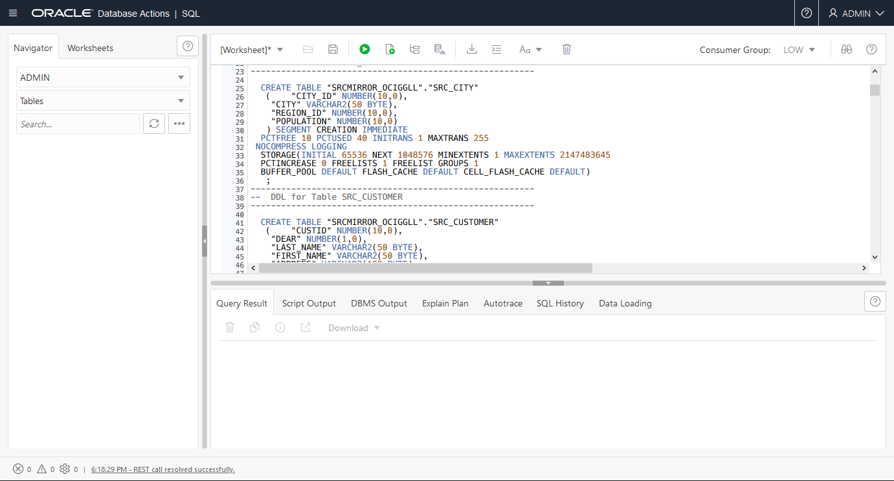

# Set up your environment

## Introduction

This lab walks you through the steps to create the required resources you'll use for this set of labs. You'll learn to create a VCN and subnet, provision autonomous databases, and load data into the databases for use with this LiveLab.

*Note: This workshop was designed to use Oracle Autonomous Databases as the source and target. If you plan to use Oracle Database, ensure that you use the CDB user to capture data from the PDBs.*

Estimated Lab Time: 20 mins

### Objectives

-  Provision a VCN and subnet
-  Provision, connect, and load data into an Autonomous Transaction Processing (ATP) instance
-  Provision, connect, and load data into an Autonomous Data Warehouse (ADW) instance

### Prerequisites

This lab assumes you have completed the Getting Started lab.

*Note: You may see differences in account details (eg: Compartment Name is different in different places) as you work through the labs. This is because the workshop was developed using different accounts over time.*

## Task 1: Create a VCN and subnet
1.  Open the **Navigation Menu**, navigate to **Networking**, and select **Virtual Cloud Networks**.

	

2.  Click **Start VCN Wizard**.

3.  Select **VCN with Internet Connectivity**, and then click **Start VCN Wizard.**

    

4.  Enter a name for the VCN, select a compartment, and then click **Next**.

    

5.  Verify the configuration, and then click **Create**.

    

You can click View VCN Details and see both a Public and Private subnet were created.

## Task 2: Create an ATP Instance

1.  Open the **Navigation Menu**, navigate to **Oracle Database**, and select **Autonomous Transaction Processing**.

	

2.  Click **Create Autonomous Database**.

    

3. Select **Compartment** by clicking on the drop-down list. (Note that yours will be different - do not select **ManagedCompartmentforPaaS**) and then enter **ATPSource** for **Display Name** and **Database Name**.

    

4.  Under **Choose a workload type**, select **Transaction Processing**.

    

5.  Under **Choose a deployment type**, select **Shared Infrastructure**.

    

6.  Under **Configure the database**, leave **Choose database version** and **Storage (TB)** and **OCPU Count** as they are.

    

7.  Add a password. Take note of the password, you will need it later in this lab.

    

8.  Under **Choose a license type**, select **License Included**.

    

9.  Click **Create Autonomous Database**. Once it finishes provisioning, you can click on the instance name to see details of it.


## Task 3: Load the ATP schema

1.  Click the following link to download the database schema.

    [Archive.zip](https://objectstorage.us-ashburn-1.oraclecloud.com/p/GBBFZbbFdladZV7maRiV3egDpZ_jCOglhpEWyqOgEuKZzIjxqeDgbrq9_WRhzjR5/n/c4u04/b/data-management-library-files/o/Archive.zip)

2.  Save `Archive.zip` to a download directory, and then unzip the file.

3.  Back in the OCI Console, select your ATP instance from the Autonomous Databases list to view its details and access tools.

    

4.  Click the **Tools** tab, and then click **Open Database Actions**.

    

    

5.  Log in with the ADMIN user and password provided when you created the ATP instance.

    

6.  From the Database Actions menu, under **Development**, select **SQL**.

    

7.  (Optional) Click **X** to close the Help dialog.

8.  Copy the SQL script from **OCIGGLL\_OCIGGS\_SETUP\_USERS\_ATP.sql** paste it into the SQL Worksheet.

    

9.  Click **Run Script**. The Script Output tab displays confirmation messages.

10. Copy the SQL script from **OCIGGLL\_OCIGGS\_SRC\_USER\_SEED\_DATA.sql** and paste it into a new SQL Worksheet.

    

11. Click **Run Script**. The Script Output tab displays confirmation messages.

12. In the Navigator tab, look for the SRC\_OCIGGLL schema and then select tables from their respective dropdowns to verify the schema and tables were created. You may need to log out and log back in if you can't locate SRC\_OCIGGLL.

    

13. To enable supplemental logging, run the following command:

    ```
    <copy>ALTER PLUGGABLE DATABASE ADD SUPPLEMENTAL LOG DATA;</copy>
    ```

## Task 4: Create an ADW Instance

1.  Open the **Navigation Menu**, navigate to **Oracle Database**, and select **Autonomous Data Warehouse**.

	

2.  Click **Create Autonomous Database**.

    

3. Select **Compartment** by clicking on the drop-down list. (Note that yours will be different - do not select **ManagedCompartmentforPaaS**) and then enter **ADWTarget** for **Display Name** and **Database Name**.

    

4.  Under **Choose a workload type**, select **Data Warehouse**.

    

5.  Under **Choose a deployment type**, select **Shared Infrastructure**.

    

6.  Under **Configure the database**, leave **Choose database version** and **Storage (TB)** and **OCPU Count** as they are.

    

7.  Add a password. Note the password down in a notepad, you will need it later in Lab 2.

    

8.  Under **Choose a license type**, select **License Included**.

    

9.  Click **Create Autonomous Database**. Once it finishes provisioning, you can click on the instance name to see details of it.

## Task 5: Load the ADW schema

1.  Select your ADW instance from the Autonomous Databases list to view its details and access tools.

    

2.  Click the **Tools** tab, and then click **Open Database Actions**.

    

    

3.  Log in with the ADMIN user and password provided when you created the ATP instance.

    

4.  From the Database Actions menu, under **Development**, select **SQL**.

    

5.  Copy the SQL script from **OCIGGLL\_OCIGGS\_SETUP\_USERS\_ADW.sql** paste it into the SQL Worksheet.

    

6.  Click **Run Script**. The Script Output tab displays confirmation messages.

7.  Copy the SQL script from **OCIGGLL\_OCIGGS\_SRC\_MIRROR\_USER\_SEED\_DATA.sql** and paste it into a new SQL Worksheet.

    

8.  Click **Run Script**. The Script Output tab displays confirmation messages.

9.  In the Navigator tab, look for the SRCMIRROR\_OCIGGLL schema and then select tables from their respective dropdowns to verify the schema and tables were created. You may need to log out and log back in if you can't locate SRCMIRROR\_OCIGGLL.

Please proceed to the next [lab](#next).

## Acknowledgements

- **Author** - Jenny Chan, Consulting User Assistance Developer
- **Last Updated By/Date** - Jenny Chan, July 2021
- **PAR Expiration date** - March 31, 2022
