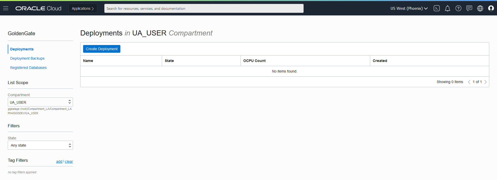
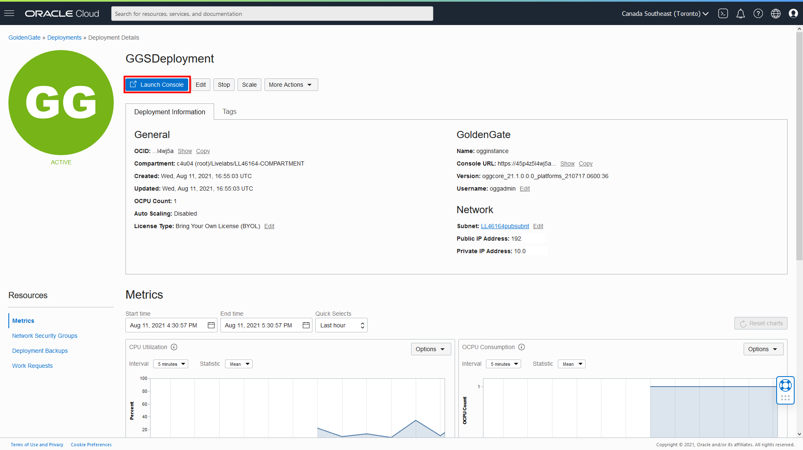
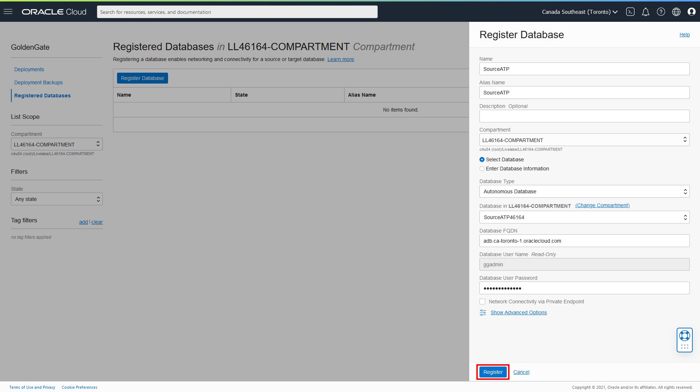
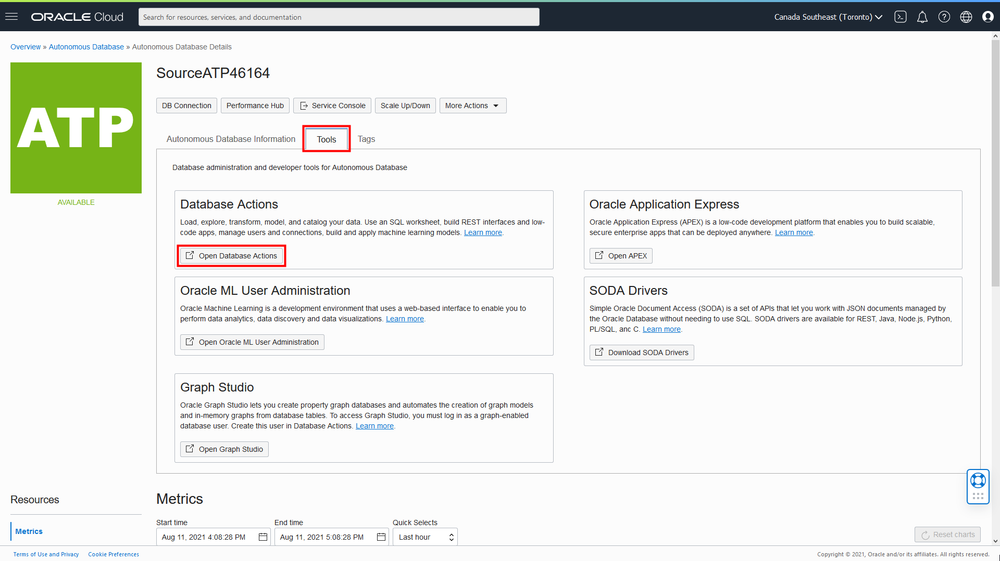
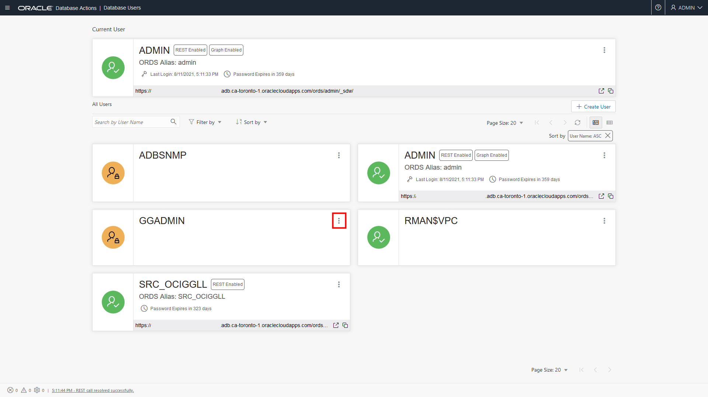
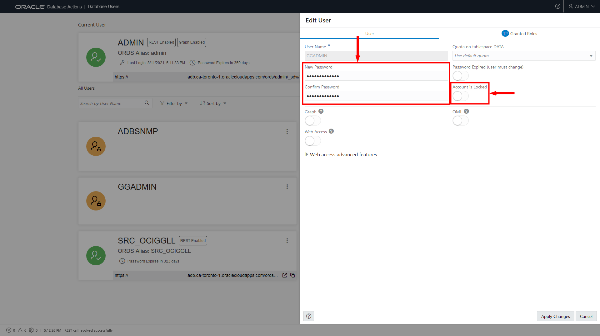
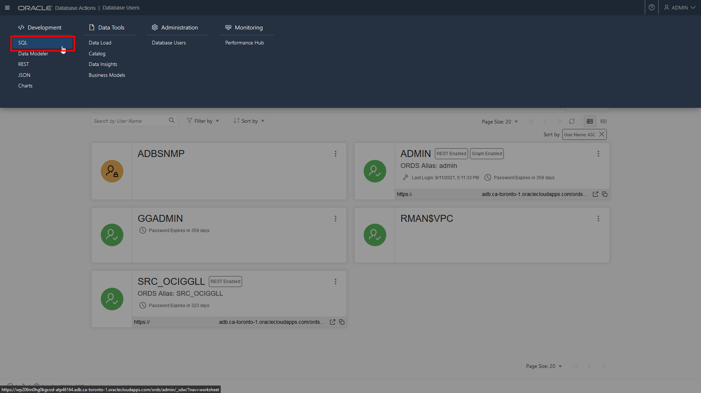

# Create the Oracle Cloud Infrastructure GoldenGate Deployment

## Introduction

This lab walks you through the steps to create an Oracle Cloud Infrastructure (OCI) GoldenGate Deployment and register databases.

Estimated Lab Time: 5 minutes

### About Oracle Cloud Infrastructure GoldenGate Resources

A OCI GoldenGate **deployment** manages the resources it requires to function. The GoldenGate deployment also lets you access the GoldenGate deployment console, where you can create and manage Extracts and Replicats.

A **database registration** captures source or target database credential information and syncs the information to OCI GoldenGate.

### Objectives

In this lab, you will:
* Create a OCI GoldenGate deployment
* Review the OCI GoldenGate deployment details
* Access the OCI GoldenGate deployment console
* Register the source and target databases
* Enable the ggadmin user and supplemental logging

### Prerequisites

This lab assumes that you completed all preceding labs.

## **STEP 1**: Create a Deployment

*Note that the compartment names in the screenshots may differ from values that appear in your environment.*

1.  Open the **Navigation Menu**, navigate to **Oracle Database**, and select **GoldenGate**.

    

    You're brought to the **Deployments** page.

    

2.  You may need to select a compartment. Under List Scope, from the Comparment dropdown, expand the root compartment, and then select the compartment associated with your username. For example, if your LiveLab username is LL1234-user, expand root, and then select the compartment **LL1234-COMPARTMENT**.

3.  On the Deployments page, click **Create Deployment**.

    

4.  In the Create Deployment panel, enter **GGSDeployment** for Name.

5.  From the Compartment dropdown, select a compartment.

6.  For OCPU Count, enter **2**.

7.  For Subnet, select **&lt;user&gt;pubsubnt**.

8.  For License type, select **Bring You Own License (BYOL)**.

9.  Click **Show Advanced Options**, and then select **Create Public Endpoint**.

    

10. Click **Next**.

11. For GoldenGate Instance Name, enter **ogginstance**.

12. For Administrator Username, enter **oggadmin**.

13. For Administrator Password, enter a password. Take note of this password.

14. Click **Create**.

You're brought to the Deployment Details page. It takes a few minutes for the deployment to be created. Its status will change from CREATING to ACTIVE when it is ready for you to use.


## **STEP 2:** Review the Deployment details

On the Deployment Details page, you can:

* Review the deployment's status
* Launch the GoldenGate service deployment console
* Edit the deployment's name or description
* Stop and start the deployment
* Move the deployment to a different compartment
* Review the deployment resource information
* Add tags

    

## **STEP 3:** Launch the GoldenGate Deployment Console

1. When the deployment is active, click **Launch Console**.

    

2. To log in to the GoldenGate deployment console, enter **oggadmin** for User Name and the password you provided above, and then click **Sign In**.

    

After you log in successfully, you're brought to the GoldenGate deployment console home page. Here, you can access the GoldenGate Administration, Performance Metrics, Distribution, and Receiver Servers, as well as add Extracts and Replicats for your data replication tasks.

## **STEP 4:** Register the Source and Target Database

Now, follow the steps below to register the source and target Autonomous Database instances.

*For the purposes of this workshop, registering the Source Autonomous Database is purely used for its connection string to help you create the credential in the Oracle GoldenGate Marketplace instance.*

1.  Return to the OCI Console. In the breadcrumb, click GoldenGate, and then Registered Databases.

2.  On the Registered Databases page, click **Register Database**.

3.  In the Register Database panel, enter **SourceATP** for Name and Alias.

4.  Click **Select Database**.

5.  For **Database Type**, select **Autonomous Database**.

6.  For **Database in &lt;compartment-name&gt;**, select **SourceATP**.

7.  For **Database User Password**, enter a password, and take note of this password for use later in this workshop. You can use the database passwords provided in the Workshop Details.

8.  Click **Register**.

    

9.  Repeat these steps for the Target Autonomous Database.

The source and target databases appear in the list of Registered Databases. The database becomes Active after a few minutes.

## **STEP 5:** Enable the ggadmin user and supplemental logging

Although the ggadmin user is created during the database registration process, it is disabled by default. The following steps guide you through how to enable the ggadmin user.

1.  Open the **Navigation Menu** (hamburger icon), navigate to **Oracle Database**, and then click **Autonomous Database**.

    

2.  From the list of databases, select **SourceATP**.

    

3.  On the SourceATP Database Details page, click **Tools**, and then click **Open Database Actions**.

    

4.  Sign in to Database Actions using the ADMIN user details from Lab 1: Set Up the Environment. If you're running this lab as a workshop, copy the ADMIN password provided with your workshop details.

5.  Under **Administration**, click **Database Users**.

6.  From the list of users, locate **GGADMIN**, and then click the ellipsis (three dots) icon and select **Edit**.

    

7.  In the Edit User panel, deselect **Account is Locked**, enter the password you gave the ggadmin user in the database registration steps above, and then click **Apply Changes**.

    

    Note that the user icon changes from a blue padlock to a green checkmark.

8.  Open the Database Actions navigation menu (hamburger icon), and then select **SQL**.

    

9.  Enter the following into the worksheet, and then click **Run Script**.

    ```
    <copy>ALTER PLUGGABLE DATABASE ADD SUPPLEMENTAL LOG DATA;</copy>
    ```

10. Log out of Database Actions.

11. Repeat steps 1 to 7 to enable the ggadmin user for **TargetADW**. Log out of Database Actions when you're done.

In this lab, you created the OCI GoldenGate deployment and registered the source and target databases. You can now proceed to the [next lab](#next).

## Learn More

* [Managing Deployments](https://docs.oracle.com/en/cloud/paas/goldengate-service/using/deployments.html)

## Acknowledgements
* **Author** - Jenny Chan, Consulting User Assistance Developer, Database User Assistance
* **Contributors** -  Julien Testut, Database Product Management
* **Last Updated By/Date** - Jenny Chan, July 2021
