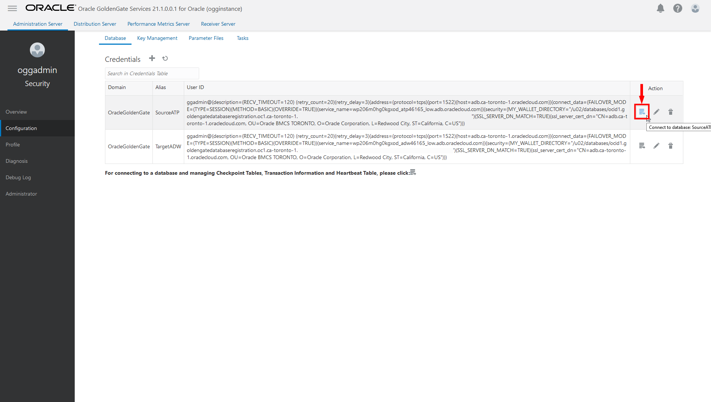
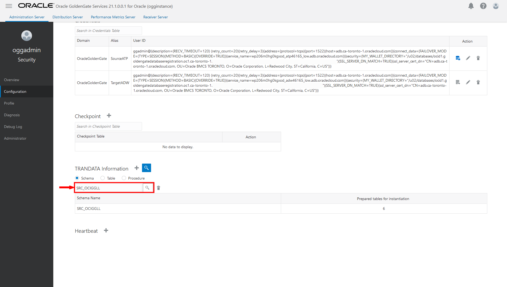
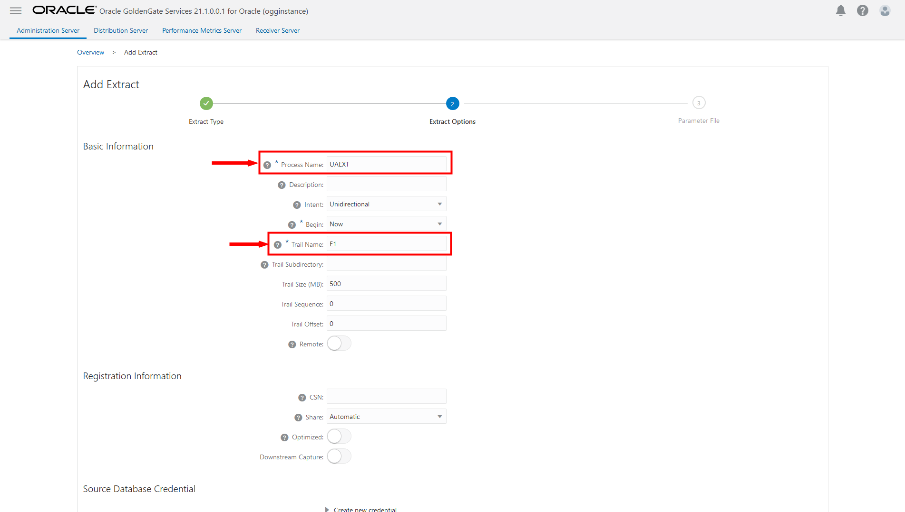
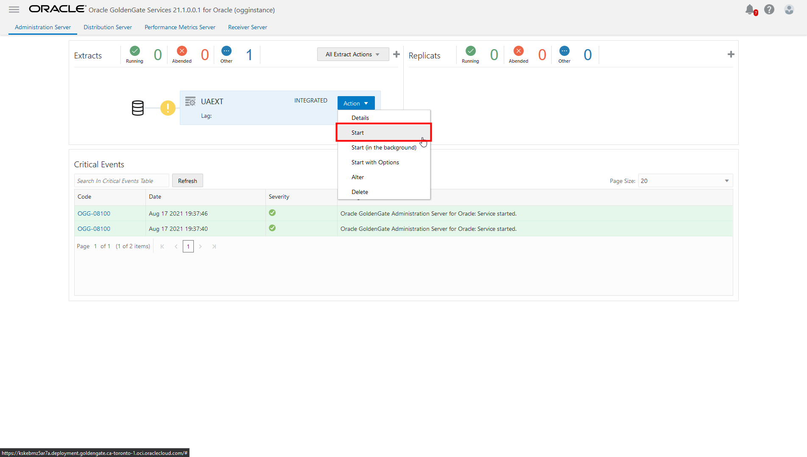
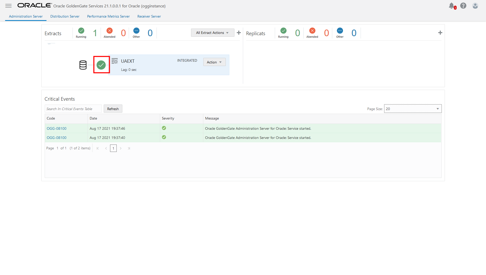
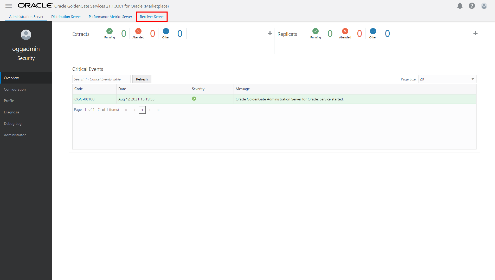
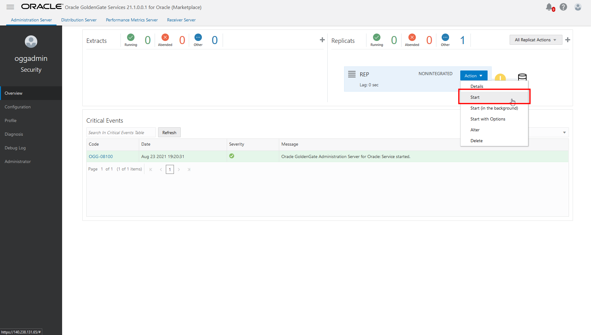
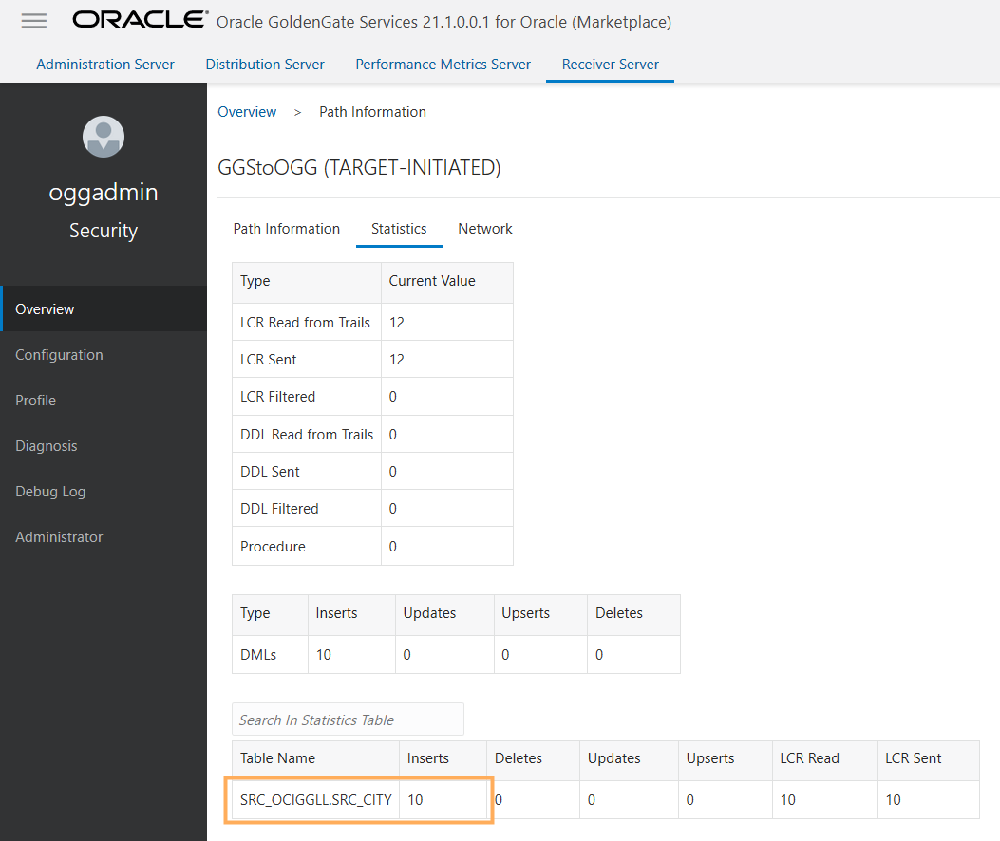
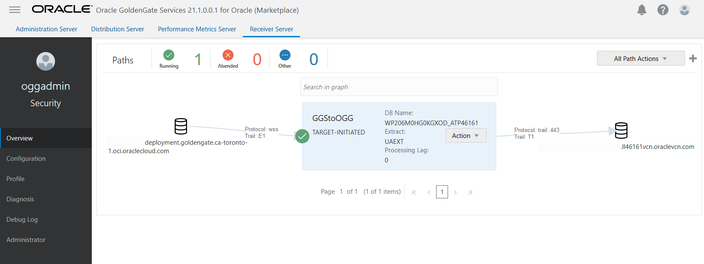

# Send the OCI GoldenGate Trail file to Oracle GoldenGate

## Introduction

This lab walks you through the steps to capture and send data from OCI GoldenGate to an on premisess or Marketplace Oracle GoldenGate instance. You'll create an Extract to capture data from the source database, a Receiver Path to initiate pulling the data down to the target, and a Replicat to consume the data received.

Estimated Lab Time: 5 minutes

### About Extracts, Paths, and Replicats
An Extract is a process that extracts, or captures, data from a source database. A Receiver Path is a target-initiated configuration that uses the Receiver Server. A Replicat is a process that delivers data to the target.

### Objectives

In this lab, you will:
* Add and run an Extract process to capture data
* Add and run a Receiver Path to pull the trail file down to Oracle GoldenGate
* Add and run a Replicat process to consume the trail file received from OCI GoldenGate

### Prerequisites

This lab assumes that you completed all preceding labs. For the purposes of this lab, the source database used in this lab is Oracle Autonomous Transaction Processing and the target database is Oracle Autonomous Data Warehouse.

## Task 1: Add Transaction Data

1.  In the OCI GoldenGate Deployment console, select **Overview** from the navigation menu (hamburger icon), and then click **Configuration**.

    

2.  Click **Connect to database SourceATP**.

    

3.  Next to **TRANDATA Information** click **Add TRANDATA**.

    

4.  For **Schema Name**, enter **SRC\_OCIGGLL**, and then click **Submit**. *You only need to click Submit once. Click Search, and then enter SRC_OCIGGLL to verify.*

    

## Task 2: Add and Run an Extract in OCI GoldenGate

This Extract process captures data from the source database to send to Oracle GoldenGate.

1.  In the OCI GoldenGate Deployment console, select **Overview** from the navigation menu (hamburger icon), and then click **Add Extract** (plus icon).

    

2.  On the Add Extract page, select **Integrated Extract**, and then click **Next**.

3.  For **Process Name**, enter a name for this Extract process, such as UAEXT.

4.  For **Trail Name**, enter a two-character name for the Trail file, such as E1.

    

5.  From the **Credential Domain** dropdown, select **OracleGoldenGate**, and then select the **Credential Alias** for the source ATP database.

6.  Click **Next**.

7.  In the Extract Parameters screen, add the following to the text area:

    ```
    <copy>Table SRC_OCIGGLL.*;</copy>
    ```

8.  Click **Create**. You're returned to the Administration Server Overview page.

9.  In the UAEXT **Action** menu, select **Start**. In the Confirm Action dialog, click **OK**.

    

    The yellow exclamation point icon changes to a green checkmark.

    

## Task 3: Add and Run a Receiver Server Path

The Receiver Path initiates the process to pull the OCI GoldenGate trail file down o OCI GoldenGate.

1.  In the Marketplace Oracle GoldenGate Administration Server console, click **Receiver Server**.

    

2.  Click **Add Path** (plus icon).

3.  On the Add Path page, for **Path Name**, enter a name for this Path. For example, **GGStoOGG**.

4.  For **Description**, describe the purpose of this Path.

5.  For **Source Host**, enter the OCI GoldenGate hostname in the following format: **&lt;domain&gt;.deployment.goldengate.us-&lt;region&gt;-1.oci.oraclecloud.com**.

    *You can copy the host from the browser address bar of your OCI GoldenGate Deployment Console window, or copy the Console URL from the Deployment Details page and remove the https://.*

6.  For **Port Number**, enter 443.

7.  Click **Trail Name**, and then select the trail file created in STEP 1 above, to send to OCI GoldenGate. For example, select **E1**.

    

8.  For **Domain**, enter the Domain from Lab 3, Task 3, step 4. For example, **GGSNetwork**.

9.  For **Alias**, enter the Alias from Lab 3, Task 3, step 4. For example, **ggs2ogg**.

10. For **Target Trail Name**, enter a two-character name for the Trail file when it is received by OCI GoldenGate. For example, **T1**.   

11. For **Generated Target URI**, click **Edit** (pencil icon), and then replace the IP address with the Oracle GoldenGate Internal FQDN. *You can copy the Internal FQDN from the Oracle GoldenGate Marketplace Compute instance in the OCI Console.*    

    

12. Click **Create Path**.

13. Return to the Receiver Server Overview page, and then select **Start** from the Path's **Action** menu.

14. In the OCI GoldenGate Deployment Console, check the Receiver Server for the Receiver Path. It can take a few minutes before it appears.

    

In this lab, you created and ran a Path on your on premisess Oracle GoldenGate Receiver Server and sent a trail file from OCI GoldenGate to Oracle GoldenGate.

## Task 4: Add a Checkpoint table

1.  In the Oracle GoldenGate Administration Server, click **Administration Server**, and then open the navigation menu to select **Configuration**.

    

2.  For TargetADW, click **Connect to Database**.

3.  Next to Checkpoint, click **Add Checkpoint**.

    

4.  For **Checkpoint Table**, enter **"SRCMIRROR\_OCIGGLL"."CHECKTABLE"**, and then click **Submit**.

    

To return to the GoldenGate Deployment Console Home page, click **Overview** in the left navigation.

## Task 5: Add and Run a Replicat

This Replicat process consumes the trail file sent from Oracle GoldenGate.

1.  Click **Overview**, and then click **Add Replicat** (plus icon).

    

2.  On the Add Replicat page, select **Nonintegrated Replicat**, and then click **Next**.

3.  On the Replicate Options page, for **Process Name**, enter **Rep**.

4.  For **Credential Domain**, select **OracleGoldenGate**.

5.  For **Credential Alias**, select **adw&lt;user&gt;_low**.

6.  For **Trail Name**, enter T1.

7.  From the **Checkpoint Table** dropdown, select **"SRCMIRROR\_OCIGGLL"."CHECKTABLE"**.

8.  Click **Next**.

9.  In the **Parameter File** text area, replace **MAP \*.\*, TARGET \*.\*;** with **MAP SRC\_OCIGGLL.\*, TARGET SRCMIRROR\_OCIGGLL.\*;**

10. Click **Create**.

11. In the Rep Replicat **Action** menu, select **Start**.

    

    The yellow exclamation point icon changes to a green checkmark.  

12. Return to the OCI Console and use the navigation menu (hamburger icon) to navigate back to **Oracle Database**, **Autonomous Transaction Processing**, and then **Source ATP**.

13. On the Source ATP Details page, click **Tools**, and then **Database Actions**.

14. Use the Source ATP database credentials in the Workshop details to log in to Database Actions, and then click **SQL**.

15. Enter the following inserts, and then click **Run Script**:

    ```
    <copy>Insert into SRC_OCIGGLL.SRC_CITY (CITY_ID,CITY,REGION_ID,POPULATION) values (1000,'Houston',20,743113);
Insert into SRC_OCIGGLL.SRC_CITY (CITY_ID,CITY,REGION_ID,POPULATION) values (1001,'Dallas',20,822416);
Insert into SRC_OCIGGLL.SRC_CITY (CITY_ID,CITY,REGION_ID,POPULATION) values (1002,'San Francisco',21,157574);
Insert into SRC_OCIGGLL.SRC_CITY (CITY_ID,CITY,REGION_ID,POPULATION) values (1003,'Los Angeles',21,743878);
Insert into SRC_OCIGGLL.SRC_CITY (CITY_ID,CITY,REGION_ID,POPULATION) values (1004,'San Diego',21,840689);
Insert into SRC_OCIGGLL.SRC_CITY (CITY_ID,CITY,REGION_ID,POPULATION) values (1005,'Chicago',23,616472);
Insert into SRC_OCIGGLL.SRC_CITY (CITY_ID,CITY,REGION_ID,POPULATION) values (1006,'Memphis',23,580075);
Insert into SRC_OCIGGLL.SRC_CITY (CITY_ID,CITY,REGION_ID,POPULATION) values (1007,'New York City',22,124434);
Insert into SRC_OCIGGLL.SRC_CITY (CITY_ID,CITY,REGION_ID,POPULATION) values (1008,'Boston',22,275581);
Insert into SRC_OCIGGLL.SRC_CITY (CITY_ID,CITY,REGION_ID,POPULATION) values (1009,'Washington D.C.',22,688002);</copy>
    ```

16. In the OCI GoldenGate Deployment Console, select **Overview** from the navigation menu (hamburger icon), click the **Extract name (UAEXT)**, and then click **Statistics**. Verify that **SRC\_OCIGGLL.SRC\_CITY** is listed with 10 inserts.

    

17. Navigate to the Oracle GoldenGate Marketplace Receiver Server. From the **Action** menu, select **Details**, and then **Statistics**. Verify that **SRC\_OCIGGLL.SRC\_CITY** is listed with 10 inserts.

    

## Task 6: Confirm the Receiver Path is running

In the Oracle GoldenGate Marketplace Receiver Server, verify the Receiver Path is running.



In this lab, you created an Extract, a Receiver Path, and a Replicat, and you verified that data is moving from OCI GoldenGate to Oracle GoldenGate. You can now proceed to the [next lab](#next).

## Learn More

* [Quickstart - Sending Data from OCI GoldenGate to Oracle GoldenGate](https://docs.oracle.com/en/cloud/paas/goldengate-service/using/qs-ggs-ogg-prem.html)
* [Creating an Extract](https://docs.oracle.com/en/cloud/paas/goldengate-service/using/goldengate-deployment-console.html#GUID-3B004DB0-2F41-4FC2-BDD4-4DE809F52448)
* [About Target-initiated Paths](https://docs.oracle.com/en/middleware/goldengate/core/21.1/ggmas/overview-target-initiated-paths.html)

## Acknowledgements
* **Author** - Jenny Chan, Consulting User Assistance Developer, Database User Assistance
* **Contributors** -  Werner He and Julien Testut, Database Product Management
* **Last Updated By/Date** - Jenny Chan, August 2021
