# Conflict Detection and Resolution (Heterogeneous)

## Introduction
This lab will introduce you to Oracle GoldenGate Conflict Detection and Resolution for heterogeneous databases.
Since we have already setup Active-Active configuration on CDRDEMO table, we will utilize the same for manual CDR configuration.

*Estimated Lab Time*:  60 minutes

### Objectives


- Resolve the different types of conflict using one or more resolution methods.


### Prerequisites
This lab assumes you have:
- A Free Tier, Paid or LiveLabs Oracle Cloud account
- SSH Private Key to access the host via SSH
- You have completed:
    - Lab: Generate SSH Keys
    - Lab: Prepare Setup
    - Lab: Environment Setup
    - Lab: Initialize Environment
    - Lab: Create One-Way Replication
    - Lab: GoldenGate Microservices Active-Active and Auto CDR

## **STEP 1**: INSERTROWEXISTS with the USEMAX Resolution

To resolve an insert where the row exists in the source and target, but some or all row values are different.

1. Stop all the running processes.

     ```
    <copy>
    cd ~/Desktop/Scripts/HOL/Lab10
    ./stop_all_process.sh
    </copy>
    ```
    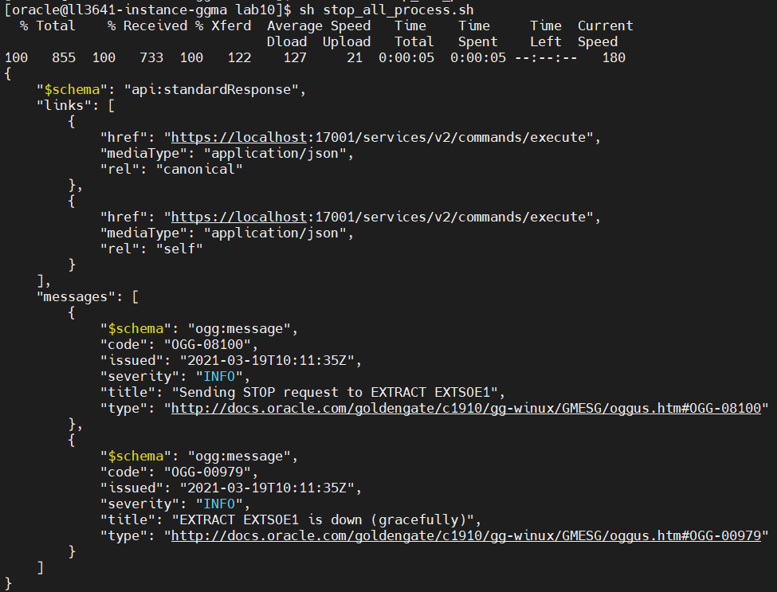
    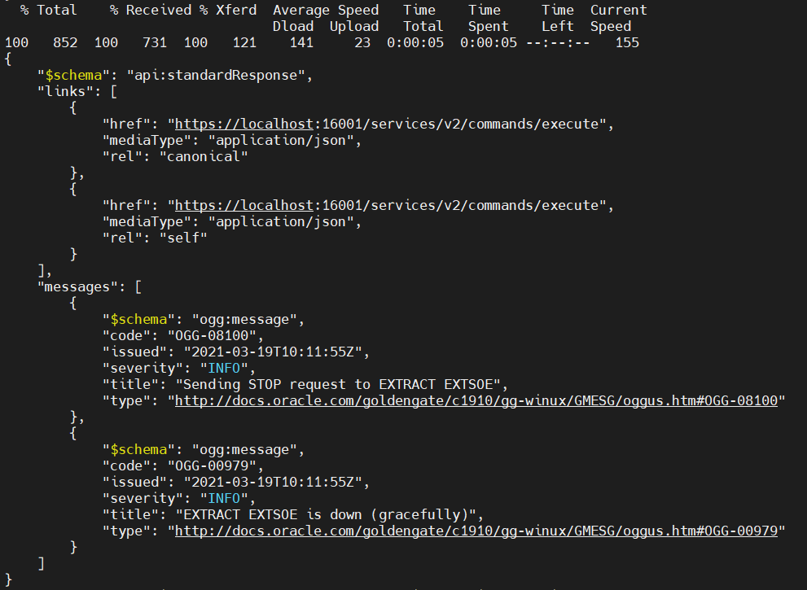
    
    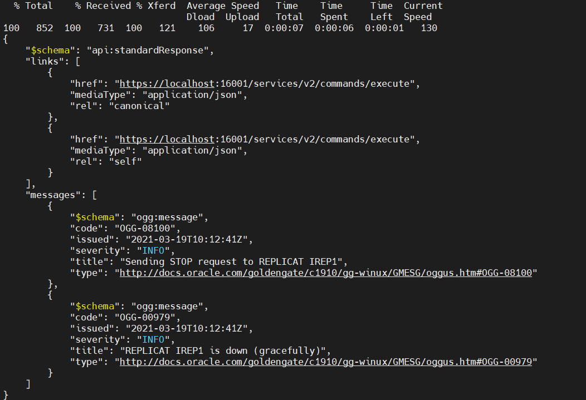

1. Edit the Extract parameter file.

    Go back to your browser and open Atlanta adminserver, click the <b>Action</b> dropdown of extract EXTSOE and choose <b>Details</b>.

    


    Click on <b>Parameters</b>

    

    Click on the edit button to edit the parameter entry

    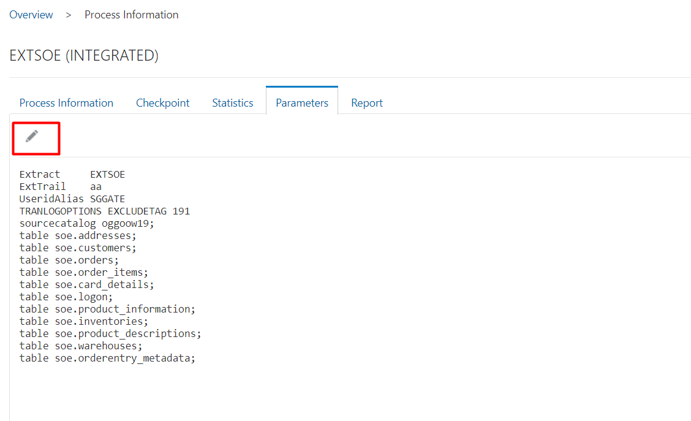

    Add below parameter to <b>EXTSOE</b> on Atlanta:

    ```
    <copy>
    GETUPDATEBEFORES
    </copy>
    ```

    and replace Table SOE.CDRDEMO with below line:

    ```
    <copy>
    TABLE SOE.CDRDEMO, GETBEFORECOLS (ON UPDATE ALL, ON DELETE ALL);
    </copy>
    ```

    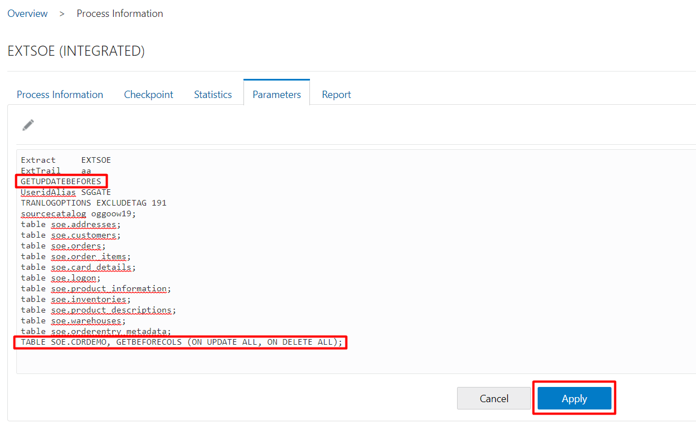


2. Repeat the above step to edit <b>EXTSOE1</b> on Boston and add below parameters.

     ```
    <copy>
    GETUPDATEBEFORES
    </copy>
    ```

    and replace Table SOE.CDRDEMO with below line:

    ```
    <copy>
    TABLE SOE.CDRDEMO, GETBEFORECOLS (ON UPDATE ALL, ON DELETE ALL);
    </copy>
    ```

    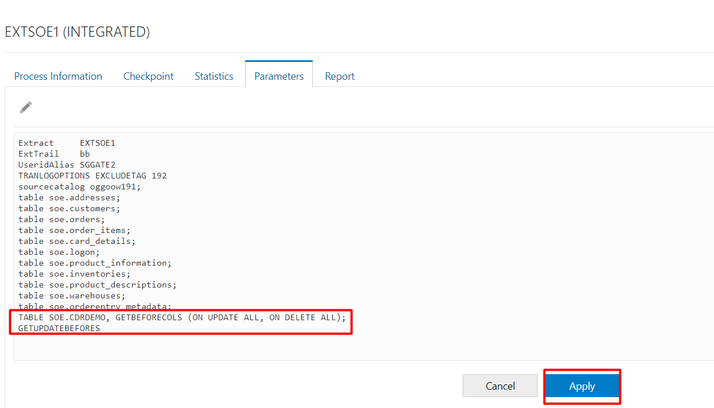

    **NOTE** : The same steps will be repeated for editing parameter for extract or replicat on any of the two deployments (Boston and Atlanta).

3. Modify the Replicat parameter file.

    In both the replicat replace "map <oggoow191||oggoow19>.soe.cdrdemo,target soe.cdrdemo;" with line below:

    ```
    <copy>
    map <oggoow191||oggoow19>.soe.cdrdemo,target soe.cdrdemo,RESOLVECONFLICT (INSERTROWEXISTS, (DEFAULT, USEMAX (INSERTED_DATE)));
    </copy>
    ```
    **NOTE** : Do not forget to edit the above parameter with correct database name. Example - OGGOOW19 in IREP parameter and OGGOOW191 in IREP1 paramter.

4.  To raise the conflict execute the below script which is going to insert same primary key row with different values for non-primary key column, so when all the process will start it raises the conflict.

    <b>insert into soe.cdrdemo(id,name,balance) values(99,'oggoow19',200);</b> on OGGOOW19 database and <br/>
    <b>insert into soe.cdrdemo(id,name,balance) values(99,'oggoow191',400);</b> on OGGOOW191

    ```
    <copy>
    cd ~/Desktop/Scripts/HOL/Lab10
    ./db_conflict_insertRowExist.sh
    </copy>
    ```

    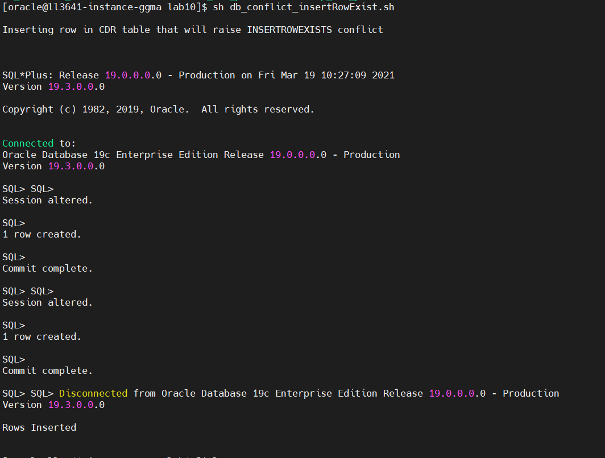
5. Start all the processes.

     ```
    <copy>
    ./start_all_process.sh
    </copy>
    ```

    
    
    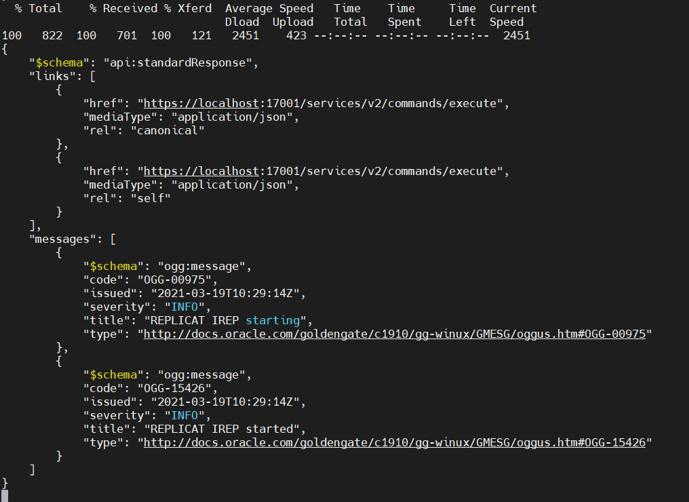
    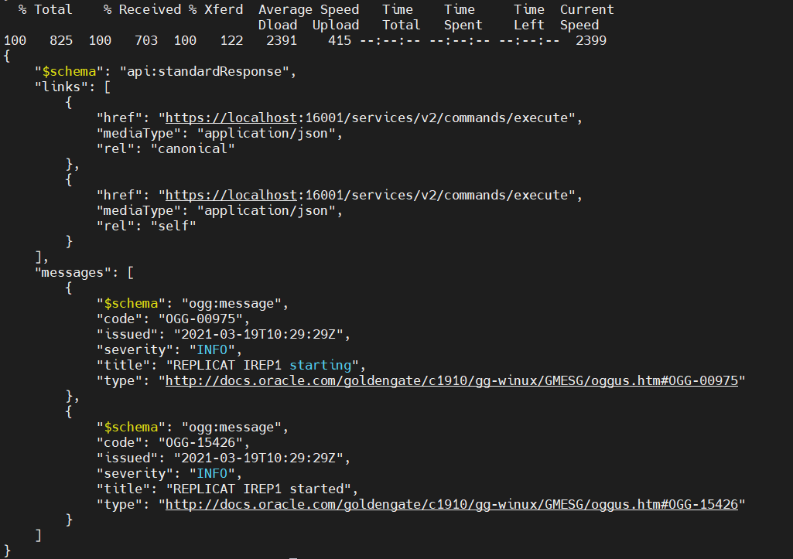    

6. To get the details for the conflict go to the performance Metrics in the <b>Atlanta</b> and click on <b>IREP1</b>.

    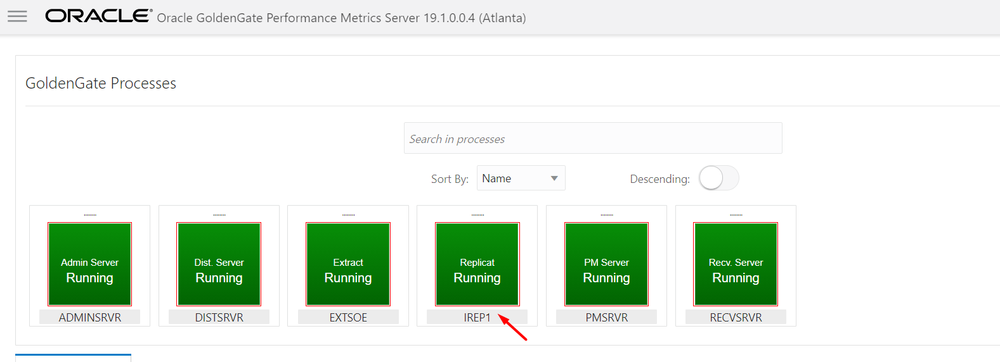
    
    


## **STEP 2**: UPDATEROWEXISTS with USEDELTA and USEMAX

To resolve the condition where a target row exists on UPDATE but non-key columns are different. We will use two different resolution methods (<b>USEDELTA</b> and <b>USEMAX</b>) to handle this conflict.

1. Stop all the running process again as we need to modify the paramter for the processes.

     ```
    <copy>
    cd ~/Desktop/Scripts/HOL/Lab10
    ./stop_all_process.sh
    </copy>
    ```

2. In both the replicat paramter file modify the paramter mapping <b>SOE.CDRDEMO</b> table, with below statement

     ```
    <copy>
    map <oggoow19||oggoow191>.soe.cdrdemo,target soe.cdrdemo, &
    COMPARECOLS (ON UPDATE ALL, ON DELETE ALL), &
    RESOLVECONFLICT(INSERTROWEXISTS,(DEFAULT,USEMAX(INSERTED_DATE))), &
    RESOLVECONFLICT(UPDATEROWEXISTS,(delta_res_method, USEDELTA, COLS (BALANCE)),(DEFAULT, USEMAX (INSERTED_DATE)));
    </copy>
    ```
    **NOTE** : Do not forget to edit the above parameter with correct database name. Example - OGGOOW19 in IREP parameter and OGGOOW191 in IREP1 paramter.
3. Run the script below which is going to insert a row on both OGGOOW19 and OGGOOW191 with different values in non primary key columns and also make an update on OGGOOW19 to change its before and after image.

    ```
    <copy>
    ./db_conflict_updateRowExist.sh
    </copy>
    ```

    

4. Start all the processes.

     ```
    <copy>
    ./start_all_process.sh
    </copy>
    ```

5. Open a browser tab session to the Performance Metrics Server for Boston Deployment

    ```
    <copy>https://<Your Public IP Address>/Boston/pmsrvr</copy>
    ```

    
    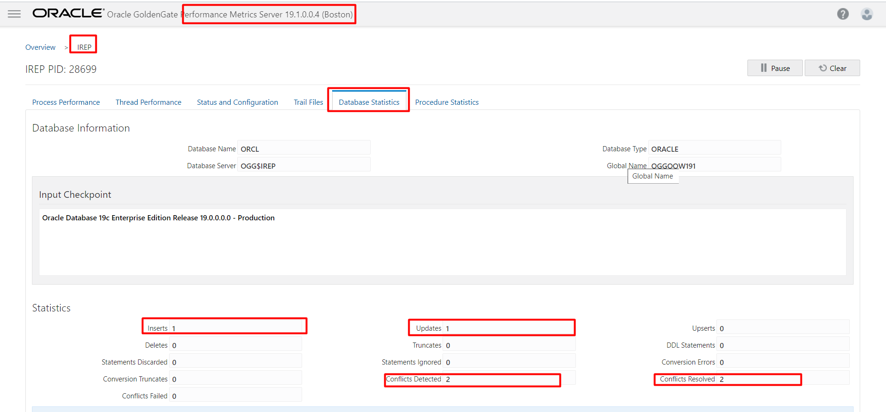
    


## **STEP 3**: DELETEROWEXISTS with OVERWRITE Resolution

To resolve the case where the source row was deleted but the target row exists. In this case, the OVERWRITE resolution applies the delete to the target.

1. Stop all the running process again as we need to modify the paramter for the processes.

     ```
    <copy>
    cd ~/Desktop/Scripts/HOL/Lab10
    ./stop_all_process.sh
    </copy>
    ```

2. In both the replicat paramter file modify the paramter mapping <b>SOE.CDRDEMO</b> table, with below statement

     ```
    <copy>
    map <oggoow19||oggoow191>.soe.cdrdemo,target soe.cdrdemo, &
    COMPARECOLS (ON UPDATE ALL, ON DELETE ALL), &
    RESOLVECONFLICT(INSERTROWEXISTS,(DEFAULT,USEMAX(INSERTED_DATE))), &
    RESOLVECONFLICT(UPDATEROWEXISTS,(delta_res_method, USEDELTA, COLS (BALANCE)),(DEFAULT, USEMAX (INSERTED_DATE))), &
    RESOLVECONFLICT(DELETEROWEXISTS, (DEFAULT, OVERWRITE));
    </copy>
    ```
    **NOTE** : Do not forget to edit the above parameter with correct database name. Example - OGGOOW19 in IREP parameter and OGGOOW191 in IREP1 paramter.

3. Start all the processes.

    ```
    <copy>
    ./start_all_process.sh
    </copy>
    ```

4. Execute the below sql statements in sequence to raise the DELETEROWEXISTS conflict.
    We have a row persent in both source and target with different current image, to raise the conflict of DELETEROWEXISTS we will try deleting the same row in the source side.
    The primary key value (ID) of the row is 100, feel free to compare the values of the row in both the databases.

    Connect to database as sysdba

    ```
    <copy>
    sqlplus / as sysdba
    </copy>
    ```

    Connect to the OGGOOW19 pluggable database.

     ```
    <copy>
    alter session set container=OGGOOW19;
    </copy>
    ```

    Delete the row on the source database (OGGOOW19) with id =100

     ```
    <copy>
    delete from soe.cdrdemo where id = 100;
    </copy>
    ```

    ```
    <copy>
    commit;
    </copy>
    ```

    ```
    <copy>
    exit
    </copy>
    ```


5. Open a browser tab session to the Performance Metrics Server for Boston Deployment

    ```
    <copy>https://<Your Public IP Address>/Boston/pmsrvr</copy>
    ```

    
    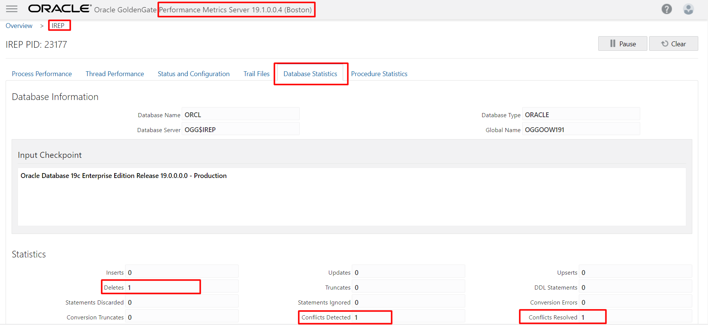
    


## **STEP 4**: DELETEROWMISSING with DISCARD Resolution

To resolve the case where the target row is missing. In the case of a delete on the source, it is acceptable for the target row not to exist (it would need to be deleted anyway), so the resolution is to discard the DELETE operation that is in the trail.

1. Stop all the running process again as we need to modify the paramter for the processes.

     ```
    <copy>
    cd ~/Desktop/Scripts/HOL/Lab10
    ./stop_all_process.sh
    </copy>
    ```

2. In both the replicat paramter file modify the paramter mapping <b>SOE.CDRDEMO</b> table, with below statement

     ```
    <copy>
    map <oggoow19||oggoow191>.soe.cdrdemo,target soe.cdrdemo, &
    COMPARECOLS (ON UPDATE ALL, ON DELETE ALL), &
    RESOLVECONFLICT(INSERTROWEXISTS,(DEFAULT,USEMAX(INSERTED_DATE))), &
    RESOLVECONFLICT(UPDATEROWEXISTS,(delta_res_method, USEDELTA, COLS (BALANCE)),(DEFAULT, USEMAX (INSERTED_DATE))), &
    RESOLVECONFLICT(DELETEROWEXISTS, (DEFAULT, OVERWRITE)), &
    RESOLVECONFLICT(DELETEROWMISSING, (DEFAULT, DISCARD));
    </copy>
    ```
    **NOTE** : Do not forget to edit the above parameter with correct database name. Example - OGGOOW19 in IREP parameter and OGGOOW191 in IREP1 paramter.

3. Run the script to insert two rows on the OGGOOW19 (source) database.

    ```
    <copy>
    ./db_conflict_deleteRowMissing.sh
    </copy>
    ```

     

4. Alter the extract (EXTSOE) capturing changes on OGGOOW19 (Atlanta) to skip these newly inserted rows.

    ```
    <copy>
    ./alter_extract.sh EXTSOE 16001
    </copy>
    ```
    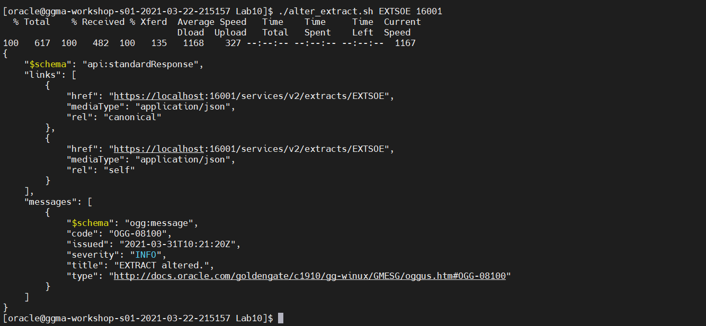
5. Start all the processes.

    ```
    <copy>
    cd ~/Desktop/Scripts/HOL/Lab10
    ./start_all_process.sh
    </copy>
    ```
6. Verify rows in both the database by executing the script below, there should be missmatch in number of rows since we made it ready for conflicts.

    ```
    <copy>
    ./check_records.sh
    </copy>
    ```
    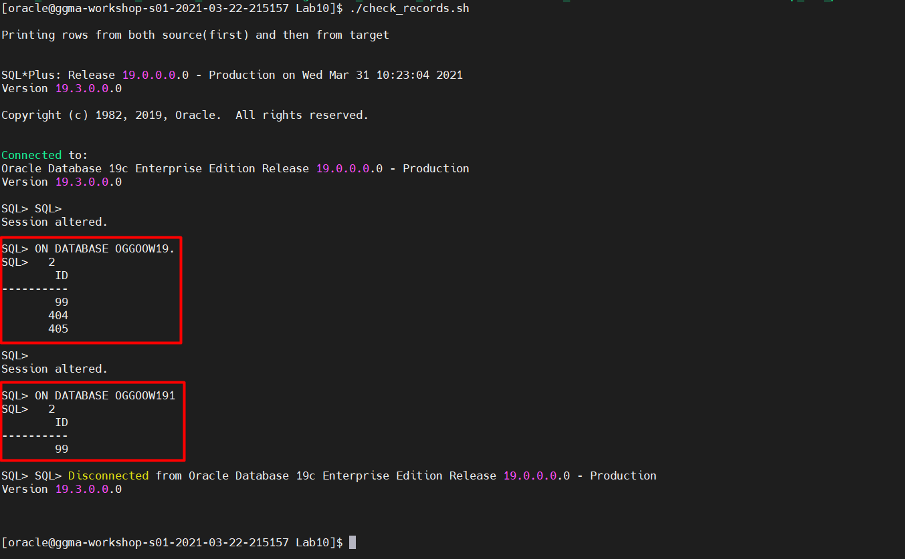

7. Execute the below sql statements in sequence to raise the delete row missing conflict.

    Connect to database as sysdba

    ```
    <copy>
    sqlplus / as sysdba
    </copy>
    ```

    Connect to the OGGOOW19 pluggable database.

     ```
    <copy>
    alter session set container=OGGOOW19;
    </copy>
    ```

    Delete row with id 404 from source database (OGGOOW19).

     ```
    <copy>
    delete from soe.cdrdemo where id = 404;
    </copy>
    ```

    ```
    <copy>
    commit;
    </copy>
    ```

    ```
    <copy>
    exit
    </copy>
    ```

8. Open a browser tab session to the Performance Metrics Server for Boston Deployment

    ```
    <copy>https://<Your Public IP Address>/Boston/pmsrvr</copy>
    ```

    
    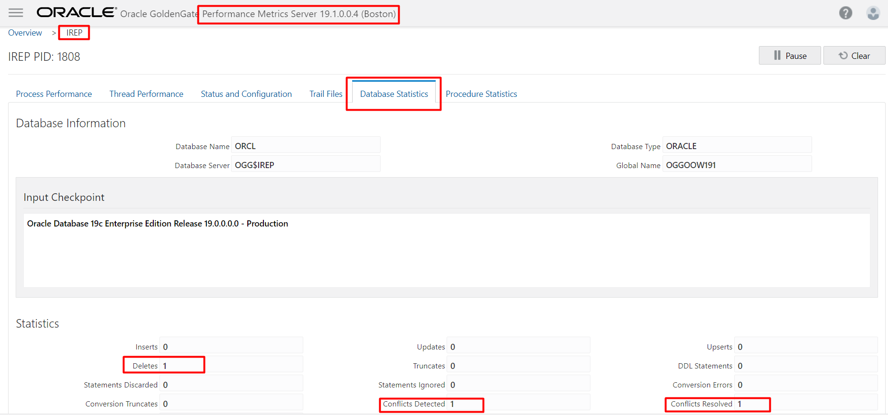
    


## **STEP 5**: UPDATEROWMISSING with OVERWRITE Resolution

To resolve the case where the target row is missing. The logical resolution, and the one used, is to overwrite the row into the target so that both databases are in sync again.

1. Stop all the running process again as we need to modify the paramter for the processes.

     ```
    <copy>
    cd ~/Desktop/Scripts/HOL/Lab10
    ./stop_all_process.sh
    </copy>
    ```

2. In both the replicat paramter file modify the paramter mapping <b>SOE.CDRDEMO</b> table, with below statement

     ```
    <copy>
    map <oggoow19||oggoow191>.soe.cdrdemo,target soe.cdrdemo, &
    COMPARECOLS (ON UPDATE ALL, ON DELETE ALL), &
    RESOLVECONFLICT(INSERTROWEXISTS,(DEFAULT,USEMAX(INSERTED_DATE))), &
    RESOLVECONFLICT(UPDATEROWEXISTS,(delta_res_method, USEDELTA, COLS (BALANCE)),(DEFAULT, USEMAX (INSERTED_DATE))), &
    RESOLVECONFLICT(DELETEROWEXISTS, (DEFAULT, OVERWRITE)), &
    RESOLVECONFLICT(DELETEROWMISSING, (DEFAULT, DISCARD)), &
    RESOLVECONFLICT(UPDATEROWMISSING, (DEFAULT, OVERWRITE));
    </copy>
    ```
    **NOTE** : Do not forget to edit the above parameter with correct database name. Example - OGGOOW19 in IREP parameter and OGGOOW191 in IREP1 paramter.

4. Start all the processes.

    ```
    <copy>
    cd ~/Desktop/Scripts/HOL/Lab10
    ./start_all_process.sh
    </copy>
    ```
5. Execute the below sql statements in sequence to raise the update row missing conflict.

    Connect to database as sysdba

    ```
    <copy>
    sqlplus / as sysdba
    </copy>
    ```

    Connect to the OGGOOW19 pluggable database.

     ```
    <copy>
    alter session set container=OGGOOW19;
    </copy>
    ```

    Update row with id 405 on the source database (OGGOOW19).

     ```
    <copy>
    update soe.cdrdemo set name='updaterowmissing' where id= 405;
    </copy>
    ```

    ```
    <copy>
    commit;
    </copy>
    ```

     ```
    <copy>
    exit
    </copy>
    ```

6. Open a browser tab session to the Performance Metrics Server for Boston Deployment

    ```
    <copy>https://<Your Public IP Address>/Boston/pmsrvr</copy>
    ```

    
    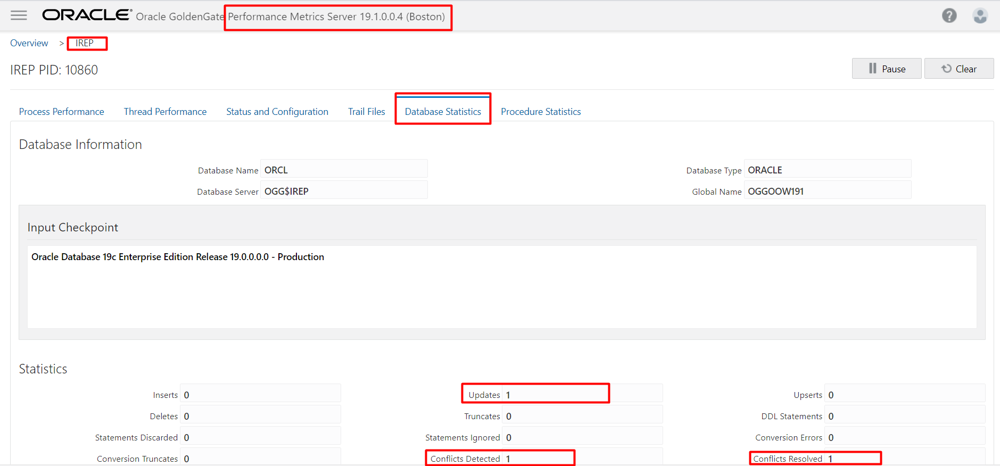
    

You may now [proceed to the next lab](#next).

## Learn More
* [GoldenGate Microservices](https://docs.oracle.com/en/middleware/goldengate/core/19.1/understanding/getting-started-oracle-goldengate.html#GUID-F317FD3B-5078-47BA-A4EC-8A138C36BD59)

## Acknowledgements
* **Author** - Nishant Kaushik, Data Integration, December 2020
* **Contributors** - Brian Elliott, Meghana Banka, Rene Fontcha
- **Last Updated By/Date** - Rene Fontcha, LiveLabs Platform Lead, NA Technology, January 2021

## Need Help?
Please submit feedback or ask for help using our [LiveLabs Support Forum](https://community.oracle.com/tech/developers/categories/livelabsdiscussions). Please click the **Log In** button and login using your Oracle Account. Click the **Ask A Question** button to the left to start a *New Discussion* or *Ask a Question*.  Please include your workshop name and lab name.  You can also include screenshots and attach files.  Engage directly with the author of the workshop.

If you do not have an Oracle Account, click [here](https://profile.oracle.com/myprofile/account/create-account.jspx) to create one.
