# Monitor the Oracle GoldenGate Marketplace Instance on Oracle Enterprise Manager

## Introduction
This lab describes how to Monitor the GoldenGate Marketplace instance (Classic and Microservices) using the Oracle Enterprise Manager Marketplace instance.

It describes how to open the Oracle GoldenGate Services ports from the Oracle Cloud Infrastructure (OCI) console, open the proxy ports on Oracle GoldenGate Microservices Marketplace instance, and discover and monitor the Oracle GoldenGate instances on Oracle Enterprise Manager on Marketplace.

*Estimated Lab Time*: 15 minutes

### Objectives
In this lab, you will:
* Open the Oracle GoldenGate Services Ports from the OCI Console and the Proxy ports on Oracle GoldenGate Microservices Marketplace instance.
* Create the default ingress rule (in the Network’s VCN) to open the Microservices Port.
* Discover Oracle GoldenGate Microservices instances in Oracle Enterprise Manager on Marketplace
* Set Monitoring and Preferred Credentials to Oracle GoldenGate Microservices Marketplace in Enterprise Manager Plug-in

### Prerequisites
This lab assumes you have:

* A Free Tier, Paid or LiveLabs Oracle Cloud account
* SSH Private Key to access the host via SSH
* You have completed:
    * Lab: Generate SSH Keys (Free-tier and Paid Tenants only)
    * Lab: Prepare Setup (Free-tier and Paid Tenants only)
    * Lab: Environment Setup
    * Lab: Initialize Environment
* The following are required to complete this lab:
    * Introduction and Prerequisites

**STEP 1:** Open the Oracle GoldenGate Services Ports from the OCI Console and the Proxy ports on Oracle GoldenGate Microservices Marketplace instance

Before you begin to discover the Oracle GoldenGate instances, you need to open all the Oracle GoldenGate Services port from the Oracle Cloud Infrastructure (OCI) console. If the Service Manager, Administration Server, Distribution Server, Receiver Server, Performance Metrics server ports are not opened, then the Oracle Enterprise Manager Plug-in cannot discover the instances.

You may choose to white-list the ports to Oracle Enterprise Manager Marketplace instance. By doing this, no other instances will be able access the GoldenGate Marketplace instance ports, hence making  secured.

To open the ports:
1. Login to your Cloud account and access the Oracle GoldenGate Microservices instance. Start an instance of Oracle GoldenGate (Microservices) Marketplace.

2. Create the default ingress rule (in the Network’s VCN) to open the Microservices Port (Administrator Server, Distribution Server, Receiver server, and Performance server) for Oracle GoldenGate Enterprise Manager Plug-in to access these services. You can open these ports through the OCI Cloud account’s Network section. For example, open all the ports from 9000 through 9010 where your Oracle GoldenGate Microservices services are running.
      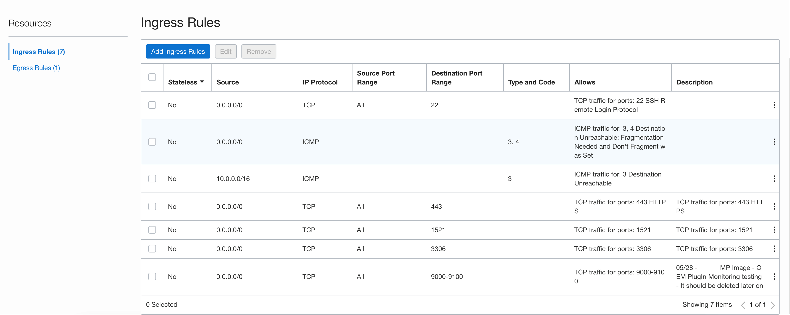
For more information, see [Security Lists](https://docs.oracle.com/en-us/iaas/Content/Network/Concepts/securitylists.htm#stateful).

3. Log-in to your Oracle GoldenGate Marketplace instance using the private key that you have given while provisioning the instance. See [Deploying Oracle GoldenGate Microservices on Oracle Cloud Marketplace](https://docs.oracle.com/en/middleware/goldengate/core/19.1/oggmp/oracle-goldengate-microservices-oracle.html#GUID-EF6680D7-7571-41E7-BF2D-831BD79BCC15) to login to Oracle GoldenGate Marketplace.
4. In the Oracle GoldenGate Microservices instance, run the following command to expose the Service Manager, Administration Server, Receiver Server, Distribution Server, and Performance Metrics Server ports:
    <pre>sudo firewall-cmd --list-ports
    sudo firewall-cmd --add-port=*<OGG Process port number>*/tcp</pre>

**STEP 2**: Install Oracle GoldenGate Enterprise Manager Plug-in

1. Download Oracle GoldenGate Enterprise Manager Plug-in from [Oracle GoldenGate Downloads](https://www.oracle.com/in/middleware/technologies/goldengate-downloads.html).
2. Copy the Oracle GoldenGate Enterprise Manager Plug-in to Oracle Marketplace on which, Enterprise Manager is installed.
3. See [Deploying Oracle GoldenGate Enterprise Manager Plug-in](https://docs.oracle.com/en/middleware/goldengate/emplugin/13.4.2/install/deploying-plug.html#GUID-D024EC6B-75A8-4333-BCEF-04B154614C6F) to install Oracle GoldenGate Enterprise Manager Plug-in.

**STEP 3:** Discover Oracle GoldenGate Microservices instances in Oracle Enterprise Manager on Marketplace

After you have created an Enterprise Manager instance on Marketplace, you can discover the Oracle GoldenGate instances on the Oracle Enterprise Manager Plug-in UI:

  To discover Oracle GoldenGate Microservices instances:
  1. Click **Setup**, select **Add Target**, and click **Configure Auto Discovery**.
      
  2. On the **Targets on Host** tab, select the Enterprise Manager instance, and click **Discovery Modules** to display the **Discovery Modules** page.
      
  3. Click Oracle GoldenGate Microservices and then click **Edit Parameters** to display the **Edit Parameters** dialog box.
      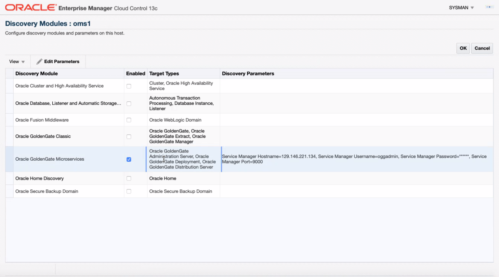
  4. Enter the following details and click **OK**:

      * **Service Manager Hostname**
      * **Service Manager Username**
      * **Service Manager Password**
      * **Service Manager Port**
        
  5. Click **OK** again to display the **Setup Discovery** page and click **Discover Now**.
        

      The targets are discovered and the control is now back on the **Targets on Host** page. Notice  the change in the number of targets discovered under the **Discovered Targets** column.
        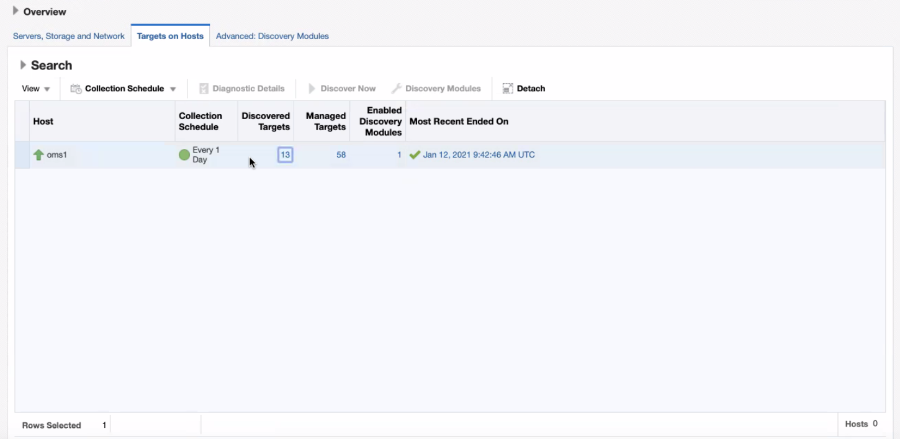

  6. Click the number under **Discovered Targets**  to display the **Auto Discovery Results** page.
        
  7. Click **Promote** to display the **Custom Promotion for GoldenGate Targets**.
        

  8.  Click **Yes** in the **Confirmation** dialog box to manage agents.
          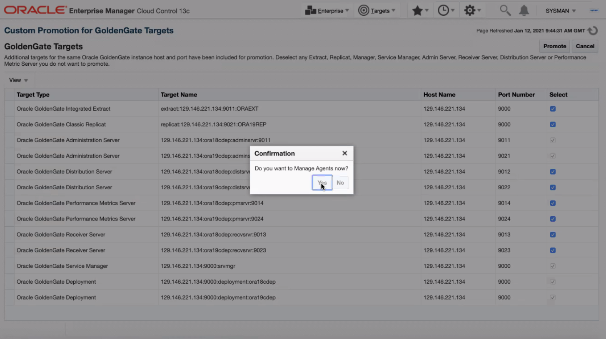

  9. Click **Submit** in the **Manage EM Agents for OGG instance** page.
          
  10. Click **OK** in the **Information** dialog box.
          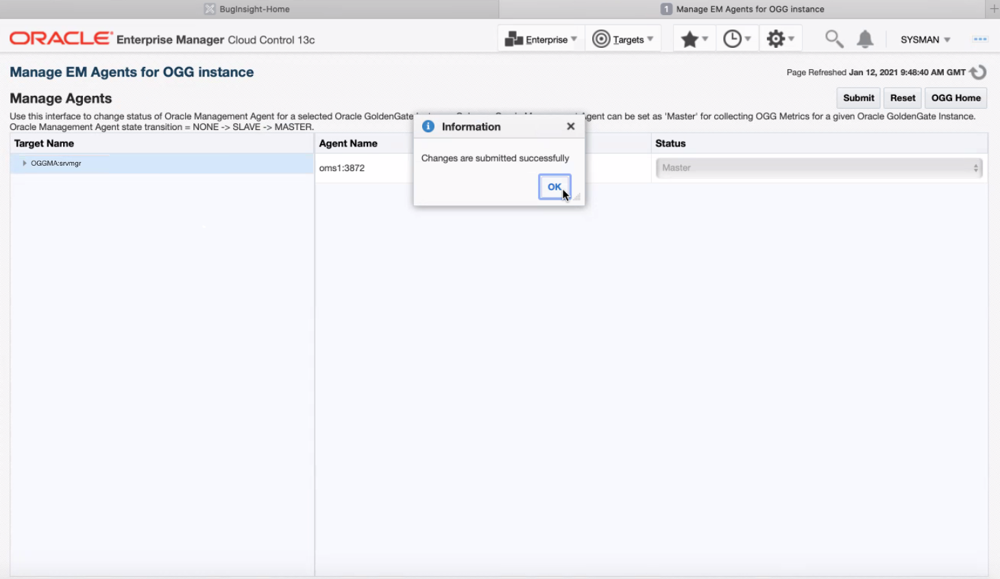

  11. Click **Submit** in the **Manage Agents** page.
        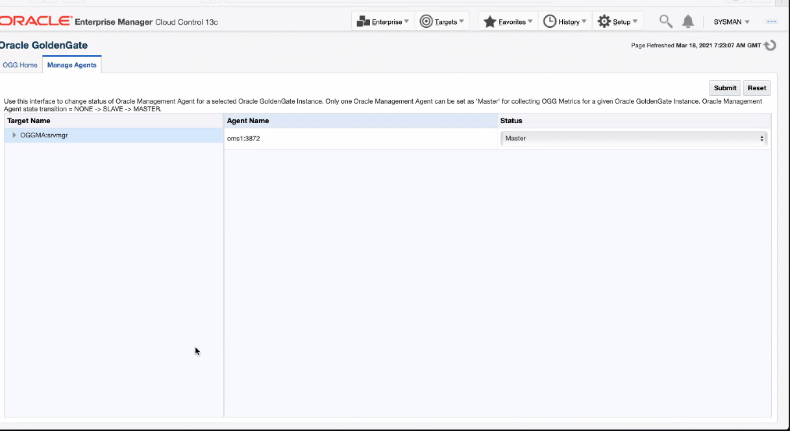

    The Oracle GoldenGate Microservices instance is now discovered and is ready to be monitored on the Enterprise Manager Marketplace instance.

  12. Click **OGG Home** to view the discovered targets.
        

  Watch this video if you want to know more about Discovering Oracle GoldenGate targets (both MA and Classic) in Enterprise Manager.
      

**STEP 4:** Set Monitoring Credentials to Oracle GoldenGate Microservices Marketplace in Enterprise Manager Plug-in

If you are an Enterprise Manager administrator, then you also have the option of storing credentials in a secure manner — as preferences or operation credentials. You can then use these credentials to perform different system management activities like real-time monitoring, patching, provisioning, and other target administrative operations.

You need to set the credentials (Monitoring and Preferred Credentials) for an MA instance.

To set the Monitoring credentials:
  1. Click **Setup**, select **Security**, and click **Monitoring Credentials** to display the **Monitoring Credentials** page.
      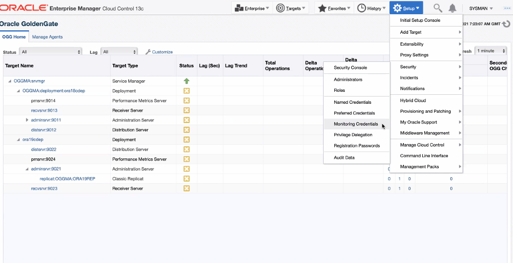

  2. Select **Oracle GoldenGate Service Manager** and click **Manage Monitoring Credentials**.
      

  3. In the **Oracle GoldenGate Service Manager Monitoring Credentials** page, select the target and click **Set Credentials** to display the **Edit monitoring credentials** dialog box.
      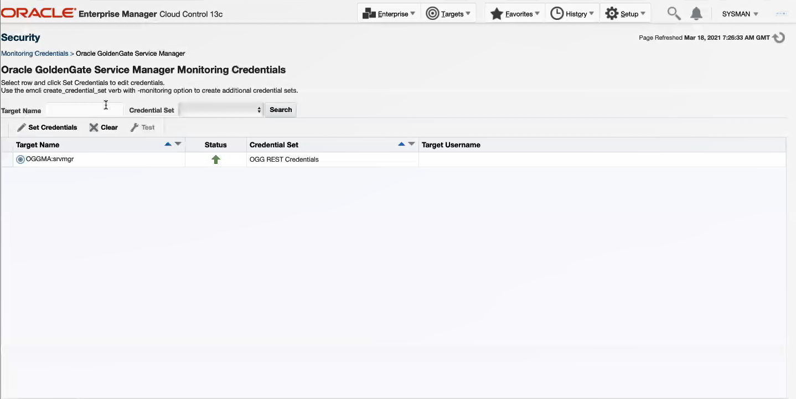

  4. Enter the monitoring credentials details and click **OK**.
      

      The credentials are set successfully and this Information is indicated on the screen.
  5. Click **Targets** and select **GoldenGate**.
      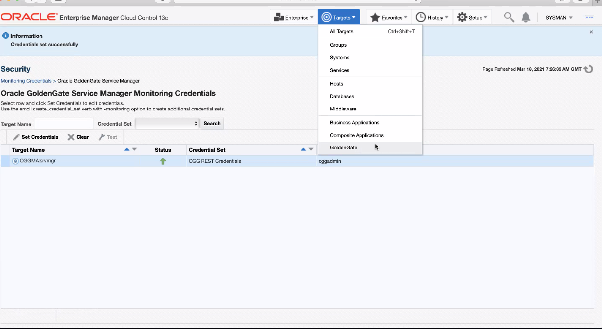

  6. Notice the status has changed for the targets.
      

  7. Select a target and notice that the **Start** and **Stop** buttons are activated for the target.
      

      The monitoring credentials are successfully set and you can monitor the instance, view the logs, configuration files, and GGSERR files, and also start or stop the instance.                                         

  **STEP 5:** Set Preferred Credentials to Oracle GoldenGate MA Marketplace instances in Enterprise Manager Plug-in

  It is required to set preferred credentials to Oracle GoldenGate Service manager target for Oracle GoldenGate Microservices instances in addition to monitoring credentials. While setting preferred credentials for a Microservices instance, you need to add only the host credential.

  **Note**: This is a mandatory step starting from Oracle GoldenGate Enterprise Manager Plug-in 13.4.2.0.0 onwards and is an optional step for earlier releases.

    To set Preferred Credentials:

    1. Click **Setup**, select **Security**, and click **Preferred Credentials** to display the **Preferred Credentials** page.
      

    2. Select **Oracle GoldenGate Service Manager** and click **Manage Preferred Credentials**.
    to display the **Oracle GoldenGate Service Manager Preferred Credentials** page.
      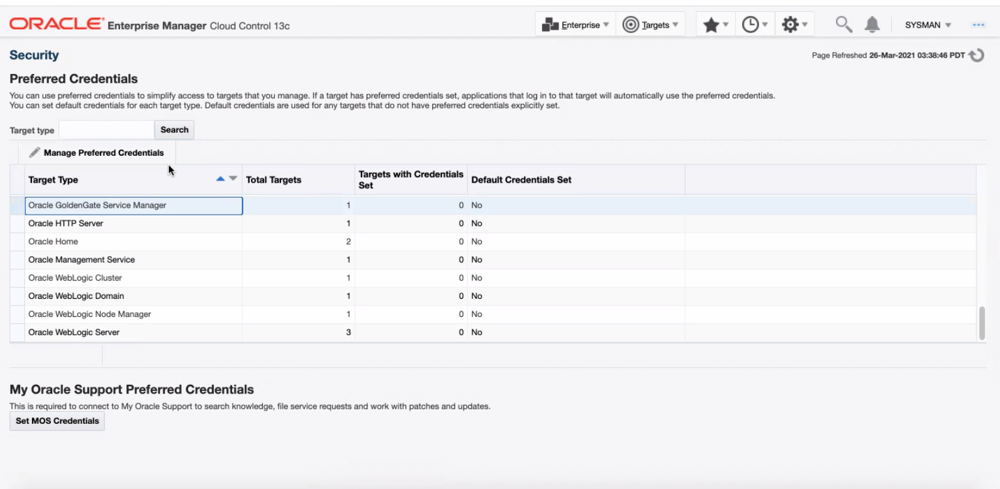

    3. Under **Target Preferred Credentials**, select **Host Credentials**, and click **Set** to display the **Select Named Credential** dialog box.

      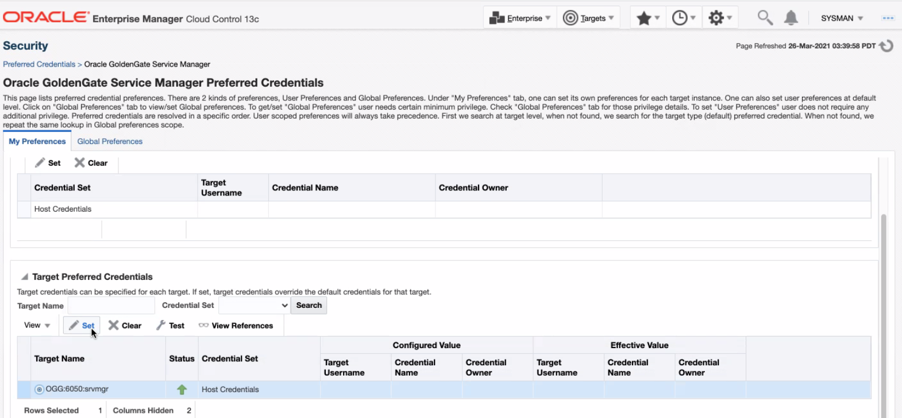

    4. Click **New** to enter the UserName, Password, and Confirm Password.
      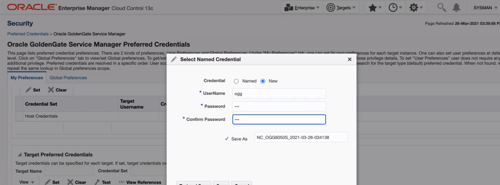

    5. Click **Save** to save the new credentials.

  The Preferred Credentials are set and an information that the Named credential association has been completed successfully is indicated on the screen.

Watch this video if you want to know more about Setting Credentials for Oracle GoldenGate targets (both MA and Classic) in Enterprise Manager Plug-in 13.4.1.0.0 release.
      

## Learn More
* [Oracle GoldenGate Enterprise Manager Plug-in Documentation](https://docs.oracle.com/en/middleware/goldengate/emplugin/13.4.2/index.html)
* [Discovering Oracle GoldenGate Targets](https://docs.oracle.com/en/middleware/goldengate/emplugin/13.4.2/empug/setting-enterprise-manager-oracle-goldengate.html#GUID-DC4F56DF-CB20-4F50-BF07-B9E42C5819BC)
* [A Simple Guide to Oracle GoldenGate Enterprise Manager Plug-in -Blog](https://blogs.oracle.com/dataintegration/a-simple-guide-to-oracle-goldengate-enterprise-manager-plug-in)
* [New Route to Discovery in Oracle GoldenGate Enterprise Manager Plug-in 13.4.2](https://blogs.oracle.com/dataintegration/new-route-to-discovery-in-oracle-goldengate-enterprise-manager-plug-in)
## Acknowledgements

* **Author:**
    + Anuradha Chepuri, Principal UA Developer, Oracle GoldenGate User Assistance
* **Reviewed by:**
    + Nisharahmed Soneji, Senior Principal Product Manager, GoldenGate Development
    + Vetrivel Saravanan, Senior Member of Technical staff, Database Test Dev/Tools/Platform Testing

* **Last Updated By/Date:** Anuradha Chepuri, April 2021
