# Create and Run the Extract and Replicat

## Introduction

This lab walks you through the steps to create an Extract and a Replicat in the Oracle GoldenGate Deployment Console.

Estimated Lab Time: 10 minutes

### About Extracts and Replicats
An Extract is a process that extracts, or captures, data from a source database. A Replicat is a process that delivers data to a target database.

### Objectives

In this lab, you will:
* Log in to the Oracle GoldenGate deployment console
* Add transaction data and a checkpoint table
* Add and run an Extract
* Add and run a Replicat

### Prerequisites

This lab assumes that you completed all preceding labs, and your deployment is in the Active state.

*Note: If you encounter into an error when you run the Extract or Replicat, then you must delete and recreate the Extract or Replicat after you resolve the issue before trying again.*

## **STEP 1**: Log in to the Oracle GoldenGate deployment console

1.  Log in to Oracle Cloud Infrastructure and navigate to the **GoldenGate** service using the Console navigation menu.

2.  On the Deployments page, select a **GGSDeployment**.

3.  On the Deployment Details page, click **Launch Console**.

    

4.  On the OCI GoldenGate Deployment Console sign in page, enter **oggadmin** for User Name and the password you provided when you created the deployment, and then click **Sign In**.

    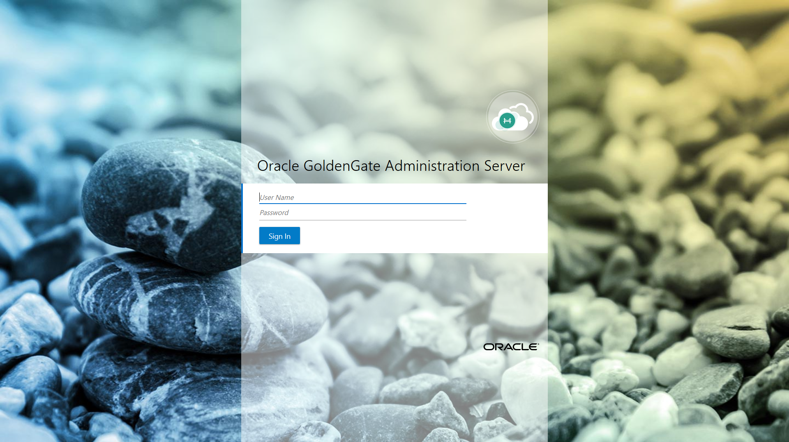

    You're brought to the OCI GoldenGate Deployment Console Home page after successfully signing in.

## **STEP 2:** Add Transaction Data and a Checkpoint Table

1.  Open the navigation menu and then click **Configuration**.

    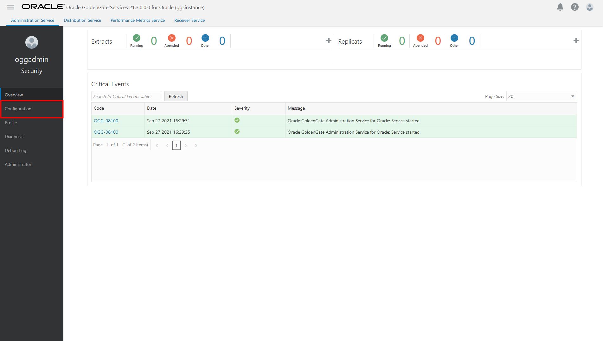

2.  Click **Connect to database SourceATP**.

    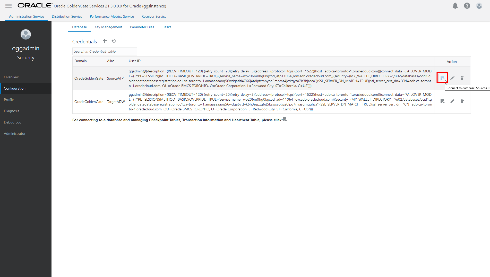

3.  Next to **TRANDATA Information** click **Add TRANDATA**.

    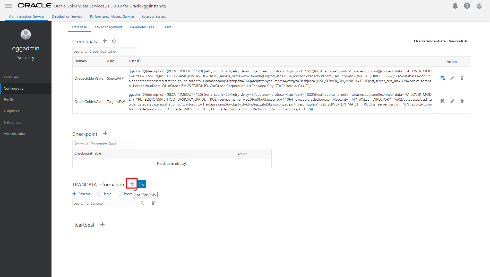

4.  For **Schema Name**, enter **SRC\_OCIGGLL**, and then click **Submit**.

5.  To verify, you can enter **SRC\_OCIGGLL** into the Search field and click **Search**.

    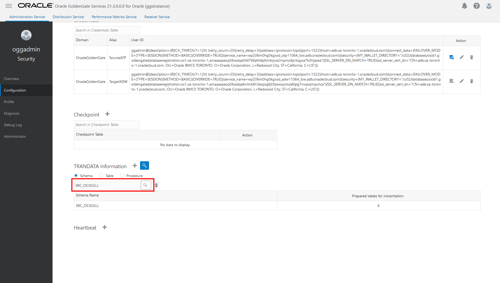

6.  Click **Connect to database TargetADW**.

    

7.  Next to Checkpoint, click **Add Checkpoint**.

    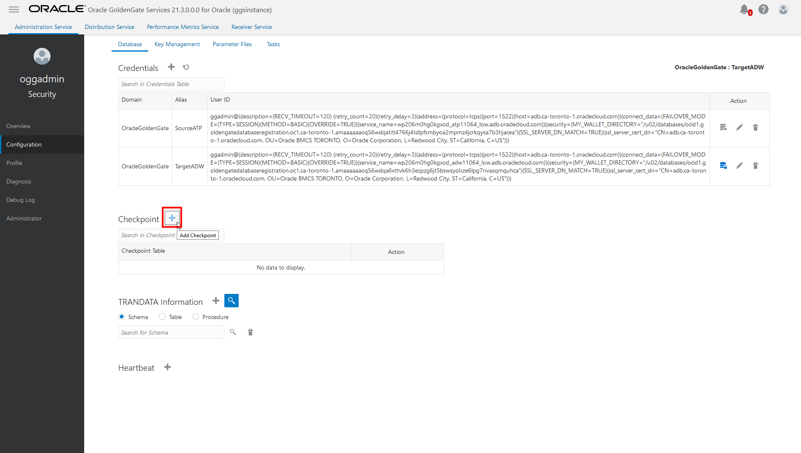

8.  For **Checkpoint Table**, enter **"SRCMIRROR\_OCIGGLL"."CHECKTABLE"**, and then click **Submit**.

    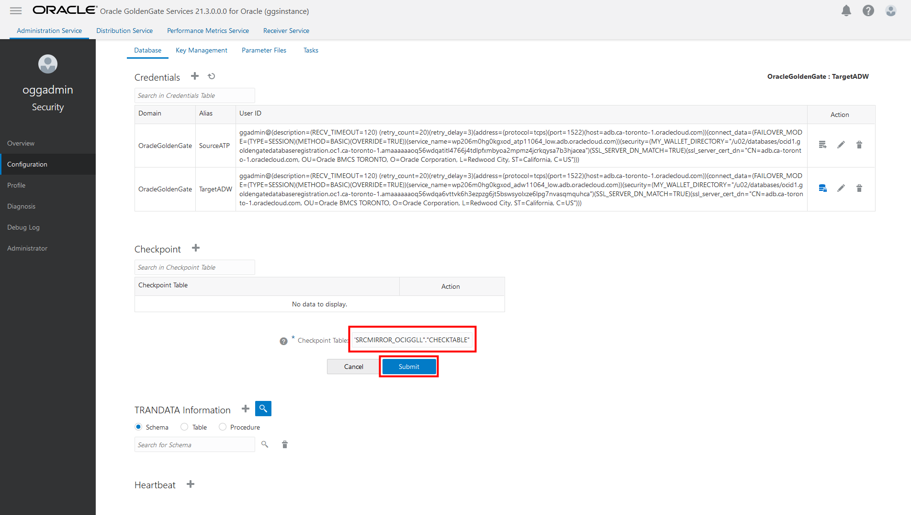

To return to the GoldenGate Deployment Console Home page, click **Overview** in the left navigation.

## **STEP 2:** Add and Run an Extract

1.  On the GoldenGate Deployment Console Home page, click the plus (+) icon for Extracts.

    

2.  On the Add Extract page, select **Integrated Extract**, and then click **Next**.

3.  For **Process Name**, enter UAEXT.

4.  For **Trail Name**, enter E1.

    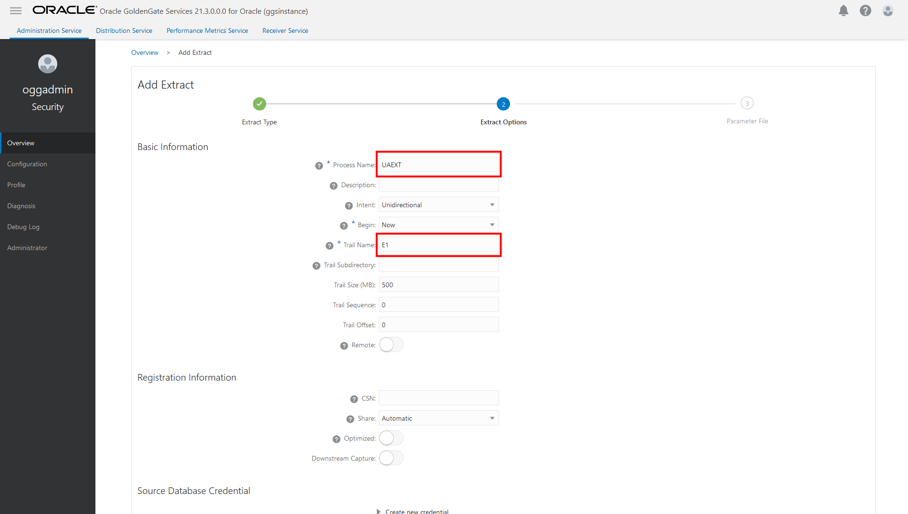

5.  Under **Source Database Credential**, for **Credential Domain**, select **OracleGoldenGate**.

6.  For **Credential Alias**, select the **SourceATP**.

    

7.  Under Managed Options, enable **Critical to deployment health**.

8.  Click **Next**.

9.  On the Parameter File page, in the text area, add a new line and the following text:

    ```
    <copy>Table SRC_OCIGGLL.*;</copy>
    ```

10. Click **Create**. You're returned to the OCI GoldenGate Deployment Console Home page.

11. In the UAEXT **Actions** menu, select **Start**. In the Confirm Action dialog, click **OK**.

    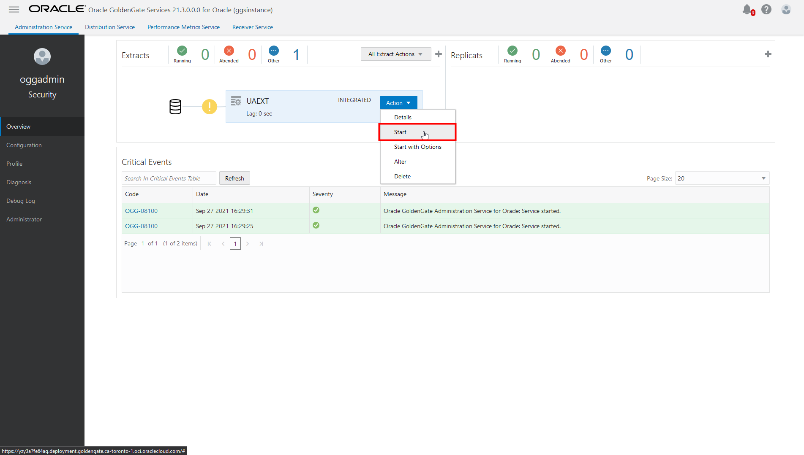

    The yellow exclamation point icon changes to a green checkmark.

    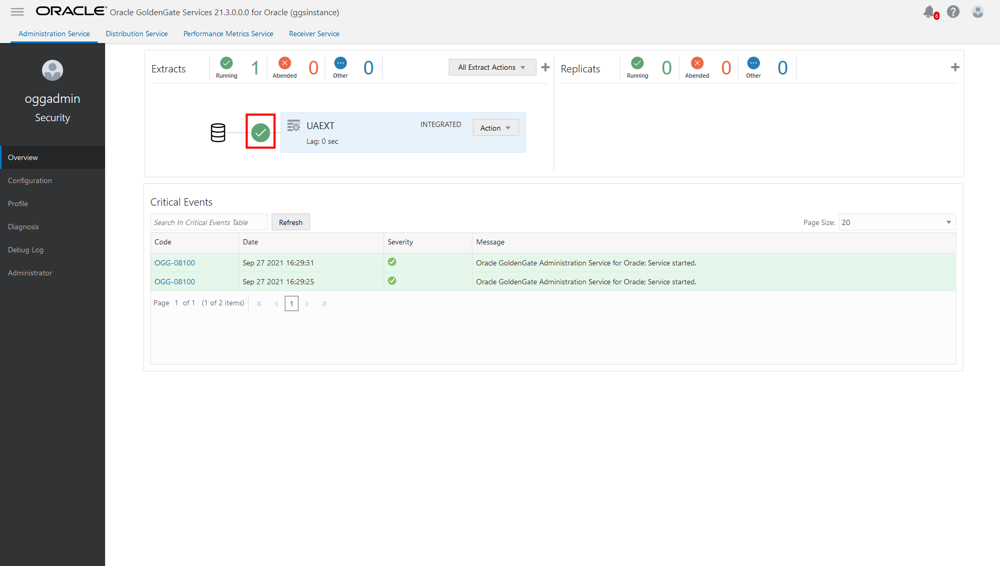

## **STEP 3**: Add and Run the Replicat

1.  On the GoldenGate Deployment Console Home page, click the plus (+) icon for Replicats.

    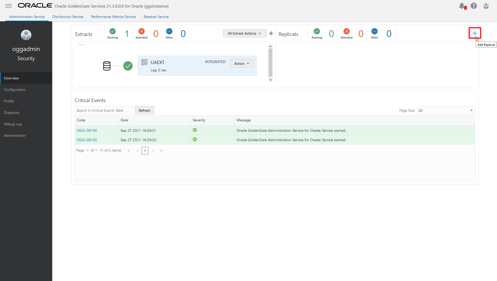

2.  On the Add Replicat page, select **Nonintegrated Replicat**, and then click **Next**.

3.  On the Replicate Options page, for **Process Name**, enter **Rep**.

4.  For **Credential Domain**, select **OracleGoldenGate**.

5.  For **Credential Alias**, select **TargetADW**.

6.  For **Trail Name**, enter E1.

7.  For **Checkpoint Table**, select **"SRCMIRROR_OCIGGLL","CHECKTABLE"**.

    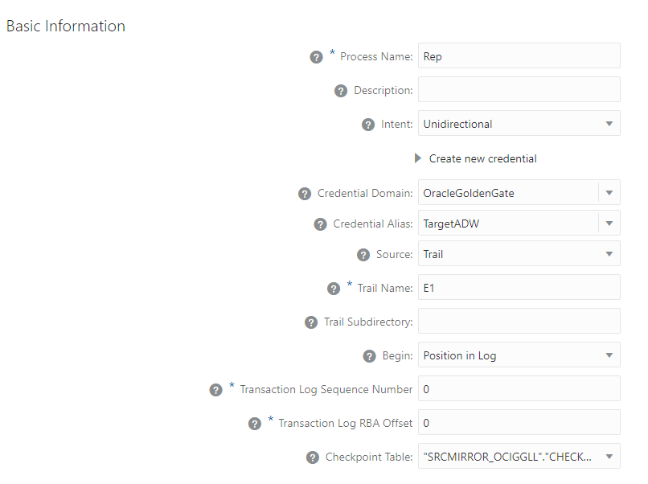

6.  Under **Managed Options**, enable **Critical to deployment health**.

7.  Click **Next**.

8.  In the **Parameter File** text area, replace **MAP \*.\*, TARGET \*.\*;** with **MAP SRC\_OCIGGLL.\*, TARGET SRCMIRROR\_OCIGGLL.\*;**

    

9.  Click **Create**.

10. In the Rep Replicat **Action** menu, select **Start**.

    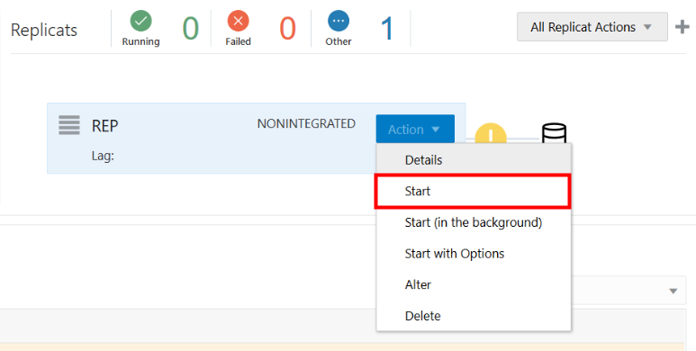

    The yellow exclamation point icon changes to a green checkmark.

In this lab, you created and ran an Extract and Replicat. You may now [proceed to the next lab](#next), to monitor these processes.

## Learn More

* [Creating an Extract](https://docs.oracle.com/en/cloud/paas/goldengate-service/using/goldengate-deployment-console.html#GUID-3B004DB0-2F41-4FC2-BDD4-4DE809F52448)
* [Creating a Replicat](https://docs.oracle.com/en/cloud/paas/goldengate-service/using/goldengate-deployment-console.html#GUID-063CCFD9-81E0-4FEC-AFCC-3C9D9D3B8953)

## Acknowledgements
* **Author** - Jenny Chan, Consulting User Assistance Developer, Database User Assistance
* **Contributors** -  Denis Gray, Database Product Management
* **Last Updated By/Date** - March 2021
