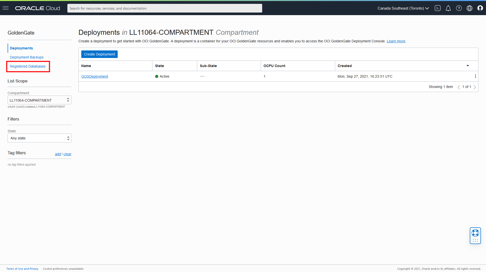
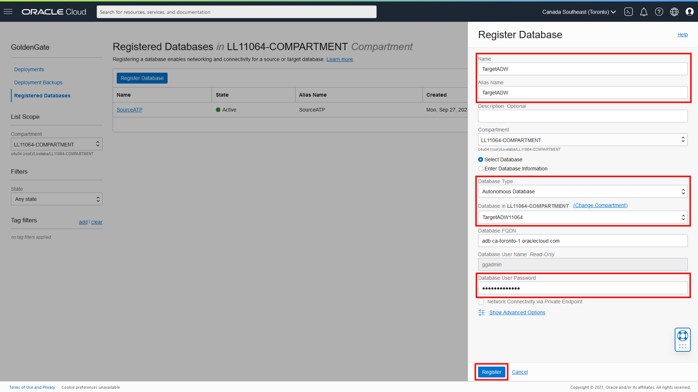

# Create a Database Registration

## Introduction

This lab walks you through the steps to create a database registration.

Estimated Lab Time: 2 minutes

### About Database Registrations
Database Registrations capture source and target credential information. A database registration also enables networking between the OCI GoldenGate service tenancy virtual cloud network (VCN) and your tenancy VCN using a private endpoint.

### Objectives
In this lab, you will register source and target databases for Oracle GoldenGate deployments to use for the duration of this lab.

## **STEP 1**: Register the Source Database

First, follow the steps below to register the source Oracle Autonomous Transaction Processing \(ATP\) Database.

1. Click **Registered Databases**.

    

2. Click **Register Database**.

    

3. In the Register Database panel, for Name and Alias, enter **SourceATP**.

4. From the Compartment dropdown, select a compartment.

5. Click **Select Database**.

6. From the Database Type dropdown, select **Autonomous Database**.

7. For **Autonomous Database in** *compartment*, click **Change Compartment**, select the compartment you created your ATP instance, and then select **ATPSource** from the dropdown. Some fields are autopopulated based on your selection.

8. Click **Register**.

    

## **STEP 2:** Register the Target Database

Now, follow the steps below to register the target Autonomous Data Warehouse \(ADW\) instance.

1. On the Registered Databases page, click **Register Database**.

2. In the Register Database panel, enter **TargetADW** for Name and Alias.

3. From the **Compartment** dropdown, select a compartment.

4. Click **Select Database**.

5. For **Autonomous Database in** *compartment*, click **Change Compartment**, select the compartment you created your ADW instance, and then select **ADWTarget** from the dropdown. Some fields are autopopulated based on your selection.

10. Click **Register**.

    

The source and target databases appear in the list of Registered Databases. You may now [proceed to the next lab](#next).

## Learn More

* [Managing Database Registrations](https://docs-uat.us.oracle.com/en/cloud/paas/goldengate-service/using/database-registrations.html)

## Acknowledgements
* **Author** - Jenny Chan, Consulting User Assistance Developer, Database User Assistance
* **Contributors** -  Denis Gray, Database Product Management
* **Last Updated By/Date** - March 2021

## Need Help?
Please submit feedback or ask for help using our [LiveLabs Support Forum](https://community.oracle.com/tech/developers/categories/livelabsdiscussions). Please click the **Log In** button and login using your Oracle Account. Click the **Ask A Question** button to the left to start a *New Discussion* or *Ask a Question*.  Please include your workshop name and lab name.  You can also include screenshots and attach files.  Engage directly with the author of the workshop.

If you do not have an Oracle Account, click [here](https://profile.oracle.com/myprofile/account/create-account.jspx) to create one.
