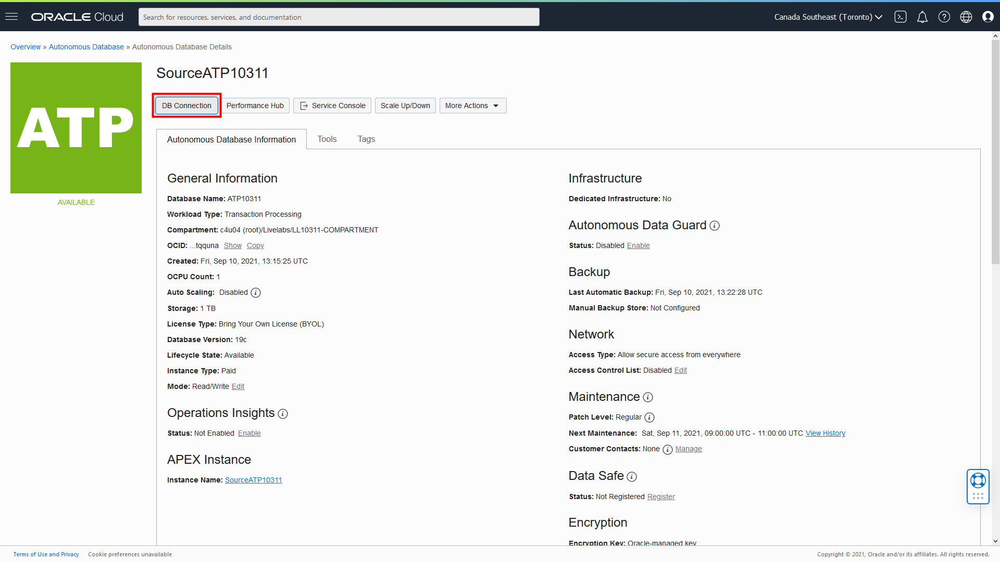
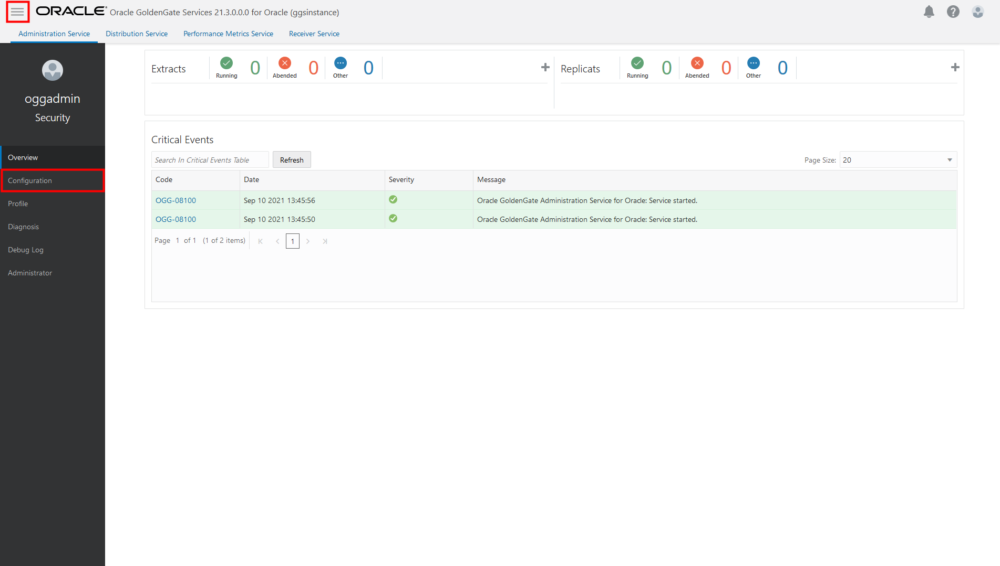
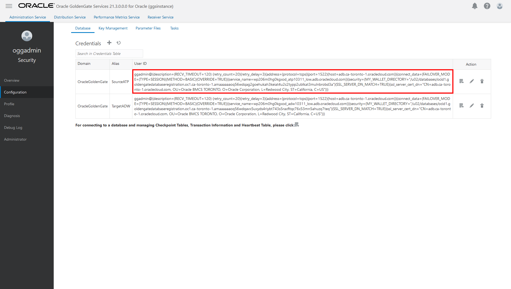
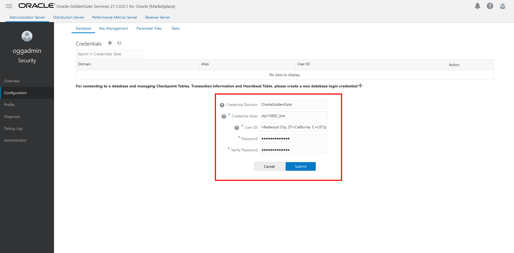
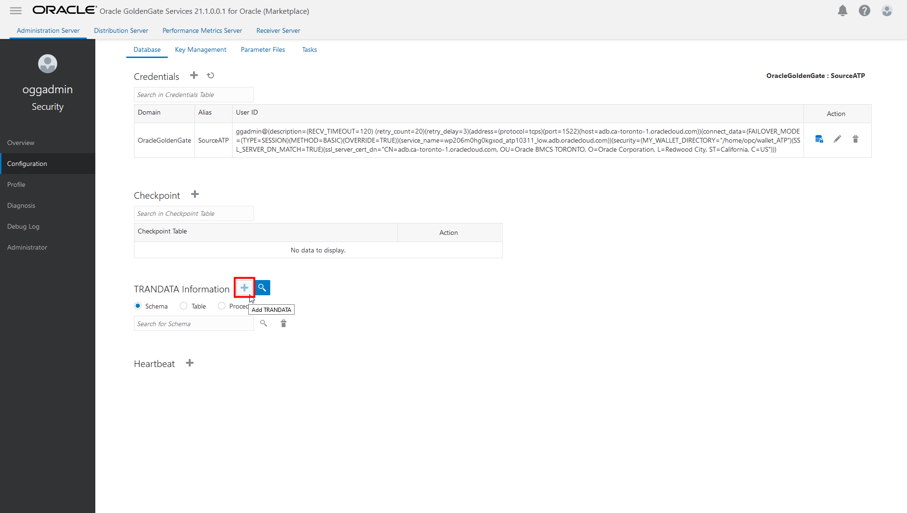

# Connect Oracle GoldenGate to Autonomous Transaction Processing

## Introduction

For the purposes of this workshop, Oracle Autonomous Transaction Processing (ATP) serves as the source database for your Oracle GoldenGate Marketplace deployment. This lab walks you through the steps to connect your Oracle GoldenGate Marketplace deployment to ATP.

Estimated lab time: 10 minutes

### Objectives

In this lab, you will:
* Download the ATP credentials
* Upload the ATP credentials to the Oracle GoldenGate Marketplace compute instance
* Add the ATP credentials in the Oracle GoldenGate Administration Server

## Prerequisites

* Follow the instructions for [Connecting to a Linux Instance ](https://docs.oracle.com/en-us/iaas/Content/Compute/Tasks/accessinginstance.htm#linux) to enter your private key for the Oracle GoldenGate Marketplace Compute instance.
* From the Configuration page of the OCI GoldenGate Deployment Console, copy the SourceATP Connection String.

## **STEP 1:** Download the Source ATP Client Credentials

1.  Navigate back to the Source ATP Autonomous Database Details page, and then click **Service Console**.

    

2.  In the Service Console, click **Administration**, and then click **Download Client Credentials (Wallet)**.

    

3.  In the Download Client Credentials (Wallet) dialog, enter the Source ATP Admin password twice, and then click **Download**.

4.  Close the Source ATP Service Console.

## **STEP 2:** Upload the Source ATP Credentials to Oracle GoldenGate

1.  In the OCI Console, open the navigation menu (hamburger icon), click **Compute**, and then click **Instances**.

    

2.  Under **List Scope**, ensure that the correct **Compartment** is selected for your workshop. You can find your compartment information in the Workshop Details of this LiveLab.

3.  Select **Oracle GoldenGate 21.1.0.0.1 Microservices Edition for Oracle**.

4.  On the Instance Details page, under **Instance Access**, copy the **Public IP Address**.

    

5.  Using a secure FTP client of your choosing, open a connection to the Oracle GoldenGate Marketplace instance using its Public IP Address.

6.  Upload the wallet\_ATP.zip and extract its contents to a new directory, such as **wallet\_ATP**.

    ```
    <code>mkdir wallet_ATP
    unzip wallet_ATP.zip -d wallet_ATP</code>
    ```

## **STEP 3:** Add the Source ATP credential in the Oracle GoldenGate Administration Server

1.  Launch the OCI GoldenGate Deployment Console.

2.  Open the navigation menu (hamburger icon) and then click **Configuration**.

    

3.  Copy the SourceATP connection string in the User ID column, and then paste it into a text editor.

    

4.  Edit the SourceATP connection string, replacing the value for **MY\_WALLET\_DIRECTORY** with the location where you unzipped the wallet_ATP.zip. For example, **/home/opc/wallet\_ATP**.

    

5.  In a new browser tab or window, enter **https://&lt;public-ip&gt;:443** to open the Service Manager.

6.  Log in to the Service Manager using **oggadmin** credentials found in **/home/opc/ogg-credentials.json**.

7.  In the Service Manager, under **Services**, click the port number associated with the Administration Server. The Administration Server opens in a new browser tab. If you're prompted to log in again, use the same oggadmin credentials.

    

8.  In the Administration Server, open the navigation menu (hamburger icon), and then select **Configuration**.

    

9.  Click **Add Credential**.

10. Enter the following information, and then click **Submit**:

    * For **Credential Domain**, enter **OracleGoldenGate**.
    * For **Credential Alias**, enter the ATP database name (low) from /home/opc/wallet\_ATP/tnsnames.ora. For example, **atp46130\_low**.
    * For **User ID**, paste the ATP connection string from step 4.
    * For **Password**, enter the ggadmin password created when you registered the Source Database.

    

14. Click **Connect to Database**.

    

15. Next to TRANDATA Information, click Add **TRANDATA**.

    

16. For **Schema Name**, enter **SRC_OCIGGLL**, and then click **Submit**.

In this lab, you created a connection from the Oracle GoldenGate Marketplace instance to the source ATP database. You can now proceed to the [next lab](#next).

## Acknowledgements
* **Author** - Jenny Chan, Consulting User Assistance Developer, Database User Assistance
* **Contributors** -  Denis Gray, Database Product Management
* **Last Updated By/Date** - Jenny Chan, July 2021
