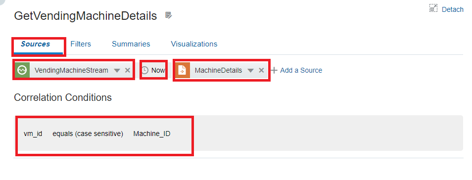
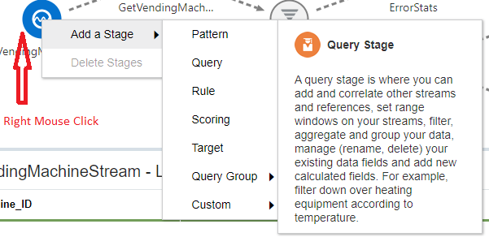
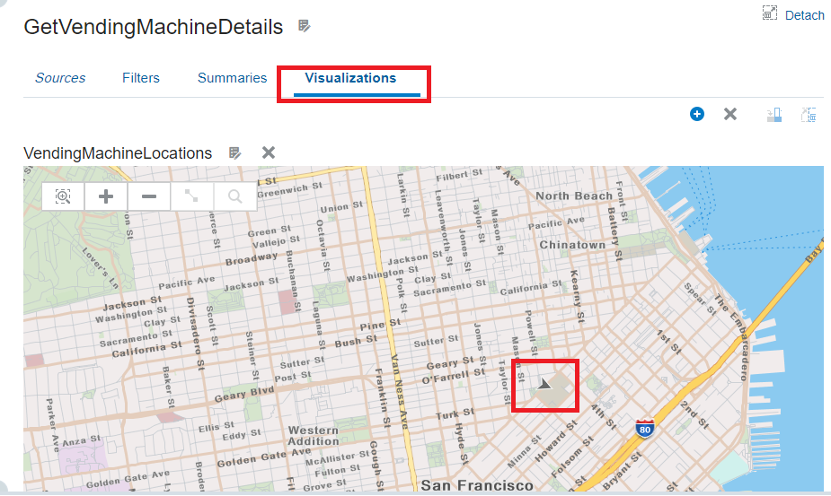
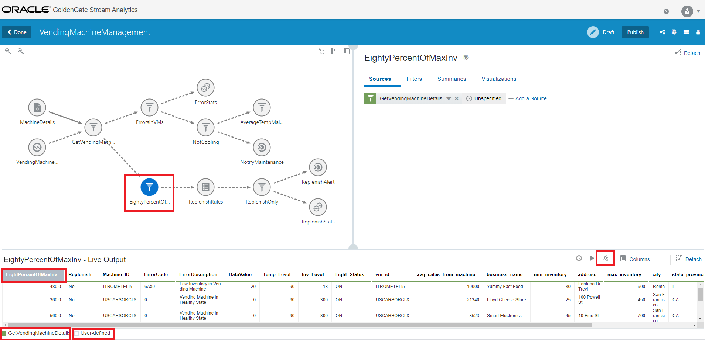
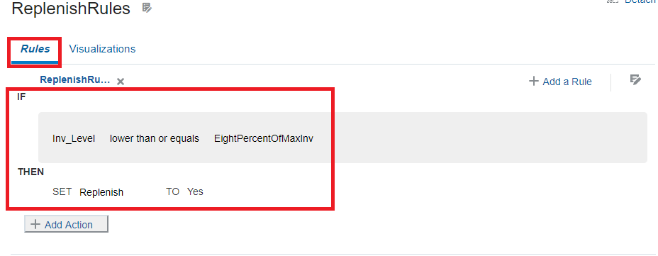
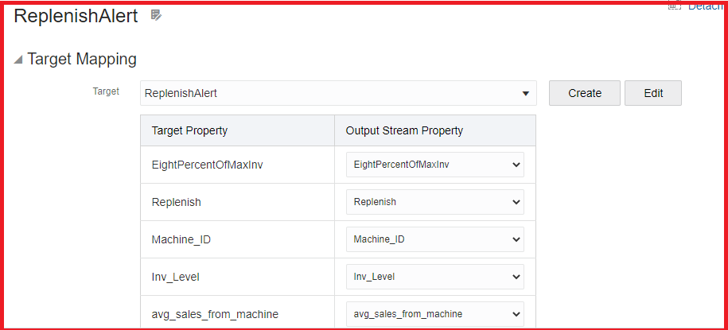
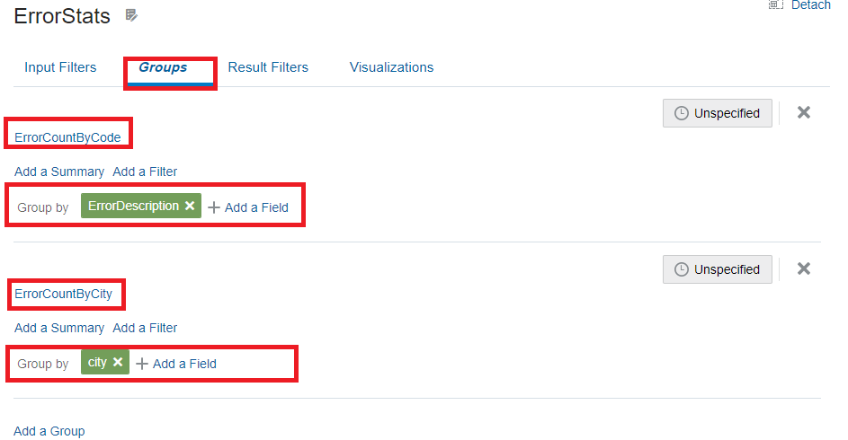

# Streaming IoT Data

## Introduction
In this scenario a management company wants to manage their vending machines which are located all around the world.  The vending machines are each equipped with various sensors that send live data to a central server alerting about any malfunctions such as temperature variations, low inventory and alike.  The input data in this use case comes from a flat-file simulating a live data stream that includes Machine ID, Error Code and Description, Inventory, Temperature levels and Light Status.

The company would like to enrich the data from a database table that contains each machine's specific location including latitude and longitude, an acceptable inventory level and how much in sales they produce on average.  They would then like to run analytics to alert them about low inventory and any malfunctions so that they could act and send the appropriate maintenance.

*Estimated Lab Time*: 30 minutes

### About Product/Technology
Golden Gate Stream Analytics (GGSA) is a tool designed to consume a stream of data from any source such as a database, GoldenGate, Kafka, JMS, REST or even a file system file.  Once the data is in GGSA you can run analytics on live data in real-time using transformation and action functionality of Spark and send the data downstream to any target of your choice.


### Objectives
- Walk through a sample IoT scenario
- Learn about multiple resources in GGSA and how they are created
- Understand the basic concepts of streaming with examples

A `pipeline` is a type of workflow made up of multiple stages such as query stage, a pattern stage, a business rule stage, a query group stage, a custom stage and many more. It is a Spark application where you can implement the business logic for any scenario in this case a vending machine management scenario.

### Prerequisites
This lab assumes you have:
- A Free Tier, Paid or LiveLabs Oracle Cloud account
- SSH Private Key to access the host via SSH
- You have completed:
    - Lab: Generate SSH Keys (*Brown Buttons* only)
    - Lab: Prepare Setup (*Brown Buttons* only)
    - Lab: Environment Setup
    - Lab: Initialize Environment

## **Step 1**: Create Pipelines and Adding Stages

1. In the left navigation bar of the Catalog page make sure Pipelines is checked and make sure that only the VendingMachineManagement pipeline is visible.

    

2. Open the `VendingMachineManagement` pipeline and see the live data streaming in the Live Output region at the bottom of the screen.

3. Click the Pause button on the middle right part of the screen to stop live streaming. The Pause icon should now turn into a triangle and live streaming should now be paused.

There are three sections in the pipeline screen.

  - Workflow: upper left region
  - Stage details: upper right region
  - Live Output: bottom region

Each circular icon represents a Stage in the workflow. A series of stages constitute a Pipeline. This pipeline is called VendingMachineManagement.

## **Step 2**: Create VendingMachineStream Stage

1. In the workflow region click on the left most stage VendingMachineStream and make sure it has been highlighted with the color blue.

2. This is the IoT Vending Machine Pipeline made up of 13 separate stages. Stay on the first stage *VendingMachineStream* with Live Output paused and understand the fields that are shown in the Live Output.  In this Lab the pipeline has already been created for you.  Follow the steps to understand how this pipeline was created.  You do not need to make any changes to the pipeline here.

 

This data comes from a csv file as streaming data that we saw in the previous lab. It could very well have come from a kafka topic, GoldenGate or JMS.

The data represents live data that comes from various machines around the world with individual IDs and various error conditions such as `Temp_Level` and `Inv_Level` etc. It also identifies each machine by the `Machine_ID` field

## **Step 3**: Create MachineDetails Stage

This is static data that comes from a database table as we saw in the previous lab. The fields represent information about each vending machine such as the address, zip code, latitude and longitude, where they are located as well as the `vm_id` which identifies that particular machine.

1. Click on this stage. Notice that you cannot highlight this stage as it is only static data from the database.

## **Step 4**: Create GetVendingMachineDetails Stage

1. Now highlight the *GetVendingMachineDetails* stage. Again, you will see that the data is streaming live in the Live Output region. Once again Pause the streaming data so you can understand the fields.

In this stage we are joining the VendingMachineStream with the MachineDetails in a query stage.

2. In the right details pane under *Sources* notice that we are joining two sources using a Correlation Conditions `Vm_id equals (case sensitive) Machine_ID`

As you can see this stage joins the two previous stages by their `Machine_ID` and `vm_id`. *Now* Represents the window of time for this stage. In this case we have selected *Now* to indicate that we are interested in the live data as it comes in.

  

3. Notice that we created the GetVendingMachineDetails by highlighting the VendingMachine Stage and then did a right click.

4. We then selected Add a Stage and then a Query.  Again in this lab just follow the steps without actually creating a new stage.

  

5. We then named this Query GetVendingMachineDetails and added a description.

  

6. Once the Stage has been created we edited it in the top right pane joining the two sources using Add a Source and select the Machine Details and adding the Correlation Conditions. You will get a chance to create various
stages in the next lab.

7. If the stream is paused click 'Resume' then click on the *Visualizations* tab. In this tab we can see the location of the vending machines with an arrow indicating its location within a geographic area. We were able to create this with the Geo Spatial type of graph from the drop down menu.


   


## **Step 5**: Create EightyPercentOfMaxInv Stage

1. Highlight the *EightyPercentOfMaxInv* stage and Pause the data. In this stage we are calculating 80% of the maximum inventory for each machine.  
2. After adding the stage as a query stage with name and description we clicked on the *fx* icon in the middle right part of the screen and filled out the formula:

    ```
    =0.8*max_inventory
    ```

3. We then clicked the checkmark to the left of the formula.

  

You will get a chance to add stages in the next lab.  In this lab just examine the formula we used with the mouse over the new added column EightyPercentOfMaxInv and see the formula.Again, we created this formula for this stage by using ***fx*** which gave us an additional column. Notice the left bottom part of the screen identifies which columns are user-defined by an empty box and which ones are part of the stream by a green color box.

  

## **Step 6**: Create ReplenishRules Stage

1. Click on the *ReplenishRules* stage and Pause the data stream to learn this stage. This is a Rule Stage where we get to define a rule setting Replenish to Yes if Inventory level is less than 80% of maximum inventory level.  Effectively we are setting a Replenish flag based on a minimum amount of inventory in each machine.

2. Here we have defined an if-then condition specified in the *Rules* tab.

    

## **Step 7**: Create ReplenishOnly Stage

1. Click on the *ReplenishOnly* stage and Pause the stream. This is another Query Stage in which we take the data from the last stage and apply a filter to it.  
2. Click on the *`Filters`* tab and notice that we added a condition that only includes Replenish conditions that are set to Yes, because we are only interested in data from machines that require replenishment.

    ```
    Replenish equals (case sensitive) Yes
    ```
## **Step 8**: Create ReplenishAlert Stage

1. Now click on the *ReplenishAlert* stage and Pause.
2. In this stage we are adding a target stage that we have defined for a kafka topic replenishAlert.

   

3. The fields in the topic have been predefined but we could have easily defined the necessary fields for our new target or even edited the existing target. Notice that in this stage we mapped the existing data from our stream Output Stream Property to the topic fields Target Property as appropriate

    

## **Step 9**: Create ReplenishStats Stage

1. Click on the *ReplenishStats* stage and Pause the stream. In this alternate last stage we would like to keep track of the number of machines that are set to Replenish by city and by `business_name`.

2. This is a Query Group - Stream stage.  Click on the *`Groups`* tab and notice that we have added two summaries.  Click on the *ReplenishCountByCity* and see the summary with the COUNT of all Replenish and then a *Group by* city and then a second summary with *Group by* `business_name`


    

3. Click on the *Visualizations* tab and see the statistics in a pie chart for each group by.
4. Here we have clicked on Add A Visualization and selected what type of chart we would like to create.  Then filled out what we require to use for Measure and Group. In the next lab you will get to create visualizations for a new scenario.


    

The next stage is in a parallel branch of the pipeline where we are interested to get data on machines that are not functioning properly.

## **Step 10**: Create ErrorsInVMs Stage

1. Click on the *ErrorsInVMS* stage and Pause.  In this stage we would like to filter out all machines that are working correctly because they do not require any maintenance.  
2. Click on the *`Filters`* tab and see the query condition:

    ```
    ErrorCode not equals 0
    ```

## **Step 11**: Create ErrorStats Stage

1. Click on the *ErrorStats* stage and Pause the stream. This is a Query-Group Stream  stage where we like to get some statistics on number of malfunctioning machines by description and also by what city they occur in.
2. Click on the *Groups* tab.
3. Notice that in this tab we have added a summary with COUNT of ErrorCode and then Group by ErrorDescription. Next we added another summary with COUNT of ErrorCode and then Group by city.

    

4. Click on the *`Visualization`* tab to see the bar char for the error stats by type and city.

## **Step 12**: Create NotCooling Stage

1. Click on the *NotCooling* stage in the parallel branch and Pause.  
2. Here we would like to isolate machines that are not cooling well by setting this query condition.Click on the *`Filters`* tab on the right to see the query condition:

    ```
    Temp_Level greater than 40
    ```

## **Step 13**: Create NotifyMaintenance Stage

1. Click on the *NotifyMaintenance* stage and Pause the stream. In this last stage we are sending the streaming data to a pre-defined Kafka topic for maintenance purposes.  
2. Once again, we have mapped the streaming data Output Stream Property values to the kafka topic with Target Property values. We could have also created the topics in this stage as opposed to using a predefined topic.


## **Step 14**: Create AverageTempMalfunction Stage

1. Finally click on the *AverageTempMalfunction* stage and Pause.  
2. In this stage we are interested in the Average temperature of malfunctioning machines, so we defined a query stage and added *Summaries* with the AVG - `Temp_Level` of all the machines and then Group by the type of machine which is identified by the `Machine_ID`.  Click on the *AvgTemp* to see the summary.

    

3. Click on the *`Visualizations`* tab to view the bar chart for the average temperature of all machines that malfunctioned by type.
4. Clik on *Done* to exit the pipeline.

You may now [proceed to the next lab](#next).

## Learn More
* [GoldenGate Stream Analytics](https://www.oracle.com/middleware/technologies)

## Rate this Workshop
When you are finished don't forget to rate this workshop!  We rely on this feedback to help us improve and refine our LiveLabs catalog.  Follow the steps to submit your rating.

1.  Go back to your **workshop homepage** in LiveLabs by searching for your workshop and clicking the Launch button.
2.  Click on any of the **Brown Buttons** to re-access the workshop  

    

3.  Click **Rate this workshop**

    

If you selected the **Green Button** for this workshop and still have an active reservation, you can also rate by going to My Reservations -> Launch Workshop.

## Acknowledgements

* **Author** - Hadi Javaherian, Solution Engineer
* **Contributors** - Shrinidhi Kulkarni, Meghana Banka, Rene Fontcha
* **Last Updated By/Date** - Rene Fontcha, LiveLabs Platform Lead, NA Technology, February 2021


