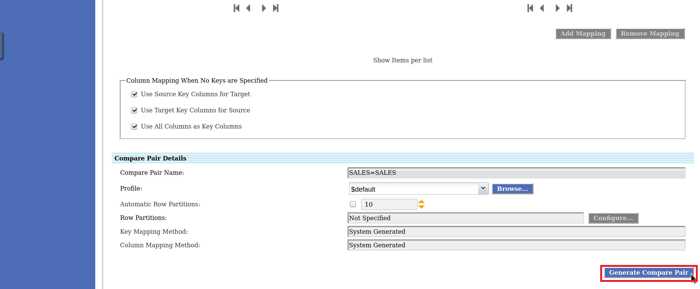
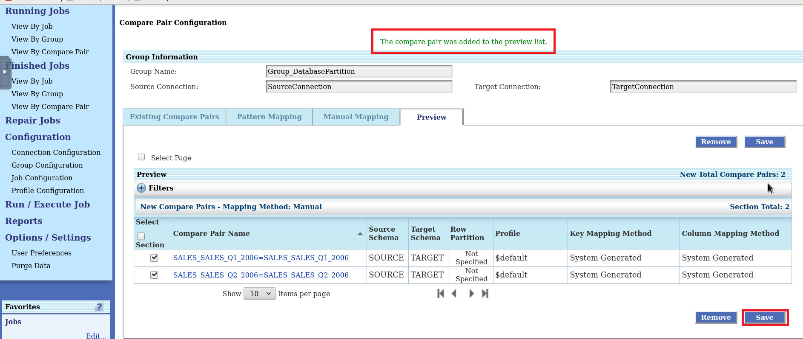

# Configure Database Row Partitions

## Introduction
This lab describes how to map existing database partitioning.

If you have the database tables partitions defined then, those partitions can be mapped and can be split further using Manual Row Partitions or Automatic Row Partitions. Compare pairs are generated per Table Partitions based on the selected mappings.

The database tables partitions are shown only when both source and target are Oracle and the tables have already partitions defined at database.

*Estimated Lab Time*: 15 minutes

### Objectives
In this lab, you will:
* Create Database Row Partitioning

### Prerequisites
This lab assumes you have:

* A Free Tier, Paid or LiveLabs Oracle Cloud account
* SSH Private Key to access the host via SSH
* You have completed:
    * Lab: Generate SSH Keys (Free-tier and Paid Tenants only)
    * Lab: Prepare Setup (Free-tier and Paid Tenants only)
    * Lab: Environment Setup
    * Lab: Initialize Environment
* From the [Get Started with Oracle GoldenGate Veridata Workshop](https://apexapps.oracle.com/pls/apex/dbpm/r/livelabs/workshop-attendee-2?p210_workshop_id=833&p210_type=1&session=13638147975386), the following are required to complete this lab:
    * Source and Target connections are created as described in [Lab: Create Datasource Connections](https://apexapps.oracle.com/pls/apex/dbpm/r/livelabs/workshop-attendee-2?p210_workshop_id=833&p210_type=1&session=13638147975386).
    * Follow the steps to [Create a Group](https://apexapps.oracle.com/pls/apex/dbpm/r/livelabs/workshop-attendee-2?p210_workshop_id=833&p210_type=1&session=13638147975386).  Let the Group Name be **Group_DBPartition**.
    * Follow the steps 1 to 2 in [Create Compare Pairs (on Manual Mapping Tab)](https://apexapps.oracle.com/pls/apex/dbpm/r/livelabs/workshop-attendee-2?p210_workshop_id=833&p210_type=1&session=1455719632468).

## **STEP 1:** Configure Database Row Partitioning
To configure Database Row Partitioning:
1. In the Compare Pair Configuration page, click **Manual Mapping**.
2. Select a Source **Schema** and a Target **Schema** under **Datasource Information**, and then select the tables from **Source Tables** and **Target Tables** for Manual Compare Pair Mapping. Enter:
    * Source schema: **SOURCE**
    * Target schema: **TARGET**
    * Source Table: **sales**
    * Target Table: **sales**
      

3. Select the source and target tables from **Source Table Partitions** and **Target Table Partitions**:
    * Source Table Partitions: **SALES_Q1_2006**
    * Target Table Partitions: **SALES_Q1_2006**

      

4. Click **Add Mapping** to map the selected database Table Partitions. You can also map multiple database Table Partitions before generating the compare-pair.

    

5. Click **Generate Mappings**. The control moves to the **Preview** tab.

    
6. Click **Save** to save the generated compare pair. The control moves to the **Existing Compare Pairs** tab.

    

  You may now proceed to the lab on [Creating and Executing Jobs](https://apexapps.oracle.com/pls/apex/dbpm/r/livelabs/workshop-attendee-2?p210_workshop_id=833&p210_type=1&session=1455719632468) to create a new job. Add the **Group_DBPartition** Group to this job.

  Watch our short video that explains the partitioning feature in Oracle GoldenGate Veridata:

    

Watch our short video that explains the partitioning feature in Oracle GoldenGate Veridata:

## Want to Learn More?

* [Oracle GoldenGate Veridata Documentation](https://docs.oracle.com/en/middleware/goldengate/veridata/12.2.1.4/index.html)
* [Configuring Partitions in Oracle GoldenGate Veridata ](https://docs.oracle.com/en/middleware/goldengate/veridata/12.2.1.4/gvdug/configure-workflow-objects.html#GUID-03B3876F-7A79-43BA-9E14-8B216BD8F3BB)

## Acknowledgements
* **Author** - Anuradha Chepuri, Principal UA Developer, Oracle GoldenGate User Assistance
* **Contributors** -  Nisharahmed Soneji, Senior Principal Product Manager and Sukin Varghese, Senior Member of Technical staff
* **Last Updated By/Date** - Anuradha Chepuri, September 2021
