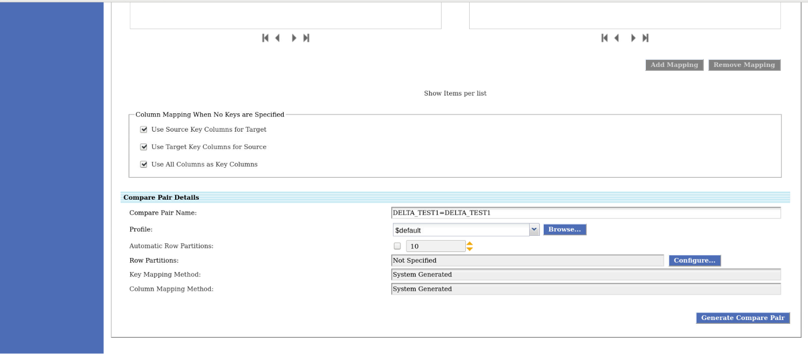
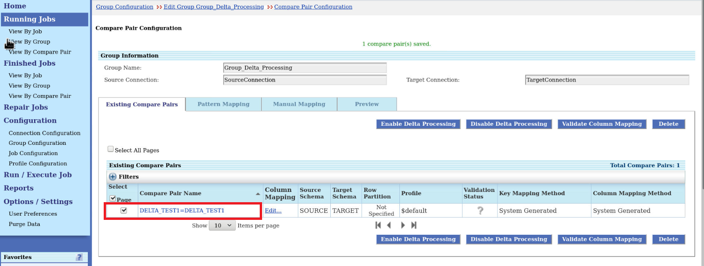
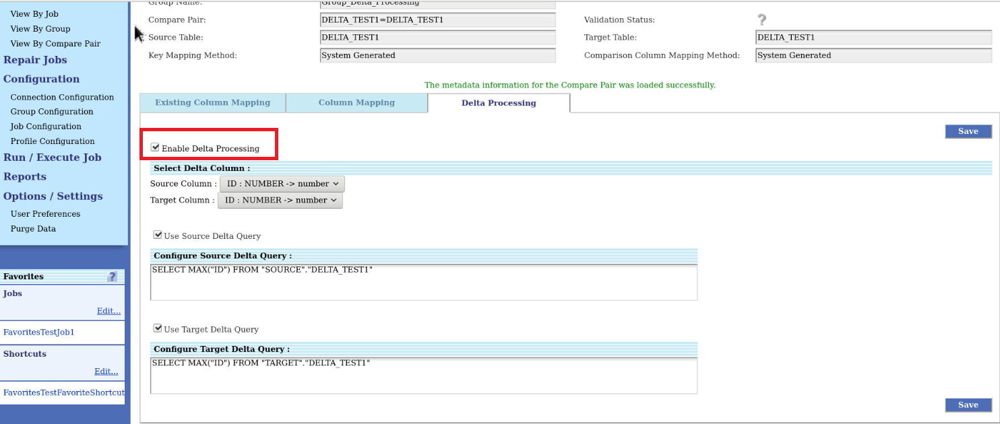
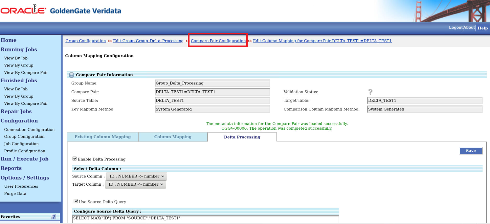
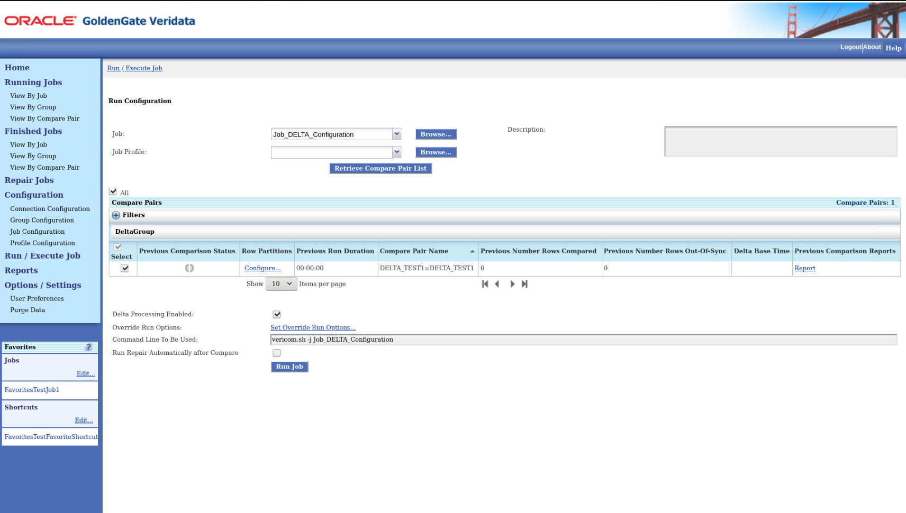
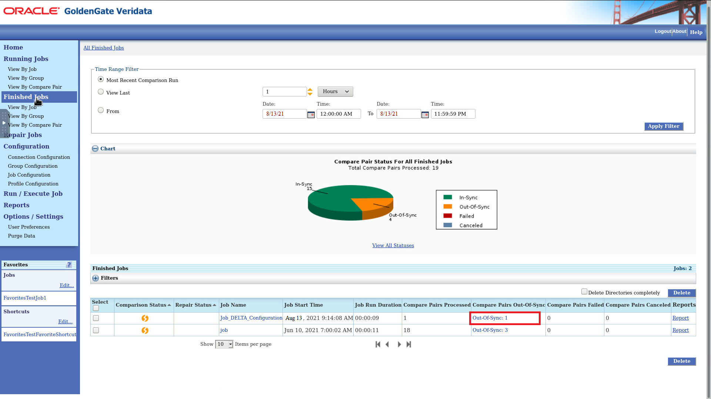
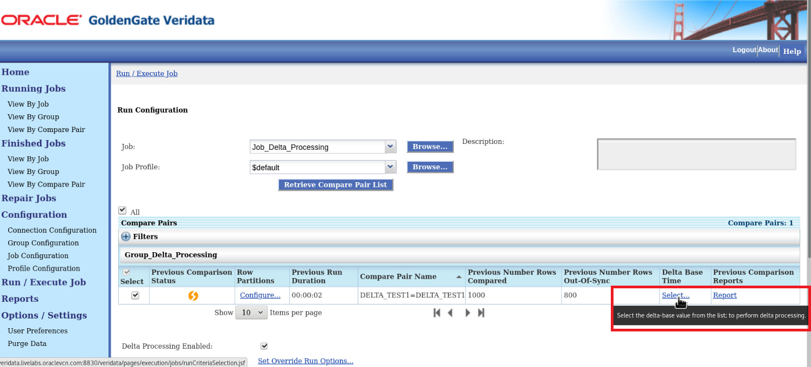
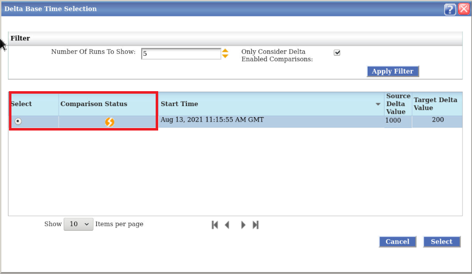
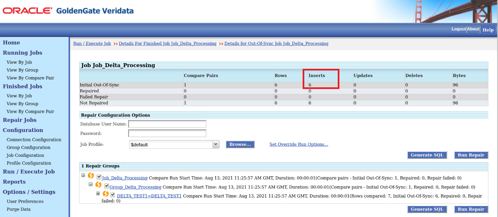
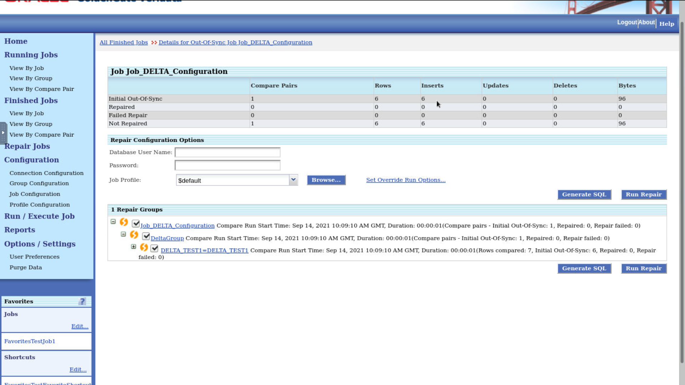

# Configure Delta Comparison in Oracle GoldenGate Veridata

## Introduction
This lab shows you how to enable delta comparison for database compare pairs in Oracle GoldenGate Veridata.

Oracle GoldenGate Veridata compares a source database table to the target database table. The source and target tables are configured using compare pairs, which are grouped and added to a job to run the comparison (see lab). When all the rows in the table are compared, it is a Full Comparison Job.

During the subsequent runs of a comparison job, the comparison of the tables can be performed based on what has changed in the tables from previous job run; these jobs are Delta Processing Jobs. Delta processing is usually performed on tables that contain a large number of rows so it is probable that in these tables there will be columns eligible for delta processing.

### What Do You Need?

+ **An existing Oracle GoldenGate Veridata install that is functional, version 12.2.1.2 and higher**

## Task 1: Configure Delta Comparison

1. In the Oracle GoldenGate Veridata UI, click **Group Configuration**, select a group, click Edit, and click **Go to Compare Pair Configuration** to display the **Compare Pair Configuration** page.
2. Click **Manual Mapping**.
3. Select a Source **Schema** and a Target **Schema** under **Datasource Information**, and then select the tables from **Source Tables** and **Target Tables** for Manual Compare Pair Mapping.
Enter:
    * Source schema: **SOURCE**
    * Target schema: **TARGET**
    * Source Table: **DELTA\_TEST1**
    * Target Table: **DELTA\_TEST1**

    
4. Click **Generate Compare Pair**.
    
5. Click **Save** to save the generated compare pairs on the **Preview** tab.
6. Click the **Existing Compare Pairs** tab, select the Compare Pair **DELTA\_TEST1=DELTA\_TEST1** and click **Edit** under **Column Mapping**.

      

7.  Click the **Delta Processing** tab, check the **Enable Delta Processing** check box, and then click **Save**.

    

8. Notice the successful operation and then click the **Compare Pair Configuration** link.

    

    Delta Processing is enabled. Notice the orange triangular icon next to the compare pairs on the **Existing Compare Pairs** tab:
    

9.  Create a job and add the previously configured group to the job.

10. Click **Run/Execute Job** to run the job. Select the job you just created from the **Job** drop-down list, click **Retrieve Compare Pair List**, and then click **Run Job**.

    

11. Click **Finished Jobs** and click **Out-of-Sync:1** link for the job you ran now. out-of-sync:1 to be highlighted.

     

    Note that for the 1st job run, the **Out-of-Sync is 800 rows with 800-Inserts**. Next, let's insert 5 more **Inserts** to the source database from the Terminal.

12. Open the terminal.
13. Run the following command:
  ```
  <copy>
  cd /home/opc/stage/scripts
  source env_setup.sh
  sqlplus
  </copy>

  ```
14. Enter the following credentials:
      * **User Name**: source
      * **Password**: source
15. Enter the following INSERT query:

      ```
      <copy>
      insert into delta_test1 values ('2000',2000);
      insert into delta_test1 values ('2001',2001);
      insert into delta_test1 values ('2002',2002);
      insert into delta_test1 values ('2003',2003);
      insert into delta_test1 values ('2004',2004);
      commit;

      </copy>
     ```
16. Press Enter.
      Next, go back to the Oracle GoldenGate Veridata UI run the job again with Delta Base Time to retrieve the delta out-of-sync entries between the 2 job runs.

17.  In the **Run/Execute Job** page, select **Job\_Delta\_Processing** from the **Job** drop-down list and click **Retrieve Compare Pair List**.   

18. Click **Select...** under **Delta Base Time** to select the delta-base time from the list to perform delta processing.

      

19. In the **Delta Base Time Selection** page, select **Base Time** and then click **Select**.

      

20. Notice the Delta Base Time has been updated to the time slot selected in the previous step.

    

21. Run the Job.

22. Click **Finished Jobs** and click **Out-of-Sync:1** link for the job you ran now.


      

Now, Out-of-Sync is 6 Rows with 6 Inserts (1+delta).

      

## Want to Learn More?
* [Using Delta Processing ](https://docs.oracle.com/en/middleware/goldengate/veridata/12.2.1.4/gvdug/configure-workflow-objects.html#GUID-02F4F2D3-2828-4504-8968-C87231752115)
* [Using Oracle GoldenGate Veridata](https://docs.oracle.com/en/middleware/goldengate/veridata/12.2.1.4/gvdug/intro-veridata.html#GUID-5E0D122D-913C-4307-97FB-DF815409FB14)
* [Oracle GoldenGate Veridata Documentation](https://docs.oracle.com/en/middleware/goldengate/veridata/index.html)


## Acknowledgements
* **Author** - Anuradha Chepuri, Principal UA Developer, Oracle GoldenGate User Assistance
* **Contributors** -  Nisharahmed Soneji, Senior Principal Product Manager and Sukin Varghese, Senior Member of Technical staff
* **Last Updated By/Date** - Anuradha Chepuri, September 2021
