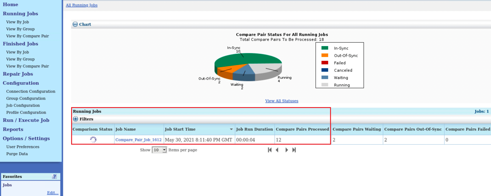

# Create Jobs and Execute Jobs

## Introduction
This lab describes how to create and execute Jobs.

You must create and execute the job to run the comparisons. The job configuration determines which compare pair groups are processed.

*Estimated Lab Time*: 30 minutes

### Objectives
In this lab, you will:
* Create a job for the Compare Pair Groups.
* Run the job.

### Prerequisites
This lab assumes you have:

* A Free Tier, Paid or LiveLabs Oracle Cloud account
* SSH Private Key to access the host via SSH
* You have completed:
    * Lab: Generate SSH Keys (Free-tier and Paid Tenants only)
    * Lab: Prepare Setup (Free-tier and Paid Tenants only)
    * Lab: Environment Setup
    * Lab: Initialize Environment
* The following are required to complete this lab:
    * Source and Target connections are created as described in **Lab: Create Datasource Connections**.
    * Groups and Compare Pairs are configured as described in **Lab: Create Groups and Compare Pairs**.

## **STEP 1**: Create a Job for the Compare Pair Group
  To create a job:
1. From the left navigation pane, click **Configuration** and **Job configuration** to display the **Job Configuration** page.
    
2. Click **New** to display the **New Job Assistant** page.
3. Enter a **Name** and **Description** for the new job, click **Next**.
    
4. Enter the **Group Name** that you want to link to this job and click **Apply Filter**.
    
5. Select the Group and click **Finish**.
    
A new job is created for the compare pair.

## **STEP 2**: Execute the Job
To execute a job:
1. From the left navigation pane, click **Run/Execute Job** to display the **Run configuration** page.
    
2. Select the job you just created from the **Job** drop-down list and click **Run Job**.
    
3. From the left navigation pane, click **Running Jobs** to display the status of the jobs that are running.
  
4. From the left navigation pane, click **Finished Jobs** to display the completed job and the details of the compare pairs.
    

You may now [proceed to the next lab](https://oracle.github.io/learning-library/data-management-library/goldengate/veridata-install-connections/workshops/freetier/?lab=ggv-repair-data)

## Learn More
* [Oracle GoldenGate Veridata Documentation](https://docs.oracle.com/en/middleware/goldengate/veridata/12.2.1.4/index.html)
* [Configuring Groups](https://docs.oracle.com/en/middleware/goldengate/veridata/12.2.1.4/gvdug/configure-workflow-objects.html#GUID-70B42ABB-EA8E-4ADF-8414-7EA1752CA7E6)
* [Compare Pairs](https://docs.oracle.com/en/middleware/goldengate/veridata/12.2.1.4/gvdug/configure-workflow-objects.html#GUID-055CE119-0307-4826-98C7-A51F53E28763)
* [Jobs](https://docs.oracle.com/en/middleware/goldengate/veridata/12.2.1.4/gvdug/working-jobs.html#GUID-EE434517-18EB-4827-A05F-D420D9E5B0DD)

## Acknowledgements
* **Author** - Anuradha Chepuri, Principal UA Developer, Oracle GoldenGate User Assistance
* **Contributors** -  Nisharahmed Soneji and Sukin Varghese
* **Last Updated By/Date** - Anuradha Chepuri, June 2021
