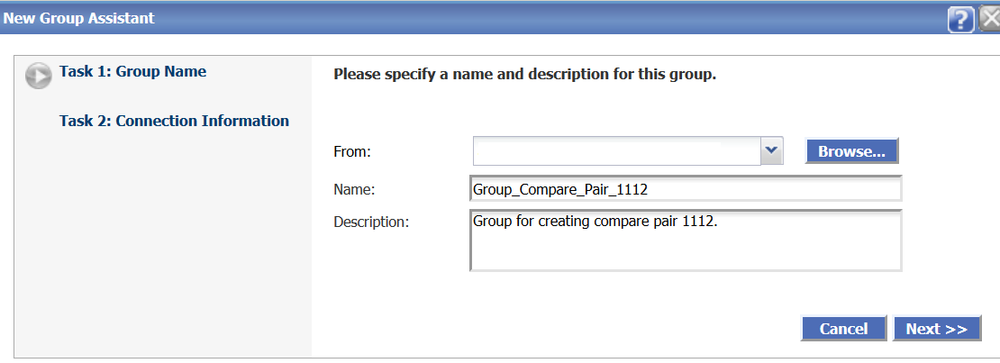

# Create Groups and Compare Pairs

## Introduction
This lab describes how to groups and compare pairs. Groups are logical containers for one or more compare pairs. They help you to organize and partition large or diverse sets of data into more manageable units. Groups are linked to jobs when jobs are created. Any group can be linked to one or more jobs, allowing you complete control over how and when data is compared.

A group is associated with a set of connections to the source and target data.

A compare pair is the logical relationship between a source table or file and a target table or file for the purpose of comparing their data. Compare pairs are linked to groups. Because of this, all of the source and target objects that you configure into compare pairs for any given group must be accessible from the datasource connections that are associated with that group.

### What Do You Need?

+ **Oracle GoldenGate Veridata installed**
+ **Source and Target connections as described in Lab 2**

## **STEP 1:** Create a Group

To create a group:
1. From the left navigation pane, click **Configuration** and then click **Group Configuration** to display the **Group configuration** page.
    
2. Click **New** to display the **New Connection Assistant** page to create a group.
3. Click **Browse** to select a template for the group from the **From** drop-down list.
4. Enter the **Name** and **Description** for the Group and click **Next**.
  
4. Click **Next** to enter the connection information.
5. Browse to select the **Source Connection** and **Target Connection** (that you have created in Lab 2).
  
6. Click **Finish**.
## Want to Learn More?

* [Oracle GoldenGate Veridata Documentation](https://docs.oracle.com/en/middleware/goldengate/veridata/12.2.1.4/index.html)
* [Configuring Connections](https://docs.oracle.com/en/middleware/goldengate/veridata/12.2.1.4/gvdug/configure-workflow-objects.html#GUID-75005B4D-5C24-4467-A68B-1FE66A168905)

## Acknowledgements

* **Author:**
    + Anuradha Chepuri, Principal UA Developer, Oracle GoldenGate User Assistance
* **Reviewed by:**
    + Avinash Yadagere, Principal Member Technical Staff, Oracle GoldenGate Development
    + Sukin Varghese, Senior Member of Technical staff, Database Test Dev/Tools/Platform Testing

* **Last Updated By/Date:** Anuradha Chepuri, December 2020

## Need Help?
Please submit feedback or ask for help using our [LiveLabs Support Forum](https://community.oracle.com/tech/developers/categories/livelabsdiscussions). Please click the **Log In** button and login using your Oracle Account. Click the **Ask A Question** button to the left to start a *New Discussion* or *Ask a Question*. Please include your workshop name and lab name.  You can also include screenshots and attach files. Engage directly with the author of the workshop.

If you do not have an Oracle Account, click [here](https://profile.oracle.com/myprofile/account/create-account.jspx) to create one.
