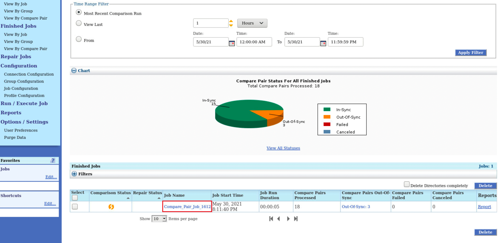
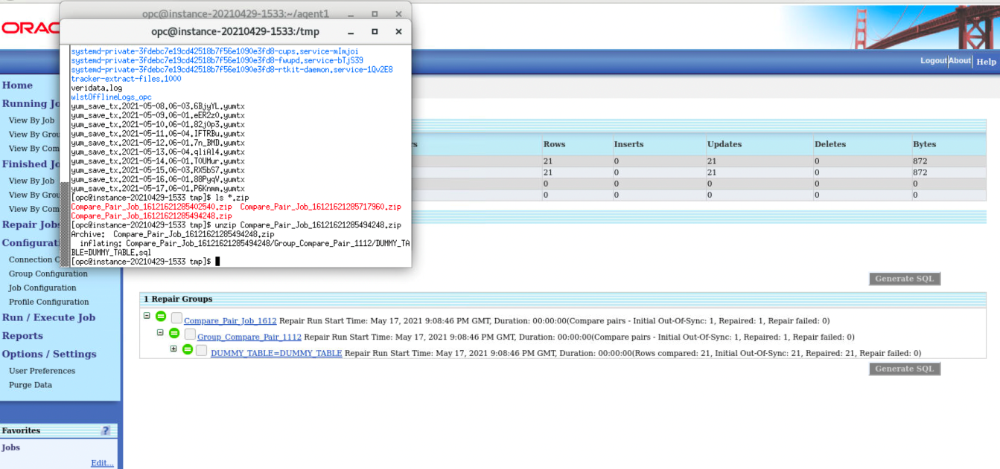

# Repair Out-of-Sync Jobs and Generate SQL Files

## Introduction
From the Finished Jobs page, you can select the out-of-sync comparisons for repair. Jobs, groups, and compare pairs can be selected for repair.

The Repair Jobs page displays a summary of all repair jobs. You can use the Filters on this page to display older repair jobs and to filter repair jobs by repair status and job name.

Oracle GoldenGate Veridata provides the Generate SQL functionality which generates SQL files for the source and target tables associated with the out-of-sync jobs. To do that, the Oracle GoldenGate Veridata generates the SQL Statements in the background and executes these SQL statements onto the target database.

You can also look at these SQL Statements before the Oracle GoldenGate Veridata executes them onto the target database, or execute these SQL statements by yourself on any of the other database tools. With the Generate Repair SQL functionality, you can generate the SQL statements for all your out-of-sync-records, and can also execute them at your convenience.

### What Do You Need?

+ **Oracle GoldenGate Veridata installed**
+ **Groups and Compare Pairs have been created as described in Lab 3**
+ **Jobs have been created and executed as described in Lab 3**

To begin with, ensure that you have completed Lab 3.
## **STEP 1:** Repair Out-of-Sync Jobs
  To repair out-of-sync jobs:
  1. From the left navigation pane, click **Finished Jobs** to view the page containing details of all the finished jobs. You can select Jobs, groups, and compare pairs for generating SQL statements.
  2. From the table under **Finished Jobs**, click the **Out-Of-Sync** link for the selected Job.
    
  3. Click **Run Repair**.
    
  The out-of-sync records for the selected job are repaired.
    

## **STEP 2:** Generate SQL files
  To generate SQL files:
  1. From the left navigation pane, click **Finished Jobs** to view the page containing details of all the finished jobs. You can select Jobs, groups, and compare pairs for generating SQL statements.
  2. To generate SQL statements for out-of-sync data, select the record from the finished jobs and click **Generate SQL**.
    
    The SQL file gets generated:
    
  3. Login to the DB terminal to view the generated SQL file:
    
  4. Unzip the SQL file to view its contents.
    

## Want to Learn More?
* [Oracle GoldenGate Veridata Documentation](https://docs.oracle.com/en/middleware/goldengate/veridata/12.2.1.4/index.html)
* [Repair Data](https://docs.oracle.com/en/middleware/goldengate/veridata/12.2.1.4/gvdug/working-jobs.html#GUID-B46185DF-4B7E-4647-8BE2-F7176E1FFDFF)
* [Generate SQL File](https://docs.oracle.com/en/middleware/goldengate/veridata/12.2.1.4/gvdug/working-jobs.html#GUID-0AA3E8E2-BAD3-41D2-83CD-E8986C69A3AB)

## Acknowledgements

* **Author:**
    + Anuradha Chepuri, Principal UA Developer, Oracle GoldenGate User Assistance
* **Reviewed by:**
    + Nisharahmed Soneji, Senior Principal Product Manager, GoldenGate Development
    + Sukin Varghese, Senior Member of Technical staff, Database Test Dev/Tools/Platform Testing

* **Last Updated By/Date:** Anuradha Chepuri, January 2021

## Need Help?
Please submit feedback or ask for help using our [LiveLabs Support Forum](https://community.oracle.com/tech/developers/categories/livelabsdiscussions). Please click the **Log In** button and login using your Oracle Account. Click the **Ask A Question** button to the left to start a *New Discussion* or *Ask a Question*. Please include your workshop name and lab name.  You can also include screenshots and attach files. Engage directly with the author of the workshop.

If you do not have an Oracle Account, click [here](https://profile.oracle.com/myprofile/account/create-account.jspx) to create one.
