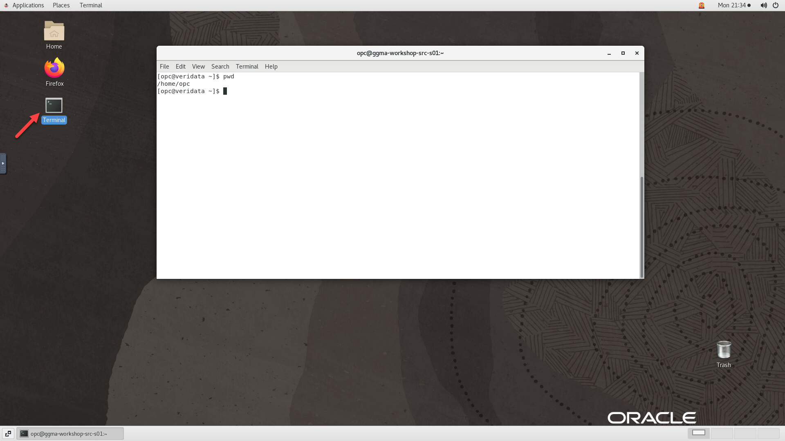

# Initialize Environment

## Introduction

In this lab we will review and startup all components required to successfully run this workshop.

*Estimated Lab Time:* 10 Minutes.

### Objectives
- Initialize the workshop environment.

### Prerequisites
This lab assumes you have:
- A Free Tier, Paid or LiveLabs Oracle Cloud account
- SSH Private Key to access the host via SSH
- You have completed:
    - Lab: Generate SSH Keys (*Free-tier* and *Paid Tenants* only)
    - Lab: Prepare Setup (*Free-tier* and *Paid Tenants* only)
    - Lab: Environment Setup

## **STEP 1:** Start the Database
1. Click on *Terminal* to launch the terminal utility from the remote desktop.

    

2. Run the script file `env_setup.sh` to initialize the environment variables. This will setup the environment variables needed to start the Services.

    ```
    <copy>
    cd /home/opc
    source env_setup.sh
    </copy>
    ```
3. Run the script file to start the database.

    ```
    <copy>
    ./db_start.sh
    </copy>
    ```

This will start the database and listener. The script could take 2-5 minutes to run.

## **STEP 2**: Start the Oracle WebLogic Server
1. Navigate to the Domain Home.

    ```
    <copy>
    cd $DOMAIN_HOME
    </copy>
    ```

2. Run `startWebLogic.sh` script. This will start the WebLogic services.

    ```
    <copy>
    ./startWebLogic.sh
    </copy>
    ```

This script could take 2-5 minutes to start the WebLogic server.

## **STEP 3**: Start the Oracle GoldenGate Veridata Server
You can start the Veridata server only after the WebLogic server is up and running.

1. Navigate to the Veridata Domain Home.

    ```
    <copy>
    cd $DOMAIN_HOME/veridata/bin
    </copy>
    ```

2. Run veridataServer.sh script and provide the WebLogic credentials when prompted.    This will start the Oracle GoldenGate Veridata server.

    ```
    <copy>
    ./veridataServer.sh start
    </copy>
    ```

   **User Name**: weblogic

   **Password**: welcome1

This script could take 2-5 minutes to start the Veridata server.

## **STEP 4**: Start the Oracle GoldenGate Veridata Agent

1. Navigate to the Veridata Agent location.

     ```
     <copy>
     cd /home/opc/agent1
     </copy>
     ```

2.  Run agent.sh script. This will start the Oracle GoldenGate Veridata agent.

    ```
    <copy>
    ./agent.sh run
    </copy>
    ```

You may now [proceed to the next lab](#next).

## Acknowledgements
* **Author** - Anuradha Chepuri, Principal UA Developer, Oracle GoldenGate User Assistance
* **Contributors** -  Nisharahmed Soneji, Sukin Varghese , Rene Fontcha
* **Last Updated By/Date** - Rene Fontcha, LiveLabs Platform Lead, NA Technology, June 2021
