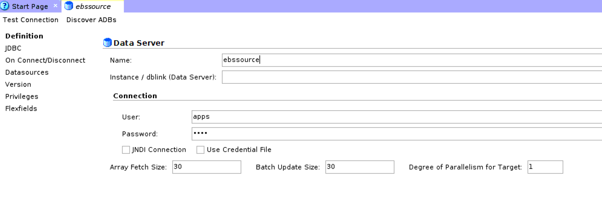
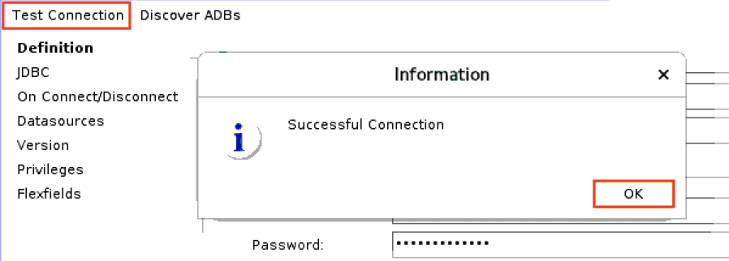
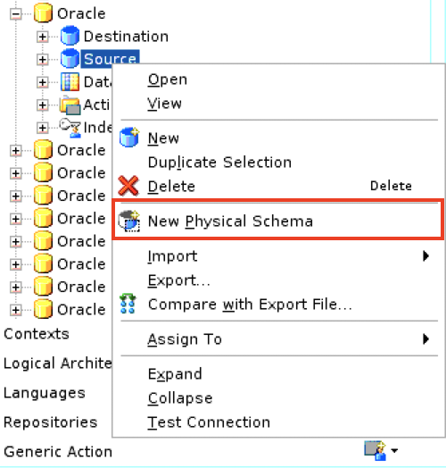
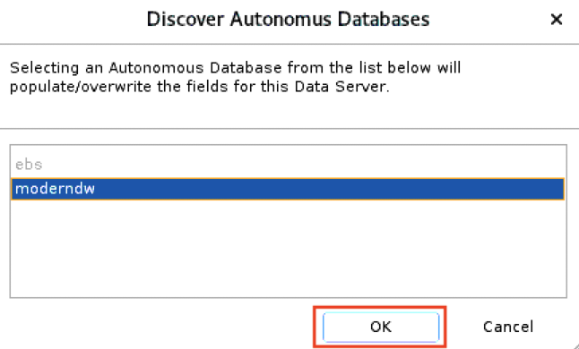
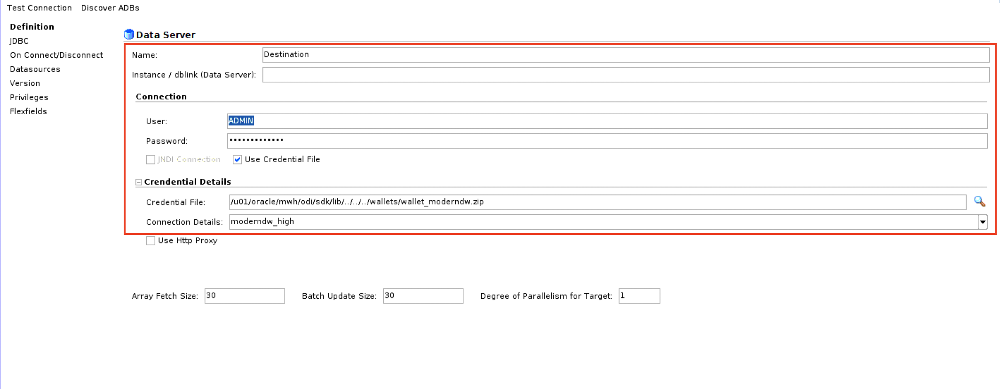
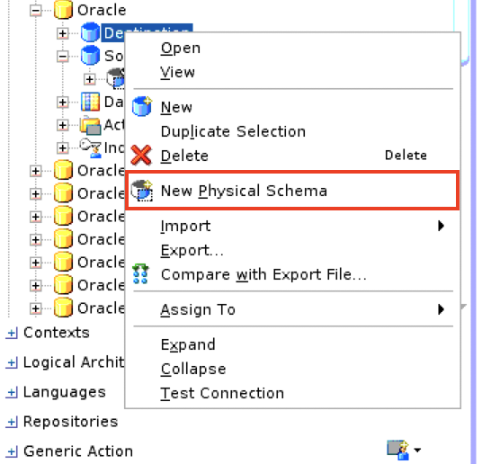
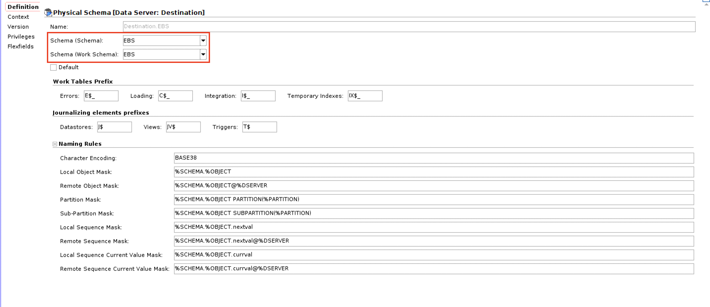
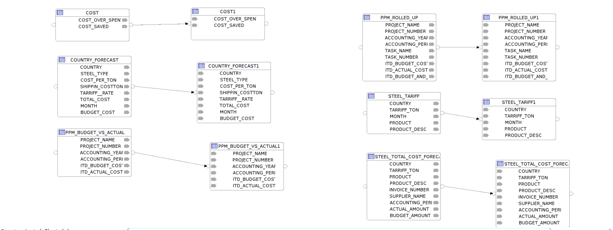

# Configure Integration and load data from EBS-emulating Database into ADW using ODI

## Introduction

In this lab, you will configure the ODI integration, create the mapping between source and destination, and run the integration. 

Estimated Lab Time: 25 minutes

### Objectives

- Rapidly create an integration that moves data from your EBS database / emulating ADW to a data warehouse that will be used to perform analysis.

### Prerequisites

- Credentials of the EBS Database/ADW and the ADW used for the repositories.

## Task 1: Set up the EBS Data Server

A data server stores information according to a specific technical logic which is declared into **physical schemas** attached to this data server. Every database server or group of flat files that is used in Data Integrator, must be declared as a data server. 

1.  On the **Topology** tab, under **Physical Architecture**, expand **Technologies** and scroll down till you find **Oracle**. Right click on it and then choose **New Data Server**.

    
    
    
    
2. If you are connecting to an EBS database. Please provide its credentials in the screen that opens up, under the **Definition** tab. Then, go to the **JDBC** tab and provide the JDBC URL i.e. the database hostname:port/service_name. Finally, click **Test Connection** and if successful, save the connection by clicking on the **Save** button, right under the **Edit** menu.

    
    
    
    
    
    
    
    
3. If you are using an ADW to emulate the EBS database, then simply click on the **Discover ADBs**, next to the **Test Connection**. This will detect all ADBs in the same compartment as the ODI instance, which is why you were asked to spin up the ADW emulating the EBS in the same compartment.

    
    
    
4. Now, select the ebs database. The **Data Server** screen will now be updated to use the Credential file for the ADW. Fill in the required details including: Connection Name, User (ADMIN), Password and select the high connection. Test the connection and save it, as well.

    
    
    

5. **Right Click** on the newly created **Data Server** and click on **New Physical Schema** to create a **Physical schema**. Choose the schema containing the tables that have to be transferred.

    
    
    

6. Click on the **Context** tab and configure a logical schema. Click on the **+** sign, under **Context**, select **Global** and then type **Source** as the name for your logical schema. Hit **Save**.

    
    
## Task 2: Set up the Destination Data Server

1.  On the **Topology** tab, under **Physical Architecture**, expand **Technologies** and scroll down till you find **Oracle**. Right click on it and then choose **New Data Server**.

    
    
    
    
2. Click on **Discover ADBs**. Select the modernDW (Destination) database. The **Data Server** screen will now be updated to use the Credential file for the ADW. Fill in the required details including: Connection Name, User (ADMIN), Password and select the high connection. Test the connection and save it, as well.

    
    
    
    
    
    
3. **Right Click** on the newly created **Data Server** and click on **New Physical Schema** to create one. Choose the schema containing the tables that have to be transferred.

    
    
    

6. Click on the **Context** tab and configure a logical schema. Click on the **+** sign, under **Context**, select **Global** and then type **Destination** as the name for your logical schema. Hit **Save**.

    
    
## Task 3: Create Models for Source and Destination Schemas

We will now create models based on the logical schema we created. 

1. Click on the **Designer** tab. Go down to the **Models** panel. Click on the **Folder Icon** to the right of **Models** and select **New Model**.

    

2. Give the model a name, choose **Oracle** as the **Technology**, select **Source** as the **Logical Schema** and choose **Oracle Default** as the **Action Group**. Save the model and click on **Reverse Engineer**. The Reverse Engineering should be complete in a matter of seconds.

    
    
3. Repeat Step 2 for the Destination Model. This time set the **Logical Schema** to **Destination**. Reverse Engineering should take just a few seconds, here as well.

    

## Task 4: Setting up an Integration Project

Now that you have configured your connections to your source and destination, we will create the mapping and move the data between the two systems. An integration project is composed of several components. These components include organizational objects, such as folders, and development objects such as mappings or variables.

1. Under **Designer**, click **New Project** in the toolbar of the **Projects** section. Enter a Name for the project, and hit **Save**.

    
    
    

**Note**: For more about ODI integration projects, click [here](https://docs.oracle.com/middleware/1212/odi/ODIDG/projects.htm#ODIDG311).

## Task 5: Design your Mapping and Run the Integration

1. Go back to the **Projects** section and expand your project. Under **First Folder**, **right-click** on **Mappings** and create a new mapping with a name of your choosing. Make sure to deselect **Create Empty Dataset**.

    
    
    
    
2. Go to the **Models** section, expand the **Source** model and drag your tables to the mapping interface.
    
    

3. Similarly, drag over the tables from the destination model and place the source and their destination counterparts side-by-side. 

    
    
4. One-by-one connect the different counterparts together by name. **By name** matches the names of the source to the target. Leave everything as it is and select **OK**.

    
    
    

5. Click on the **Physical** tab and select the icon between the source and destination tables for each of the combinations and change the **Loading Knowledge Module** property to **LKM Oracle to Oracle (Built-In) GLOBAL**.

    

6. You are now ready to run the integration. Click on the green start button to run your integration. Click **OK** on the prompt that shows up.

    
    
    

7. You can monitor the status of the integration after its completion by navigating to the **Operator** tab, under **Date**, and expanding on the day of your integration. Upon finishing successfully, your data should be in the target table.

    

You may now proceed to Lab 5.

## Acknowledgements
- **Author** - Yash Lamba, Cloud Native Solutions Architect, January 2021
- **Contributor** - Clarence Ondieki, Cloud Engineer
- **Last Updated By/Date** - Yash Lamba, January 2021

