# Create and Connect to ODI Repository and Prepare the EBS Data Source

## Introduction

In this lab, you will create and connect to an ODI work repository and prepare the E-Business Suite data source in ODI. We will be using an Autonomous database to emulate EBS. If you have access to an EBS environment, please feel free to bring in data from there.

Estimated Lab Time: 40 minutes

### Objectives

- Create and connect to master and work repositories in ODI. 
- Load Data into ADW emulating the EBS database.

### Prerequisites

- Previously created ODI instance.
- Credentials of EBS Database or the Database that is being used in its place and the previously provisioned ADW.
- Access to the following files: 
    - [controlling\_project\_expenditure.sql](https://objectstorage.us-ashburn-1.oraclecloud.com/p/J9wWgoLCHZjptNcxH7R20QI4tILC45uz0Db3cHDGQmQ0I5H3Ta2JY5VG-xiAYEpU/n/oradbclouducm/b/bucket-20200907-1650/o/controlling_project_expenditure.sql)
    - [ModernDW\_Schema.sql](https://objectstorage.us-ashburn-1.oraclecloud.com/p/yaHmByhpW1c_I4LSrDf_P3BThu_XK-Epef4DjjLNx8v-Vkn9EVktPHMcDYRthJpx/n/oradbclouducm/b/bucket-20200907-1650/o/ModernDW_Schema.sql)
- Terminal on Unix/Linux or Putty on Windows. (Optional Step)
- IP address of the Bastion instance and the private IP of the ODI instance. (Optional Step)
- The private SSH key. (Optional Step) 

Note: Please download the above file before continuing. Normally, while working with EBS, you would write sql queries to fetch and combine records from different modules of the application and then create temporary tables with that data to perform any analysis. The script above will create the temporary tables that you need for the rest of the labs.

## Task 1: Provision Autonomous Data Warehouse (Optional)

If you are using an Autonomous Database to emulate the EBS database, please follow Step 1, else proceed to Step 2.

1. Click the **Navigation Menu** in the upper left, navigate to **Oracle Database**, and select **Autonomous Data Warehouse**.
	
	

3. Click on the **Create Autonomous Database** button.

    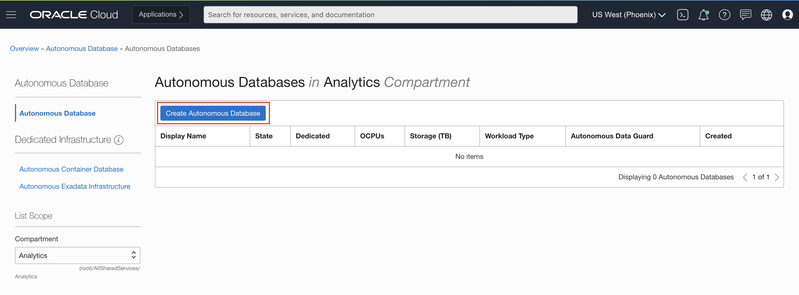

4. Choose the same compartment as that of the ODI stack. This is a must because a few of our instructions in the later labs depend on this, so please make sure you use the same compartment. Enter the **Display Name** and also enter a name for the **Database**. Leave everything else set to the default values.

    

5. Scroll down and provide a password for the administrator.

    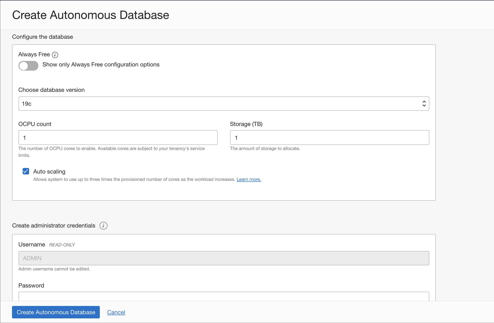

6. Thereafter, hit **Create Autonomous Database**.

    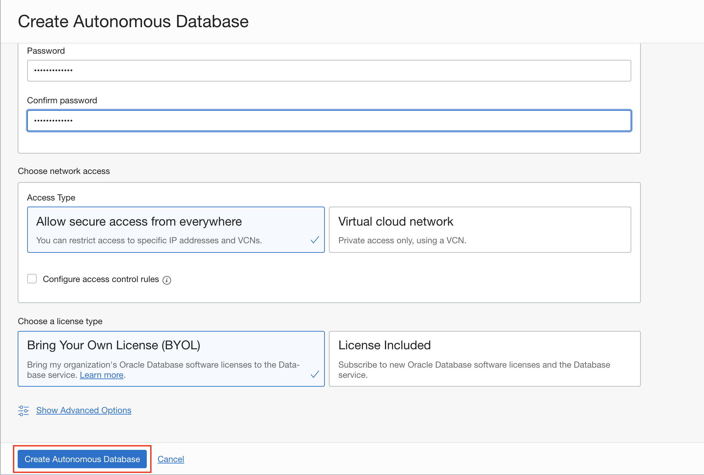

7. The database should be up and running in a couple of minutes.

    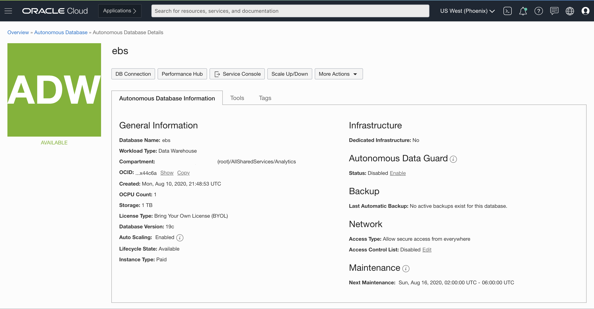

8. Download the wallet file for the database as shown in step 3 of Lab 1. 
        
## Task 2: Creating Tables in EBS-emulating Database

1. Use SQL Developer to connect to your EBS database or Autonomous Database, provisioned in Step 1. Instructions for connecting to an Autonomous Database via SQL Developer can be found [here](https://docs.oracle.com/en/cloud/paas/autonomous-data-warehouse-cloud/user/connect-sql-dev182.html#GUID-14217939-3E8F-4782-BFF2-021199A908FD).

2. Now, go ahead and run the 'controlling\_project\_expenditure.sql' script to create the tables.

3. The following tables should be visible: COST, COUNTRY\_FORECAST, PPM\_BUDGET\_VS\_ACTUAL, PPM\_ROLLED\_UP, STEEL\_TARIFF, STEEL\_TOTAL\_COST\_FORECAST.
    
## Task 3: Create Empty Target Tables and ODI Schema in Autonomous Data Warehouse

1. Connect to the Autonomous Data Warehouse that we created as part of the ODI-ADW-OAC stack as the ADMIN user via SQL Developer. We downloaded the wallet to the local machine in the previous lab.

2. Run the commands below to create a schema for the metadata repository. We will call this schema 'ODI'. Replace 'MyPassword' in the first command with a password of your choosing.
    
        create user ODI identified by MyPassword;
    
        grant DWROLE to ODI;
    
        grant unlimited tablespace to ODI;
    
        grant PDB_DBA to ODI;   

3. Now, run the following commands to create EBS schema for the target tables. Replace 'MyPassword' in the first command with a password of your choosing.

        create user EBS identified by MyPassword;
    
        grant DWROLE to EBS;
    
        grant unlimited tablespace to EBS;
    
        grant PDB_DBA to EBS;   
    
4. Connect to the ADW instance, again, but this time as the EBS user and execute the 'ModernDW\_Schema.sql' script to create empty target tables for our integration under the EBS schema. 
   
## Task 4: Creating ODI Master Repository

In order to use ODI, we need to create a master and work repository. For this, we are going to use the Autonomous Data Warehouse that was spun up as part of the stack.

1. Return to ODI Studio.

    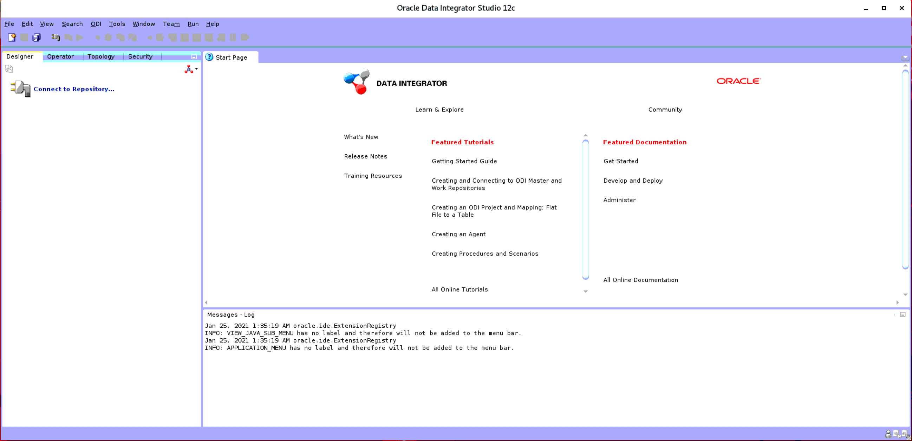
    
2. Click on **File**, then **New**.

    
    
3. Select **Create a New Master Repository** and press **OK**.

    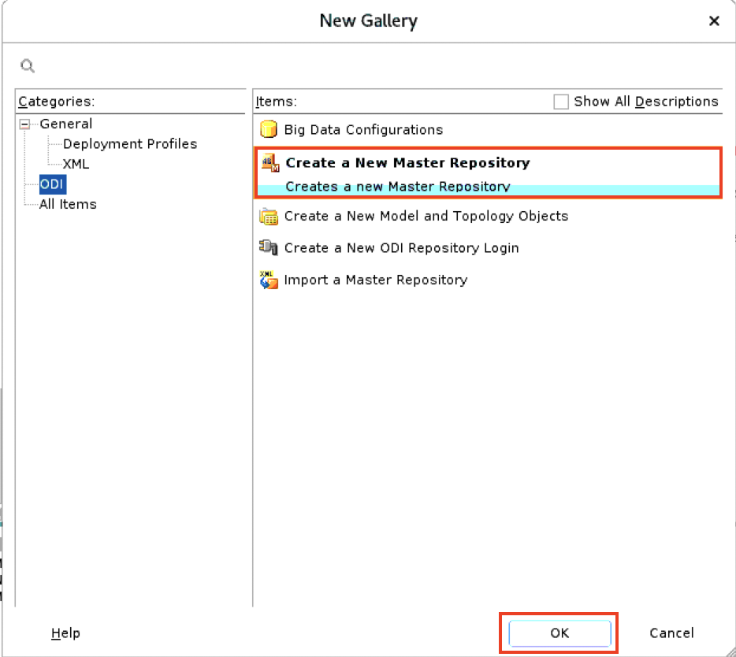
    
4. From the **Technology** drop down, select **Oracle**. Select the **Use Credential File** option and click on the magnifying glass icon in front of the **Credential File** field. The file should be in /home/Oracle/Desktop. Thereafter, choose the high connection in the **Connection Details** drop down. The JDBC URL will get auto-populated. Now, enter **ODI** as the user and provide the password for the ODI schema. The DBA User would be ADMIN. Please enter its password, as well.

    
    
5. Click on **Test Connection**. If everything was done correctly, you should see a **Successful Connection** message. If not, then please fix the error and proceed. Now, click on **Next**.

    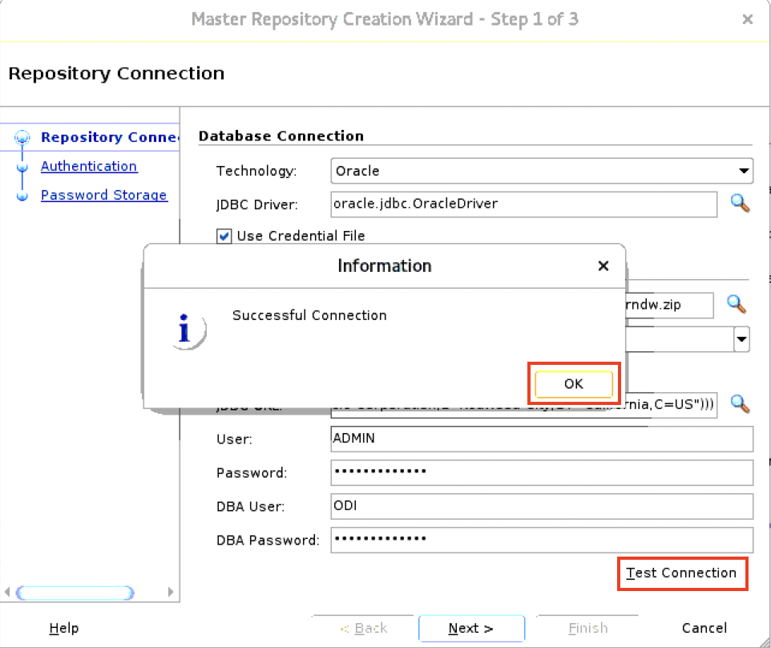
    
6. On the **Authentication** page, enter **SUPERVISOR** as the **Supervisor User**, please provide the supervisor password and confirm it. Then, hit **Next**. Click on **Finish** on the final page.

    
    
    
    
7. ODI Studio will take 3-5 minutes to create the repository. Once it is done, you will see a prompt telling you that the creation was successful.

    
    
    

## Task 5: Connect to Master Repository

1. Click on **Connect To Repository** and click on the **+** sign in the login prompt to create a new login. 
    
    

    

2. Provide a name to the login and enter **SUPERVISOR** as the user and provide the password for **SUPERVISOR**. In the Database Connection section, enter ODI as the user and provide the password to the ODI schema. From the driver list drop down, select **Oracle JDBC Driver** and select the **Use Credential File** check box. As done previously, select the ADW wallet in the credential file selector and choose the high connection. 

    
    
3. Test and connection and make sure that the test is successful, fixing any errors encountered along the way.

    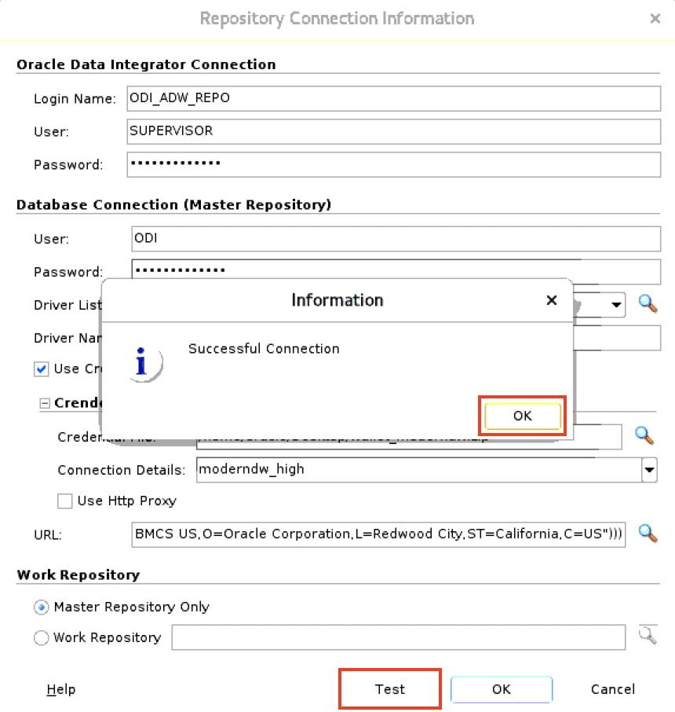

4. Now, select the **Login Name** that you just created. Enter **SUPERVISOR** in the user field and enter the password. Clicking **OK** will prompt you to enter the ADW wallet's password. Provide the password, click **OK** and you will find yourself logged into the Master Repository.

    
    
    
    
## Task 6: Create a Work Repository

1. Click on the **Topology** tab. Expand the repositories section. Under the master repository, you will find Work Repositories. Right click and select **New Work Repository**.

    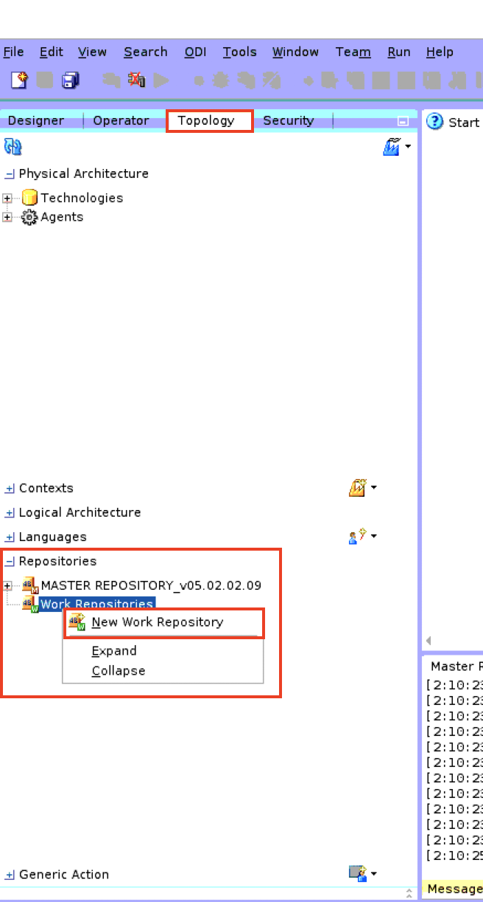

2. In the connection properties, set the **Technology** drop down to **Oracle** and check the **Use Credential File** checkbox. Now, select the ADW wallet as the **Credential File** and choose the high connection. Finally, set **User** to ODI and provide the password to the ODI schema. Then, click **Next**.

    

3. Give the work repository a name of your choosing and set a password. You can leave the repository type set to **Development**. Hit **Finish** to get a confirmation dialog and agree to creating a login with a **Yes**.

    
    
    

4. Give a login name and select **OK**. This will throw a prompt asking for the ADW wallet's password. Provide the password and click on **OK**.

    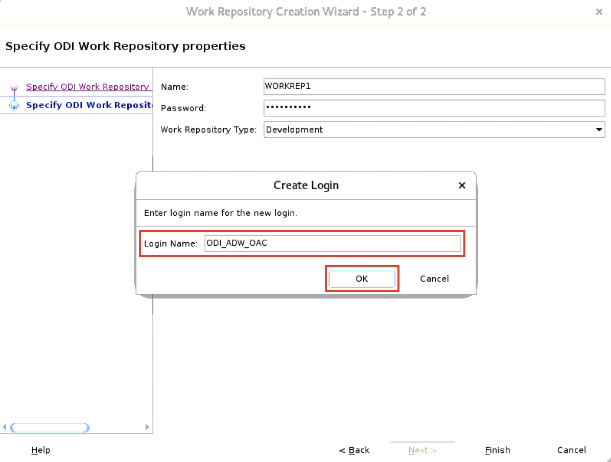
    
    

**Note**: The repository should be up and running in a couple of minutes.

## Task 7: Connect to the Work Repository

1. Select the **Designer** tab and then disconnect from the master repository.
    
    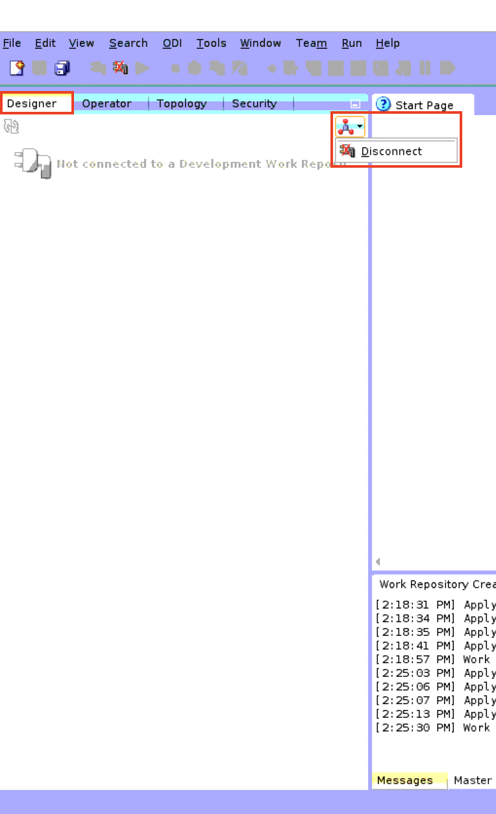

2. Click on **Connect to Repository** and choose the Work Repository in the **login name** drop down.

    
    
3. Enter **SUPERVISOR** as the user and provide its credentials. Click on **OK** to get connected to the work repository.

    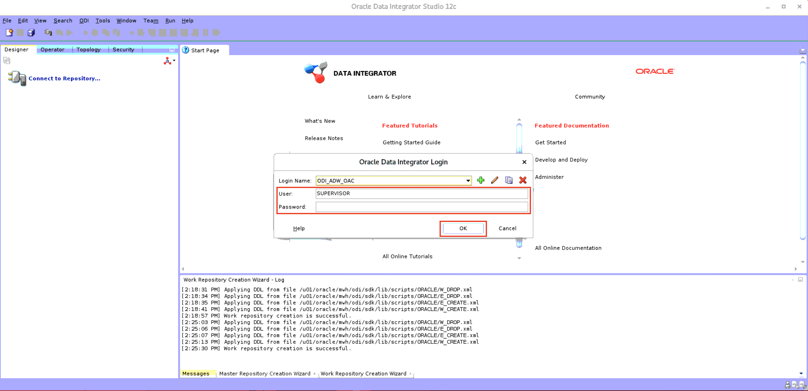

    

You may now proceed to Lab 4.

## Acknowledgements
- **Author** - Yash Lamba, Cloud Native Solutions Architect, January 2021
- **Last Updated By/Date** - Yash Lamba, January 2021

