# Run Analytics - Create Dashboards

## Introduction

In this lab, you will get started with the analysis of the EBS data in Oracle Analytics Cloud. To get you started with an analytics project, we will use a dva file to set up an Analytics project and use the Source ADW to supply data for the visualizations. You will then connect to the destination ADW to explore the data.

Estimated Lab Time: 15 minutes

### Objectives

- Import analytics project.
- Connect to ADW and create data sets.
- Analyse data.

### Prerequisites

- The source and destination Autonomous Data Warehouses (ADW) and Analytics Cloud (OAC) instance.
- Access to the ModernDW file needed to recreate an analytics project.
    - [ModernDW.dva](https://objectstorage.us-ashburn-1.oraclecloud.com/p/4CYxFxh-zXj8Ke32RMTnGQa0mEoiHsAgBO0Kc7qbqQUTtkFD8YpJN25ybT4Amr83/n/c4u04/b/data-management-library-files/o/modern-data-warehouse/ModernDW.dva)

**Note:** Please download the file above before continuing.

## Task 1: Set up the Analytics Project in OAC 

As previously mentioned, when you spin up the stack the links to some resources do not show up in the **Associated Resources** tab. In our case, we want to get to our Analytics Cloud instance, but the link is not provided.

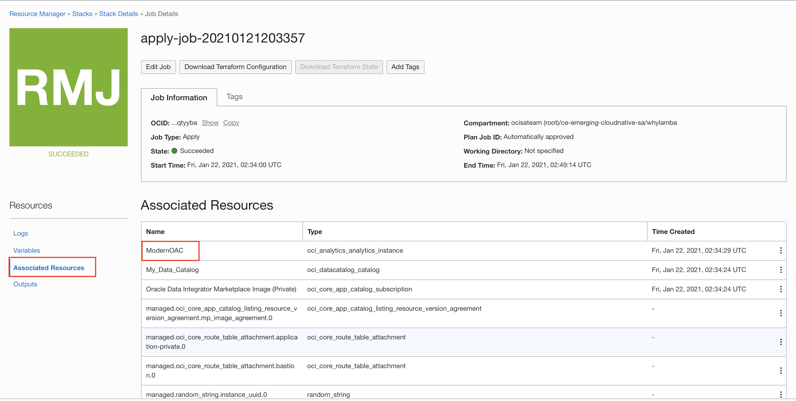

1. Click the **Navigation Menu** in the upper left, navigate to **Analytics & AI**, and select **Analytics Cloud**.

	

2. Choose the right compartment and then select your analytics instance. In the page that opens up, click on **Analytics Home Page** to login to the analytics cloud instance.

    

    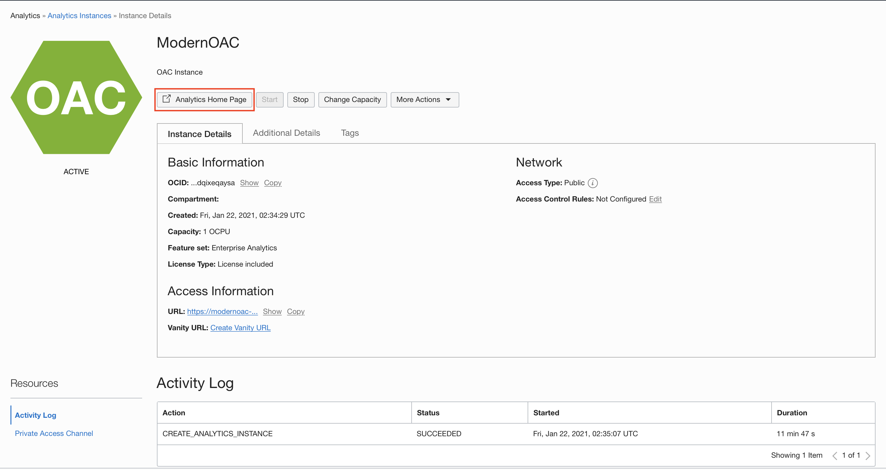

3. Click on the ellipses menu in the top right, select **Import Project/Flow**. Then, click on **Select File** and choose the ModernDW.dva file.

    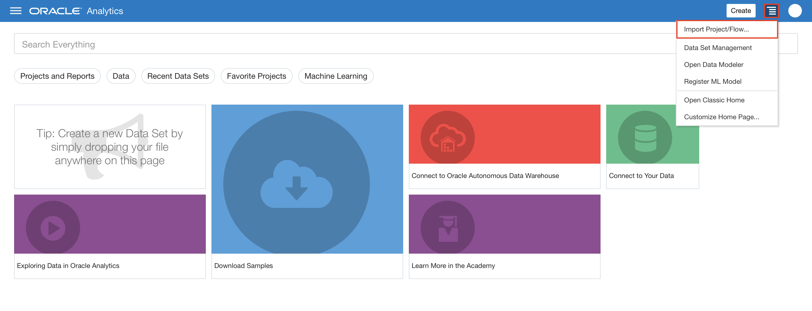

    

4.  Import the file into OAC by clicking on **Import**. The password is **Admin123**. Hit **OK** to close the dialog.

    

    

5. Click on the navigation menu icon in the top left. Go to **Data** and open the **Connections** tab. You should see a connection named **EBS\_ADW\_OAC**.

    

    

6. Click on the ellipses menu on the extreme right of the connection’s name and select inspect.

     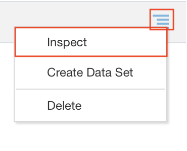

7. Click on the **Select** button in front of Client Credentials and select the wallet to your Source ADW instance. Enter the username as **ADMIN** and provide the schema password. Click **Save**.

    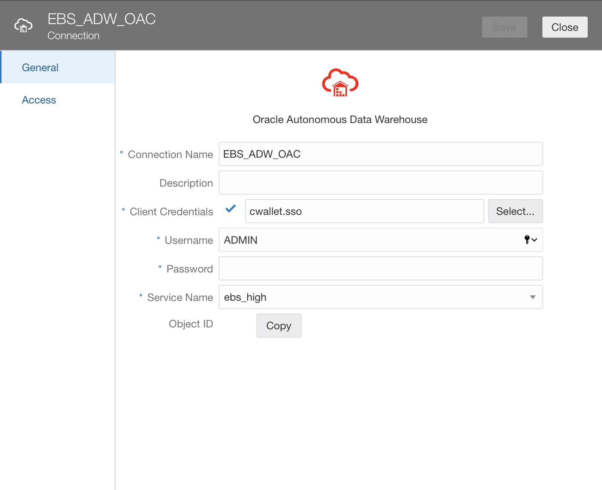

8. We will now refresh our data sets to utilize our connection. Select the **Data Sets** tab and you will see all the tables appear below. Go ahead and reload each data set by clicking on the ellipses menu to the right of the data set's name and selecting **Reload Data**.

    

9. Now, proceed to the hamburger menu and select **Catalog** and open your project. The visualizations should load, but click **Refresh Data** if needed, to refresh the visuals.

    

    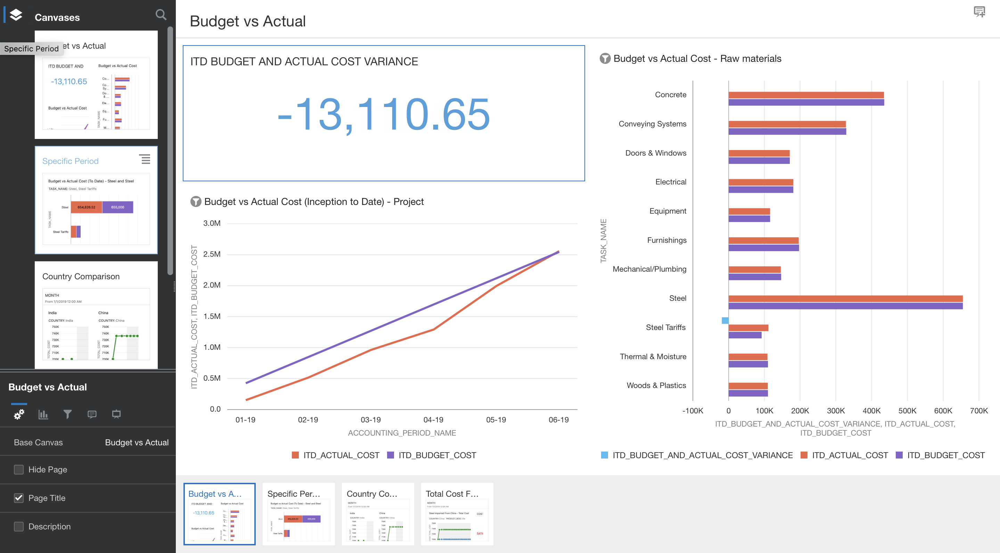

## Task 2: Establish a connection to the Destination Database as ADMIN

As you might remember, we loaded the data from the EBS instance into the **ADMIN** schema of the destination ADW and from the Source ADW into the **EBS** schema. We will now create a connection to the database as the **ADMIN** user.

1. Click on the navigation menu icon in the top left. Go to **Data** and open the **Connections** tab.

    

2. Click on the **Create** button in the top right of the screen and select **Connection**. Choose **Autonomous Data Warehouse**.

    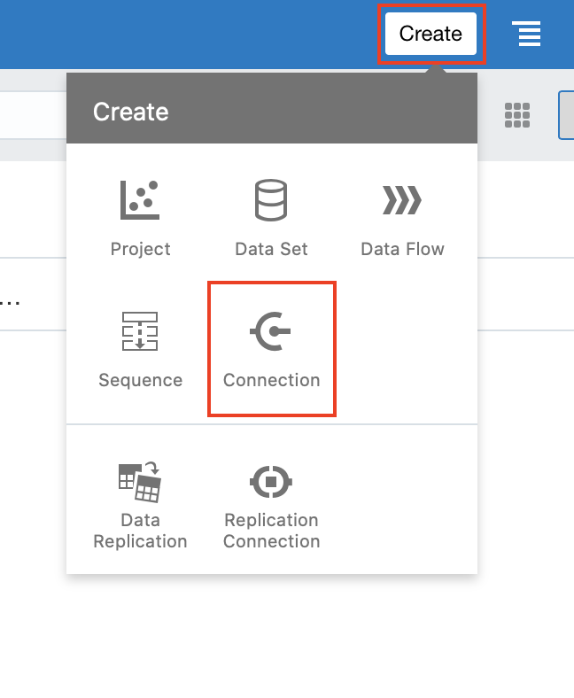

    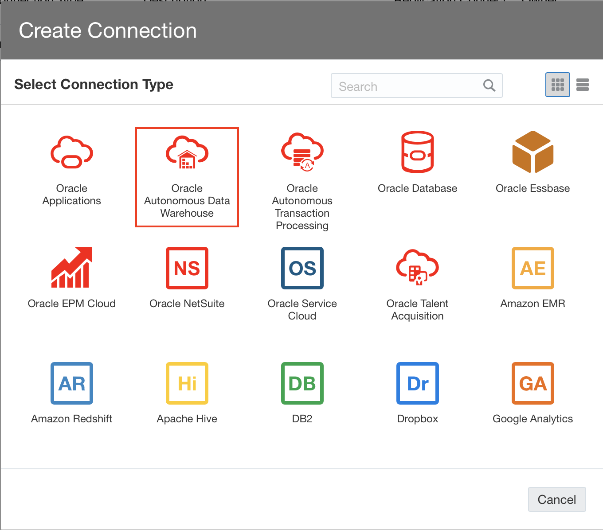

3. Provide a name to the connection. Click on the **Select** button in front of Client Credentials and select the wallet to your destination ADW instance. Let the username be **ADMIN** and provide the schema password. Select the high service from the **Service Name** dropdown and click on **Save** to establish the connection.

    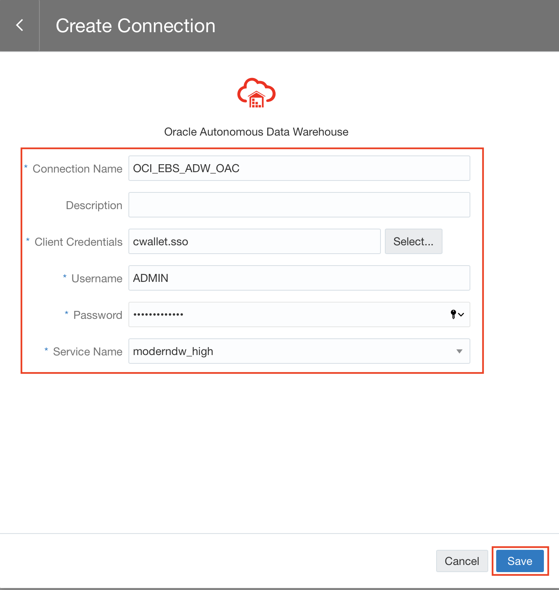

    

## Task 3: Create Data Sets in OAC

1. To the right of the connection's name an ellipses button will appear. Click on it. In the menu that appears, select **Create Data Set**. On the next page, you will see all the available schemas including the **ADMIN** and **EBS** schemas.

    

    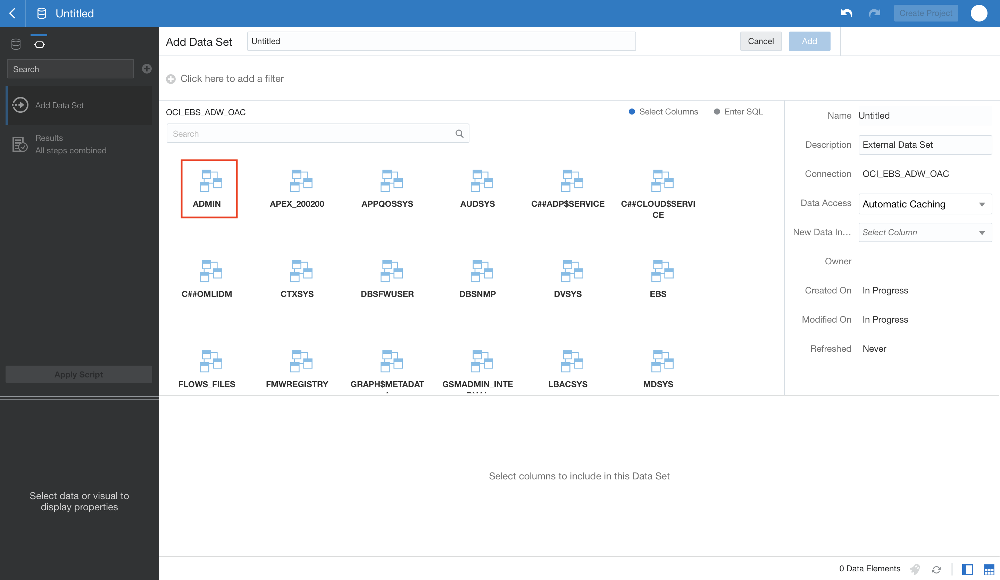

2. You may now choose any data set to see its columns and play with it. Thereafter, give the data set a name and click on the **Add** button to save it.

    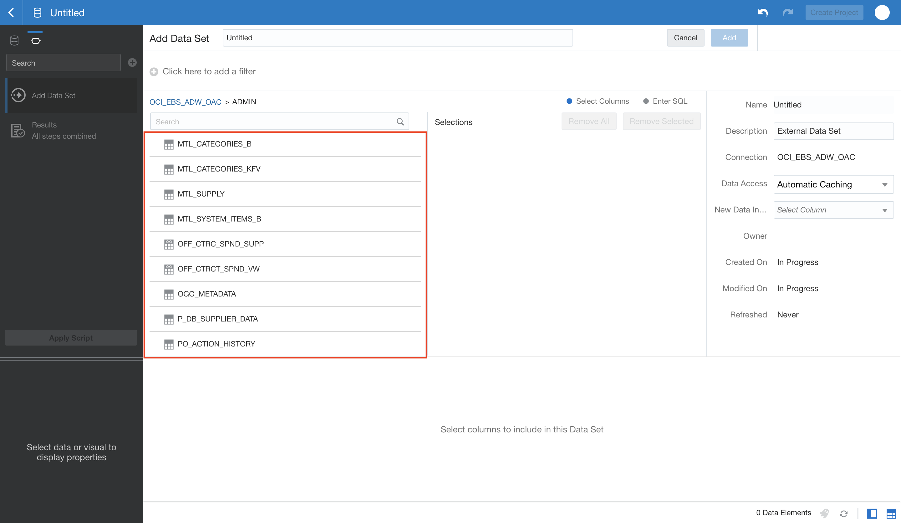

    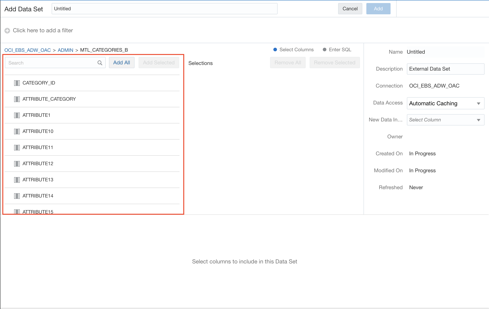

    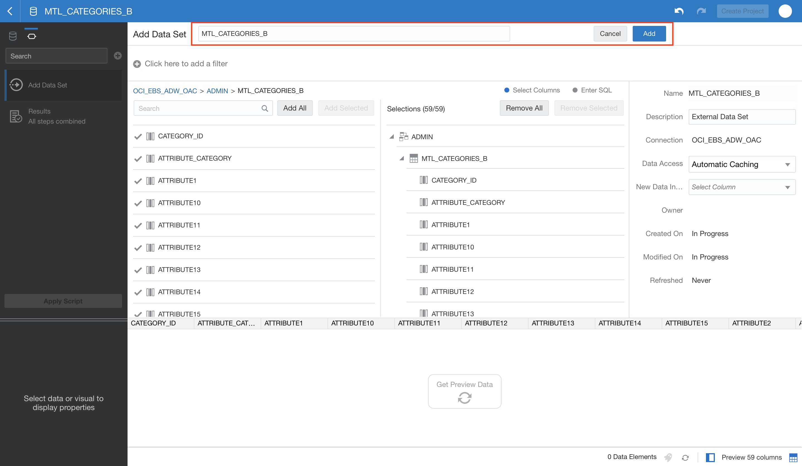

3. The data set can now be seen under the **Data Sets** tab. Feel free to repeat the process to create more data sets.

    

We will now leave it up to your imagination to analyse the data sets that have been provided to you and to use them in visualisations.

*Congratulations! You have successfully completed the lab*.

## Acknowledgements
- **Author** - Yash Lamba, Cloud Native Solutions Architect, January 2021
- **Last Updated By/Date** - Yash Lamba, May 2021
