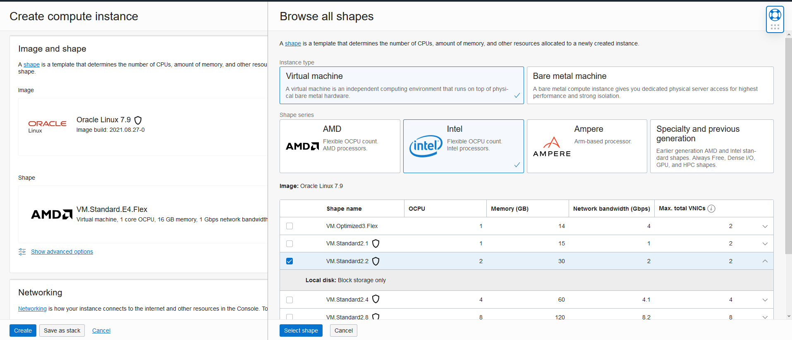
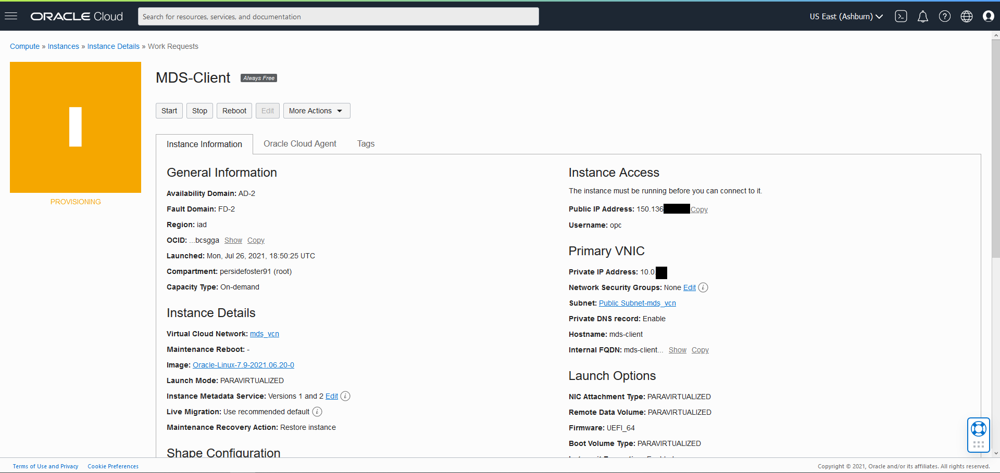
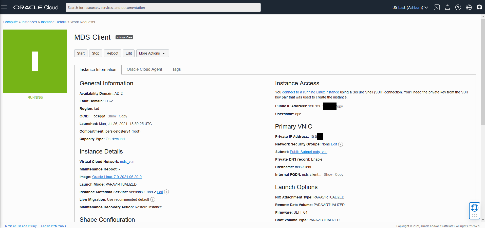
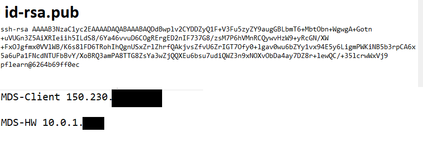

# Connect to MySQL Database System
 


## Introduction

When working in the cloud, there are often times when your servers and services are not exposed to the public internet. The Oracle Cloud Infrastructure (OCI) MySQL cloud service is an example of a service that is only accessible via private networks. Since the service is fully managed, we keep it siloed away from the internet to help protect your data from potential attacks and vulnerabilities. It’s a good practice to limit resource exposure as much as possible, but at some point, you’ll likely want to connect to those resources. That’s where Compute Instance, also known as a Bastion host, enters the picture. This Compute Instance Bastion Host is a resource that sits between the private resource and the endpoint which requires access to the private network and can act as a “jump box” to allow you to log in to the private resource via protocols like SSH.  This bastion host requires a Virtual Cloud Network and Compute Instance to connect with the MySQL DB Systems. 

Today, you will use the Compute Instance to connect from the browser to a MDS DB System

Estimated Lab Time 20 minutes


### Objectives

In this lab, you will be guided through the following tasks:

- Create SSH Key on OCI Cloud 
- Create Compute Instance
- Setup Compute Instance with MySQL Shell
- Connect to MySQL DB System

### Prerequisites

- An Oracle Trial or Paid Cloud Account
- Some Experience with MySQL Shell
- Must Complete Lab 1

## Task 1: Create SSH Key on OCI Cloud Shell

The Cloud Shell machine is a small virtual machine running a Bash shell which you access through the OCI Console (Homepage). You will start the Cloud Shell and generate a SSH Key to use  for the Bastion  session.

1.  To start the Oracle Cloud shell, go to your Cloud console and click the cloud shell icon at the top right of the page. This will open the Cloud Shell in the browser, the first time it takes some time to generate it.

    

    

    *Note: You can use the icons in the upper right corner of the Cloud Shell window to minimize, maximize, restart, and close your Cloud Shell session.*

2.  Once the cloud shell has started, create the SSH Key using the following command:

    ```
    <copy>ssh-keygen -t rsa</copy>
    ```
    
    Hit enter for each question.
    
    Here is what it should look like.  

    

3.  The public  and  private SSH keys  are stored in ~/.ssh/id_rsa.pub.

4.  Examine the two files that you just created.

    ```
    <copy>cd .ssh</copy>
    ```
    
    ```
    <copy>ls</copy>
    ```

    

    Note in the output there are two files, a *private key:* `id_rsa` and a *public key:* `id_rsa.pub`. Keep the private key safe and don't share its content with anyone. The public key will be needed for various activities and can be uploaded to certain systems as well as copied and pasted to facilitate secure communications in the cloud.

## Task 2: Create Compute instance
You will need a compute Instance to connect to your brand new MySQL database. 

1. Before creating the Compute instance open a notepad 

2. Do the followings steps to copy the public SSH key to the  notepad 

    Open the Cloud shell
        

    Enter the following command  

    ```
    <copy>cat ~/.ssh/id_rsa.pub</copy>
    ``` 
     

3. Copy the id_rsa.pub content the notepad
        
    Your notepad should look like this
      

4. To launch a Linux Compute instance, go to Navigation Menu > Compute > Instances
    

5. On Instances in **(root)** Compartment, click on 'Create Instance'
    

6. On Create Compute Instance 

 Enter Name
    ```
    <copy>MDS-Client</copy>
    ```   
7. Make sure **(root)** compartment is selected 

8. On Placement, keep the selected Availability Domain

9. On Image and Shape, keep the selected Image, Oracle Linux 7.9 

        

10. Select Instance Shape: VM.Standard2.2

        

11. On Networking, make sure '**MDS-VCN**' is selected

    'Assign a public IP address' should be set to Yes 
   
  

12. On Add SSH keys, paste the public key from the notepad. 
  
    

13. Click '**Create**' to finish creating your Compute Instance. 

14. The New Virtual Machine will be ready to use after a few minutes. The state will be shown as 'Provisioning' during the creation
    

15.	The state 'Runing' indicates that the Virtual Machine is ready to use. 

    On the **MDS-Client** Instance page under 'Instance Access', **Copy and save the Public IP Address** 
    

## Task 3: Connect to MySQL Database System

1. Copy the public IP address of the active Compute Instance to your notepad

    - Go to Navigation Menu > Compute > Instances
    

    - Click on the `MDS-Client` Compute Instance link
    
    
    - Copy `MDS-Client` plus  the `Public IP Address` to the notepad

2. Copy the public IP address of the active MySQl Database Service Instance to your notepad

    - Go to Navigation Menu > Databases > MySQL
     

    - Click on the `MDS-HW` Database System link

     
    
    - Copy `MDS-HW` plus the `Private IP Address` to the notepad

3. Your notepad should look like the following:
     
    
4. Indicate the location of the private key you created earlier with **MDS-Client**. 
    
    Enter the username **opc** and the Public **IP Address**.

    Note: The **MDS-Client**  shows the  Public IP Address as mentioned on TASK 5: #11
    
    (Example: **ssh -i ~/.ssh/id_rsa opc@132.145.170...**) 

    ```
    <copy>ssh -i ~/.ssh/id_rsa opc@<your_compute_instance_ip></copy>
    ```
    

    **Install MySQL Shell on the Compute Instance**

5. You will need a MySQL client tool to connect to your new MySQL DB System from your client machine.

    Install MySQL Shell with the following command (enter y for each question)

    **[opc@…]$**

     ```
    <copy>sudo yum install mysql-shell -y</copy>
    ```
    

   **Connect to MySQL Database Service**

6. From your Compute instance, connect to MDS-HW MySQL using the MySQL Shell client tool. 
   
   The endpoint (IP Address) can be found in your notepad or the  the MDS-HW MySQL DB System Details page, under the "Endpoint" "Private IP Address". 

    

7.  Use the following command to connect to MySQL using the MySQL Shell client tool. Be sure to add the MDS-HW private IP address at the end of the cammand. Also enter the admin user password

    (Example  **mysqlsh -uadmin -p -h10.0.1..   --sql**)

 **[opc@...]$**

    ```
    <copy>mysqlsh -uadmin -p -h 10.0.1.... --sql</copy>
    ```
    

8. On MySQL Shell, switch to SQL mode  to try out some SQL commands 

9. View  the airportdb total records per table in 
    ```
    <copy>SELECT table_name, table_rows FROM INFORMATION_SCHEMA.TABLES WHERE TABLE_SCHEMA = 'airportdb';</copy>
    ```
        
     
    
You may now [proceed to the next lab](#next).

## Learn More

* [Cloud Shell](https://www.oracle.com/devops/cloud-shell/?source=:so:ch:or:awr::::Sc)
* [Virtual Cloud Network](https://docs.oracle.com/en-us/iaas/Content/Network/Concepts/overview.htm)
* [OCI Bastion Service ](https://docs.public.oneportal.content.oci.oraclecloud.com/en-us/iaas/Content/Bastion/Tasks/connectingtosessions.htm)
## Acknowledgements
* **Author** - Perside Foster, MySQL Solution Engineering 
* **Contributor** - Frédéric Descamps, MySQL Community Manager 
* **Last Updated By/Date** - Perside Foster, September 2021
