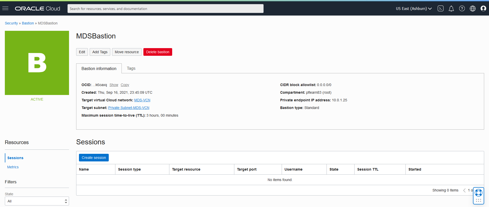
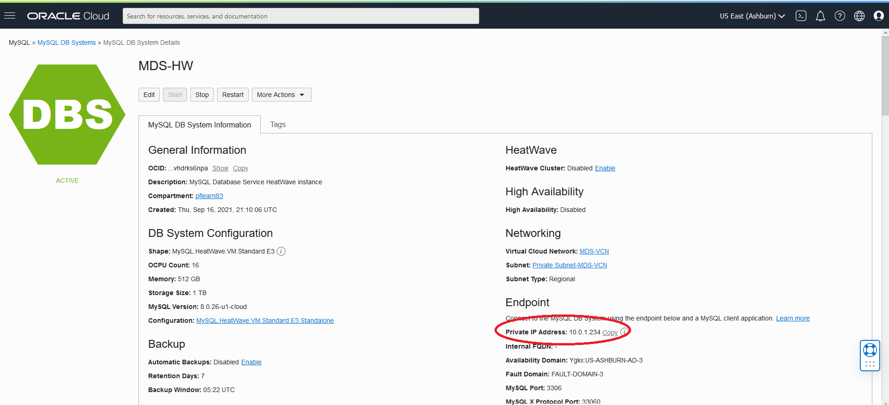
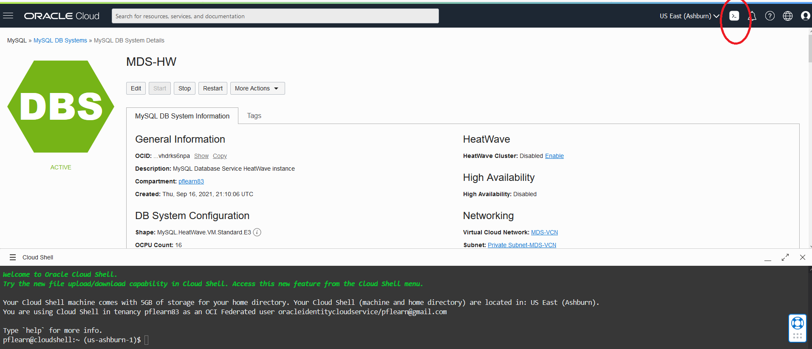
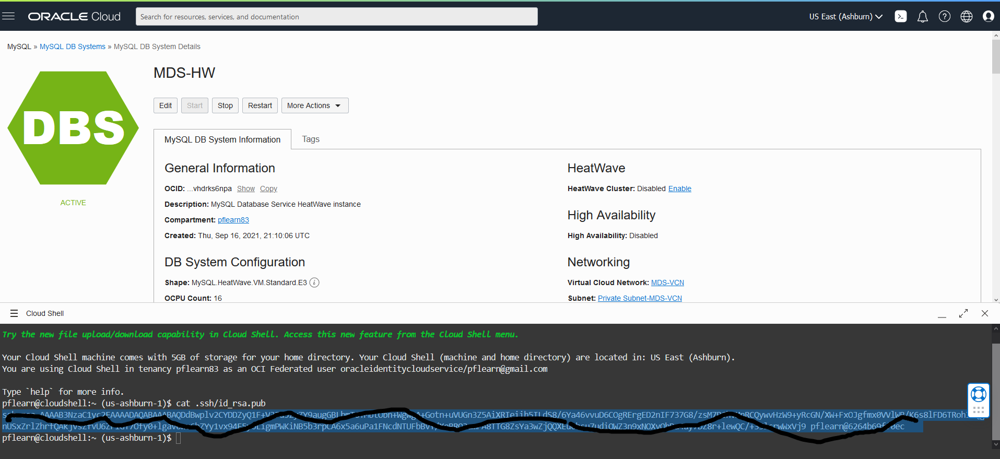
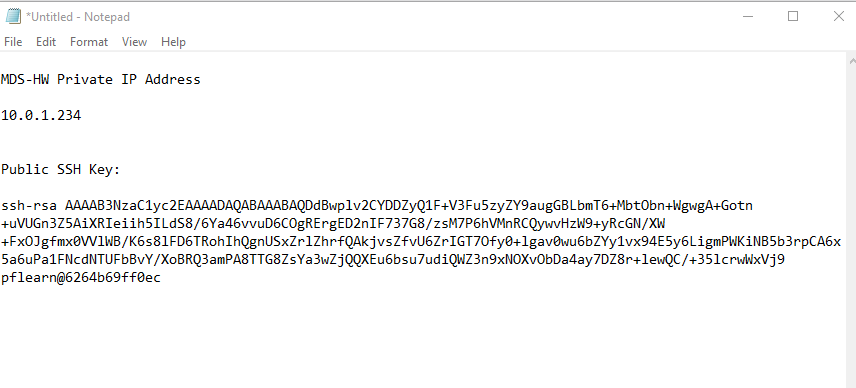
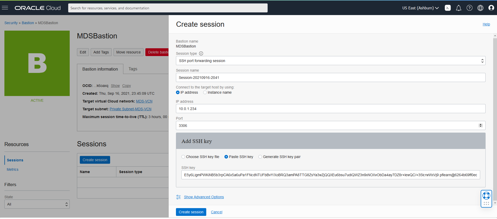
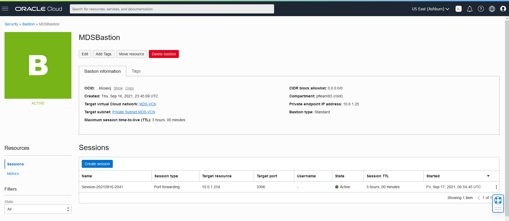
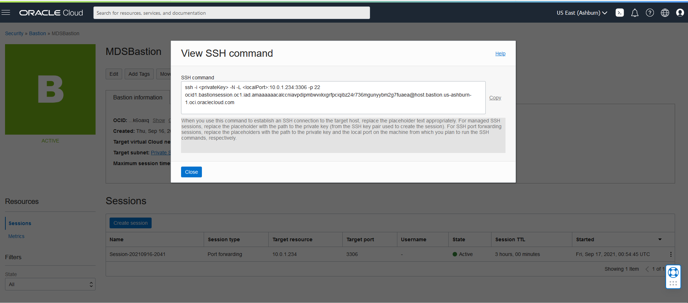
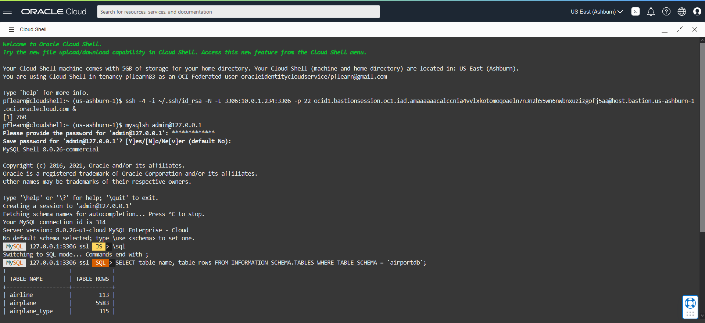

# Create MySQL Database System
 


## Introduction

In this lab, you will create and configure a MySQL DB System. The creation process will use a provided object storage link to create the airportdb schema and load data into the DB system.    

Estimated Lab Time: 20 minutes


### Objectives

In this lab, you will be guided through the following tasks:

- Create MySQL Database for HeatWave (DB System) instance with sample data (airportdb)
- Create a Bastion session 
- Connect to DB System using MySQL Shell through Bastion Service/Cloud Shell


### Prerequisites

- An Oracle Trial or Paid Cloud Account
- Some Experience with MySQL Shell
- Must Complete Lab 1


## Task 1: Create MySQL Database for HeatWave (DB System) instance with sample data (airportdb)

1. Go to Navigation Menu > Databases > MySQL > DB Systems
    

2. Click 'Create MySQL DB System'
    

3. Create MySQL DB System dialog complete the fields in each section

    - Provide basic information for the DB System
    - Setup your required DB System
    - Create Administrator credentials
    - Configure Networking
    - Configure placement
    - Configure hardware
    - Exlude Backups
    - Advanced Options - Data Import
   

4. Provide basic information for the DB System:

 Select Compartment **(root)**

 Enter Name
     ```
    <copy>MDS-HW</copy>
    ```
 Enter Description 
    ```
    <copy>MySQL Database Service HeatWave instance</copy>
    ```
 
 Select **HeatWave** to specify a HeatWave DB System
    

6. Create Administrator Credentials

 Enter Username
    ```
    <copy>admin</copy>
    ```
    
 Enter Password
    ```
    <copy>Welcome#12345</copy>
    ```   
 Confirm Password
    ```
    <copy>Welcome#12345</copy>
    ```
    

7. On Configure networking, keep the default values

    Virtual Cloud Network: **MDS-VCN**
    
    Subnet: **Private Subnet-MDS-VCN (Regional)**

    

8. On Configure placement under 'Availability Domain'
   
    Select AD-3

    Do not check 'Choose a Fault Domain' for this DB System. 

    

9. On Configure hardware, keep default shape as **MySQL.HeatWave.VM.Standard.E3**

    Data Storage Size (GB) Keep default value:  **1024**
    

10. On Configure Backups, disable 'Enable Automatic Backup'

    

11. Click on Show Advanced Options 

    Select Data Import tab

    Copy and paste the following to PAR Source URL: 
  
    ```
    <copy> https://objectstorage.us-ashburn-1.oraclecloud.com/p/RVosiQ0NG3lZ70pOZoXcc78Uq0GvwJrPsv4xKRLzc3eEk7-AiwPWoOqxcDkTCkwC/n/mysqlpm/b/airportdb-bucket/o/airportdb/@.manifest.json </copy>
    ```   
    

12. Review **Create MySQL DB System**  Screen 

    

    
    Click the '**Create**' button

13. The New MySQL DB System will be ready to use after a few minutes 

    The state will be shown as 'Creating' during the creation
    

14. The state 'Active' indicates that the DB System is ready to use 

    On MDS-HW Page, check the MySQL Endpoint (Private IP Address) 

    

## Task 2: Create a Bastion session

1. Click the `DSBastion` link

     

2. Before creating the Bastion Session open a notepad. Do the following steps to record the MySQL Database System private IP address:

    - Go to Navigation Menu > Databases > MySQL
     

    - Click on the `MDS-HW` Database System link

     
    
    - Copy the `Private IP Address` to the notepad

3. Do the followings steps to copy  the public SSH key to the  notepad 
 
    - Open the Cloud shell
         

    - Enter the following command   
        ```
     <copy>cat .ssh/id_rsa.pub</copy>
        ``` 
     

4.  Copy the id_rsa.pub content the notepad
        Your notepad should look like this
          
        
5. Go to Navigation Menu > Identity Security > Bastion

6. Open the MDSBastion link

7. Click `Create Session`

8. Set up the following information
    - Session type
      Select `SSH port forwarding session`
    - Session Name 
        *Keep Default*
    - IP address
        *Enter IP addtess from notepad*

9. Enter the Port

    ```      
        <copy>3306</copy>
    ```
10. Add SSH Key -  Copy SSH Key from notepad
    - The screen shoul look like this
     
    - Click the `Create Session` button 
11. The completed Bastion Session should look like this
     

**Note: The Session will expire in 180 minutes**

## Task 3: Connect to MySQL Database System

1. Click on the 3 vertical dots on the Bastion Session

     

2. Click `View SSh Command`  

     

3. Click copy and paste the information to your notepad and hit Close

4.  update the session command on notepad
    - Set the beginning of the command `ssh -4 -i ~.ssh/id_rsa -N -L 3306`
    - add the `&` character at the end of the command or the command will not connection will not be successful


    The command from your notepad should look like this

     
    
5. Open the cloud shell and enter the command from the notepad. It should like this... `Don't forget the &`

    `ssh -4 -i .ssh/id_rsa -N -L 3306:10.0.1...:3306 -p 22 ocid1.bastionsession.oc1.iad.amaaaaaacalccniavpdipmbwvxk..................ybm2g7fuaea@host.bastion.us-ashburn-1.oci.oraclecloud.com &`

6. Use MySQL Shell to connect to the MySQL Database Service. Enter: 

     ```
     <copy>mysqlsh admin@127.0.0.1 --sql</copy>
     ``` 
7. View  the airportdb total records per table in 


    ```
    <copy>SELECT table_name, table_rows FROM INFORMATION_SCHEMA.TABLES WHERE TABLE_SCHEMA = 'airportdb';</copy>
    ```
        
     

You may now [proceed to the next lab](#next).

## Acknowledgements
* **Author** - Perside Foster, MySQL Solution Engineering 
* **Contributors** - Mandy Pang, MySQL Principal Product Manager,  Priscila Galvao, MySQL Solution Engineering, Nick Mader, MySQL Global Channel Enablement & Strategy Manager, Frédéric Descamps, MySQL Community Manager
* **Last Updated By/Date** - Perside Foster, MySQL Solution Engineering, September 2021
