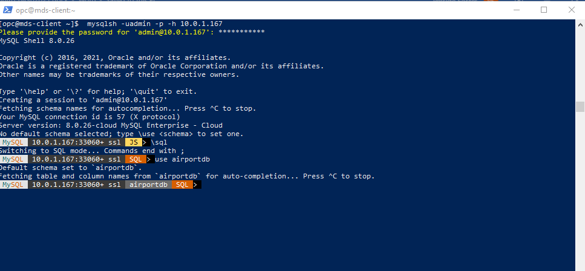
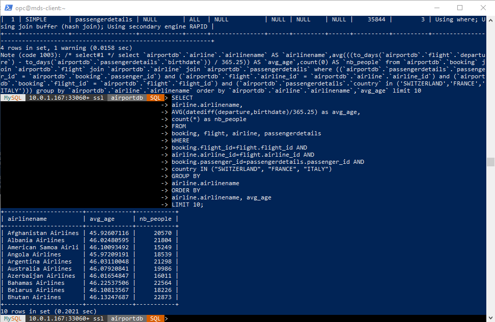
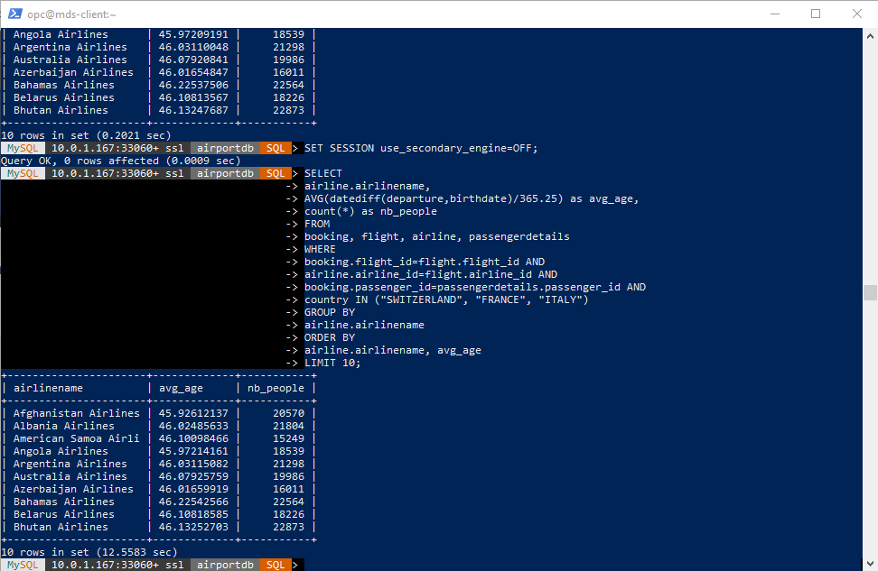
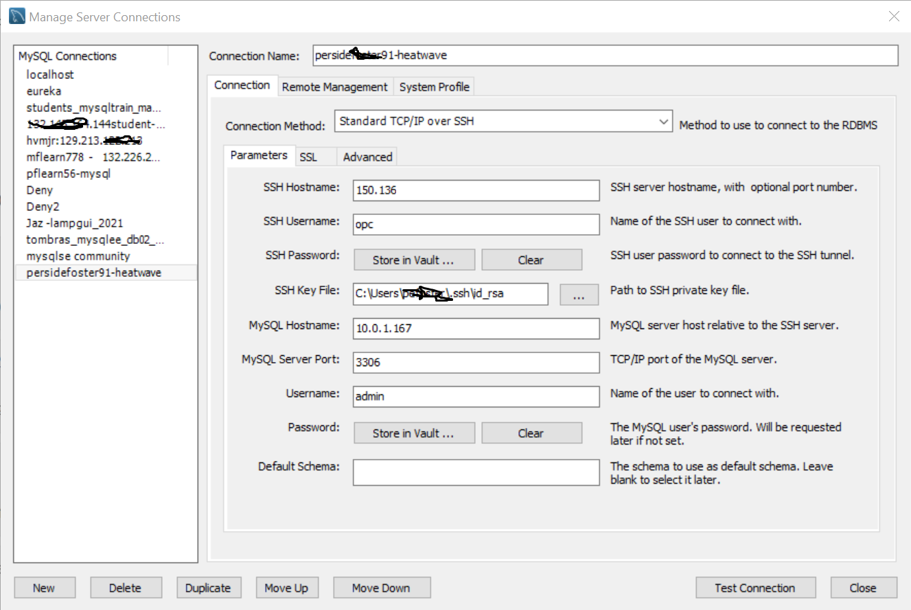
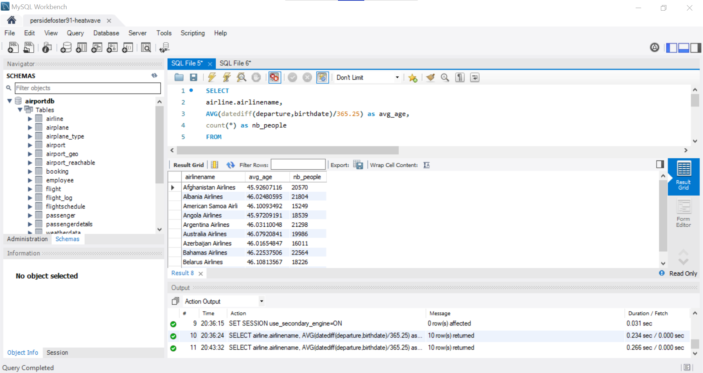

# Run Queries with MySQL Shell and Workbench
 


## Introduction

In this hands-on workshop, you will be introduced to MySQL Database Service (MDS), a powerful union between MySQL Enterprise Edition and Oracle Cloud Infrastructure. You will learn how to create and use MySQL Database Service with HeatWave in a secure Oracle Cloud Infrastructure environment.

Estimated Lab Time: 90 minutes


### Objectives

In this lab, you will be guided through the following tasks:

- Run Queries with MySQL Shell
- Run Queries using Workbench


### Prerequisites

- An Oracle Trial or Paid Cloud Account
- Some Experience with MySQL Shell
- Completed Task 3


## Task 1: Run Queries in HeatWave

1. If not already connected with SSH, on Command Line, connect to the Compute instance using SSH

    (Example: **ssh -i ~/.ssh/id_rsa opc@&132.145.170..**)

2. On command Line, connect to MySQL using the MySQL Shell client tool

    (Example  **mysqlsh -uadmin -p -h10.0.1..**)

3. Change the MySQL Shell execution mode to SQL. Enter the following command at the prompt:
    ```
    <copy>\SQL</copy>
    ```

4.	Change to the airport database.  Enter the following command at the prompt:
    ```
    <copy>USE airportdb;</copy>
    ```
    

 5. Turn on `use_secondary_engine` variable to use HeatWave
     ```
    <copy>SET SESSION use_secondary_engine=ON;</copy>
    ```
    
6. Query a - Find per-company average age of passengers from Switzerland, Italy and France

 7. Before Runing a query, use EXPLAIN to verify that the query can be offloaded to the HeatWave cluster. For example:

    ```
    <copy>EXPLAIN SELECT
    airline.airlinename,
    AVG(datediff(departure,birthdate)/365.25) as avg_age,
    count(*) as nb_people
FROM
    booking, flight, airline, passengerdetails
WHERE
    booking.flight_id=flight.flight_id AND
    airline.airline_id=flight.airline_id AND
    booking.passenger_id=passengerdetails.passenger_id AND
    country IN ("SWITZERLAND", "FRANCE", "ITALY")
GROUP BY
    airline.airlinename
ORDER BY
    airline.airlinename, avg_age
LIMIT 10;</copy>
    ```
    

8. After verifying that the query can be offloaded, run the query and note the execution time. Enter the following command at the prompt:
     ```
    <copy>SELECT
    airline.airlinename,
    AVG(datediff(departure,birthdate)/365.25) as avg_age,
    count(*) as nb_people
FROM
    booking, flight, airline, passengerdetails
WHERE
    booking.flight_id=flight.flight_id AND
    airline.airline_id=flight.airline_id AND
    booking.passenger_id=passengerdetails.passenger_id AND
    country IN ("SWITZERLAND", "FRANCE", "ITALY")
GROUP BY
    airline.airlinename
ORDER BY
    airline.airlinename, avg_age
LIMIT 10;
</copy>
    ```
     

 9. To compare the HeatWave execution time with MySQL DB System execution time, disable the `use_secondary_engine` variable to see how long it takes to run the same query on the MySQL DB System. For example:

 Enter the following command at the prompt:
     ```
    <copy>SET SESSION use_secondary_engine=OFF;</copy>
    ```

 10. Enter the following command at the prompt:
     ```
    <copy>SELECT
    airline.airlinename,
    AVG(datediff(departure,birthdate)/365.25) as avg_age,
    count(*) as nb_people
FROM
    booking, flight, airline, passengerdetails
WHERE
    booking.flight_id=flight.flight_id AND
    airline.airline_id=flight.airline_id AND
    booking.passenger_id=passengerdetails.passenger_id AND
    country IN ("SWITZERLAND", "FRANCE", "ITALY")
GROUP BY
    airline.airlinename
ORDER BY
    airline.airlinename, avg_age
LIMIT 10;</copy>
    ```
    

 11. To see if `use_secondary_engine` is enabled (=ON)

 Enter the following command at the prompt:
     ```
    <copy>SHOW VARIABLES LIKE 'use_secondary_engine%';</copy>
    ```
 12. Runing additional queries. Remember to turn on and off the `use_secondary_engine`  to compare the execution time. 
   
    (Example  **SET SESSION `use_secondary_engine`=On;**) 

    (Example  **SET SESSION `use_secondary_engine`=Off;**)      

 13. Enter the following command at the prompt
     ```
    <copy>SET SESSION use_secondary_engine=ON;</copy>
    ```
 14. Query b -  Find top 10 companies selling the biggest amount of tickets for planes taking off from US airports.	Run Pricing Summary Report Query:

    ```
    <copy> SELECT
    airline.airlinename,
    SUM(booking.price) as price_tickets,
    count(*) as nb_tickets
FROM
    booking, flight, airline, airport_geo
WHERE
    booking.flight_id=flight.flight_id AND
    airline.airline_id=flight.airline_id AND
    flight.from=airport_geo.airport_id AND
    airport_geo.country = "UNITED STATES"
GROUP BY
    airline.airlinename
ORDER BY
    nb_tickets desc, airline.airlinename
LIMIT 10;
    </copy>
    ```
15. Enter the following command at the prompt:
     ```
    <copy>SET SESSION use_secondary_engine=OFF;</copy>
    ```
    Run Query b again:

    ```
    <copy> SELECT
    airline.airlinename,
    SUM(booking.price) as price_tickets,
    count(*) as nb_tickets
FROM
    booking, flight, airline, airport_geo
WHERE
    booking.flight_id=flight.flight_id AND
    airline.airline_id=flight.airline_id AND
    flight.from=airport_geo.airport_id AND
    airport_geo.country = "UNITED STATES"
GROUP BY
    airline.airlinename
ORDER BY
    nb_tickets desc, airline.airlinename
LIMIT 10;
    </copy>
    ```
16. Query c - Give me the number of bookings that Neil Armstrong and Buzz Aldrin made for a price of > $400.00

    ```
    <copy>SET SESSION use_secondary_engine=ON;</copy>
    ```

    ```
    <copy>select firstname, lastname, count(booking.passenger_id) as count_bookings from passenger, booking   where booking.passenger_id = passenger.passenger_id  and passenger.lastname = 'Aldrin' or (passenger.firstname = 'Neil' and passenger.lastname = 'Armstrong') and booking.price > 400.00 group by firstname, lastname;</copy>
    ```
    ```
    <copy>SET SESSION use_secondary_engine=OFF;</copy>
    ```
    
    ```
    <copy>select firstname, lastname, count(booking.passenger_id) as count_bookings from passenger, booking   where booking.passenger_id = passenger.passenger_id  and passenger.lastname = 'Aldrin' or (passenger.firstname = 'Neil' and passenger.lastname = 'Armstrong') and booking.price > 400.00 group by firstname, lastname;</copy>
    ```

17. Keep HeatWave processing enabled

    ```
    <copy>SET SESSION use_secondary_engine=ON;</copy>
    ```

## Task 2: Connect to HeatWave using Workbench
1. At this point, you can also use MySQL Workbench from your local machine to connect to the MySQL endpoint using your new Compute instance as a jump box

2. In your pre-installed MySQL Workbench, configure a connection using the method "Standard TCP/IP over SSH" and use the credentials of the Compute instance for SSH

    **MySQL Workbench Configuration for MDS HeatWAve**
     
   
    **MySQL Workbench Use  for MDS HeatWAve**
     


## Learn More

* [Oracle Cloud Infrastructure MySQL Database Service Documentation ](https://docs.cloud.oracle.com/en-us/iaas/mysql-database)
* [MySQL Database Documentation](https://www.mysql.com)
## Acknowledgements
* **Author** - Perside Foster, MySQL Solution Engineering 
* **Contributors** - Mandy Pang, MySQL Principal Product Manager,  Priscila Galvao, MySQL Solution Engineering, Nick Mader, MySQL Global Channel Enablement & Strategy Manager
* **Last Updated By/Date** - Perside Foster, MySQL Solution Engineering, September 2021
