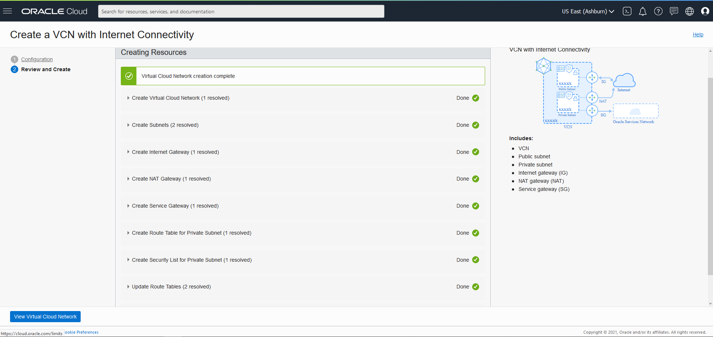
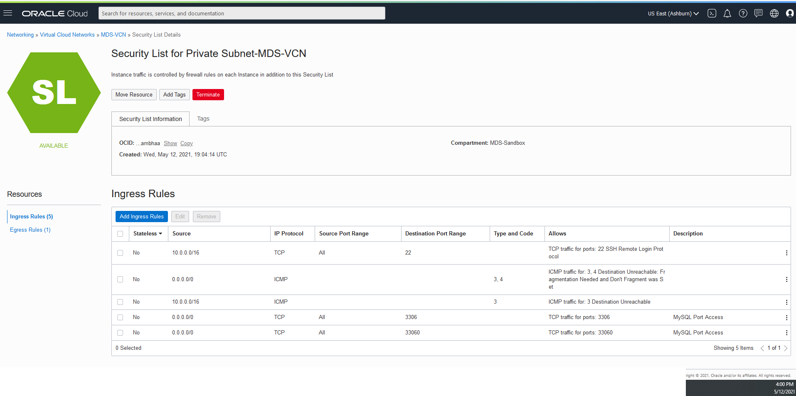
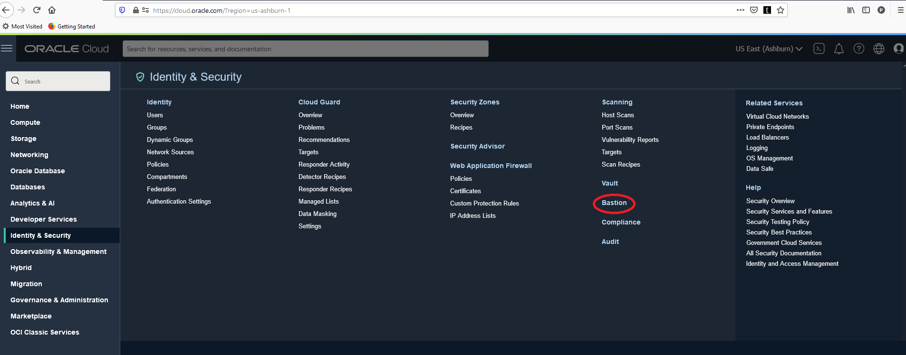
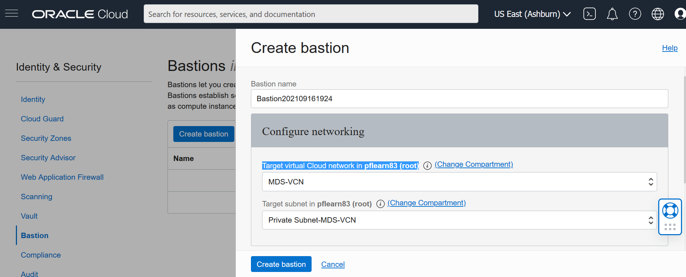
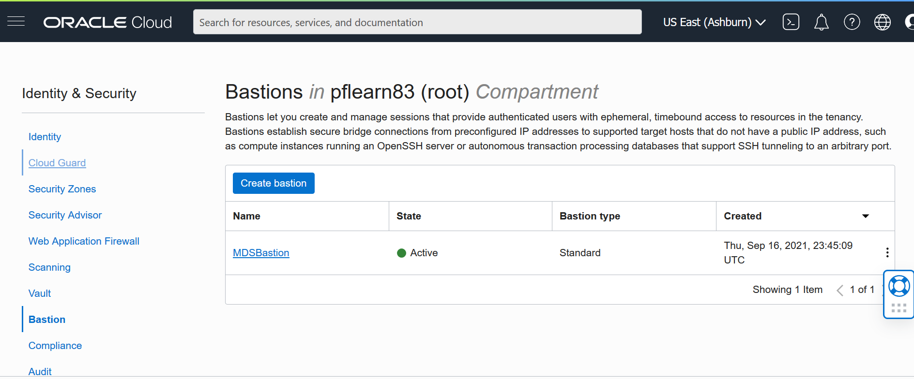

# Connect to MySQL Database System
 


## Introduction

When working in the cloud, there are often times when your servers and services are not exposed to the public internet. The Oracle Cloud Infrastructure (OCI) MySQL cloud service is an example of a service that is only accessible via private networks. Since the service is fully managed, we keep it siloed away from the internet to help protect your data from potential attacks and vulnerabilities. It’s a good practice to limit resource exposure as much as possible, but at some point, you’ll likely want to connect to those resources. That’s where bastion hosts enter the picture. A bastion host is a resource that sits between the private resource and the endpoint which requires access to the private network and can act as a “jump box” to allow you to log in to the private resource via protocols like SSH or RDP.  The bastion host requires a Virtual Cloud Network to connect with the MySQL DB Systems. 

Oracle added a Bastion Service to OCI. And you may also have noticed that the OCI Dashboard offers you the possibility to use a browser based terminal: Cloud Shell.

Today, you will use these two components to connect from the browser to a MDS DB System

Estimated Lab Time 15 minutes


### Objectives

In this lab, you will be guided through the following tasks:

- Create SSH Key on OCI Cloud Shell 
- Create Create Virtual Cloud Network  
- Setup Bastion Service


### Prerequisites

- An Oracle Trial or Paid Cloud Account
- Some Experience with MySQL Shell


## Task 1: Create SSH Key on OCI Cloud Shell

The Cloud Shell machine is a small virtual machine running a Bash shell which you access through the OCI Console (Homepage). You will start the Cloud Shell and generate a SSH Key to use  for the Bastion  session.

1.  To start the Oracle Cloud shell, go to your Cloud console and click the cloud shell icon at the top right of the page. This will open the Cloud Shell in the browser, the first time it takes some time to generate it.

    

    

2.  Once the cloud shell has started, create the SSH Key using the following command:

    ````
    <copy>ssh-keygen -t rsa</copy>
    ````
    
    Hit enter for each question.
    
    Here is what it should look like.  

    

3.  The public  and  private SSH keys  are stored in ~/.ssh/id_rsa.pub.

4.  Examine the two files that you just created.

    ````
    <copy>cd .ssh</copy>
    ````
    
    ````
    <copy>ls</copy>
    ````

    

    Note in the output there are two files, a *private key:* `id_rsa` and a *public key:* `id_rsa.pub`. Keep the private key safe and don't share its content with anyone. The public key will be needed for various activities and can be uploaded to certain systems as well as copied and pasted to facilitate secure communications in the cloud.

## Task 2: Create Virtual Cloud Network

1. Navigation Menu > Networking > Virtual Cloud Networks
    

2. Click 'Start VCN Wizard'
    

3. Select 'Create VCN with Internet Connectivity'

    Click on 'Start VCN Wizard' 
    

4. Create a VCN with Internet Connectivity 

    On Basic Information, complete the following fields:

 VCN Name: 
     ```
    <copy>MDS-VCN</copy>
    ```
 Compartment: Select  **(root)**

 Your screen should look similar to the following
    

5. Click 'Next' at the bottom of the screen 

6. Review Oracle Virtual Cloud Network (VCN), Subnets, and Gateways
         
    Click 'Create' to create the VCN
    

7. The Virtual Cloud Network creation is completing 
    
    
8. Click 'View Virtual Cloud Network' to display the created VCN
    

9. On MDS-VCN page under 'Subnets in (root) Compartment', click on '**Private Subnet-MDS-VCN**' 
     

10.	On Private Subnet-MDS-VCN page under 'Security Lists',  click on '**Security List for Private Subnet-MDS-VCN**'
    

11.	On Security List for Private Subnet-MDS-VCN page under 'Ingress Rules', click on '**Add Ingress Rules**' 
    

12.	On Add Ingress Rules page under Ingress Rule 1
 
 Add an Ingress Rule with Source CIDR 
    ```
    <copy>0.0.0.0/0</copy>
    ```
 Destination Port Range 
     ```
    <copy>3306,33060</copy>
     ```
Description 
     ```
    <copy>MySQL Port Access</copy>
     ```
 Click 'Add Ingress Rule'
    

13.	On Security List for Private Subnet-MDS-VCN page, the new Ingress Rules will be shown under the Ingress Rules List
    


## Task 3: Create Bastion Service

The new Bastion Service that will allow you to create a SSH Tunnel to your MySQL DB System.
1. Go to Navigation Menu > Identity Security > Bastion

    

2. Click Create Bastion

    

 3. On Create bastion, complete the following fields:   

    Bastion Name
     ```
     <copy>MDSBastion</copy>
     ```
    Target virtual Cloud network in .. (root)
    
    Select  `MDS-VCN`
    
    Target subnet in .. (root)

    Select  `Private Subnet-MDS-VCN`

    CIDR block allowlist (As you don’t know the IP of the Cloud Shell, use 0.0.0.0/0)

     ```
     <copy>0.0.0.0/0</copy>
     ```
    
    Click `0.0.0.0/0(New)`

     

4. Click `Create Bastion` button 

    When completed your scren should look like this:

     


You may now [proceed to the next lab](#next).

## Learn More

* [Cloud Shell](https://www.oracle.com/devops/cloud-shell/?source=:so:ch:or:awr::::Sc)
* [Virtual Cloud Network](https://docs.oracle.com/en-us/iaas/Content/Network/Concepts/overview.htm)
* [OCI Bastion Service ](https://docs.cloud.oracle.com/en-us/iaas/mysql-database)
## Acknowledgements
* **Author** - Dan Kingsley, Enablement Specialist, OSPA
* **Contributors** - Jaden McElvey, Kamryn Vinson, Frédéric Descamps 
* **Last Updated By/Date** - Perside Foster, September 2021
