# Launch Your First MySQL Database Service System

## Introduction
In this lab, you will learn how to launch a MySQL Database Service System on Oracle Cloud Infrastructure (OCI) and connect to it using the Oracle Cloud Console.

Estimated Time: 90 minutes

### About MySQL Database Service

MySQL Database Service is a fully-managed OCI service that is developed, managed, and supported by the MySQL team in Oracle.

### Objectives

In this lab, you will be guided through the following steps:

- Create a Compartment
- Create a policy
- Create a virtual cloud network (VCN)
- Create a MySQL Database System
- Create a client virtual machine
- Connect to MySQL Database
- Start, stop, reboot, or delete a MySQL Database

### Prerequisites

- An Oracle Free Tier, Always Free, Paid or LiveLabs Cloud Account
- Some Experience with MySQL Shell
- Create a local Secure Shell (SSH) key

## Task 1: Create a Compartment

You must have an OCI tenancy subscribed to your home region and enough limits configured for your tenancy to create a MySQL Database System. Make sure to log in to the Oracle Cloud Console as an Administrator.

1. Click the **Navigation Menu** in the upper left, navigate to **Identity & Security** and select **Compartments**.

    

2. On the Compartments page, click **Create Compartment**.

    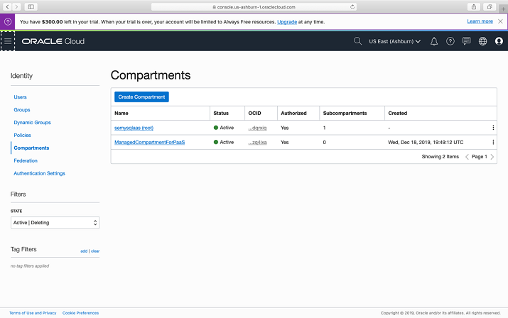

   > **Note:** Two Compartments, _Oracle Account Name_ (root) and a compartment for PaaS, were automatically created by the Oracle Cloud.

3. In the Create Compartment dialog box, in the **NAME** field, enter **MDS_Sandbox**, and then enter a Description, select the **Parent Compartment**, and click **Create Compartment**.

    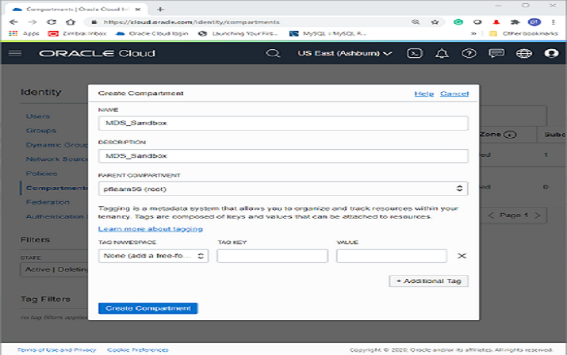

    The following screen shot shows a completed compartment:

    

## Task 2: Create a Policy

1.	Click the **Navigation Menu** in the upper-left corner, navigate to **Identity & Security** and select **Policies**.

     

2.	On the Policies page, in the **List Scope** section, select the Compartment (root) and click **Create Policy**.

    

3.	On the Create Policy page, in the **Description** field, enter **MDS_Policy** and select the root compartment.

3. In the **Policy Builder** section, turn on the **Show manual editor** toggle switch.

    

4. Enter the following required MySQL Database Service policies:

    - Policy statement 1:

     ```
    <copy>Allow group Administrators to {COMPARTMENT_INSPECT} in tenancy</copy>
    ```

    - Policy statement 2:

     ```
    <copy>Allow group Administrators to {VCN_READ, SUBNET_READ, SUBNET_ATTACH, SUBNET_DETACH} in tenancy</copy>
    ```

    - Policy statement 3:

     ```
    <copy>Allow group Administrators to manage mysql-family in tenancy</copy>
    ```

5. Click **Create**.

    

    > **Note:** The following screen shot shows the completed policy creation:

    

## Task 3: Create a VCN

1. Click the **Navigation Menu** in the upper-left corner, navigate to **Networking**, and select **Virtual Cloud Networks**.

   

2. Click **Start VCN Wizard**.

3. Select **VCN with Internet Connectivity** and click **Start VCN Wizard**.

    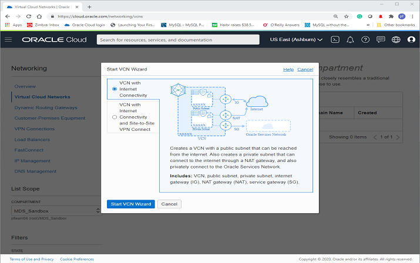

4. On the Create a VCN with Internet Connectivity page, in the **Basic Information** section, in the **VCN Name** field, enter `MDS_VCN` and from the **Compartment** drop-down list, select **MDS_Sandbox**.
    > **Note:** Your screen should look similar to the following screen shot:

    

5. Click **Next** at the bottom of the screen.

6. Review the **Oracle Virtual Cloud Network (VCN)**, **Subnets**, and **Gateways** sections and click **Create** to create the VCN.

    

    > **Note:** The VCN creation is completing.

    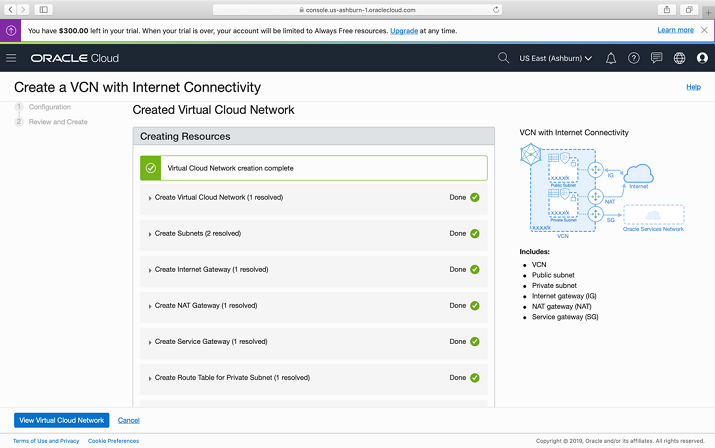

8. Click **View Virtual Cloud Network** to display the created VCN.

    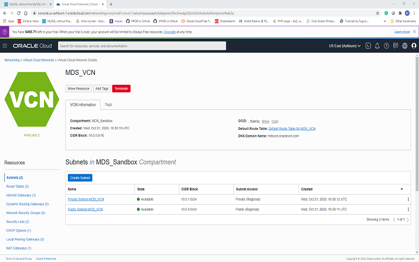

9. In the **Name** column, click **MDS_VCN**.

   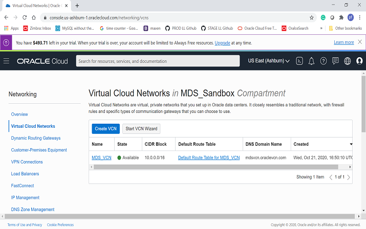

10.	On the Virtual Cloud Network Details page, under **Resources**, select **Security Lists (2)**.

     

11.	In the **Security Lists in _Compartment\_Name_ Compartment** section, click **Security List for Private Subnet-MDS_VCN**.

    

12.	In the **Security List for Private Subnet-MDS_VCN** section, in the **Ingress Rules** section, click **Add Ingress Rules**.

    

13.	In the **Add Ingress Rule** dialog box, add an ingress rule with **Source CIDR** `0.0.0.0/0` and destination port number `3306, 33060` and click **Add Ingress Rule**.

    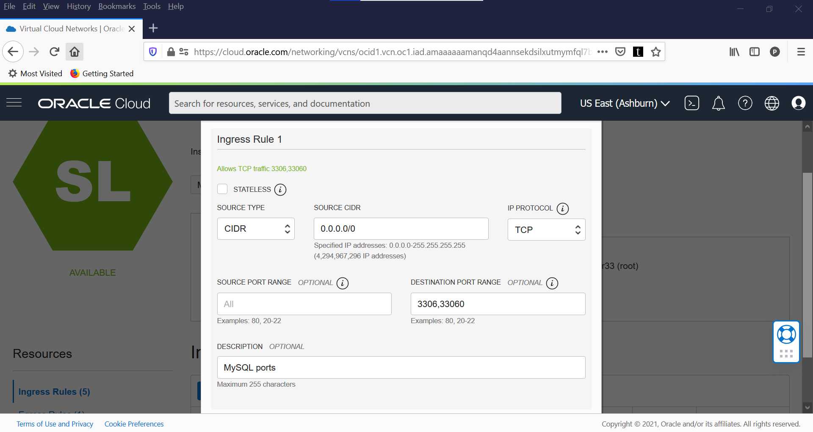

14.	On the Security List for Private Subnet-MDS_VCN page, the new ingress rules will be shown in the **Ingress Rules** list.

    

## Task 4: Create a MySQL Database System

1. Click the **Navigation Menu** in the upper-left corner, navigate to **Databases**, and select **Database Systems**.

   

2. Click **Create MySQL Database System**.

    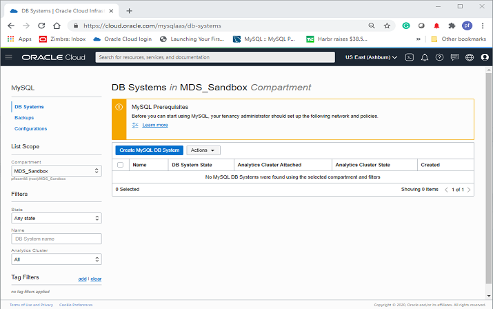

3. On the Create MySQL Database System dialog box, complete the fields in each section:

    - Provide basic information for the database system
    - Set up your required database system
    - Create administrator credentials
    - Configure networking
    - Configure placement
    - Configure hardware
    - Configure backups
    - Show advanced options

4. In **Provide basic information for the DB System**, select the **MDS\_Sandbox** Compartment, in the **Name** field and **Description** field, enter **MDS_DB**.

    

5. In **Setup your required Database System**, select **Standalone** to specify a single-instance database system.

    

6. In **Create Administrator credentials**, enter **admin** for the user name, enter **Welcome1!** for the password, and then enter **Welcome1!** to confirm the password.   

    

7. In **Configure networking**, keep default values **MDS\_VCN** for the VCH and **Private Subnet-MDS\_VCN (Regional)** for the subnet.

    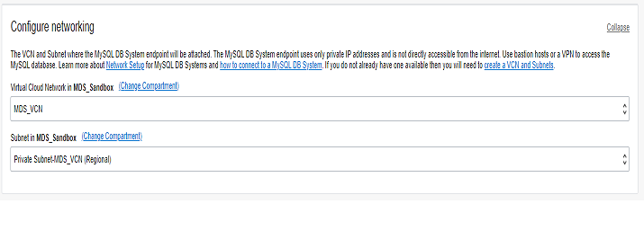

8. In **Configure placement**, keep **Availability Domain** selected.

    > **Note:** Do not select **Choose a Fault Domain** for this database system. Oracle will select the best placement for you.

    

9. In **Configure hardware**, keep default shape **MySQL.VM.Standard.E3.1.8GB** and keep the default value **50** for the **Data Storage Size (GB)**.

    

19. In **Configure Backups**, keep **Enable Automatic Backups** selected. Set the retention period to `7` and select **Default Backup Window**.

    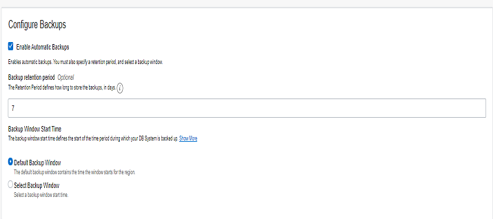

20. Click **Create**.

    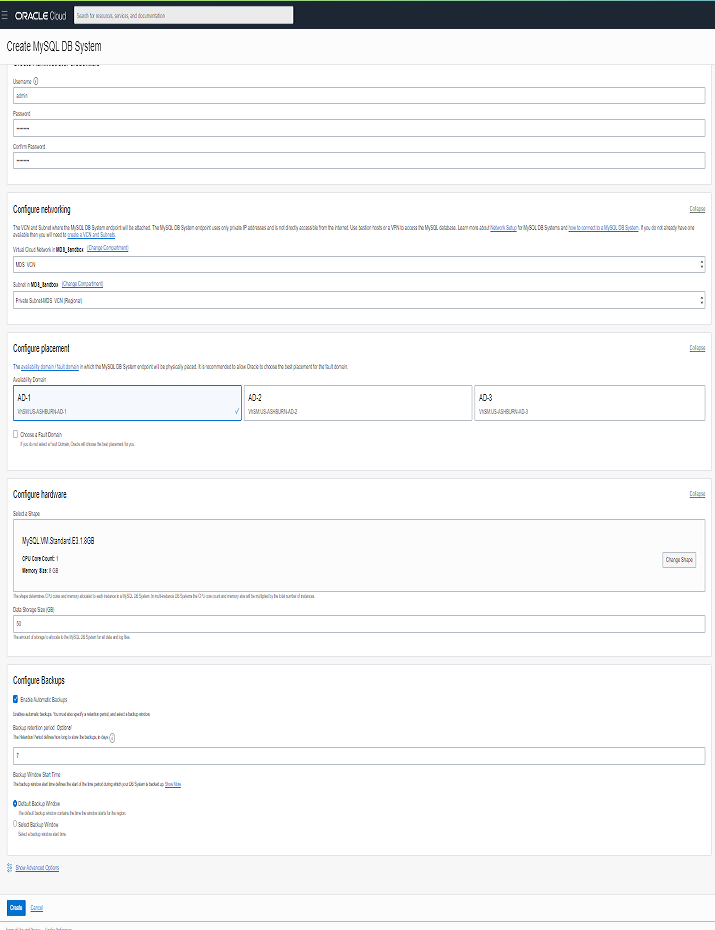

    > **Note:** The New MySQL Database System will be ready to use after a few minutes. The state will be shown as **Creating** during the creation.

    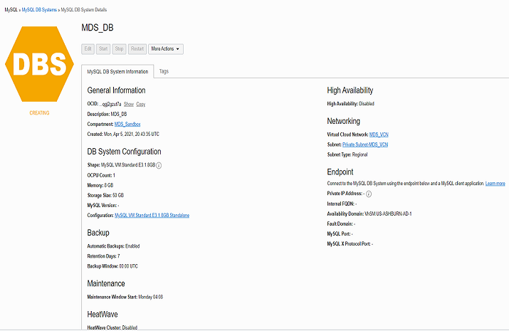

    > **Note:** The **Active** state indicates that the database system is ready to use.

21. On the MySQL Database System Details page, verify that the MySQL endpoint (address) displays under **Instances**.

    

## Task 5: Create the Client Virtual Machine

> **Important:** If you have not already completed the **Create Local SSH Key** lab, please do so now. When you are finished, return to this task.

1. You need a client machine to connect to your brand new MySQL database. Click the **Navigation Menu** in the upper-left corner, navigate to **Compute**, and select **Instances**.

   

2. In the **Instances in MDS_Sandbox Compartment** section, click **Create Instance**.

    

3. In the **Create Compute Instance** section, enter **MDS_Client** for the instance name.

4. Make sure the **MDS_Sandbox** compartment is selected.

5. Choose an operating system or image source (for this lab, select **Oracle Linux**).

6. In the **Configure placement and hardware** section, select the **Availability Domain** and select  **VM.Standard.E2.1.Micro** for the **Shape**.

   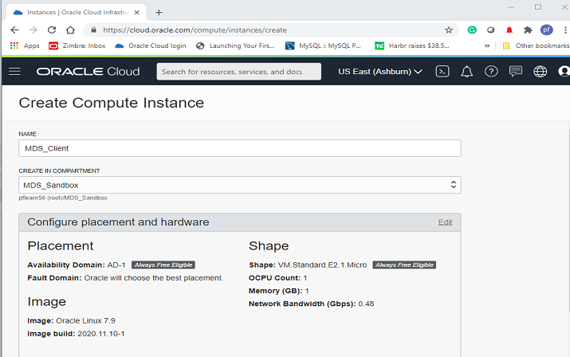

    > **Note:** For the **Virtual cloud network**, make sure **MDS_VCN** is selected and **Assign a public IPv4 address** is set to **Yes**.  

   

7. If you have not already created your SSH key, complete the **Create Local SSH Key** lab. When you are done, continue on to the next step.

8. In the **Add SSH keys** section, generate an SSH key pair or upload your own public key. Select one of the following options:

   - **Generate SSH key pair:** Oracle Cloud Infrastructure (OCI) generates an RSA key pair for the instance. Click **Save Private Key**, and then save the private key on your computer. Optionally, click **Save Public Key** and then save the public key.
   - **Choose public key files:** Upload the public key portion of your key pair. Either browse to the key file that you want to upload, or drag and drop the file into the field. To provide multiple keys, press and hold down the Command key (on Mac) or the CTRL key (on Windows) while selecting files.
   - **Paste public keys:** Paste the public key portion of your key pair in the field.
   - **No SSH keys:** Do _not_ select this option. You will not be able to connect to the compute instance using SSH.

    

    > **Note:** The new virtual machine will be ready to use after a few minutes. The state will be shown as **Provisioning** during the creation.

    

    > **Note:** The **Running** state indicates that the virtual machine is ready to use. **Save the Public IP Address** is under **Instance Access**  on the **MDS_Client** page.

    

## Task 6: Connect to MySQL Database

If you are a Linux, Mac, or  Windows 10 Powershell user, skip the first step.

1.  If you are a Windows user, click the Start menu from your windows machine to access Git, which should include the Git Bash command. select the Git Bash command.

    > **Note:** This will take you to the Git Bash terminal.

2.  From a terminal window on your local system, connect to the compute instance with the SSH command.

3. Indicate the location of the private key that you created earlier with **MDS_Client**.

4. Enter the user name `opc` and the public **IP Address**.

      > **Note:** The **MDS\_Client** shows the public IP Address as mentioned at the end of **Task 5: Create the Client Virtual Machine**. For example, **ssh -i ~/.ssh/id_rsa opc@&132.145.170.990**

     ```
     <copy>$ ssh -i ~/.ssh/id_rsa opc@&<your_compute_instance_ip>;</copy>
     ```

     

3. Install MySQL release package with the following command (you will need a MySQL client tool to connect to your new MySQL Database System from your client machine):

     ```
     <copy>[opc@...]$ sudo yum -y install https://dev.mysql.com/get/mysql80-community-release-el7-3.noarch.rpm</copy>
     ```

     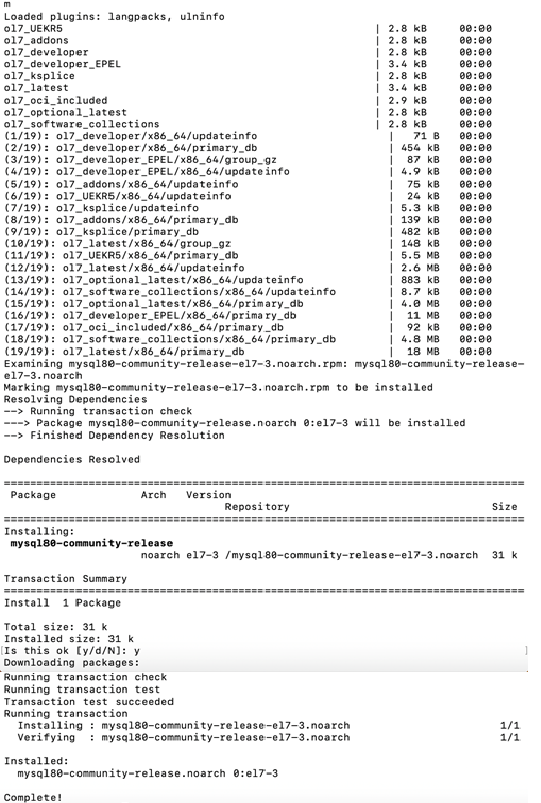

4. Install MySQL Shell with the following command:

     ```
     <copy>[opc@...]$ sudo yum install –y mysql-shell</copy>
     ```

     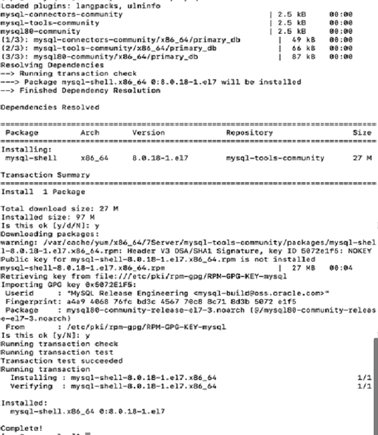

4. From your compute instance, connect to MySQL using the MySQL Shell client tool.

     > **Note:** The endpoint (IP address) can be found on the MySQL Database System Details page, under **Endpoints**.

     

5.  Use the following command to connect to MySQL using the MySQL Shell client tool. For example,  **mysqlsh -uadmin -p -h132.145.170.990**.

     ```
     <copy>[opc@...]$ mysqlsh -u<MDS_admin_username> -p -h<MDS_endpoint></copy>
     ```

     

6. On MySQL Shell, switch to SQL mode to try some SQL commands. Type the following command at the prompt:    

     ```
     <copy>\SQL</copy>
     ```

     

7. To display a list of databases, type the following command at the prompt:

     ```
     <copy>SHOW DATABASES;</copy>
     ```

8. To display the database version, current date, and user, type the following command at the prompt:

     ```
     <copy>SELECT VERSION(), CURRENT_DATE, USER();</copy>
     ```

9. To display MysQL user and host from user table type the following command at the prompt:

     ```
     <copy>SELECT USER, HOST FROM mysql.user;</copy>
     ```

     > **Note:** Optionally, you can use MySQL Workbench from your local machine to connect to the MySQL endpoint using your new compute instance as a jump box.

10. If required, in your pre-installed **MySQL Workbench**, configure a connection using the **Standard TCP/IP over SSH** method and use the credentials of the compute instance for SSH.

   - MySQL Workbench configuration for MySQL MySQL Database Service:

     

   - MySQL Workbench launched for MySQL Database Service:

     

## Task 7: Start, Stop, or Reboot MySQL Database System

1. Click the **Navigation Menu** in the upper-left corner, navigate to **Databases**, and select **DB Systems**.

   

2. List Database Systems.

   

3. Select the **MDS\_Sandbox** Compartment and click **MDS\_DB** to open the MySQL DB System Details page.

    

3. Select one of the following actions:

    - Start: Starts a stopped database system. After the database system is started, the **Stop** action is enabled and the **Start** option is disabled.
    - Stop: Stops a running database system. After the database system is powered off, the **Start** action is enabled.
    - Restart: Shuts down a database system, and restarts it.

     > **Note:**  Stopping a database system stops billing for all OCPUs associated with it.
       - Billing continues for storage.
       - Billing for OCPUs resumes if you restart the database system.
       - If you selected **Stop** or **Restart**, the Stop/Restart MySQL Database System dialog box is displayed.

4. Select a shutdown type:

     - Fast: Flushes dirty pages before shutting down the database system. Some flush operations must        be performed during the next startup, potentially increasing the duration of the start-up    process.
     - Slow: Flushes dirty pages and purges undo log pages for older transactions. The shutdown itself can take longer, but the subsequent startup is faster.
     - Immediate: Does not flush dirty pages and does not purge any undo log pages. Stops MySQL immediately. Page flushes and log purging will take place during the next startup, increasing the duration of the start-up process.

5. Select the required shutdown type and click **Stop** or **Restart**, depending on the action chosen.

## Task 8: Delete the MySQL Database System

Deleting a database system is permanent. Any manual backups associated with the deleted database system are retained for their retention periods. Automatic backups are deleted with the database system.

1. Click the **Navigation Menu** in the upper-left corner, navigate to **Databases**, and select **DB Systems**.

   

2. List Database Systems.

   

3. Choose the **MDS_Sandbox** Compartment.

4. Click **MDS_DB** to open the MySQL DB System Details page.

    

5. From the **More Actions** drop-down list, select **Delete**.

    

    > **Note:** A prompt is displayed, asking you to confirm the deletion.

    

6. Enter `DELETE` in all caps and click **Delete 1 MySQL Database System**.

When the delete process is done, **MDS_DB** will be set to the **Delete** status.

## Learn More

* [Oracle Cloud Infrastructure MySQL Database Service Documentation ](https://docs.cloud.oracle.com/en-us/iaas/mysql-database)
* [MySQL Database Documentation](https://www.mysql.com)

## Acknowledgements
* **Author** -  Perside Foster, MySQL Solution Engineering
* **Contributors** -  Airton Lastori, MySQL Principal Product Manager, Priscila Galvao, MySQL Solution Engineering, Nick Mader, MySQL Global Channel Enablement & Strategy Manager
* **Last Updated By/Date** - Perside Foster, MySQL Solution Engineering, September 2021
