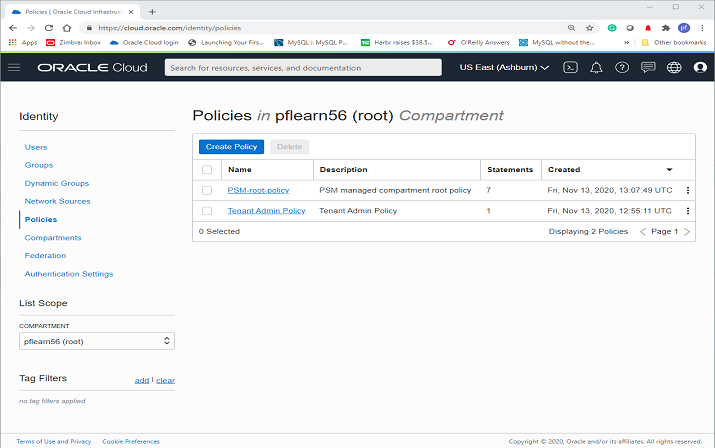
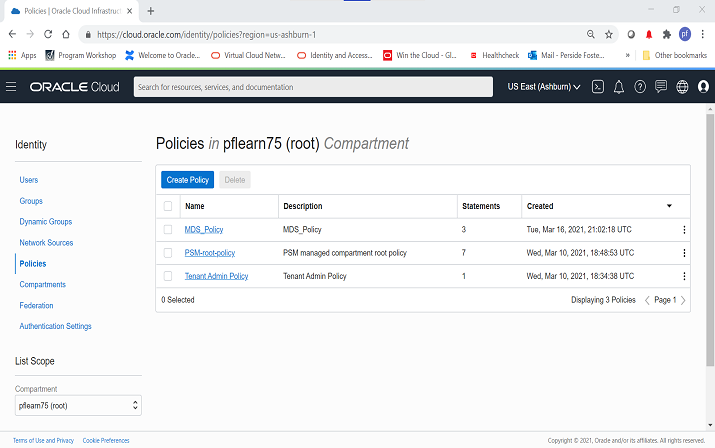
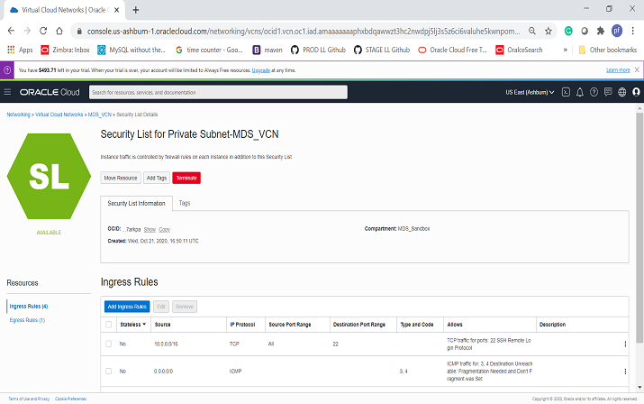
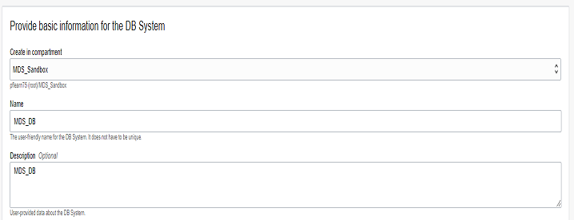
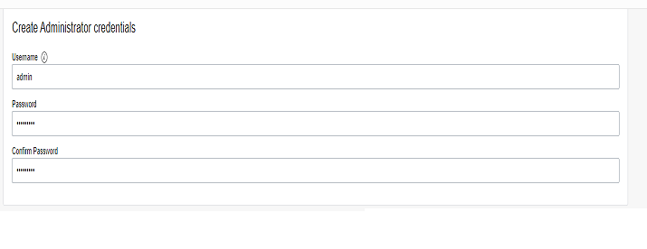
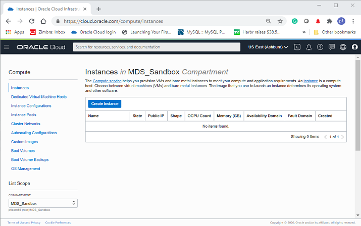
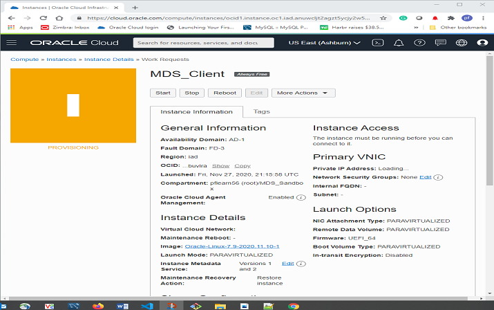
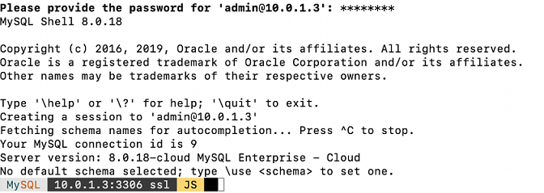
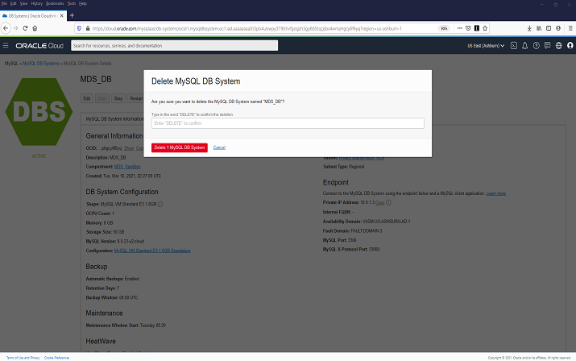

# Launch Your First MySQL Database Service System

## Introduction

In this Lab, you will learn how to launch a MySQL Database Service System on OCI and connect to it using the Console.

Estimated Lab Time: 90 minutes

### About MySQL Database Service

MySQL Database Service is a fully-managed OCI, developed, managed, and supported by the MySQL team in Oracle.

### Objectives

In this lab, you will be guided through the following tasks:

- Create a Compartment
- Create a Policy
- Create a Virtual Cloud Network
- Create a MySQL DB System
- Create a Client Virtual Machine
- Connect to a MySQL Database System
- Start, stop, reboot, or delete a MySQL Database

### Prerequisites

- An Oracle Free Tier, Always Free, Paid or LiveLabs Cloud Account
- Some Experience with MySQL Shell
- Complete Lab 1: Create Local SSH Key

## **TASK 1**: Create Compartment

You must have an Oracle Cloud Infrastructure service (OCI) tenancy subscribed to your home region and enough limits configured for your tenancy to create a MySQL Database System. Make sure to log-in to the Console as an Administrator.

1. From the **Navigation Menu** in the upper left, select **Identity & Security** and select **Compartments**.

		

2. Click Create Compartment. 

    

  >**Note**:  Two Compartments, named Oracle Account Name (root) and a compartment for PaaS, were automatically created by the Oracle Cloud. 

3. In the Create Compartment dialog box, in the Name field, enter **MDS_Sandbox**, and Description.  From the  Parent Compartment drop down list. select Parent Compartment.

4. Click Create Compartment.

    
 
   **Completed Compartment** 
    

## **TASK 2**: Create Policy
1.	Click the **Navigation Menu** in the upper left, navigate to **Identity & Security** and select **Policies**.

		

2.	On Policies Page, under List Scope, select the Compartment(root) and click the Create Policy button.
    

3.	On Create Policy, enter Name **MDS_Policy**, Description, select Root comaprtment. On Policy Builder turn on the “Show manual editor”  switch. 
    
4. Enter the following required MySQL Database Service policies:

    a. Policy statement 1:

    ```
    <copy>Allow group Administrators to {COMPARTMENT_INSPECT} in tenancy</copy>
    ```

    b. Policy statement 2:

    ```
    <copy>Allow group Administrators to {VCN_READ, SUBNET_READ, SUBNET_ATTACH, SUBNET_DETACH} in tenancy</copy>
    ```

    c. Policy statement 3:

    ```
    <copy>Allow group Administrators to manage mysql-family in tenancy</copy>
    ```
5. Click the Create button

     

    
    **Completed Policy Creation**
    

## **TASK 3:** Create Virtual Cloud Network

1. Click the **Navigation Menu** in the upper left, navigate to **Networking**, and select **Virtual Cloud Networks**.

	

2. Click Start VCN Wizard.
    

3. Select VCN with Internet Connectivity 

4. click Button Start VCN Wizard 
    

5. Create a VCN with Internet Connectivity 

6. On Basic Information  Complete the following fields 
    - VCN Name **MDS_VCN**    
    - Compartment **MDS_Sandbox** 

7. Your screen should look similar to the following
    
  
8. Click the Next button at the bottom of the screen 

9. Review Oracle Virtual Cloud Network (VCN), Subnets, and Gateways
         
10. Click Create button to create the VCN
    

11. The Virtual Cloud Network creation is completing 
    
    
12. Click "View Virtual Cloud Network" button to display the  created VCN
    

13. Click the VCN Name **MDS_VCN**. 
            

14.	On the Virtual Cloud Network Details page, under Resources, click Security Lists (2).
        

15.	On Security Lists in <Compartment Name> Compartment, click Security List for Private Subnet-MDS_VCN.

    

16.	On Security List for Private Subnet-MDS_VCN  page, under Ingress Rules, click Add Ingress Rules.
    

17.	On Add Ingress Rule, add an Ingress Rule with Source CIDR 0.0.0.0/0, Destination Port Name 3306, 33060, and Description  

18. Click Add Ingress Rule.
    

19.	On Security List for Private Subnet-MDS_VCN page
 
 New Ingress Rules will be shown under the Ingress Rules List
    

## **TASK 4:** Create a MySQL Database System.

1. Click the **Navigation Menu** in the upper left, navigate to **Databases**, and select **Database Systems**.

	

2. Click Create MySQL Database System
    

3. On Create MySQL Database System dialog complete the fields in each section

    - Provide basic information for the Database System
    - Setup your required Database System
    - Create Administrator credentials
    - Configure Networking
    - Configure placement
    - Configure hardware
    - Configure Backups
    - Show Advanced Options

4. On Provide basic information for the Database System:
      
    Select Compartment **MDS_Sandbox**
      
    Name enter **MDS_DB**
      
    Description enter **MDS_DB**

    

5. On Setup your required Database System 
    
    System Select **Standalone** to specify a single-instance Database System
    

6. On Create Administrator credentials

    Username to **admin**

    Password to **Welcome1!**  
    
    Confirm Password **Welcome1!**
    

7. On Configure networking Keep default values

    Virtual Cloud Network: **MDS_VCN**
    
    Subnet: **Private Subnet-MDS_VCN (Regional)**

    

8. On Configure placement  keep checked  "Availability Domain"
    
    Do not check "Choose a Fault Domain" for this Database System. Oracle will chooses the best placement for you.
    

9. On Configure hardware keep default shape  **MySQL.VM.Standard.E3.1.8GB**

    Data Storage Size (GB) keep default value **50**
    

10. On Configure Backups, keep  "Enable Automatic Backups" checked
    
    set Retention period to **7**
    
    select "Default Backup Window"
    
    
    
11. Click Create button 
    

12. The New MySQL Database System will be ready to use after a few minutes. 

    The state will be shown as Creating during the creation
    

13. The state Active indicates that the Database System is ready to use. 

    Check the MySQL endpoint (Address) under Instances in the MySQL Database System Details page. 

    

## **TASK 5:** Create Client Virtual Machine

**Important:** If you have not already completed **Lab 1: Create Local SSH Key**, please do so now. 
- When you are finished, return to this TASK 5 #1.

1. You will need a client machine to connect to your brand new MySQL database. Click the **Navigation Menu** in the upper left, navigate to **Compute**, and select **Instances**

	 
    
2. On Instances in **MDS_Sandbox** Compartment, click Create Instance.
    

3. On Create Compute Instance enter **MDS_Client**  for the instance Name.

4. Make sure **MDS_Sandbox** compartment is selected. 
 
5. Choose an operating system or image source 
    
    for this lab , select Oracle Linux
 
6. Edit Configure placement and hardware
   
7. Select the Availability Domain and Instance Shape

    select VM.Standard.E2.1.Micro
    

8. For VCN make sure **MDS_VCN** is selected, "Assign a public IP address" should be set to Yes.  
    

9. If you have not already created your SSH key

    * Perform Lab 1: Create Local SSH Key

    * When you are done return to the next line

10. In the Add SSH keys section, generate an SSH key pair or upload your own public key. 

11. Select one of the following options: 
    * **Generate SSH keys:** Oracle Cloud Infrastructure generates an RSA key pair for the instance. Click Save Private Key, and then save the private key on your computer. Optionally, click Save Public Key and then save the public key.
    * **Generate SSH keys:** Oracle Cloud Infrastructure generates an RSA key pair for the instance. Click Save Private Key, and then save the private key on your computer. Optionally, click Save Public Key and then save the public key.  
    * **Choose SSH key files:** Upload the public key portion of your key pair. Either browse to the key file that you want to upload, or drag and drop the file into the box. To provide multiple keys, press and hold down the Command key (on Mac) or the CTRL key (on Windows) while selecting files.
    * **Paste SSH keys:** Paste the public key portion of your key pair in the box.
    * **No SSH keys:** Do NOT select this option! You will not be able to connect to the Compute Instance using SSH.
     

12. The New Virtual Machine will be ready to use after a few minutes. The state will be shown as Provisioning during the creation
    

13.	The state Running indicates that the Virtual Machine is ready to use. 

14. **Save the Public IP Address** under "Instance Access"  on the **MDS_Client** Instance page. 
    

## **TASK 6:** Connect to MySQL Database

1. If you are a Linux, Mac, or  Windows 10 Powershell user go to TASK 6: #2

2. If you are a Windows user click Start menu from your windows machine for Git which should include the Git Bash command.

3. Click the Git Bash command. This will take you to the Git Bash terminal as shown below and continue to  TASK 6: #4. 
    

4.  From a terminal window on your local system. Connect to the Compute Instance with the SSH command. 

5. Indicate the location of the private key you created earlier with **MDS_Client**. 
    
6. Enter the username **opc** and the Public **IP Address**.

    * Note: The **MDS_Client**  shows the  Public IP Address as mentioned on TASK 5: #10
    
    * (Example: **ssh -i ~/.ssh/id_rsa opc@&132.145.170.990**)

     ````
    <copy>ssh -i ~/.ssh/id_rsa opc@&<your_compute_instance_ip>;</copy>
     ````

    

7. You will need a MySQL client tool to connect to your new MySQL Database System from your client machine. 

8. Install MySQL release package  with the following command:

      ````
    <copy>sudo yum -y install https://dev.mysql.com/get/mysql80-community-release-el7-3.noarch.rpm</copy>
     ````   

    

9. Install MySQL Shell with the following command 

     ````
    <copy>sudo yum install –y mysql-shell</copy>
     ````

    
 
10. From your Compute instance, connect to MySQL using the MySQL Shell client tool. 
    
    The endpoint (IP Address) can be found in the MySQL Database System Details page, under the "Endpoints" resource. 

    

11.  Use the following command to connect to MySQL using the MySQL Shell client tool.

    (Example  **mysqlsh -uadmin -p -h132.145.170....**)

     ````
    <copy>mysqlsh -u<MDS_admin_username> -p -h<MDS_endpoint> </copy>
     ````

    

12. On MySQL Shell, switch to SQL mode  to try out some SQL commands 

13. Type the following command at the prompt:

    **\sql**

    

14. To display a list of databases, type the following command at the prompt:

     ````
    <copy>SHOW DATABASES;</copy>
     ````   
    
15. To display the database version, current_date, and user type the following command at the prompt:
     ````
    <copy>SELECT VERSION(), CURRENT_DATE, USER();</copy>
     ````

16. To display MysQL user and host from user table type the following command at the prompt:
   
     ````
    <copy>SELECT USER, HOST FROM mysql.user;</copy>
     ````
17. (Optional) At this point, you can also use MySQL Workbench from your local machine to connect to the MySQL endpoint using your new Compute instance as a jump box. 

18. In your pre installed MySQL Workbench, configure a connection using the method "Standard TCP/IP over SSH" and use the credentials of the Compute instance for SSH. 
   
19. MySQL Workbench Configuration for MDS:

    

20. MySQL Workbench Launched for MDS:

    

## **TASK 7:** Start, stop, or reboot MySQL Database System

1. Click the **Navigation Menu** in the upper left, navigate to **Databases**, and select **Database Systems**.


2. List Database Systems

3. Choose  **MDS_Sandbox** Compartment 

4. Click **MDS_DB** to open the Database System details page


5. Select one of the following actions:
    * Start: Starts a stopped Database System. After the Database System is started, the Stop action is enabled and the Start option is disabled.
    * Stop: Stops a running Database System. After the Database System is powered off, the Start action is enabled.
    * Restart: Shuts down a Database System, and restarts it.
    * Note: Stopping a Database System stops billing for all OCPUs associated with it. 
    * Billing continues for storage. 
    * Billing for OCPUs resumes if you restart the Database System.
    * If you selected Stop or Restart, the Stop/Restart MySQL Database System dialog is displayed.

6. Select a shutdown type:
    * Fast: Flushes dirty pages before shutting down the Database System. 
    * Some flush operations must be performed during next startup, potentially increasing the duration of the startup process.
    * Slow: Flushes dirty pages and purges undo log pages for older transactions. 
    * The shutdown itself can take longer, but the subsequent startup is faster.
    * Immediate: Does not flush dirty pages and does not purge any undo log pages. 
    * Stops MySQL immediately. Page flushes and log purging will take place during the next startup, increasing the duration of the startup process.

7. Select the required shutdown type and click the Stop or Restart button, depending on the action chosen.

## **TASK 8:** Delete MySQL Database System

Deleting a Database System permanently deletes it. Any manual backups associated with the deleted Database System are retained for their retention periods. Automatic backups are deleted with the Database System.

1. Click the **Navigation Menu** in the upper left, navigate to **Databases**, and select **Database Systems**.


2. List Database Systems

Choose  **MDS_Sandbox** Compartment 

3. Click **MDS_DB** to open the Database System details page


4. Click "More Actions" drop down list and select **Delete**


5. A prompt is displayed asking you to confirm the deletion.

Enter the word, all caps, "DELETE" and click "Delete 1 MySQL Database System" button.

6. When delete process is done **MDS_DB** will be set to Delete status.
## Learn More

* [Oracle Cloud Infrastructure MySQL Database Service Documentation ](https://docs.cloud.oracle.com/en-us/iaas/mysql-database)
* [MySQL Database Documentation](https://www.mysql.com)
## Acknowledgements
* **Author** -  Perside Foster, MySQL Solution Engineering 
* **Contributors** -  Airton Lastori, MySQL Principal Product Manager, Priscila Galvao, MySQL Solution Engineering
* **Last Updated By/Date** - Perside Foster, MySQL Solution Engineering, July 2021


