# Launch Your First MySQL Database Service System

## Introduction

In this Lab, you will learn how to launch a MySQL Database Service System on Oracle Cloud Infrastructure and connect to it using the Console.

Estimated Lab Time: 90 minutes

### About MySQL Database Service

MySQL Database Service is a fully-managed Oracle Cloud Infrastructure service, developed, managed, and supported by the MySQL team in Oracle.

### Objectives

In this lab, you will be guided through the following steps:

- Create Compartment
- Create Policy
- Create Virtual Cloud Network
- Create a MySQL DB System.
- Create Client Virtual Machine
- Connect to MySQL Database
- Start, stop, or reboot a MySQL Database
- Clean up the resources

### Prerequisites

- An Oracle Free Tier, Always Free, Paid or LiveLabs Cloud Account
- Some Experience with MySQL Shell

## **STEP 1**: Create Compartment

You must have an OCI tenancy subscribed to the US East (Ashburn) region and enough limits configured for your tenancy to create a MySQL DB System. Make sure to log-in to the Console as an Administrator.

1. On the Navigation Menu, under Governance and Administration, select Identity -> Compartments.

    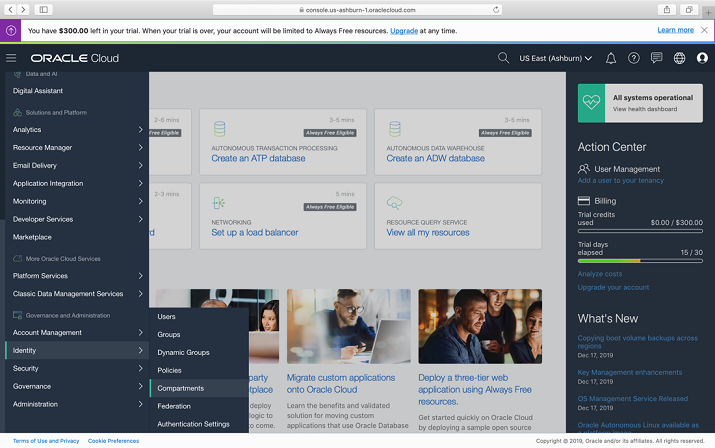

2. On Compartments Page, click on Create Compartment. 

    

   **Note**:  Two Compartments, named Oracle Account Name (root) and a compartment for PaaS, were automatically created by the Oracle Cloud. 

3. On Create Compartment, enter Name **MDS_Sandbox**, Description, select Parent Compartment, and click on Create Compartment.ompartment.

    
    
    
    
    **Completed Compartment** 
    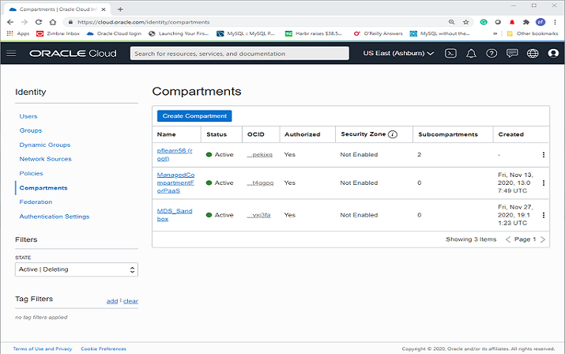

## **STEP 2**: Create Policy
1.	On the Navigation Menu, under Governance and Administration, select Identity -> Policies. 
    

2.	On Policies Page, under List Scope, select the Compartment(root) and click on the Create Policy button.
    

3.	On Create Policy, enter Name **MDS_Policy**, Description, select Root comaprtment. On Policy Builder turn on the “Show manual editor”  switch. 
    
4. Enter the following required MySQL Database Service policies:

    a. Policy statement 1:

    ```
    Allow group Administrators to {COMPARTMENT_INSPECT} in tenancy
    ```

    b. Policy statement 2:

    ```
    Allow group Administrators to {VCN_READ, SUBNET_READ, SUBNET_ATTACH, SUBNET_DETACH} in tenancy
    ```

    \_<br>

    c. Policy statement 3:

    ```
    Allow group Administrators to manage mysql-family in tenancy
    ```
    Click the Create button

     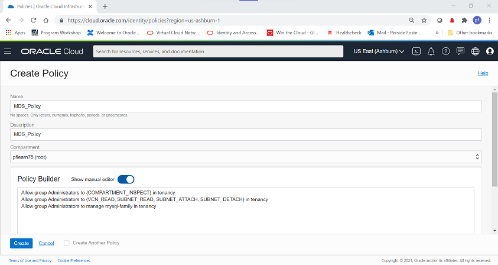

    
    **Completed Policy Creation**
    

## **STEP 3:** Create Virtual Cloud Network

1. On the Navigation Menu, under Core Infrastructure, select Networking -> Virtual Cloud Networks.
    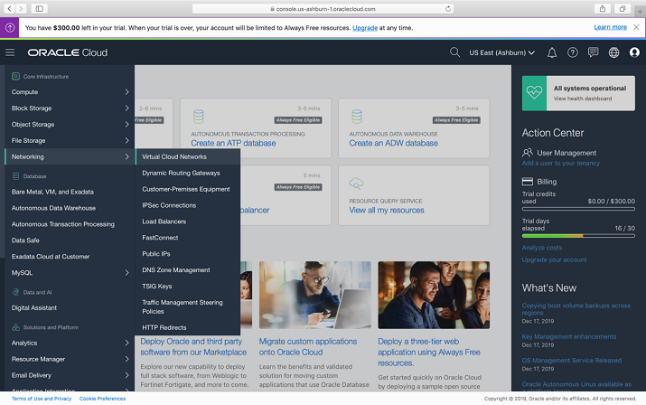

2. Click on Start VCN Wizard.
    

3. Select VCN with Internet Connectivity 

    click on Button Start VCN Wizard 
    

4. Create a VCN with Internet Connectivity 

    On Basic Information  Complete the following fields 
    * VCN Name **MDS_VCN**    
    * Compartment **MDS_Sandbox** 

    Your screen should look similar to the following
    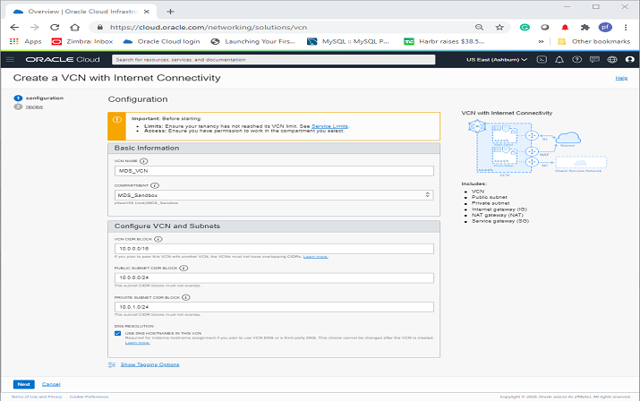
  
5. Click the Next button at the bottom of the screen 

6. Review Oracle Virtual Cloud Network (VCN), Subnets, and Gateways
         
    Click Create button to create the VCN
    

7. The Virtual Cloud Network creation is completing 
    
    
8. Click on "View Virtual Cloud Network" button to display the  created VCN
    

9. Click on the VCN Name **MDS_VCN**. 
            

10.	On the Virtual Cloud Network Details page, under Resources, click on Security Lists (2).
        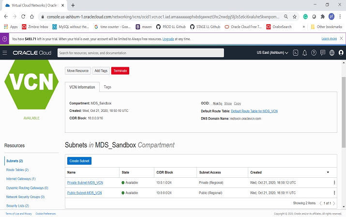

11.	On Security Lists in <Compartment Name> Compartment, click on Security List for Private Subnet-MDS_VCN.

    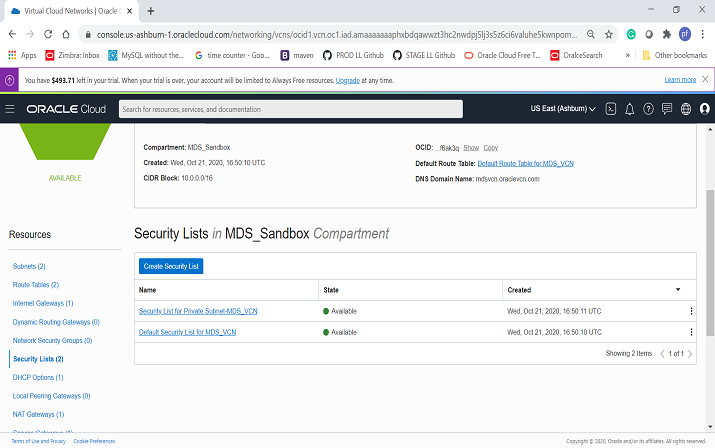

12.	On Security List for Private Subnet-MDS_VCN  page, under Ingress Rules, click on Add Ingress Rules.
    

13.	On Add Ingress Rule, add an Ingress Rule with Source CIDR 0.0.0.0/0 and Destination Port Name 3306 

    Click on Add Ingress Rule.
    

14.	On Security List for Private Subnet-MDS_VCN page
    
     New Ingress Rules will be shown under the Ingress Rules List
    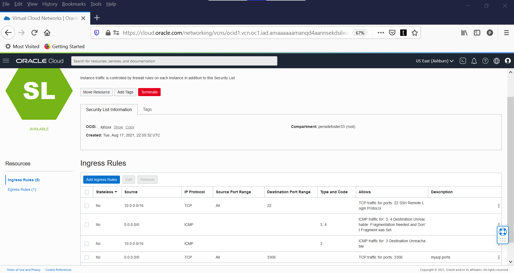

## **STEP 4:** Create a MySQL DB System.

1. On the Navigation Menu, under Database, select MySQL -> DB Systems
    

2. On DB Systems in **MDS_Sandbox** Compartment, click on Create MySQL DB System.
    

3. On Create MySQL DB System, under Provide basic information for the DB System
      
    Select Compartment **MDS_Sandbox**
      
    For Name enter **MDS_DB**
      
    For Description enter **MDS_DB**

    Select **Standalone** to specify a single-instance DB System
    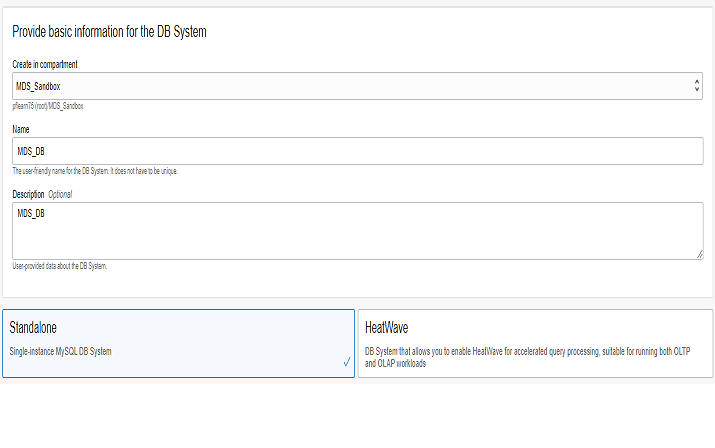

4. On Create Administrator credentials

    Set Username to **admin**

    Set Administrator user's password to **Welcome1!**  
    
    Confirm password with **Welcome1!**
    

5. Configure networking Keep default values

    Create VCN and Subnets "Virtual Cloud Network in MDS_Sandbox"  

    should be **MDS_VCN**
    
    "Subnet in MDS_Sandbox" 
    
    should be **Private Subnet-MDS_VCN (Regional)**

    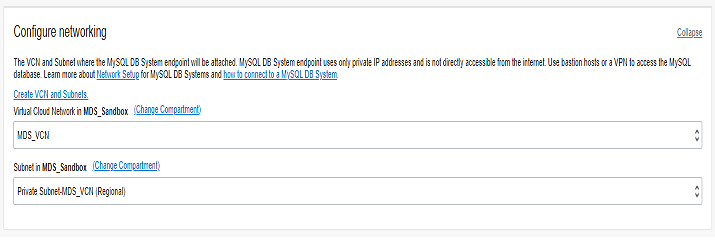

6. On Configure placement  keep  "Availability Domain" checked
    
    Do not check "Choose a Fault Domain" for this DB System
    

7. On Configure hardware keep default shape  **Shape MySQL.VM.Standard.E3.1.8GB**

    Data Storage Size (GB) keep default value **50**
    

8. On Configure Backups, keep  "Enable Automatic Backups" checked
    
    set Retention period to **7**
    
    select "Default Backup Window"
    
    Click on Create button.
    

9. The New MySQL DB System will be ready to use after a few minutes. 

    The state will be shown as Creating during the creation
    

10. The state Active indicates that the DB System is ready to use. 

    Check the MySQL endpoint (Address) under Instances in the MySQL DB System Details page. 

    

## **STEP 5:** Create Client Virtual Machine

1. You will need a client machine to connect to your brand new MySQL database. To launch a Linux Compute instance, go to the Console, menu Compute, Instances
    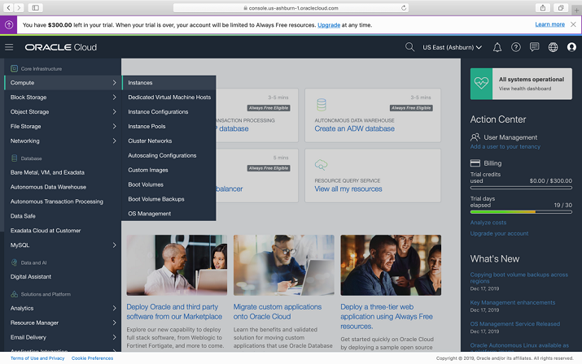

2. On Instances in **MDS_Sandbox** Compartment, click on Create Instance.
    

3. On Create Compute Instance enter **MDS_Client**  for the instance Name. 
    
4. Make sure **MDS_Sandbox** compartment is selected. 
 
5. Choose an operating system or image source (for this lab , select Oracle Linux), 
 
6. Edit Configure placement and hardware
   
   Select the Availability Domain, Instance Shape (select VM.Standard.E2.1.Micro).

    

   For VCN make sure **MDS_VCN** is selected, "Assign a public IP address" should be set to Yes.  
    


7. If you have not already created your SSH key, perform "Lab 1: Create Local SSH Key". 
    
   When you are done return to the next line (STEP 5: #8) .

8.  Add SSH Keys: Select CHOOSE SSH KEY FILES and browse to select the
    SSH public key, which was created earlier. (In this example it is id_rsa).

    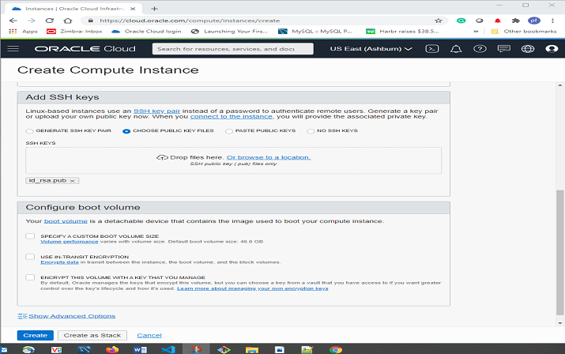

9. The New Virtual Machine will be ready to use after a few minutes. The state will be shown as Provisioning during the creation
    

10.	The state Running indicates that the Virtual Machine is ready to use. 

    Save the Public IP Address under Primary VNIC Information on the Instance page. 
    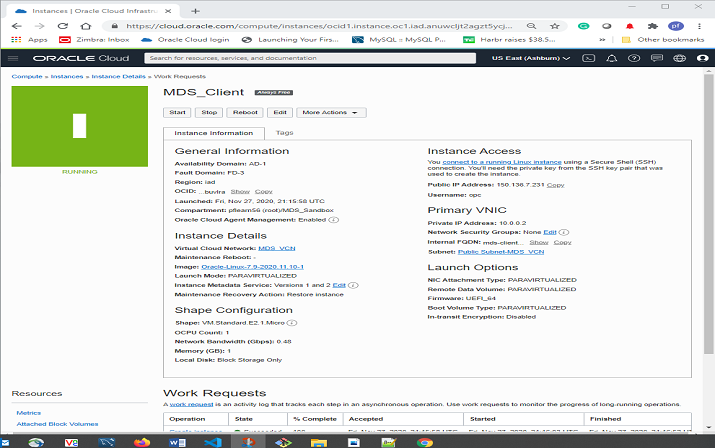

## **STEP 6:** Connect to MySQL Database

1. If you are a Linux or Mac user go to STEP 6: #2

   If you are a Windows user click Start menu from your windows machine for Git which should include the Git Bash command.

    Click on the Git Bash command. This will take you to the Git Bash terminal as shown below and continue to  STEP 6: #2. 
    

2.  From a terminal window on your local system. Connect to the Compute Instance with the SSH command. 

    Indicate the location of the private key you created earlier with **MDS_Client**. Enter the username opc and the Public IP Address.

    Note: The **MDS_Client**  shows the  Public IP Address as mentioned on Step 4: #9
    
    (Example: **ssh -i ~/.ssh/id_rsa opc@&132.145.170.990**)

    `$ ssh -i ~/.ssh/id_rsa opc@&<your_compute_instance_ip>;`

    

3. You will need a MySQL client tool to connect to your new MySQL DB System from your client machine. 

    Install MySQL release package  with the following command:

    `[opc@...]$ sudo yum -y install https://dev.mysql.com/get/mysql80-community-release-el7-3.noarch.rpm`

    

    Install MySQL Shell with the following command 

    `[opc@...]$ sudo yum install –y mysql-shell`
    
 
4. From your Compute instance, connect to MySQL using the MySQL Shell client tool. 
    
   The endpoint (IP Address) can be found in the MySQL DB System Details page, under the "Endpoints" resource. 

    

5.  Use the following command to connect to MySQL using the MySQL Shell client tool.

    (Example  **mysqlsh -uadmin -p -h132.145.170.990**)
    
    `[opc@...]$ mysqlsh -u<MDS_admin_username> -p -h<MDS_endpoint>`

    

6. (Optional) At this point, you can also use MySQL Workbench from your local machine to connect to the MySQL endpoint using your new Compute instance as a jump box. 

   In your pre installed MySQL Workbench, 
   
   configure a connection using the method "Standard TCP/IP over SSH" 
   
   and use the credentials of the Compute instance for SSH. 
   
   MySQL Workbench Configuration for MDS:

    

   MySQL Workbench Launched for MDS:

    

## **STEP 7:** Start, stop, or reboot MySQL DB System

Open the navigation menu. Under MySQL, click DB Systems.


List DB Systems

Choose  **MDS_Sandbox** Compartment 

Click **MDS_DB** to open the DB System details page


Select one of the following actions:
* Start: Starts a stopped DB System. After the DB System is started, the Stop action is enabled and the Start option is disabled.
* Stop: Stops a running DB System. After the DB System is powered off, the Start action is enabled.
* Restart: Shuts down a DB System, and restarts it.

**Note**  Stopping a DB System stops billing for all OCPUs associated with it. 
* Billing continues for storage. 
* Billing for OCPUs resumes if you restart the DB System.
* If you selected Stop or Restart, the Stop/Restart MySQL DB System dialog is displayed.

Select a shutdown type:
* Fast: Flushes dirty pages before shutting down the DB System. 

    Some flush operations must be performed during next startup, potentially increasing the duration of the startup process.
* Slow: Flushes dirty pages and purges undo log pages for older transactions. 
    
    The shutdown itself can take longer, but the subsequent startup is faster.
* Immediate: Does not flush dirty pages and does not purge any undo log pages. 
    Stops MySQL immediately. Page flushes and log purging will take place during the next startup, increasing the duration of the startup process.

Select the required shutdown type and click the Stop or Restart button, depending on the action chosen.

## **STEP 8:** Delete MySQL DB System

Deleting a DB System permanently deletes it. Any manual backups associated with the deleted DB System are retained for their retention periods. Automatic backups are deleted with the DB System.

Open the navigation menu. Under MySQL, click DB Systems.


List DB Systems

Choose  **MDS_Sandbox** Compartment 

Click **MDS_DB** to open the DB System details page


Click on "More Actions" drop down list and select **Delete**
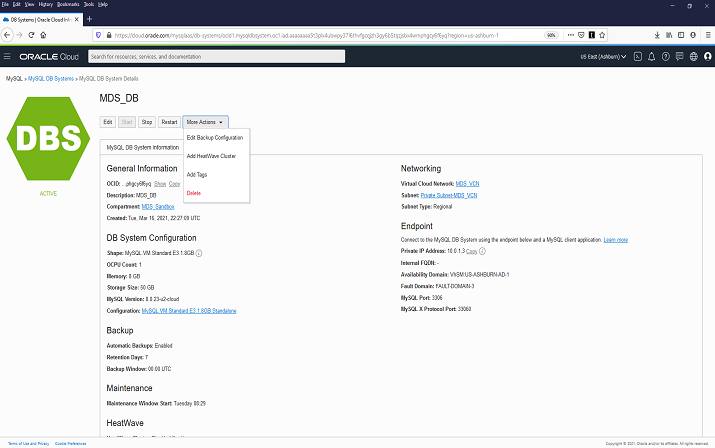

A prompt is displayed asking you to confirm the deletion.

Enter the word, all caps, "DELETE" and click "Delete 1 MySQL DB System" button.

When delete process is done **MDS_DB** will be set to Delete status.
## Learn More

* [Oracle Cloud Infrastructure MySQL Database Service Documentation ](https://docs.cloud.oracle.com/en-us/iaas/mysql-database)
* [MySQL Database Documentation](https://www.mysql.com)
## Acknowledgements
* **Author** -  Airton Lastori, MySQL Principal Product Manager, MySQL Product Management 
* **Contributors** -  Priscila Galvao, MySQL Solution Engineering
* **Last Updated By/Date** - Perside Foster, MySQL Solution Engineering, March 2021

## Need Help?
Please submit feedback or ask for help using our [MySQL Support Forum](https://community.oracle.com/tech/developers/categories/MySQL). Please click the **Log In** button and login using your Oracle Account. Click the **Ask A Question** button to the left to start a *New Discussion* or *Ask a Question*.  Please include your workshop name and lab name.  You can also include screenshots and attach files.  Engage directly with the author of the workshop.

If you do not have an Oracle Account, click [here](https://profile.oracle.com/myprofile/account/create-account.jspx) to create one.

