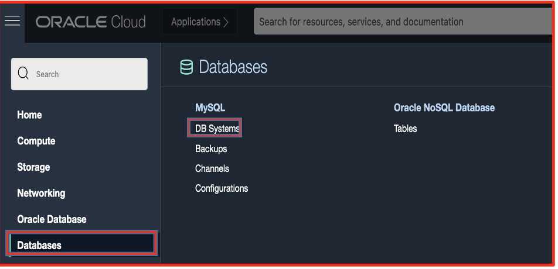
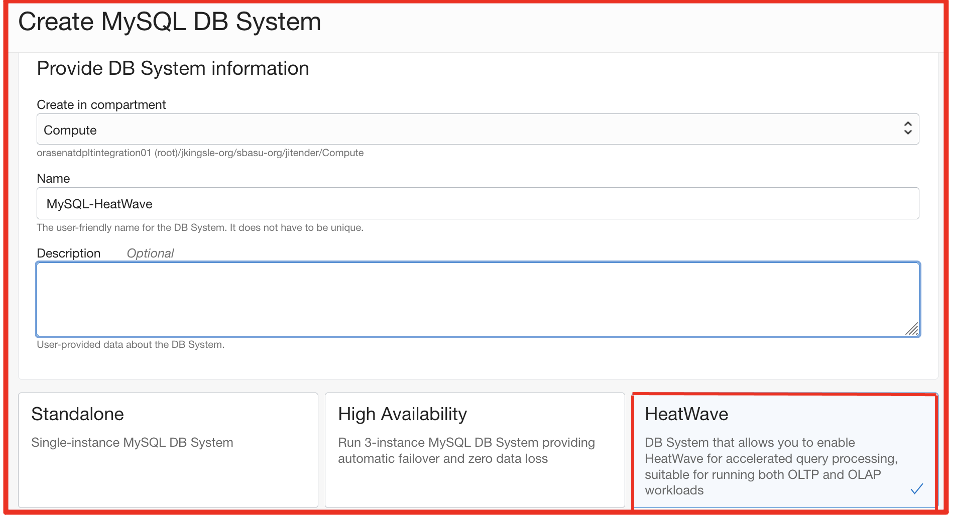
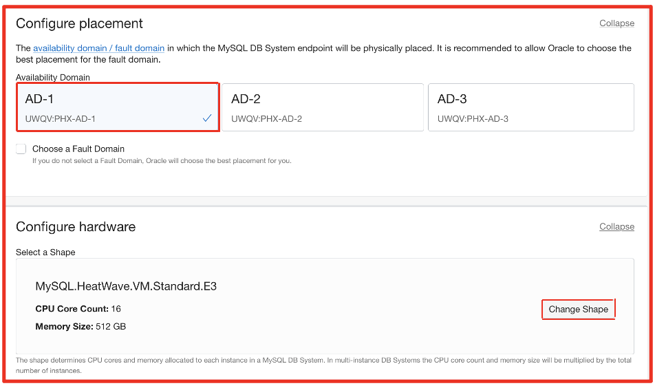
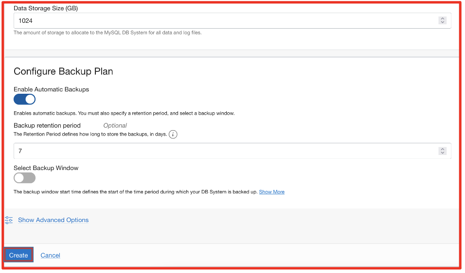
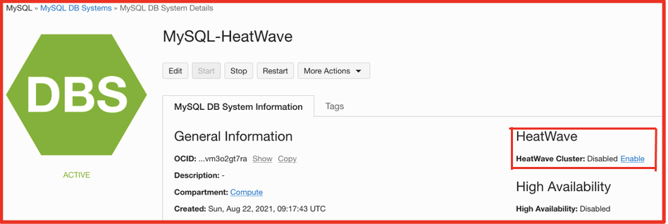

# Create MySQL Database System

## Introduction

This lab walks you through the steps to create **MySQL Database System** in Oracle Cloud Infrastructure.

Estimated Time: 15 minutes

### Objectives

In this lab, you will:
* Be able to launch MySQL Database System in Oracle Cloud.

### Prerequisites

This lab assumes you have:
* An Oracle account
* Privileges to use Oracle Cloud resources

## **Task 1**: Create MySQL Database System in Oracle Cloud

1. Login into OCI console, Navigate to **Databases** menu and click on DB Systems under **MySQL**.

	

2. Click on "**Create MySQL DB System**"

  

3. Select **Compartment** and Provide information and select “**HeatWave**” from options.

	

4. Provide **username**/**password**, **confirm password** and select Virtual Cloud Network (**VCN**)

   

5. Select Availability Domain as per choice and select “**MySQL.HeatWave.VM.Standard.E3**’ Instance shape for MySQL HeatWave.
	 If you wish to change Instance shape, please click on “**Chane Shape**” button.

	

6. Specify Storage size and Enable Automated backups and click on “**Create**” to initiate creation process.

	 

7. Once Instance is launched, it will be Active in a minutes. However the HeatWave options will be **disabled**.

	 

**NOTE:** At this stage we have learnt how to create MySQL Database System However HeatWave Engine is still disable. To enable HeatWave engine we will proceed to Lab 2.

**This completes the Task 1**

**You are ready to proceed to Lab 2**

## Acknowledgements
* **Author** - Jitender Singh, Senior Cloud Engineer, NA Cloud Engineering
* **Contributors** -  Jitender Singh, Senior Cloud Engineer, NA Cloud Engineering
* **Last Updated By/Date** - Jitender Singh, September 2021
