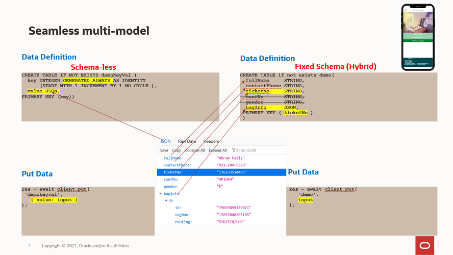
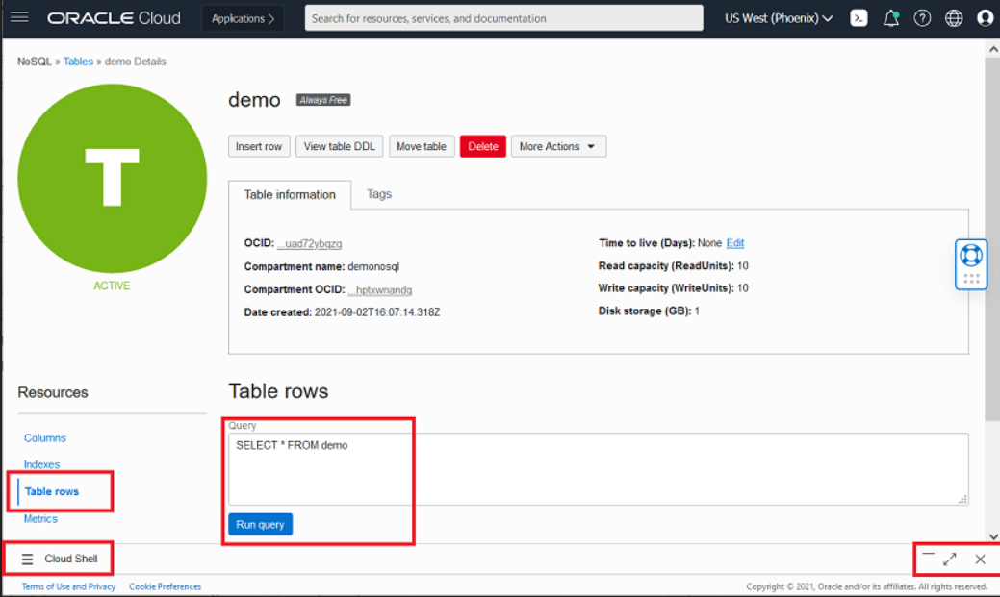

# LAB 4: Explore Data, Run Queries

## Introduction

This lab picks up where lab 3 left off.   We are going to explore in more detail the tables we created, load data with functions, and read data with a python application.  

Estimated Lab Time: 20 minutes

### Objectives

* Understand the different tables
* Load data with functions
* Read data with REST api
* Read data with a python application

### Prerequisites

* An Oracle Free Tier, Always Free, or Paid Cloud Account
* Connection to the Oracle NoSQL Database Cloud Service
* Working knowledge of bash shell
* Working knowledge of vi, emacs
* Working knowledge of Python


## Task 1: Restart the Cloud Shell

Lets get back into the Cloud Shell.  From the previous lab, you may have minimized it in which case you need to enlarge it.  It is possible it may have become disconnected and/or timed out.   In that case, restart it.


Execute the following environment setup shell script in the Cloud Shell to set up your environment. If you close/open the Cloud Shell Console, please re-execute it.

```
source ~/serverless-with-nosql-database/env.sh
```

## Task 2: Load more data in the table and examine it

The goal of this lab is to understand the difference between the 2 data models proposed. The demoKeyVal table is a schema-less table, sometimes referred to as a JSON document that contains a primary key and a JSON column.  The demo table contains the primary key, several fixed columns and a JSON column. These tables are logically equivalent. Which data model you use depends on your business model.   Oracle NoSQL Database Cloud Service is extremely flexible in how you can model your data.   It is a true multi-model database service.



Next, we will use functions that we created in Lab 2 to add rows into the table demoKeyVal.  We will load 5 additional rows.  The initial invocation of functions can take 30-45 seconds because components are getting loaded into your environment.  Copy/paste into Cloud Shell.

```
cd ~/serverless-with-nosql-database/functions-fn
cd load/demo-keyval-load
cat ~/BaggageData/baggage_data_file99.json | fn invoke $APP_NAME demo-keyval-load
cat ~/BaggageData/baggage_data_file9.json  | fn invoke $APP_NAME demo-keyval-load
cat ~/BaggageData/baggage_data_file103.json  | fn invoke  $APP_NAME demo-keyval-load
cat ~/BaggageData/baggage_data_file2.json  | fn invoke $APP_NAME demo-keyval-load
cat ~/BaggageData/baggage_data_file84.json  | fn invoke  $APP_NAME demo-keyval-load
```

Use the steps in the previous Lab 3 to read the data for the demo-keyval-load table from the OCI console.  


Next, we will use a function to load the table demo with the same 5 rows.  Copy/paste into Cloud Shell.

```
cd ~/serverless-with-nosql-database/functions-fn
cd load/demo-load
cat ~/BaggageData/baggage_data_file99.json | fn invoke  $APP_NAME demo-load
cat ~/BaggageData/baggage_data_file9.json | fn invoke  $APP_NAME demo-load
cat ~/BaggageData/baggage_data_file103.json  | fn invoke  $APP_NAME demo-load
cat ~/BaggageData/baggage_data_file2.json | fn invoke  $APP_NAME demo-load
cat ~/BaggageData/baggage_data_file84.json  | fn invoke  $APP_NAME demo-load
```

Use the steps in the previous Lab 3 to read the data for the demo-load table from the OCI console.




## Task 3: Read data using a node.js application and REST API.

In this Task, we will review the code and trigger the function manually using the `fn invoke` cli command.  Let's look at the function we will be invoking.    By setting up different endpoints, you can cause different operations to happen.   In this node.js function, we have 3 different endpoints setup in advance. Copy/paste into Cloud Shell.

```
cd ~/serverless-with-nosql-database/functions-fn
cd api/demo-api
vi func.js
```

Next, we will call 'fn invoke' manually, passing it the getBagInfoByTicketNumber endpoint.   Copy/paste into Cloud Shell one at a time so you can see the results.

```
echo '{"ticketNo":"1762386738153", "endPoint":"getBagInfoByTicketNumber"}' | fn invoke $APP_NAME demo-api | jq
echo '{"endPoint":"getBagInfoByTicketNumber"}' | fn invoke $APP_NAME demo-api | jq
echo '{"endPoint":"getBagInfoByTicketNumber"}' | fn invoke $APP_NAME demo-api | jq '. | length'
```

Each of these produced slightly different results.   The first one display the document with a specific ticket number, the second displayed all the records and the third gave a count of the records.

Now, lets test another one of the endpoints in the function. Copy/paste into Cloud Shell.

```
echo '{"endPoint":"getPassengersAffectedByFlight"}' | fn invoke $APP_NAME demo-api | jq
```

As you can see the field "message" the getPassengersAffectedByFlight endpoint is still under construction.  In other words the code for that endpoint has not been completed yet.

The result can be simulated by using this call. Copy/paste into Cloud Shell.
```
echo '{"endPoint":"getPassengersAffectedByFlight"}' | fn invoke $APP_NAME demo-api | fn invoke $APP_NAME demo-api | jq
```

In fact, you can run SQL queries using the endpoint executeSQL.   This endpoint is coded to use the executeQuery(sql) API call. This will grab a sql query that has already been written and stored in your Cloud Shell.   Copy/paste into Cloud Shell.

````
SQL_STATEMENT=$(cat ~/serverless-with-nosql-database/objects/query1.sql | tr '\n' ' ')
echo $SQL_STATEMENT
echo "{\"sql\":\"$SQL_STATEMENT\",\""endPoint\"": \""executeSQL\"" }"  | fn invoke $APP_NAME demo-api
````
This displayed the entire record for passenger 'Clemencia Frame' where as the query before just displayed some basic information.  Let's say you didnt want to use functions.   You can also execute the same sql statement using OCI CLI commands.  Going this route, you will be querying the data over REST.  Copy/paste into Cloud Shell.

````
oci nosql query execute -c  $COMP_ID --statement "$SQL_STATEMENT"
````

In this case, the data is formatted as a nice JSON document.


## Task 4: Load data using streaming input

In this task, we are going to load a record using a python function.  This uses the Oracle NoSQL Python SDK which we call Borneo.  We can take a look at the application. At the bottom of the file is the authentication which uses resource principals. Copy/paste into Cloud Shell.

```
cd ~/serverless-with-nosql-database/functions-fn
cd streaming/load-target
vi func.py
```

We need to deploy this function, which take about 2 min and 30 sec.  Copy/paste into Cloud Shell.

```
fn -v deploy --app $APP_NAME
```

Go ahead and run this function.  The first time running this function takes about 1 min because it has to populate the cache.
Copy/paste into Cloud Shell.

```
cd ~/serverless-with-nosql-database/functions-fn
cd streaming/load-target
var1=`base64 -w 0 ~/BaggageData/baggage_data_file99.json`
cp test_templ.json stream_baggage_data_file99.json
sed -i "s/<here>/$var1/g"  stream_baggage_data_file99.json

fn invoke $APP_NAME load-target < stream_baggage_data_file99.json

```
We can remove the function.  Copy/paste into Cloud Shell.

```
fn delete function $APP_NAME load-target

```

## Task 5: Read data using a Python CLI application

Create the python CLI application in the Cloud shell.  Copy/paste into Cloud Shell.

````
cd ~/serverless-with-nosql-database/
source ~/serverless-with-nosql-database/env.sh
pip3 install borneo
python3 nosql.py -s cloud -t $OCI_TENANCY -u $NOSQL_USER_ID -f $NOSQL_FINGERPRINT -k ~/NoSQLLabPrivateKey.pem -e https://nosql.${OCI_REGION}.oci.oraclecloud.com

````


Execute the following queries.  Copy/paste into Cloud Shell.

````
SELECT *
FROM demo d
WHERE d.bagInfo.flightLegs.flightNo =ANY 'BM715';

SELECT d.fullName, d.contactPhone, d.ticketNo , d.bagInfo.flightLegs.flightNo as bagInfo
FROM demo d
WHERE d.bagInfo.flightLegs.flightNo =ANY 'BM715';

SELECT d.fullName, d.contactPhone, d.ticketNo , d.bagInfo.flightLegs.flightNo as bagInfo
FROM demo d
WHERE d.bagInfo.flightLegs.flightNo =ANY "BM715"
AND d.bagInfo.flightLegs.flightNo =ANY "BM204";

SELECT d.fullName, d.contactPhone, d.ticketNo , d.bagInfo.flightLegs.flightNo as bagInfo
FROM   demo d
WHERE  d.bagInfo.flightLegs.flightNo =ANY "BM715"
AND    d.bagInfo.flightLegs.flightNo =ANY "BM204"
AND    size(d.bagInfo.flightLegs) = 2;

exit

````
Minimize the Cloud Shell.

## Task 6: Clean up

This task deletes the tables that got created.

On the top left, go to menu, then Databases, then under Oracle NoSQL Database, hit 'Tables'
Set your compartment to 'demonosql'
Click on the demoKeyVal table, which will bring up the table details screen.  Hit Delete.


Repeat the process for the demo table and the freeTest table.

Deleting tables is an async operation, so you will not immediately see the results on the OCI console.  Eventually the status of the tables will get changed to deleted.  


## Learn More

* [About Oracle NoSQL Database Cloud Service](https://docs.oracle.com/pls/topic/lookup?ctx=cloud&id=CSNSD-GUID-88373C12-018E-4628-B241-2DFCB7B16DE8)
* [Oracle NoSQL Database Cloud Service page](https://cloud.oracle.com/en_US/nosql)
* [Java API Reference Guide](https://docs.oracle.com/en/cloud/paas/nosql-cloud/csnjv/index.html)
* [Node API Reference Guide](https://oracle.github.io/nosql-node-sdk/)
* [Python API Reference Guide](https://nosql-python-sdk.readthedocs.io/en/latest/index.html)

## Acknowledgements
* **Author** - Dario Vega, Product Manager, NoSQL Product Management and Michael Brey, Director, NoSQL Product Development
* **Contributors** - XXX, Technical Lead - Oracle LiveLabs Intern
* **Last Updated By/Date** - Michael Brey, Director, NoSQL Product Development, September 2021
