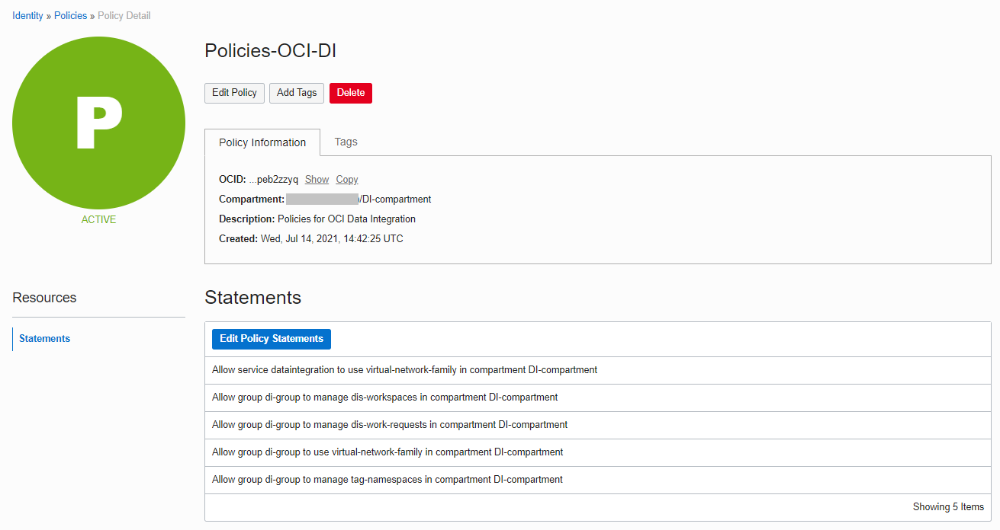
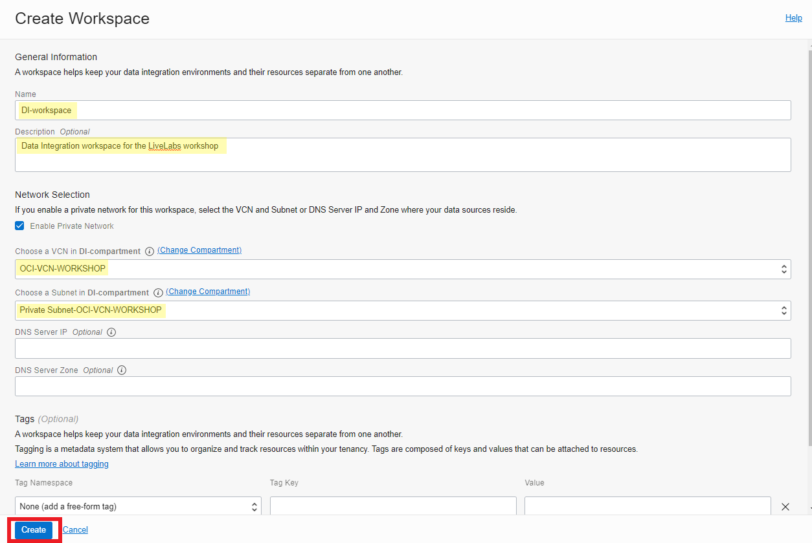

# Create an OCI Data Integration Workspace

## Introduction

This lab will guide you through the steps to set up the necessary **Policies** for OCI Data Integration and to create an OCI Data Integration **Workspace**.

*Estimated Lab Time*: 20 minutes

### Objectives
In this lab, you will:
* Create access policies for OCI Data Integration using Policy Builder UI in Oracle Cloud Infrastructure
* Create a Workspace for Data Integration resources

### Prerequisites
* **Free Tier/ Paid Oracle Cloud Account**
* You have completed **Lab 0 - Setting up the Data Integration prerequisites in Oracle Cloud Infrastructure**

## **STEP 1:** Create policies for OCI Data Integration

Oracle Cloud Infrastructure Data Integration uses **standard authentication and authorization** offered by Oracle Cloud Infrastructure. **Policies** required for OCI Data Integration will be an addition to the regular policies used in Oracle Cloud Infrastructure for accessing other necessary resources. By default, only the users in the Administrators group can access all Data Integration resources. For everyone else who's involved with Data Integration, the Cloud Administrator must create policies that gives them proper access to Data Integration resources.

*Note: In case you are a Non-admin user, ask your administrator to set up the policies in this Lab step.*

1. In your Oracle Cloud console, open the **Menu** in the upper left.

  

2. In the Oracle Cloud Infrastructure Console navigation menu, navigate to **Identity & Security**, and then select **Policies** under Identity section.

  

3. Under List Scope, make sure you select the **Compartment** you are using for Data Integration, in this case the one you have created in Lab 0 (`DI-compartment`). After you have selected your compartment, click on **Create Policy**.

  

4. In the **Create Policy** panel, complete the following fields:

    - **Name**: `Policies-OCI-DI`. *Note that the name can NOT contain spaces.*
    - **Description**: `Policies for OCI Data Integration`.
    - Using the **Policy Builder UI**: For **Policy use cases** choose `Data Integration`. For **Common policy templates** choose `Let users create and delete workspaces with networking`.
    - **Group**: The group which your OCI user belongs to.
   *Note: For the following steps we will use the group name `di-group`, but please use your group name.*
    - **Compartment**: `DI-compartment` (or the OCI Compartment you are using).

   The policy statements will appear below. Click **Create**.

   

5. The policy statements that you defined are now displayed.

  

## **STEP 2**: Create an OCI Data Integration workspace

Before you can get started with Data Integration, you must first create a **Workspace** for your data integration solution. A workspace is an organizational construct to keep multiple data integration solutions and their resources (data assets, data flows, tasks, and so on) separate from each other, helping you to stay organized. For example, you can have separate workspaces for development, testing, and production. The workspace is the preliminary component of Oracle Cloud Infrastructure Data Integration.

1. In the Oracle Cloud Infrastructure Console navigation menu, navigate to **Analytics & AI**. Under Data Lake, click **Data Integration**.

  

2. Under **List Scope**, from the Compartment dropdown, select the compartment that you created policies for in the previous section. On the Data Integration Workspaces page, click **Create Workspace**.

  

3. In the **Create Workspace** panel, complete the fields as follows:

    - For **Name**: `DI-workspace`. *You can only use alphanumeric characters, hyphens, periods, and underscores in the name.*
    - **Description**: `Data Integration workspace for the LiveLabs workshop`.
    - Under Network Selection, leave **Enable private network** selected.
    - Select the **VCN** you have created in Lab 0 (`OCI-VCN-WORKSHOP`).
    - Select a **Subnet** from the VCN created in Lab 0. Choose the **private subnet** if it is not selected by default (`Private Subnet-OCI-VCN-WORKSHOP`).
    - Leave the optional fields DNS Server IP and DNS Server Zone empty.
    - Click **Create**.

    

4. Your are now in the Workspaces page where you can see your new workspace. While it is being created, the status should appear as **Creating**.

   *Note: It may be around 10 minutes for the Workspace to be created and become active.*

  

5. After the creation process is completed, you can see the workspace in the list with the status **Active**.

  

   **Congratulations!**  Now you have the workspace that will hold all your Data Integration resources, such as projects, folders, data assets, tasks, data flows, pipelines, and applications and schedules. You may now [proceed to the next lab](#next).

## Learn More

* [Workspaces in OCI Data Integration](https://docs.oracle.com/en-us/iaas/data-integration/using/workspaces.htm)
* [Policies in OCI Data Integration](https://docs.oracle.com/en-us/iaas/data-integration/using/policies.htm)

## Acknowledgements

* **Author** - Theodora Cristea
* **Contributors** -  Aditya Duvuri, Rohit Saha
* **Last Updated By/Date** - Theodora Cristea, July 2021
