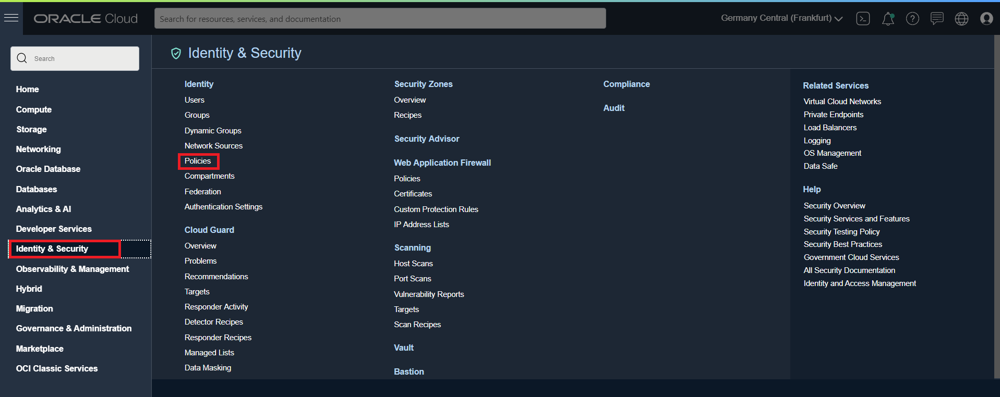
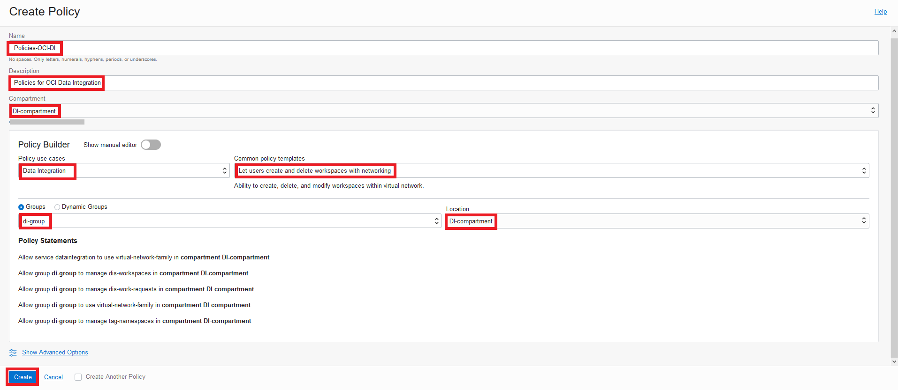

# Create an OCI Data Integration Workspace

## Introduction

This lab will guide you through the steps to set up the necessary policies for OCI Data Integration and to create an OCI Data Integration Workspace.

Estimated Lab Time: 15 minutes

## About Policies and Workspaces in OCI Data Integration
Oracle Cloud Infrastructure Data Integration uses standard authentication and authorization offered by Oracle Cloud Infrastructure. Policies required for OCI Data Integration will be an addition to the regular policies used in Oracle Cloud Infrastructure for accessing other necessary resources. To control access to Data Integration and the type of access each group of users has, you must create policies. By default, only the users in the Administrators group can access all Data Integration resources. For everyone else who's involved with Data Integration, you must create policies that gives them proper access to Data Integration resources.
Before you can get started with Data Integration, you must first create a workspace for your data integration solution. A workspace is an organizational construct to keep multiple data integration solutions and their resources (data assets, data flows, tasks, and so on) separate from each other, helping you to stay organized. For example, you can have separate workspaces for development, testing, and production. The workspace is the preliminary component of Oracle Cloud Infrastructure Data Integration.

## Objectives
In this lab, you will:
* Create access policies for OCI Data Integration using Policy Builder UI in Oracle Cloud Infrastructure
* Create a Workspace for Data Integration resources

## Prerequisites
* An Oracle Cloud Account - Please view this workshop's LiveLabs landing page to see which environments are supported
* You have completed Lab 0 - Setting up the Data Integration prerequisites in Oracle Cloud Infrastructure

## **STEP 1**: Create access policies for OCI Data Integration

1. In your Oracle Cloud console, open the **Menu** in the upper left.
     

2. In the Oracle Cloud Infrastructure Console navigation menu, navigate to **Identity & Security**, and then select **Policies** under Identity section.
    

3. Under List Scope, make sure you select the **Compartment** you are using for Data Integration, in this case the one you have created in Lab 0 (DI-compartment). After you have selected your compartment, click on **Create Policy**.
    

5. In the **Create Policy** panel, complete the following fields:
  * Enter a unique **Name** for your policy (For example "Policies-OCI-DI"). *Note that the name can NOT contain spaces.*
  * Enter a **Description** to help other users know the purpose of this set of policies (for example, "Policies for OCI Data Integration").
  * Using the Policy Builder UI, choose "Data Integration" for **Policy use cases** and "Let users create and delete workspaces with networking" for **Common policy templates**.
  * Select for **Group** the data integration group you created in Lab 0 (di-group).
  * Select for **Compartment** the data integration compartment created in Lab 0 (DI-compartment).
  The policy statements will appear below. Click **Create**.

## **STEP 2:** Create an OCI Data Integration Workspace

1. In your Oracle Cloud console, open the **Menu** in the upper left.
 

2. In the Oracle Cloud Infrastructure Console navigation menu, navigate to **Analytics & AI**. Under Big Data, click **Data Integration**.

3. Under **List Scope**, from the Compartment dropdown, select the compartment you created policies for in the previous section and on the Data Integration Workspaces page, click **Create Workspace**.

4. In the **Create Workspace** panel, complete the fields as follows:
* For **Name**, enter a name without any spaces. (For example, "DI-workspace"). *You can only use alphanumeric characters, hyphens, periods, and underscores in the name.*
* You can add a meaningful **Description** to help other users understand more about your Data Integration Workspace (For example, "Data Integration workspace for the LiveLabs workshop")
* Under Network Selection, leave **Enable private network** selected.
* Select the VCN we have created in Lab 0 (OCI-VCN-WORKSHOP).
* Select a Subnet from our VCN created in Lab 0. Choose the private subnet if it is not selected by default (Private Subnet-OCI-VCN-WORKSHOP).
* Leave the optional fields DNS Server IP and DNS Server Zone empty.
Click **Create**.

5. The workspace takes a few minutes to create and become active. Your are now in the Workspaces page where you can see your new workspace. While it is being created, you can see the status as **Creating**.

6. After the creation process is completed, you can see the workspace in  the workspace list with the status **Active**.

*At the conclusion of the lab add this statement:*
Congratulations!  Now you have the workspace that will hold all your Data Integration resources, such as projects, folders, data assets, tasks, data flows, pipelines, and applications and schedules.   

## Acknowledgements
* **Author** -
* **Contributors** -  <Name, Group> -- optional
* **Last Updated By/Date** - <Name, Group, Month Year>
* **Workshop (or Lab) Expiry Date** - <Month Year> -- optional, use this when you are using a Pre-Authorized Request (PAR) URL to an object in Oracle Object Store.
