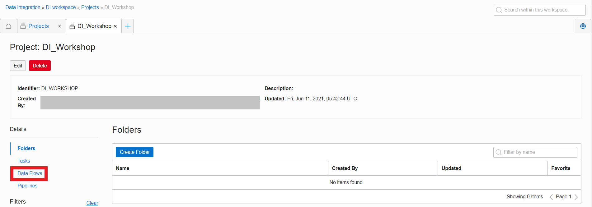
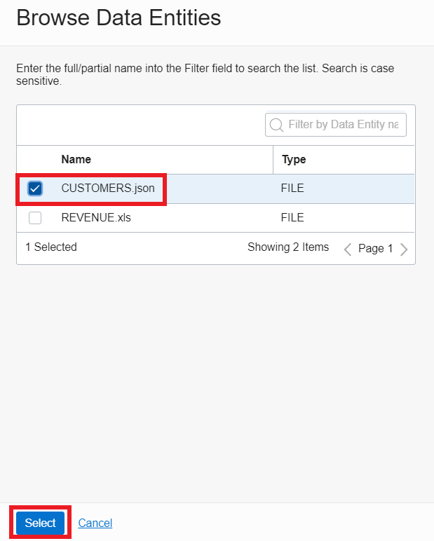

# Create a Data Flow, Data Integration task and Data Loader Task

## Introduction

This lab will walk you through the steps to create a Data Flow, Data Integration task and a Data Loader task in OCI Data Integration.

Estimated Lab Time: 45 minutes

## Objectives
In this lab, you will:
* Create an OCI Data Integration project
* Create a Data Flow
* Create an Integration task
* Create a Data Loader task

## Prerequisites
* An Oracle Cloud Account - Please view this workshop's LiveLabs landing page to see which environments are supported
* You completed Lab 0, Lab 1, Lab 2

## **STEP 1:** Create an OCI Data Integration project

In Oracle Cloud Infrastructure Data Integration, data flows and tasks can only be created in a project or folder.

1. In the Oracle Cloud Infrastructure Console navigation menu, navigate to **Analytics & AI**. Under Big Data, click **Data Integration**.

2. From the Workspaces page, make sure that you are in the compartment you created for data integration (DI-compartment). Click on your **Workspace** (DI-workspace).

3. On your workspace Home page, click Open tab (plus icon) in the tab bar, select Projects.

4. On the Projects page, click Create Project.

5. On the Create Project page, enter DI_Workshop for Name and an optional Description, and then click Save.

6. You are now in the Project Details page for DI_Workshop project.

## **STEP 2:** Create a Data Flow
A data flow is a logical diagram representing the flow of data from source data assets, such as a database or flat file, to target data assets, such as a data lake or data warehouse.
The flow of data from source to target can undergo a series of transformations to aggregate, cleanse, and shape the data. Data engineers and ETL developers can then analyze or gather insights and use that data to make impactful business decisions.

You will create a data flow to ingest data from two source files, containing customers (CUSTOMERS_JSON) and orders (REVENUE_CSV) information.
1. From the Project Details page for DI_Workshop project, click on **Data Flows** from the submenu.

2. Click Create Data Flow.

3. The data flow designer opens in a new tab. In the Properties panel, for Name, enter "Load Customers and Revenue Data", and click Save.

4. You will add your Source operator. You add source operators to identify the data entities to use for the data flow. From the Operators panel on the left, drag and drop a Source operator onto the canvas.

5. On the canvas, select SOURCE_1. The Properties panel now displays the details for the operator in focus.
In the Details tab, click Select next to each of the following options to make your selections:
- For Data Asset, select Object_Storage.
- For Connection, select Default Connection.
- For Schema, select your compartment and then your bucket. For the purposes of this tutorial, Object Storage serves as the source data asset, this is why you select your bucket here.

- For Data Entity, click on "Browse by name", select CUSTOMERS.json and then click JSON for the file type.

In the end, your details for the source operator should look like this:

## Learn More

*(optional - include links to docs, white papers, blogs, etc)*

* [URL text 1](http://docs.oracle.com)
* [URL text 2](http://docs.oracle.com)

## Acknowledgements
* **Author** - <Name, Title, Group>
* **Contributors** -  <Name, Group> -- optional
* **Last Updated By/Date** - <Name, Group, Month Year>
* **Workshop (or Lab) Expiry Date** - <Month Year> -- optional, use this when you are using a Pre-Authorized Request (PAR) URL to an object in Oracle Object Store.
