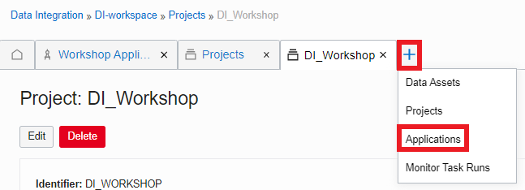
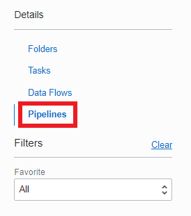
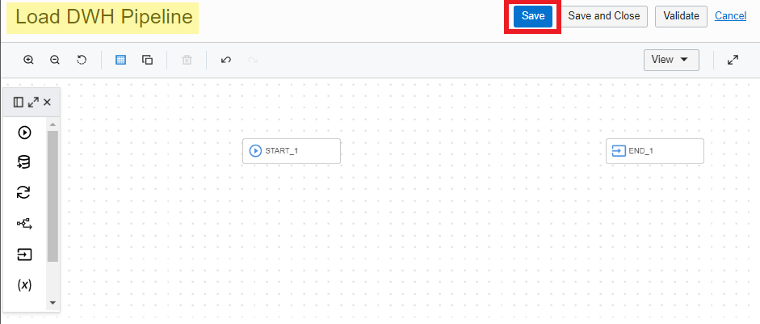
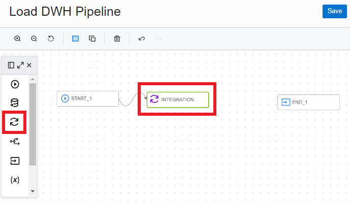
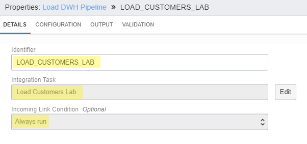
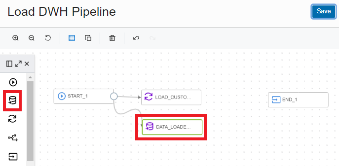

# Create a Pipeline and publish tasks

## Introduction

This lab will walk you through the steps to create an application, publish tasks and pipeline.

*Estimated Lab Time*: 30 minutes

## Objectives
In this lab, you will:
* Create an Application
* Publish tasks to Application
* Creating a Pipeline which calls the tasks
* Creating a Pipeline Task
* Publish the Pipeline Task

## Prerequisites
* An Oracle Cloud Account - Please view this workshop's LiveLabs landing page to see which environments are supported
* You completed Lab 0, Lab 1, Lab 2, Lab 3 of this LiveLabs Workshop

## **STEP 1:** Create an Application

In OCI Data Integration, an **Application** is a container for published tasks, data flows, and their dependencies. You can run published tasks in an Application for testing, or roll them out into production.
1. In the Oracle Cloud Infrastructure Console navigation menu, navigate to **Analytics & AI**. Under Big Data, click **Data Integration**.

2. From the Workspaces page, make sure that you are in the compartment you created for data integration (DI-compartment). Click on your **Workspace** (DI-workspace).

3. On the workspace Home page, in the Quick Actions tile, click Create Application.

4. On the Applications page, enter "Workshop Application" for Name. You can optionally give a short description for your application, then click Create.

5. The Application Details page for "Workshop Application" opens in a new tab.

## **STEP 2:** Publish tasks to Application

In Oracle Cloud Infrastructure Data Integration, a **Task** is a design-time resource that specifies a set of actions to perform on data. You create tasks from a project details or folder details page. You then publish the tasks into an Application to test or roll out into production.

1. From the Application Details you are currently in, click on Open tab (plus icon) in the tab bar and select Projects.

2. Select your DI_Workshop project from the projects list.

3. In the Tasks list, check all of the 4 tasks you have created in the previous lab (2 Integration tasks, one Data Loader task and one SQL task).

4. Click on Publish to Application button.

5. In the Publish to Application dialog, select Workshop Application and then click Publish.
*Note:You can modify the tasks or edit the data flow without impacting the published task. This enables you to test a version of your data flow, while working on some new changes.*

6. You can now go to your Workshop Application to see your published task. On your workspace Home page, click Open tab (plus icon) in the tab bar, select Applications.

8. Select you Workshop Application from the list of applications.

9. You can now see the list of published tasks inside your Workshop Application.

## **STEP 3:** Create a Pipeline
A pipeline is a set of tasks connected in a sequence or in parallel to facilitate data processing. It manages and orchestrates the execution of a set of related tasks and processes. The pipeline functionality in Oracle Cloud Infrastructure Data Integration helps write complex data pipelines using published tasks from any application, you can add data loader, integration or SQL tasks. You can create pipelines quickly using a designer similar to the Data Flow designer.

1. From the OCI DI Workspace home page, click on Open tab (plus icon) in the tab bar and select Projects.

2. Select your DI_Workshop project from the projects list.

3. Select Pipelines section under project Details tab.

4. Click on Create Pipeline.

5. The canvas for designing the Pipeline is now displayed. The start and end operators are already added by default to the canvas. You will start by renaming the Pipeline. Under Properties for the Pipeline, on Details section, currently the name is "New Pipeline". Rename to "Load DWH Pipeline".

6. Click on Save button, so that your title of the pipeline will change to the pipeline name you just added.

7. To add a task, you will drag and drop a task operator from the Operators Panel. Start with the drag and drop of an Integration task. Connect START_1 operator to the Integration task you added.

8. On the Properties tab for INTEGRATION_TASK_1, Details section, click on Select to choose a published Integration task from your Application.

9. A page pops up with the selections for the Integration Task:
* The Compartment where your OCI DI resources are is already selected
* The Workspace you are currently working in is already selected
* For Applications, make sure you select the "Workshop Application"
* Under Integration Task, check the "Load Customers Lab" task
* Click Select

10. In the properties bar, the Integration Task "Load Customers Lab" is now selected. The Identifier has automatically changed with the name of Integration Task you selected. For Incoming Link Condition, leave the default option of "Always run".

11. Drag and drop a Data Loader component into the Pipeline canvas. We want this task to be run in parallel with the Integration task we have just defined, so we will connect START_1 operator with the Data Loader task operator.

12. On the Properties tab for DATA_LOADER_TASK_1, Details section, click on Select to choose a published Data Loader task from your Application.

13. A page pops up with the selections for the Data Loader Task:
* The Compartment where your OCI DI resources are is already selected
* The Workspace you are currently working in is already selected
* For Applications, make sure you select the "Workshop Application"
* Under Data Loader Task, check the "Load Revenue Data into Data Warehouse" task
* Click Select

14. In the properties bar, the Data Loader Task "Load Revenue Data into Data Warehouse" is now selected. The Identifier has automatically changed with the name of Data Loader Task you selected. For Incoming Link Condition, leave the default option of "Always run".

15. For these two tasks to run in parallel, you will now add a merge operator. Drag and drop the Merge operator on the canvas, then connect the two tasks (LOAD_CUSTOMERS_LAB and LOAD_REVENUE_DATA_INTO_DATA_WAREHOUSE) to the MERGE_1 operator.

16. Under the Details tab of the Properties panel of the MERGE_1 operator, you can enter a name and optional description. Change the name to MERGE_SUCCESS. For Merge Condition select the "All Success" option, which means that all parallel operations that are linked upstream must complete and succeed before the next downstream operation can proceed.

17. Drag and drop an Integration task to the pipeline canvas. Connect MERGE_1 operator to the Integration task you added.

18. On the Properties tab for INTEGRATION_TASK_1, Details section, click on Select to choose a published Integration task from your Application.

19. A page pops up with the selections for the Integration Task:
* The Compartment where your OCI DI resources are is already selected
* The Workspace you are currently working in is already selected
* For Applications, make sure you select the "Workshop Application"
* Under Integration Task, check the "Load Employees by Regions" task
* Click Select

20. In the properties bar, the Integration Task "Load Employees by Regions" is now selected. The Identifier has automatically changed with the name of Integration Task you selected. For Incoming Link Condition, leave the default option of "Run on success of previous operator".

21. Drag and drop a SQL task operator to the pipeline canvas. Connect the SQL task operator to the LOAD_EMPLOYEES_BY_REGIONS integration task.

22. On the Properties tab for SQL_TASK_1, Details section, click on Select to choose a published SQL task from your Application.

23. A page pops up with the selections for the SQL Task:
* The Compartment where your OCI DI resources are is already selected
* The Workspace you are currently working in is already selected
* For Applications, make sure you select the "Workshop Application"
* Under Integration Task, check the "Procedure DWH Load Stats" task
* Click Select

24. In the properties bar, the SQL Task "Procedure DWH Load Stats" is now selected. The Identifier has automatically changed with the name of SQL Task you selected. For Incoming Link Condition, leave the default option of "Run on success of previous operator".

25. In the properties bar, click on Configuration tab and then on Configure where you have "Incoming Parameters Configured: 0/1".

26. A window to Configure Incoming Parameters pops up. OCI Data Integration identified the input parameter of your procedure (OCIDI_RESULT) from the database. Click on Configure for the IN_DI_RESULT parameter.

27. In the new windows that is displayed:
* Leave the  Assign a value option checked. This means you will override the default value of this parameter.
* In Default value box, write "SUCCESS" (no apostrophes).
* Click Done.

28. The input parameter of the procedure now has a Configured Value (SUCCESS). Click Configure.

29. In Configuration tab, now the Incoming Parameters are displayed as configured (1/1).

30.  Drag and drop a SQL task operator to the pipeline canvas. Connect the SQL task operator to the LOAD_EMPLOYEES_BY_REGIONS integration task.

31. On the Properties tab for SQL_TASK_1, Details section, click on Select to choose a published SQL task from your Application.

32. A page pops up with the selections for the SQL Task:
* The Compartment where your OCI DI resources are is already selected
* The Workspace you are currently working in is already selected
* For Applications, make sure you select the "Workshop Application"
* Under Integration Task, check the "Procedure DWH Load Stats" task
* Click Select

33. In the properties bar, the SQL Task "Procedure DWH Load Stats" is now selected. The Identifier has automatically changed with the name of SQL Task you selected. For Incoming Link Condition, leave the default option of "Run on failure of previous operator". The arrow from the previous operator to the new SQL task operator will turn red.

## **STEP 4:** Create a Pipeline task

## **STEP 5:** Publish the Pipeline Task

*At the conclusion of the lab add this statement:*
You may now [proceed to the next lab](#next).

## Learn More

*(optional - include links to docs, white papers, blogs, etc)*

* [URL text 1](http://docs.oracle.com)
* [URL text 2](http://docs.oracle.com)

## Acknowledgements
* **Author** - <Name, Title, Group>
* **Contributors** -  <Name, Group> -- optional
* **Last Updated By/Date** - <Name, Group, Month Year>
* **Workshop (or Lab) Expiry Date** - <Month Year> -- optional, use this when you are using a Pre-Authorized Request (PAR) URL to an object in Oracle Object Store.
