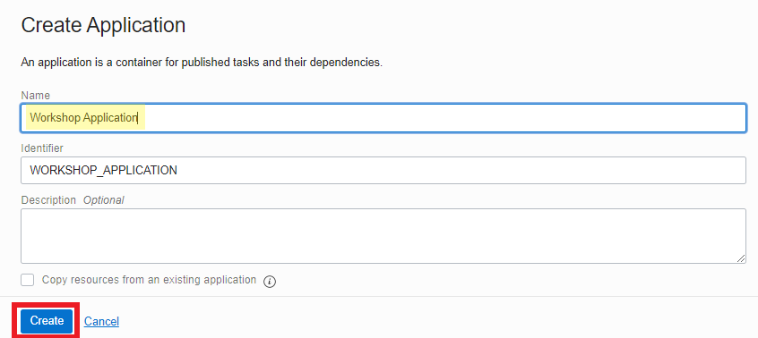

# Create a Pipeline and publish tasks

## Introduction

This lab will walk you through the steps to create an application, publish tasks and pipeline.

*Estimated Lab Time*: 30 minutes

## Objectives
In this lab, you will:
* Create an Application
* Publish the Integration task and Data Loader task into the Application
* Creating Pipelines and calling the published Tasks
* Creating a Pipeline Task
* Publish the Pipeline Task

## Prerequisites
* An Oracle Cloud Account - Please view this workshop's LiveLabs landing page to see which environments are supported
* You completed Lab 0, Lab 1, Lab 2, Lab 3 of this LiveLabs Workshop

## **STEP 1:** Create an Application

In OCI Data Integration, an **Application** is a container for published tasks, data flows, and their dependencies. You can run published tasks in an Application for testing, or roll them out into production.
1. In the Oracle Cloud Infrastructure Console navigation menu, navigate to **Analytics & AI**. Under Big Data, click **Data Integration**.

2. From the Workspaces page, make sure that you are in the compartment you created for data integration (DI-compartment). Click on your **Workspace** (DI-workspace).

3. On the workspace Home page, in the Quick Actions tile, click Create Application.

4. On the Applications page, enter "Workshop Application" for Name. You can optionally give a short description for your application, then click Create.

5. The Application Details page for "Workshop Application" opens in a new tab.

## **STEP 2:** Publish the Integration task and Data Loader task into the Application

In Oracle Cloud Infrastructure Data Integration, a **Task** is a design-time resource that specifies a set of actions to perform on data. You create tasks from a project details or folder details page. You then publish the tasks into an Application to test or roll out into production.

1. From the Application Details you are currently in, click on Open tab (plus icon) in the tab bar and select Projects.

2. Select your DI_Workshop project from the projects list.

3. In the Tasks list, from the Actions icon (three dots) for Load Customers Lab, select Publish to Application.

4. In the Publish to Application dialog, select Workshop Application and then click Publish.
*Note:You can modify the task or edit its data flow without impacting the published task. This enables you to test a version of your data flow, while working on some new changes.*

5. You will publish now the Data Loader task that you created in the previous lab. From your DI_Workshop project page you are currently in, in the Tasks list, from the Actions icon (three dots) for Load Revenue Data into Data Warehouse, select Publish to Application.

6. In the Publish to Application dialog, select Workshop Application and then click Publish.

7. You can now go to your Workshop Application to see your published task. On your workspace Home page, click Open tab (plus icon) in the tab bar, select Applications.

8. Select you Workshop Application from the list of applications.

9. You can now see the list of published tasks inside your Workshop Application.

## **STEP 3:** Create a Pipeline

## **STEP 4:** Create a Pipeline task

## **STEP 5:** Publish the Pipeline Task

*At the conclusion of the lab add this statement:*
You may now [proceed to the next lab](#next).

## Learn More

*(optional - include links to docs, white papers, blogs, etc)*

* [URL text 1](http://docs.oracle.com)
* [URL text 2](http://docs.oracle.com)

## Acknowledgements
* **Author** - <Name, Title, Group>
* **Contributors** -  <Name, Group> -- optional
* **Last Updated By/Date** - <Name, Group, Month Year>
* **Workshop (or Lab) Expiry Date** - <Month Year> -- optional, use this when you are using a Pre-Authorized Request (PAR) URL to an object in Oracle Object Store.
