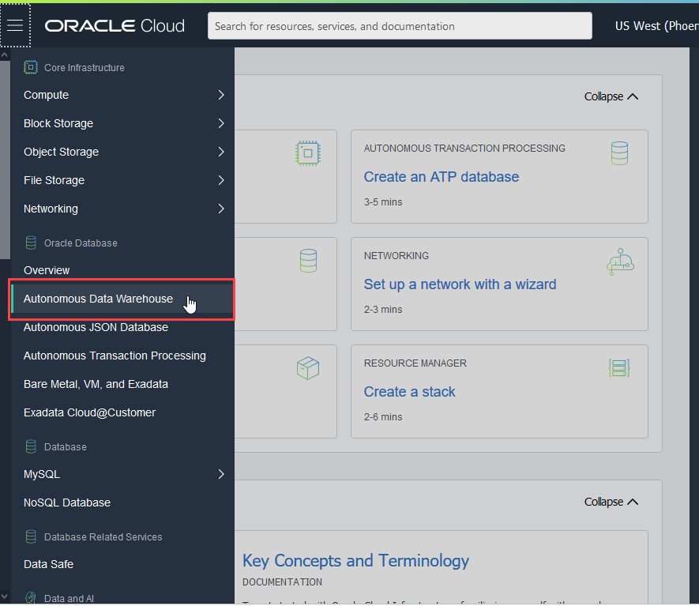
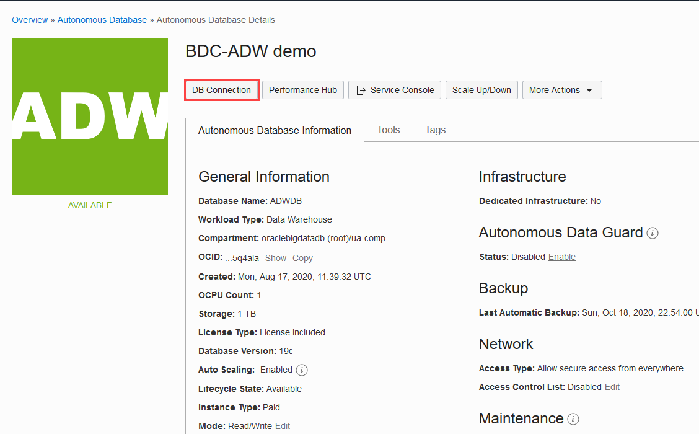
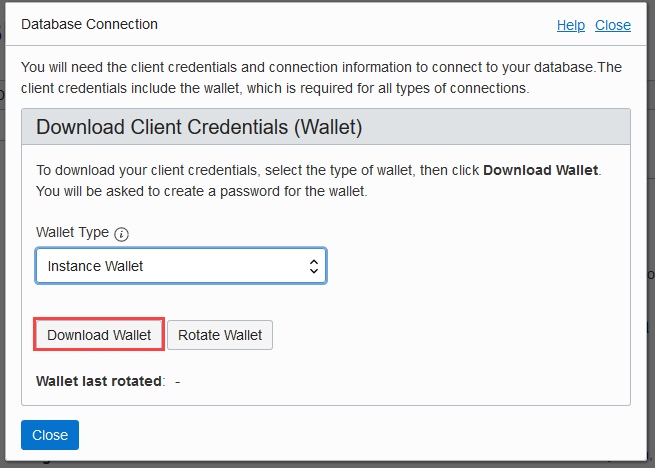
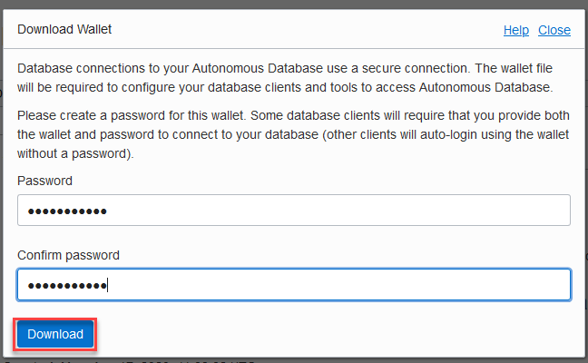
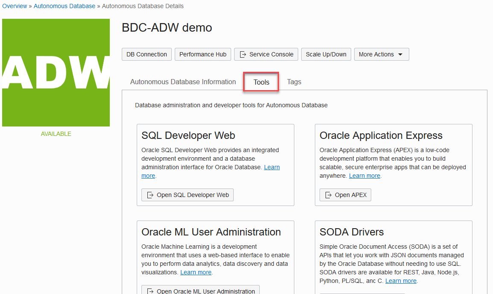
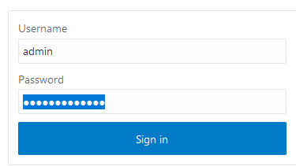
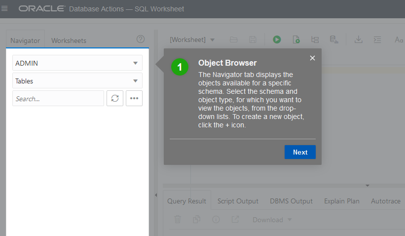
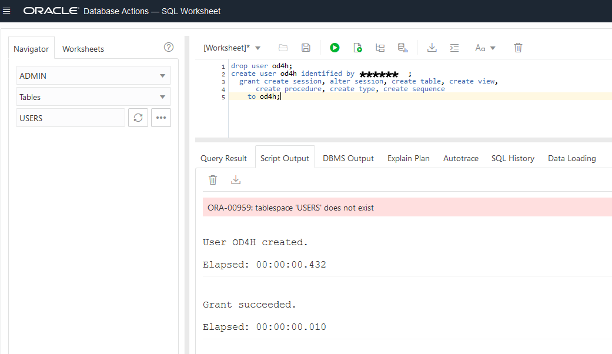
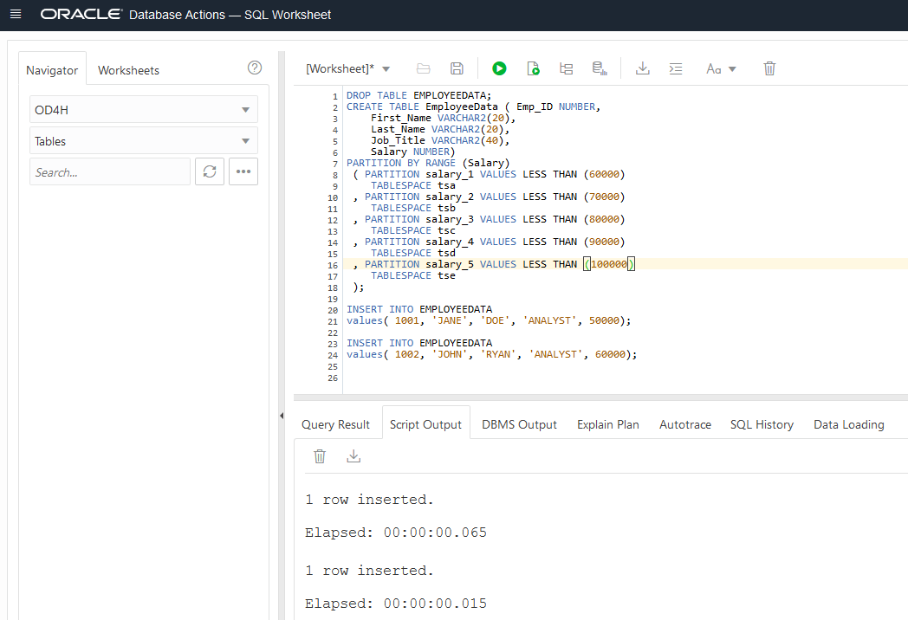
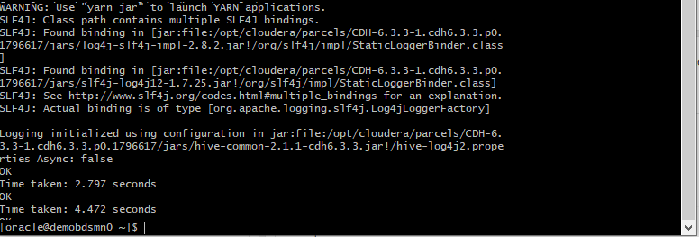

# Connecting Oracle DataSource for Apache Hadoop (OD4H) on Big Data Service to Autonomous Data Warehouse
## Introduction

This 15-minute lab walks you through the steps to connecting OD4H on Big Data Service to Autonomous Data Warehouse (ADW).

### About Product/Technology
You can access Hadoop on from Autonomous Data Warehouse using Oracle DataSource For Apache Hadoop on Big Data Service.

Oracle DataSource for Apache Hadoop (OD4H) does not require creating a new table. You can start working with OD4H using the following steps:

* Create a new Oracle table, or, reuse an existing table.
* Create the Hive DDL for creating the external table referencing the Oracle Table.
* Issue HiveSQL, SparkSQL, or other Spark/Hadoop queries and API calls.

External Tables allow you to define Java classes to access external database and present it as a native hive table.

###Objectives

In this lab, you will:

* Download Autonomous Data Warehouse Cloud Credentials.
* Create an OD4H user and an ```EMPLOYEEDATA``` Table on Autonomous Data Warehouse.
* Create and Query a Hive External Table Using the Autonomous Data Warehouse Table.


### Prerequsites

* Login credentials and a tenancy name for the Oracle Cloud Infrastructure Console.
* Big Data Service Cluster
* Autonomous Data Warehouse Service

Oracle DataSource for Apache Hadoop (OD4H) is already installed on BDS nodes when you provision BDS. It is available under /opt/oracle/od4h/jlib.


## **STEP 1**: Set up the OD4H Jars


1. Add `/opt/oracle/od4h/jlib/` to **HADOOP_CLASSPATH**.

    ```
    <copy>
    export OD4H_HOME=/opt/oracle/od4h/jlib
    export HADOOP_CLASSPATH=$OD4H_HOME/osh.jar:$OD4H_HOME/ojdbc8.jar:$OD4H_HOME/ucp.jar:$OD4H_HOME/osdt_cert.jar:$OD4H_HOME/oraclepki.jar:$OD4H_HOME/osdt_core.jar:$OD4H_HOME/orai18n.jar
    export classpath= $OD4H_HOME/osh.jar:$OD4H_HOME/ojdbc8.jar:$OD4H_HOME/ucp.jar:$OD4H_HOME/osdt_cert.jar:$OD4H_HOME/oraclepki.jar:$OD4H_HOME/osdt_core.jar:$OD4H_HOME/orai18n.jar
    </copy>
    ```
Note: Ensure that ucp.jar, ojdbc8.jar and osh.jar are present in the Hive CLASSPATH, for using OD4H.

## **STEP 2**: Download Autonomous Data Warehouse Cloud Credentials

Oracle client credentials (wallet files) are downloaded from Autonomous Data Warehouse by a service administrator. If you are not an Autonomous Data Warehouse administrator, your administrator should provide you with the client credentials.

To download client credentials, do the following from Oracle Cloud Infrastructure console:

1. Log in to the Oracle Cloud Console as the Cloud Administrator.

2. On the Sign In page, select your tenancy, enter your username and password, and then click **Sign In**. The Oracle Cloud Console Home page is displayed.

3. Select Autonomous Data Warehouse from the hamburger menu and navigate into your Autonomous Data Warehouse instance.

   
   

4. Click **DB Connection**.

   

5. On the Database Connection page click **Download Wallet**.

   

6. In the Download Wallet dialog, enter a wallet password in the **Password** field and confirm the password in the Confirm Password field. The password must be at least 8 characters long and must include at least 1 letter and either 1 numeric character or 1 special character. Click **Download**.

   

   **Note:** This password protects the downloaded Client Credentials wallet. This wallet is not the same as the Transparent Data Encryption (TDE) wallet for the database; therefore, use a different password to protect the Client Credentials wallet.

7. Click **Download** to save the client security credentials zip file.
   By default the filename is: Wallet_databasename.zip. You can save this file as any filename you want. You must protect this file to prevent unauthorized database access.

8. Unzip cloud credential zip under a local directory where the OS user has access; example `/home/oracle/wallet`.

   The zip file includes the following:

    * `tnsnames.ora` and `sqlnet.ora`: Network configuration files storing connect descriptors and SQL*Net client side configuration.

    * `cwallet.ora` and `ewallet.p12`: Auto-open SSO wallet and PKCS12 file. PKCS12 file is protected by the wallet password provided in the UI.

    * `keystore.jks` and `truststore.jks`: Java `keystore` and `truststore` files. They are protected by the wallet password provided while downloading the wallet.

    * `ojdbc.properties`: Contains the wallet related connection property required for JDBC connection. This should be in the same path as `tnsnames.ora`.

9. Edit sqlnet.ora and make sure the **WALLET_LOCATION** parameter points to a valid directory where the wallet is located. An absolute path is needed.
   Example of sqlnet.ora: Assumeming SSL Wallet zip was unzipped under `/home/oracle/wallet`.

     ```
     WALLET_LOCATION = (SOURCE = (METHOD = file) (METHOD_DATA = (DIRECTORY="/home/oracle/wallet")))
     SSL_SERVER_DN_MATCH=yes
     ```

10. Make sure the `ojdbc.properties` file has been configured to use Oracle Wallet, as follows (i.e., anything related to JKS commented out)

    ```
    <copy>oracle.net.wallet_location=(SOURCE=(METHOD=FILE)(METHOD_DATA=(DIRECTORY=${TNS_ADMIN})))
    #javax.net.ssl.trustStore=${TNS_ADMIN}/truststore.jks
    #javax.net.ssl.trustStorePassword=<password_from_console>
    #javax.net.ssl.keyStore=${TNS_ADMIN}/keystore.jks
    #javax.net.ssl.keyStorePassword=<password_from_console>
    </copy>
    ```
11.  Your ADW cloud services (e.g., myadwsvc) has several levels of priority including High, Medium and Low; the tnsnames.ora file from the downloaded client credentials contains the full description of these services. In this following OD4H string, enter the priority level as "high" and target Oracle database table name as `EmployeeData`.

    **Note:** Pick the priority level corresponding to your requirement, from the `tnsnames.ora` i.e., `myadwsvc_high` or `myadwsvc_low` or `myadwsvc_medium`.

      ```
      <copy>
      'mapreduce.jdbc.url' = 'jdbc:oracle:thin:/@myadwsvc_high',
      'mapreduce.jdbc.username' = '**********',
      'mapreduce.jdbc.password' = '**********',
      'mapreduce.jdbc.input.table.name' = 'Oracle_Table_Name',
      'oracle.hcat.osh.authentication' = 'ORACLE_WALLET',
      'oracle.net.tns_admin' = '/home/oracle/wallet';</copy>
      ```    

## **STEP 3**: Create an OD4H User and EMPLOYEEDATA Table on Autonomous Data Warehouse

Although you can connect to your autonomous database using local PC desktop tools like Oracle SQL Developer, you can conveniently access the browser-based SQL Developer Web directly from your ADW or ATP console.

1. If you are not logged in to Oracle Cloud Console, login and select Autonomous Data Warehouse from the hamburger menu and navigate into your ADW instance.
Navigate to the Autonomous Data Warehouse details page.

   


2. In your ADW details page, click the **Tools** tab. The Tools page provides you access to SQL Developer Web, Oracle Application Express, Oracle ML User Administration, etc. In the SQL Developer Web box, click Open **SQL Developer Web**.

   

   

4. A sign-in page opens for the SQL Developer Web. For this lab, simply use your database instance's default administrator account, Username - ADMIN, and with the admin Password you specified when creating the database. Click **Sign in**.

   

5. SQL Developer Web opens on a worksheet tab. The first time you open the SQL Developer Web, a series of pop-up informational boxes introduce you to the main features.

   

6. Copy and paste the code snippet below to your SQL Developer Web worksheet. This query will create a database user which will be used to run the OD4H example, granting the required privileges as shown in the following example. Make sure you click the Run Statement button to run it in the SQL Developer Web so that all the rows are displayed on the screen.

       ```
       create user OD4H identified by <password> quota unlimited on data;
       grant create session, alter session, create table, create view, create procedure, create type, create sequence to OD4H;
       ```

    

7. As a `OD4H` user, create a table named `EMPLOYEEDATA` and insert some values. Copy and paste the code snippet below to your SQL Developer Web worksheet.

      ```
        CREATE TABLE EmployeeData ( Emp_ID NUMBER,
        First_Name VARCHAR2(20),
        Last_Name VARCHAR2(20),
        Job_Title VARCHAR2(40),
        Salary NUMBER)
    PARTITION BY RANGE (Salary)
     ( PARTITION salary_1 VALUES LESS THAN (60000)
        TABLESPACE tsa
     , PARTITION salary_2 VALUES LESS THAN (70000)
        TABLESPACE tsb
     , PARTITION salary_3 VALUES LESS THAN (80000)
        TABLESPACE tsc
     , PARTITION salary_4 VALUES LESS THAN (90000)
        TABLESPACE tsd
     , PARTITION salary_5 VALUES LESS THAN (100000)
        TABLESPACE tse
     );

      INSERT INTO EMPLOYEEDATA
      VALUES (1001, 'JANE','DOE', 'ANALYST'. 50000);

      INSERT INTO EMPLOYEEDATA
      VALUES (1002, 'JOHN','RYAN', 'ANALYST'. 60000);

    ```
    

## **STEP 4**: Create and Query a Hive External Table Using the Autonomous Data Warehouse Table

The following section contains Hive commands to build an external Hive table that refers to `EMPLOYEEDATA` table.

1.  Connect to the BDS cluster via bastion host as `opc` user. See Connect to a Cluster Node Through Secure Shell (SSH) in Using Oracle Big Data Cloud.

    **Note:** You need to set up a bastion host and connect to the BDS cluster via the bastion host. See Learn more about setting up a bastion host.

      ```
        ssh -i id_rsa <private_node_ip>

      ```

2.  Create an external Hive table named `emp_hive` referring to an ADW table.

      ```
           <copy>
               drop table emp_hive;
               create external table emp_hive (EMP_ID int, FIRST_NAME varchar(20), LAST_NAME varchar(20), JOB_TITLE varchar (30), SALARY int)
               stored by 'oracle.hcat.osh.OracleStorageHandler'
               with SERDEPROPERTIES ('oracle.hcat.osh.columns.mapping' = 'EMP_ID, FIRST_NAME, LAST_NAME, JOB_TITLE, SALARY')
               tblproperties ( 'mapreduce.jdbc.url' = 'jdbc:oracle:thin:/@myadwsvc_high',
               'mapreduce.jdbc.username' = '<not shown>',
               'mapreduce.jdbc.password' = 'not shown>',
               'mapreduce.jdbc.input.table.name' = 'EmployeeData',
               'oracle.hcat.osh.authentication' = 'ORACLE_WALLET',
               'oracle.net.tns_admin' = '/home/oracle/wallet'
            );</copy>

     ```
     

3. Execute the following command to list the table.

      ```
       <copy>
       Hive> show table;
       </copy>

      ```
      

4. Execute the following command to query all rows from the `emp_hive` ADW table.

      ```
       <copy>
       select * from hive_emp;
       exit;
       </copy>

      ```

      

## Want to Learn More?

* [Oracle DataSource for Apache Hadoop (OD4H)](https://docs.oracle.com/en/bigdata/big-data-appliance/5.1/bigug/ota4h.html#GUID-C2A509A4-34CB-4B58-AC55-6CCCE51163A8)
* [Using Oracle Big Data Service](https://docs.oracle.com/en/cloud/paas/big-data-service/user/index.html)
* [Autonomous Data Warehouse](https://docs.oracle.com/en/cloud/paas/autonomous-data-warehouse-cloud/index.html)
* [Oracle Cloud Infrastructure Documentation](https://docs.cloud.oracle.com/en-us/iaas/Content/GSG/Concepts/baremetalintro.htm)
* [Overview of Oracle Cloud Infrastructure Identity and Access Management (IAM)](https://docs.cloud.oracle.com/en-us/iaas/Content/Identity/Concepts/overview.htm)

## Acknowledgements
* **Authors**
    * Kuassi Menah, Director of Product Management, Database Java (JVM, JDBC)
    * Dimpi Sarmah, Senior UA Developer, Oracle Database User Assistance

See an issue?  Please open up a request [here](https://github.com/oracle/learning-library/issues).  Please include the workshop name and lab in your request.
